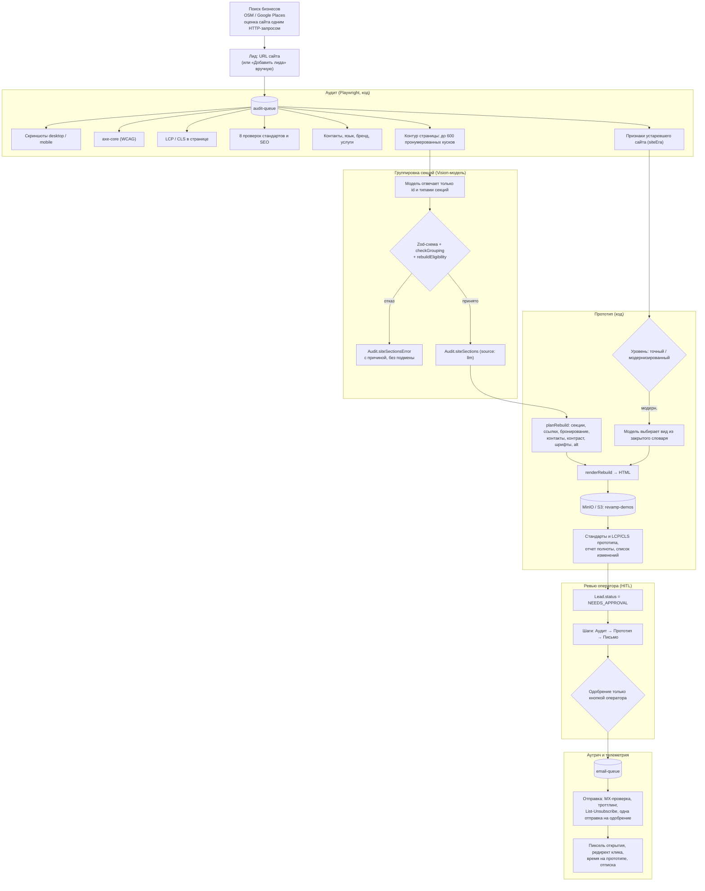

# Revamp SaaS — Итоговый отчет о состоянии проекта (Project Completion Report)

> **Состояние на 07.10.2026, ветка `main` (обновлено в REV-134).** Отчет описывает систему такой, какая она в коде сейчас. Первоначальная версия отчета была снимком после 4-недельной дорожной карты (REV-20, 24.09.2026); она сохранена в истории git этого репозитория, а ее таблица задач — в [разделе 8.1](#81-первоначальная-дорожная-карта-rev-1--rev-20). Подробный список задач после релиза — в [`milestones.md`](./milestones.md#6-развитие-после-релиза-rev-21--rev-44), актуальная архитектура — в [`blueprint.md`](./blueprint.md).

---

## 1. Паспорт проекта

| | |
|---|---|
| **Наименование** | Revamp SaaS — аудит сайтов локального бизнеса, перестройка их главной страницы и персональный аутрич с одобрением человеком |
| **Репозиторий реализации** | [`yurykurouski/revamp-dev`](https://github.com/yurykurouski/revamp-dev) (монорепозиторий, публичный) |
| **Репозиторий документации** | [`yurykurouski/revamp-docs`](https://github.com/yurykurouski/revamp-docs) (публичный) |
| **Задачи** | [Linear, проект Revamp](https://linear.app/revamp-proect/project/revamp-992fa5274adb), команда REV |
| **Автор** | Yury Kurouski, группа 22LR, ЕГУ |
| **Руководитель практики** | Sergei Audeychik |
| **Период по истории git** | 17.09.2026 — 04.10.2026 (последний коммит в коде) |
| **Объем** | 373 коммита, 101 влитый pull request, 106 задач REV в заголовках коммитов, около 80,7 тыс. строк TS/TSX в `apps/` и `packages/` вместе с тестами |
| **Тесты** | 160 файлов, 3135 тестов Vitest, 0 сбоев (прогон 07.10.2026) |
| **Статический анализ** | `npm run typecheck` — 0 ошибок; `npm run lint` — 0 ошибок, 8 предупреждений (неиспользуемые переменные) |
| **Сборка** | `npm run build` (пакеты и три приложения) проходит |

Источники цифр: `git log`, `gh pr list --state merged`, `wc -l` по `*.ts`/`*.tsx` без `node_modules` и `dist`, вывод `npm test` / `npm run typecheck` / `npm run lint` / `npm run build` на `main` 07.10.2026.

---

## 2. Задача и итог

**Задача.** У многих локальных бизнесов (стоматологии, автосервисы, юридические конторы) устаревшие сайты: нет мобильной версии, медленная загрузка, ошибки доступности и SEO. Ручной аудит и редизайн для такого клиента слишком дороги. Нужно было спроектировать и реализовать систему, которая по адресу сайта измеряет его проблемы, собирает улучшенную главную страницу из контента самого сайта и готовит персональное письмо владельцу, при этом ничего не отправляет без оператора.

**Итог.** Работающий конвейер от поиска бизнеса на карте до письма с трекингом. Главное отличие от первоначального плана: прототип (MVP) — это не универсальный Bento-шаблон, а перестройка главной страницы самого клиента по ее секциям, в двух уровнях: «точный» (цвета, порядок и расположение оригинала, только исправления) и «модернизированный» (тот же контент и порядок, современный вид) для сайтов, которые код признал устаревшими. Модели участвуют только там, где их ответ можно проверить кодом: они группируют и классифицируют куски страницы по номерам и никогда не пишут текст сайта.

---

## 3. Сквозной конвейер



Статус лида: `QUEUED` → `AUDITING` → `AUDITED` → `GENERATING` → `NEEDS_APPROVAL` → `SCHEDULED` → `SENT` → `OPENED` → `CLICKED` → `ENGAGED`, плюс `AUDIT_FAILED`, `REJECTED`, `UNSUBSCRIBED`. Разрешенные переходы — одна таблица `LEAD_TRANSITIONS` (`@revamp/validation`); каждая запись статуса атомарно проверяет ее, поэтому повторная задача или поздний клик не откатывают лида назад.

---

## 4. Архитектура

| Часть | Назначение |
|---|---|
| `apps/api` | REST API на Express: лиды, аудиты, MVP, аутрич, поиск бизнесов, трекинг, health. Тела запросов валидируются Zod; все ошибки в одном формате `{ success: false, error: { code, message, details? } }` с кодами из `API_ERROR_CODES` |
| `apps/workers` | Воркеры BullMQ: `audit-queue`, `ai-gen-queue`, `deploy-queue`, `email-queue`, `email-test-queue`, `discovery-queue`, `mvp-edit-queue` |
| `apps/dashboard` | Рабочее место оператора: React, MUI, Zustand, React Router; очередь ревью, ревью лида в три шага, поиск бизнесов, полноэкранное превью; интерфейс на 5 языках (en, ru, be, pl, lt) |
| `packages/shared-types` | Типы, статусы, имена очередей, словари (секции, признаки, коды изменений) |
| `packages/validation` | Zod-схемы ответов моделей и запросов, таблица переходов статусов, проверки группировки и правок |
| `packages/db` | Единственное место схем Mongoose; приложения их только реэкспортируют |
| Инфраструктура | MongoDB 7, Redis 7, MinIO (S3) в `docker-compose.yml`; `npm run setup` и `npm run dev` поднимают стек одной командой |
| Модели | Единый `LlmClient`, провайдеры `anthropic`, `openai`, `gemini`, `claude-cli` (локальный Claude Code CLI); оператор выбирает провайдера и модель |

---

## 5. Ключевые модули

### 5.1. Аудит (детерминированный)
* Playwright открывает страницу на десктопе и телефоне, закрывает cookie-баннеры, снимает полностраничные скриншоты.
* Доступность — axe-core; скорость — LCP и CLS, измеренные в самой странице (без Lighthouse, REV-102); стандарты и SEO — 8 проверок (HTTPS, viewport, title, meta description, один h1, favicon, Schema.org, OpenGraph), сумма 100 баллов (REV-102, REV-118).
* Контакты, язык (`<html lang>`, затем `<meta>`, затем распознавание по тексту для en/ru/be/pl/lt), бренд и услуги извлекаются кодом.
* Признаки устаревшего сайта (табличная верстка, нет viewport, фреймы, Flash, узкая фиксированная ширина, старые теги, шрифт по умолчанию, старый jQuery, устаревший копирайт) складываются во взвешенный балл `Audit.siteEra` (REV-114).
* Сбойный замер не заменяется подставным значением: он попадает в `Audit.measurementErrors`, итог считается по измеренному (REV-100).

### 5.2. Секции главной страницы (Vision-модель по id)
* Код режет страницу на пронумерованные куски (заголовки, абзацы, списки, изображения, фоны, встраивания) с их размерами и стилями (REV-113).
* Vision-модель получает контур и до шести скриншотов и отвечает только номерами кусков, типами и расположением секций. Ответ проходит `SiteGroupingAnswerSchema` и `checkGrouping` (известные id, каждый один раз, у секции есть заголовок, логотип — изображение); отклоненный ответ повторяется один раз с причиной.
* Код копирует куски по id в секции; куски, не попавшие никуда, записываются как пропущенные. Полнота — доля текста страницы, попавшая в секции.
* Если модель не настроена, вызов упал, ответ дважды невалиден или чтение не годится для перестройки, секции не сохраняются, а причина записывается (`not_configured`, `call_failed`, `invalid_answer`, `ineligible`; REV-132). Чтение правилами осталось только отладочным видом.

### 5.3. Перестройка (прототип)
* `planRebuild` принимает все решения из секций: порядок, ссылки (другие страницы убираются и записываются), форма бронирования, проверенные контакты, контраст, размер и межстрочный интервал текста, alt. Результат проверяется `RebuildPlanSchema`; `renderRebuild` превращает план в HTML со стилями из переменных (REV-110).
* Прототип не строится, если полнота ниже 0,85, страница «плоская» (одна секция держит больше половины текста или мало заголовков) или план больше 300 КБ. Тогда генерация завершается ошибкой с причиной и кнопкой «Сгенерировать шаблонным макетом»; подмены нет (REV-132).
* Модернизированный уровень: модель один раз на аудит выбирает вид из закрытого словаря (карточки, сторона фото, герой, шкала шрифтов) без права менять порядок, скрывать или писать CSS (REV-114).
* Правка своими словами: модель отвечает id секций и кусков и фиксированными значениями; `checkRebuildEdit` отклоняет неизвестные id и скрытие главного заголовка (REV-111).
* SEO-теги прототипа берутся только из проверенных данных оригинала (REV-118).

### 5.4. Проверка опубликованного прототипа
* После каждой публикации тот же код, что и на аудите, проверяет стандарты прототипа и измеряет его LCP/CLS на телефонном профиле; сбой замера сохраняется как ошибка, без подставного значения (REV-118, REV-119).
* Шаг «Прототип» перечисляет каждое изменение с причиной и пользой для посетителя: доступность, читаемость, скорость, SEO, конверсия, дизайн, правки оператора, оставленный за бортом контент. Все тексты — шаблоны i18n, модель их не пишет (REV-119).
* Баннер «До / После» в письме несет только измеренные значения (REV-126).

### 5.5. Ревью оператора и аутрич
* Главный экран — очередь ревью с группами «Ждут вас», «В работе», «Аутрич», «Закрыты»; лид проверяется в три шага: Аудит, Прототип, Письмо. Одобрение есть только в панели действий шага «Письмо» (REV-77, REV-79).
* Отправка: одна отправка на одобрение (`SCHEDULED` → `SENDING`), MX-проверка, троттлинг, `List-Unsubscribe`, отписка в один клик по RFC 8058 (REV-61, REV-72, REV-73).
* Телеметрия: пиксель открытия, редирект клика, время на прототипе через Beacon API.

### 5.6. Поиск бизнесов
* Поиск на OpenStreetMap и Google Places с автоопределением города, фоновым прогрессом и уведомлением; уже существующие лиды не предлагаются (REV-26 — REV-41).
* До импорта сайт оценивается одним HTTP-запросом без выполнения скриптов: простой ли он и какие у него признаки проблем (REV-98).

---

## 6. Инженерные правила проекта

| Правило | Зачем |
|---|---|
| Метрики, контакты и язык — только кодом (Strict Grounding) | Модель может ошибиться в числе или выдумать телефон |
| Модель отвечает id и значениями из словаря, а не текстом | Текст сайта переносится дословно, ответ проверяется кодом |
| Письмо уходит только после одобрения оператора (HITL) | Защита получателя и репутации отправителя |
| Ни mock-данных, ни подмен при сбое (REV-45, REV-100, REV-132) | Честная ошибка с причиной лучше выдуманного результата |
| Одна схема переходов статусов лида (REV-62) | Повторная задача или поздний клик не затрут статус |
| Одна схема на коллекцию, один формат ошибок API (REV-48, REV-63) | API, воркеры и дашборд не расходятся в форме данных |
| Каждое изменение — тикет, тесты, PR, документация (`AGENTS.md` §4.3) | Проверяемая история решений |

---

## 7. Подтверждение результатов

### 7.1. Автоматические тесты (`npm test`, 07.10.2026)
```
 Test Files  160 passed (160)
      Tests  3135 passed (3135)
   Duration  47.11s
```
Покрыты схемы Zod, сервисы, эндпоинты (коды 200/201/400/404/409/500), воркеры и очереди, сторы дашборда, разметка и скрипты прототипа (happy-dom). Ответы моделей проверяются на записанных ответах по реальным сайтам (`fixtures/grouping`: adwokatpiatkowska.pl, anident.pl, falcodent.pl; `fixtures/modernize`: anident.pl, falcodent.pl); тесты не вызывают живую модель.

### 7.2. Проверки перед каждым PR
В репозитории нет CI, поэтому шлюз — локальный прогон: `npm run build:packages`, `npm run typecheck`, `npm run lint`, `npm test`, `npm run build`, плюс проверка изменения в браузере на запущенном стеке. Результат 07.10.2026: все проходят; у линтера 0 ошибок и 8 предупреждений.

### 7.3. Стандарты: оригинал и прототип
10 опубликованных прототипов (9 сайтов), для которых сохранен замер стандартов прототипа. Оригинал и прототип проверяет один и тот же код (`readStandardsInDocument`).

| Сайт | Стандарты оригинала | Стандарты прототипа | Нарушений axe у оригинала | Способ |
|---|---:|---:|---:|---|
| ultracar.waw.pl | 10 | 80 | 2 | шаблон |
| falcodent.pl (аудит 1) | 90 | 100 | 3 | перестройка, модернизированная |
| falcodent.pl (аудит 2) | 70 | 100 | 3 | перестройка, точная |
| anident.pl | 80 | 100 | 5 | шаблон |
| auto-blak.bosch-service.pl | 80 | 100 | 4 | шаблон |
| autoservice.waw.pl | 0 | 100 | 5 | шаблон |
| evolutionservice.pl | 70 | 100 | 3 | перестройка, точная |
| adcar.waw.pl | 50 | 100 | 2 | шаблон |
| autooriol.pl | 20 | 80 | 2 | перестройка, модернизированная |
| adwokatpiatkowska.pl | 40 | 100 | 1 | шаблон |
| **Среднее** | **51** | **96** | | |

«Шаблон» — прототипы, сделанные до REV-132 или по ручному выбору оператора. Источник: локальная MongoDB (`audits.scores.standards`, `mvpprojects.standards.score`), 07.10.2026.

### 7.4. Полнота перестройки
Доля текста страницы, попавшая в секции, на четырех перестройках: falcodent.pl — 0,957 и 0,960, evolutionservice.pl — 0,999, autooriol.pl — 0,998. Порог, ниже которого прототип не строится, — 0,85.

### 7.5. Что не сравнивается
LCP прототипов — 52–416 мс, оригиналов — 300–3856 мс, но прототипы измерены на локальном хосте MinIO, а оригиналы — на их боевых серверах. Это не честное сравнение, поэтому скорость прототипа не выносится на баннер «До / После» и не приводится как улучшение.

### 7.6. Исторический прогон (REV-19)
На 24.09.2026 сквозной прогон на 20 реальных сайтах дал 19 полных циклов из 20 (один сбой DNS обработан корректно). Это снимок до перехода на перестройку; повторного прогона на большой выборке после REV-132 не было.

---

## 8. Хронология

### 8.1. Первоначальная дорожная карта (REV-1 — REV-20)
4-недельный план из [`milestones.md`](./milestones.md), закрыт к 24.09.2026:

| Задача | Наименование задачи | Этап / Неделя | Статус |
|:---:|---|---|:---:|
| [**REV-1**](https://linear.app/revamp-proect/issue/REV-1/get-familiar-with-linear) | Get familiar with Linear | Onboarding | ✅ `Done` |
| [**REV-2**](https://linear.app/revamp-proect/issue/REV-2/connect-your-tools) | Connect your tools | Onboarding | ✅ `Done` |
| [**REV-3**](https://linear.app/revamp-proect/issue/REV-3/import-your-data) | Import your data | Onboarding | ✅ `Done` |
| [**REV-4**](https://linear.app/revamp-proect/issue/REV-4/set-up-your-teams) | Set up your teams | Onboarding | ✅ `Done` |
| [**REV-5**](https://linear.app/revamp-proect/issue/REV-5/inicializaciya-monorepozitoriya-i-bazovogo-okruzheniya-docker-mongo) | Инициализация монорепозитория и базового окружения (Docker, Mongo, Redis, MinIO) | Неделя 1 | ✅ `Done` |
| [**REV-6**](https://linear.app/revamp-proect/issue/REV-6/bazovye-mongoose-modeli-lead-audit-i-arhitektura-ocheredej-bullmq) | Базовые Mongoose-модели (`Lead`, `Audit`) и архитектура очередей BullMQ | Неделя 1 | ✅ `Done` |
| [**REV-7**](https://linear.app/revamp-proect/issue/REV-7/playwright-vorker-kraulinga-skrinshotov-i-vygruzki-v-s3minio) | Playwright-воркер краулинга, скриншотов и выгрузки в S3/MinIO | Неделя 1 | ✅ `Done` |
| [**REV-8**](https://linear.app/revamp-proect/issue/REV-8/integraciya-axe-core-i-zamery-core-web-vitals-lighthouse) | Интеграция Axe-core и замеры Core Web Vitals (Lighthouse) | Неделя 1 | ✅ `Done` |
| [**REV-9**](https://linear.app/revamp-proect/issue/REV-9/integraciya-vision-llm-claude-35-sonnet-gpt-4o-i-algoritm-skoringa) | Интеграция Vision LLM (Claude 3.5 Sonnet / GPT-4o) и алгоритм скоринга | Неделя 1 | ✅ `Done` |
| [**REV-10**](https://linear.app/revamp-proect/issue/REV-10/ekstraktor-ajdentiki-brenda-k-means-palitra-logotip-faktura) | Экстрактор айдентики бренда (K-Means палитра, логотип, фактура) | Неделя 2 | ✅ `Done` |
| [**REV-11**](https://linear.app/revamp-proect/issue/REV-11/razrabotka-modulnogo-universalnogo-bento-shablona-na-tailwind-css) | Разработка модульного универсального Bento-шаблона на Tailwind CSS | Неделя 2 | ✅ `Done` |
| [**REV-12**](https://linear.app/revamp-proect/issue/REV-12/mvp-content-and-copywriting-agent-s-zashitoj-ot-gallyucinacij-strict) | MVP Content & Copywriting Agent с защитой от галлюцинаций (Strict Grounding) | Неделя 2 | ✅ `Done` |
| [**REV-13**](https://linear.app/revamp-proect/issue/REV-13/sborka-staticheskogo-bandla-publikaciya-v-cloudflare-r2-s3-i) | Сборка статического бандла, публикация в Cloudflare R2 / S3 и генерация промо-коллажа | Неделя 2 | ✅ `Done` |
| [**REV-14**](https://linear.app/revamp-proect/issue/REV-14/interfejs-voronki-lidov-na-mui-v6-kanban-datagrid) | Интерфейс воронки лидов на MUI v6 (Kanban + DataGrid) | Неделя 3 | ✅ `Done` |
| [**REV-15**](https://linear.app/revamp-proect/issue/REV-15/side-by-side-inspektor-predprosmotra-s-adaptivnymi-brejkpointami) | Side-by-Side инспектор предпросмотра с адаптивными брейкпоинтами | Неделя 3 | ✅ `Done` |
| [**REV-16**](https://linear.app/revamp-proect/issue/REV-16/hitl-approval-gate-redaktirovanie-palitry-chernovika-pisma-i) | HITL Approval Gate: редактирование палитры, черновика письма и утверждение | Неделя 3 | ✅ `Done` |
| [**REV-17**](https://linear.app/revamp-proect/issue/REV-17/email-dispatcher-cherez-bullmq-s-trottlingom-i-mx-validaciej) | Email Dispatcher через BullMQ с троттлингом и MX-валидацией | Неделя 4 | ✅ `Done` |
| [**REV-18**](https://linear.app/revamp-proect/issue/REV-18/telemetriya-i-treking-aktivnosti-piksel-redirekty-dwell-time) | Телеметрия и трекинг активности (Пиксель, редиректы, Dwell Time) | Неделя 4 | ✅ `Done` |
| [**REV-19**](https://linear.app/revamp-proect/issue/REV-19/skvoznoe-e2e-testirovanie-na-20-realnyh-sajtah-i-optimizaciya) | Сквозное E2E тестирование на 20 реальных сайтах и оптимизация | Неделя 4 | ✅ `Done` |
| [**REV-20**](https://linear.app/revamp-proect/issue/REV-20/boevoj-deploj-v-prodakshen-docker-vps-hetzner-atlas-cloudflare) | Боевой деплой в продакшен (Docker, VPS Hetzner, Atlas, Cloudflare) | Неделя 4 | ✅ `Done` |

### 8.2. После релиза (REV-21 — REV-134)
Каждая задача прошла конвейер тикет → ветка → тесты и проверки → PR → слияние → документация → закрытие. Полный список с описаниями — в [`milestones.md` §6](./milestones.md#6-развитие-после-релиза-rev-21--rev-44). Направления:

* **Аудит:** полностраничные скриншоты, закрытие cookie-баннеров, оценка сложности сайта, измерение LCP/CLS в странице вместо Lighthouse, расширенные проверки стандартов и SEO, признаки устаревшего сайта.
* **Поиск бизнесов:** OSM и Google Places, автоопределение города, ревью и выборочный импорт, фоновый прогресс, предварительная оценка сайта.
* **Прототип:** от Bento-шаблона к контенту оригинала (REV-23), затем к перестройке главной страницы по секциям (REV-108 — REV-114) и к перестройке только по ответам моделей (REV-132, REV-133); правки своими словами, панель «Инструменты дизайна», список изменений с причинами.
* **Платформа:** общие схемы в `@revamp/db`, один автомат статусов, один формат ошибок, удаление mock-данных, единый клиент моделей и выбор провайдера.
* **Дашборд:** очередь ревью, ревью в три шага, горячие клавиши, редизайн темы с контрастом WCAG AA, локализация на 5 языков.
* **Аутрич:** одна отправка на одобрение, письмо как в превью, отписка в один клик.

---

## 9. Использование ИИ

* **В разработке.** Код по тикетам писали ИИ-агенты (Claude Code и другие, см. `AGENTS.md`); 236 из 373 коммитов содержат подпись `Co-Authored-By: Claude`. Агенты работают по правилам `AGENTS.md`: ограничения системы, обязательный конвейер задачи, проверки перед PR. Постановка задач, архитектурные решения, проверка на реальных сайтах и приемка — за автором.
* **В продукте.** Модели группируют главную страницу на секции, выбирают модернизированный вид из закрытого словаря, оценивают дизайн первого экрана и понимают правку своими словами. Каждый ответ проходит Zod-схему и проверки кодом; текст сайта, метрики и контакты модель не пишет.

---

## 10. Ограничения

* **Зависимость от модели.** Без Vision-модели прототип по перестройке не строится: оператор видит ошибку с причиной и может выбрать шаблонный макет.
* **Только главная страница.** Внутренние страницы не перестраиваются; ссылки на них убираются и записываются.
* **Нет аутентификации в API.** Это инструмент одного оператора; публичный доступ к нему требует доработки.
* **Боевое развертывание не подтверждено.** В репозитории есть конфигурация (`docker-compose.prod.yml`, `deploy/deploy.sh`, `deploy/nginx`, `npm run verify:env`) и ее тесты, но работающий боевой экземпляр из репозитория не проверить; проверенный способ запуска — локальный стек.
* **Реальная рассылка не проводилась.** Отправка проверялась на тестовом SMTP; в локальной базе 0 кампаний.
* **Ответы модели меняются от запуска к запуску.** Регрессии ловятся на записанных ответах по 4 сайтам, а не на живых вызовах.
* **Малая выборка.** 10 прототипов в разделе 7.3 — пример, а не статистика; распознавание языка по тексту — только для en, ru, be, pl, lt.

---

## 11. Запуск

```bash
git clone https://github.com/yurykurouski/revamp-dev.git
cd revamp-dev
npm run setup   # Node 20+, Docker, зависимости, Chromium, .env, MongoDB/Redis/MinIO, сборка пакетов
npm run dev     # инфраструктура + API (:4000) + воркеры + дашборд (:5173) в одном терминале
```

Проверка на реальных сайтах без записи в базу: `npx tsx scripts/read_site_sections.ts --llm <url>` и `npx tsx scripts/render_rebuild.ts --llm <out-dir> <url...>`.

Конфигурация боевого развертывания: `docker-compose.prod.yml`, `deploy/deploy.sh`, `.env.production.example`, предполетная проверка `npm run verify:env` (см. ограничения выше).

---

## 12. Связанные документы

* Архитектура, очереди, схемы: [`blueprint.md`](./blueprint.md)
* Требования, статусы, эндпоинты: [`spec.md`](./spec.md)
* Исследования и решения (ADR): [`research.md`](./research.md)
* План и критерии готовности: [`milestones.md`](./milestones.md)
* Промпты и схемы агентов: [`AGENTS.md`](./AGENTS.md)
