# Revamp SaaS — Автоматизированный аудит сайтов и генерация MVP

<p align="center">
  <b>Комплексная SaaS-платформа для автоматизированного B2B-аутрича, глубокого аудита сайтов локального бизнеса и мгновенной генерации современных MVP-лендингов с Human-in-the-Loop контролем.</b>
</p>

<p align="center">
  
  
  
  
  
  
  
  
</p>

---

## 📌 Оглавление

1. [О проекте](#-о-проекте)
2. [Ключевые возможности](#-ключевые-возможности)
3. [Архитектура и пайплайн работы](#-архитектура-и-пайплайн-работы)
4. [Фундаментальные инженерные принципы](#-фундаментальные-инженерные-принципы)
5. [Структура проекта (Monorepo)](#-структура-проекта-monorepo)
6. [Стек технологий](#-стек-технологий)
7. [Документация проекта](#-документация-проекта)
8. [Быстрый старт (Локальное окружение)](#-быстрый-старт-локальное-окружение)
9. [Дорожная карта реализации (4-недельный план)](#-дорожная-карта-реализации-4-недельный-план)
10. [Контакты и вклад](#-контакты-и-вклад)

---

## 💡 О проекте

Веб-студии, агентства и фрилансеры тратят десятки часов в неделю на ручной поиск устаревших сайтов, ручной аудит доступности и верстку коммерческих предложений с конверсией в ответ менее 2–3%.

**Revamp SaaS** трансформирует процесс cold outreach в полностью автоматизированный конвейер:
1. **Анализирует** устаревший сайт за 40 секунд (замеры Core Web Vitals, доступность WCAG 2.1 AA, скриншоты и мультимодальный AI-аудит первого экрана).
2. **Извлекает айдентику бренда** (палитра K-Means, логотип, телефоны, услуги).
3. **Генерирует готовый адаптивный Bento-лендинг** на Tailwind CSS, размещая его в песочнице на публичном URL.
4. **Предоставляет оператору удобный дашборд (Side-by-Side)** для моментальной инспекции «До / После» и корректировки палитры/текста в 1 клик.
5. **Отправляет персонализированное письмо** владельцу сайта с интерактивным прототипом и собирает полную телеметрию (открытия, клики, время на сайте).

---

## 🚀 Ключевые возможности

* 🔍 **Многоуровневый детерминированный аудит:**
  * **WCAG 2.1 AA Accessibility:** `@axe-core/puppeteer` проверяет контрастность, метки форм, alt-теги изображений.
  * **Core Web Vitals:** Lighthouse измеряет LCP (Largest Contentful Paint), CLS, скорость ответа и наличие SSL.
  * **Vision LLM Critique:** Мультимодальный ИИ (Claude 3.5 Sonnet / GPT-4o) выявляет 3 критические ошибки в дизайне первого экрана и 3 Quick Wins.
* 🎨 **Универсальный модульный Bento-каркас:**
  * Сверхлегкий адаптивный HTML + Tailwind CSS бандл (< 300 Кб).
  * Динамическая стилизация под цвета оригинального бренда без галлюцинаций.
  * Автоматический подбор иконок Lucide под список услуг.
* 🛡️ **Human-In-The-Loop (HITL) Gate:**
  * Никаких автоматических отправок писем без проверки человеком.
  * Утверждение отправки за 20 секунд с помощью горячих клавиш (`Cmd/Ctrl + Enter`).
  * Быстрый Color Picker для моментальной смены палитры во фрейме предпросмотра.
* 📬 **Умный Email-аутрич и троттлинг:**
  * Интеграция с Resend / SendGrid API.
  * Джиттер-троттлинг (1 письмо в 3 минуты с рандомизацией 15–45 сек) для максимальной защиты репутации домена.
  * DNS-проверка валидности MX-записей перед отправкой и заголовки `List-Unsubscribe`.
* 📊 **Телеметрия в реальном времени:**
  * Невидимый $1\times1$ GIF-пиксель для трекинга открытия писем.
  * Проксирование кликов по ссылке на прототип.
  * Встроенный скрипт трекинга `revamp-tracker.js`: замер времени нахождения на демо (Dwell Time) через Beacon API и кликов по CTA-кнопкам.

---

## 🏗 Архитектура и пайплайн работы

```mermaid
flowchart LR
    A["1. Ввод URL / База"] --> B["2. Playwright + Axe + Lighthouse"]
    B --> C["3. Vision LLM & K-Means"]
    C --> D["4. Генерация Bento MVP & S3"]
    D --> E["5. React + MUI Дашборд<br/><b>HITL Gate</b>"]
    E -->|Аппрув оператора| F["6. BullMQ Email Dispatcher"]
    F --> G["7. Доставка клиенту"]
    G -->|Клик / Просмотр| H["8. Телеметрия & Dwell Time"]
    H --> E

    style E fill:#dcfce7,stroke:#15803d,stroke-width:2px
    style D fill:#ede9fe,stroke:#6d28d9,stroke-width:2px
    style B fill:#dbeafe,stroke:#1d4ed8,stroke-width:2px
```



---

## 🔒 Фундаментальные инженерные принципы

1. **Human-In-The-Loop (HITL):** Фоновые воркеры переводят сущности в статус `NEEDS_APPROVAL`. Отправка писем клиентам возможна **исключительно** после явного подтверждения оператором.
2. **Детерминизм метрик (Strict Grounding):** Замеры LCP, доступности a11y, извлечение номеров телефонов, адресов и цен осуществляются детерминированным кодом, а не нейросетями.
3. **Строгая валидация (Zod):** Все ответы LLM и входящие HTTP-запросы валидируются через схемы Zod перед записью в базу данных.
4. **Изоляция сгенерированных MVP:** Сгенерированные прототипы запускаются на изолированном домене (`*.preview.revamp.io`) и встраиваются в дашборд через `<iframe sandbox="allow-scripts allow-same-origin">`.

---

## 📁 Структура проекта (Monorepo)

```text
/
├── apps/
│   ├── api/             # Express.js REST API Gateway (Node.js + TypeScript)
│   ├── workers/         # Фоновые воркеры BullMQ (Playwright, AI, Deploy, Email)
│   └── dashboard/       # Рабочее место оператора (React 18+, Vite, MUI v6, DataGrid)
├── packages/
│   ├── shared-types/    # Общие TypeScript интерфейсы и DTO
│   └── validation/      # Общие Zod-схемы для валидации данных
├── docker/              # Конфигурации Dockerfile и docker-compose.yml
├── AGENTS.md            # Системные инструкции для ИИ-агентов
├── blueprint.md         # Полный архитектурный блюпринт системы
├── milestones.md        # 4-недельный план реализации и Definition of Done
├── research.md          # Исследования предметной области, сценарии и ADR
└── spec.md              # Спецификация требований к программному обеспечению (SRS)
```

---

## 🛠 Стек технологий

| Область | Технологии |
|---|---|
| **Ядро & Бэкенд** | Node.js (v20+ LTS), Express.js, TypeScript |
| **Базы данных & Очереди** | MongoDB 7.0 (Mongoose), Redis 7.0, BullMQ |
| **Краулинг & Метрики** | Playwright Chromium, `@axe-core/puppeteer`, Google Lighthouse |
| **AI & LLM** | Anthropic Claude 3.5 Sonnet, OpenAI GPT-4o / GPT-4o-mini |
| **Фронтенд дашборда** | React 18+, Vite, Material UI (MUI v6), `@mui/x-data-grid`, TanStack Query v5, Zustand |
| **Сгенерированный MVP** | HTML5, Tailwind CSS, Lucide Icons, Vanilla JS Tracker |
| **Хранилище & Хостинг** | MinIO (локально), Cloudflare R2 / AWS S3, Cloudflare Pages |
| **Email-инфраструктура** | Resend API / SendGrid API, Nodemailer, DNS MX Validator |

---

## 📚 Документация проекта

В репозитории собрана детальная инженерная документация:

* 🏆 [**`PROJECT_COMPLETION_REPORT.md`**](./PROJECT_COMPLETION_REPORT.md) — **Итоговый отчет о завершении разработки:** 100% выполнение дорожной карты (`REV-1` — `REV-20`), архитектура, результаты E2E-тестирования 20 сайтов и инструкция по развертыванию на VPS Hetzner / Cloudflare.
* 📐 [**`blueprint.md`**](./blueprint.md) — Системный архитектурный блюпринт: описание слоев, очередей BullMQ, схемы MongoDB и диаграммы взаимодействия.
* 📋 [**`spec.md`**](./spec.md) — Спецификация требований (SRS): функциональные требования, жизненный цикл лида, REST API эндпоинты.
* 🔬 [**`research.md`**](./research.md) — Архитектурные исследования, ключевые решения (ADR), пользовательские сценарии (CJM) и конкурентный анализ.
* ⏱️ [**`milestones.md`**](./milestones.md) — 4-недельная ускоренная дорожная карта с детализацией по дням и чек-листами Definition of Done.
* 🤖 [**`AGENTS.md`**](./AGENTS.md) — Руководство и системные промпты для автономных ИИ-агентов платформы и ИИ-разработчика.

---

## ⚡ Быстрый старт (Локальное окружение)

### Требования
* Node.js >= 20.x
* Docker и Docker Compose
* npm или pnpm

### 1. Клонирование и установка зависимостей
```bash
git clone https://github.com/revamp-saas/revamp.git
cd revamp
npm install
```

### 2. Запуск инфраструктуры (MongoDB, Redis, MinIO)
```bash
docker compose up -d
```

### 3. Настройка переменных окружения
Создайте файл `.env` в корне проекта на основе `.env.example`:
```env
PORT=4000
MONGODB_URI=mongodb://localhost:27017/revamp
REDIS_HOST=localhost
REDIS_PORT=6379

# AI Providers
ANTHROPIC_API_KEY=your_claude_key
OPENAI_API_KEY=your_openai_key

# Object Storage (MinIO / S3)
S3_ENDPOINT=http://localhost:9000
S3_BUCKET=revamp-assets
S3_ACCESS_KEY=minioadmin
S3_SECRET_KEY=minioadmin

# Email Outreach
RESEND_API_KEY=re_your_api_key
FROM_EMAIL=outreach@revampdemo.com
```

### 4. Запуск сервисов в режиме разработки
```bash
# Запуск всех приложений (API, Workers, Dashboard)
npm run dev

# Либо раздельный запуск:
npm run dev:api         # http://localhost:4000
npm run dev:workers     # BullMQ воркеры аудита и генерации
npm run dev:dashboard   # http://localhost:5173
```

---

## 🗓 Дорожная карта реализации (4-недельный план)

Спринты и задачи зафиксированы в Linear-проекте [**Revamp**](https://linear.app/revamp-proect/project/revamp-992fa5274adb):

* 🔹 **Спринт 1 (Дни 1–7):** Инфраструктура, краулер Playwright, замеры Axe/Lighthouse, Vision LLM и скоринг (`POST /api/v1/leads`).
* 🔹 **Спринт 2 (Дни 8–14):** K-Means экстрактор палитры, модульный Bento-шаблон Tailwind, ИИ-копирайтинг и хостинг MVP в R2/S3.
* 🔹 **Спринт 3 (Дни 15–21):** React + Material UI v6 дашборд, Kanban-доска, Side-by-Side инспектор и HITL-шлюз аппрува.
* 🔹 **Спринт 4 (Дни 22–28):** Почтовый диспетчер с троттлингом, трекинг Dwell Time, E2E-тесты на 20 реальных сайтах и боевой деплой.

---

## 📄 Лицензия

Проект распространяется под лицензией **MIT**. Подробности в файле `LICENSE`.
