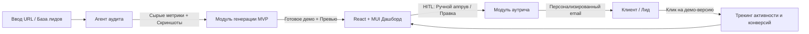
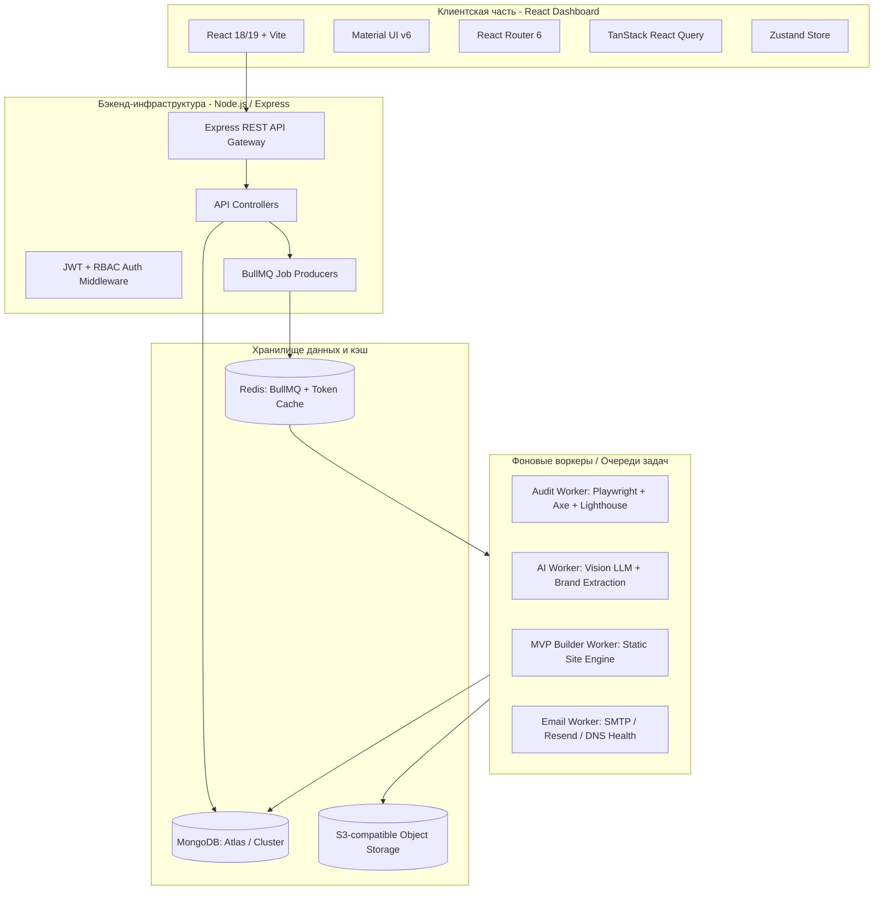
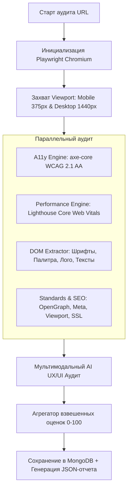
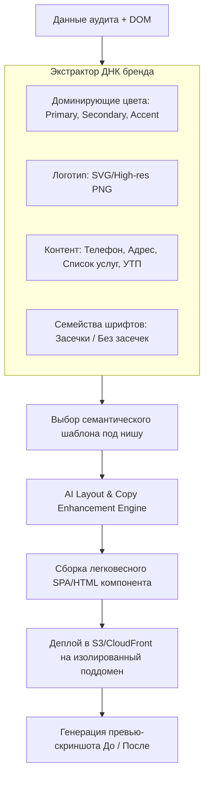
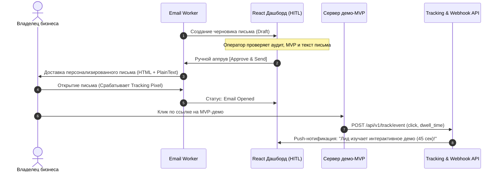
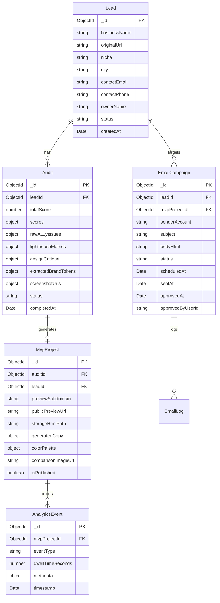
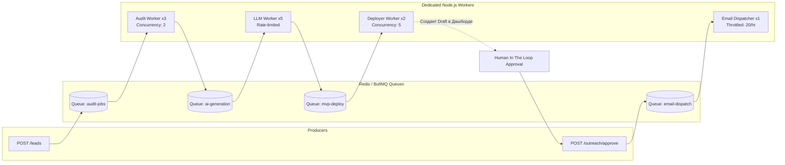
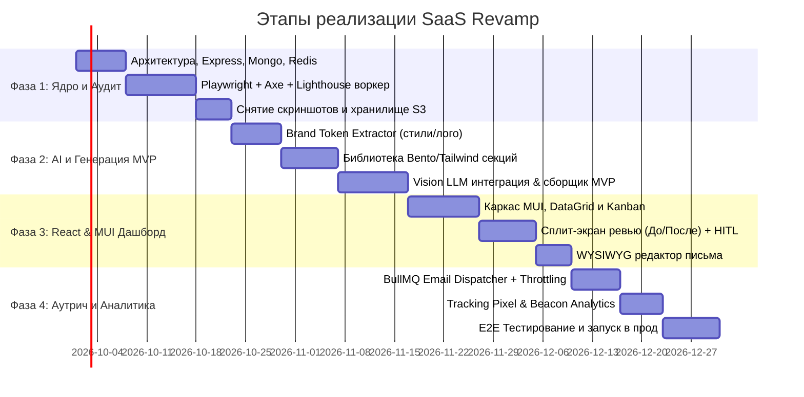

# Архитектурный Блюпринт: SaaS-система автоматизированного аудита и редизайна сайтов локального бизнеса (Revamp SaaS)

---

## 1. Введение и концепция системы

### 1.1. Назначение системы
Платформа предназначена для автоматизации B2B-лидогенерации и предпродажной подготовки (cold outreach) для веб-агентств, дизайн-студий и фрилансеров. Система находит или принимает на вход сайты локальных бизнесов (стоматологии, автосервисы, юридические конторы, салоны красоты и др.), выполняет глубокий многоуровневый аудит, автоматически синтезирует современный интерактивный MVP-редизайн с сохранением ДНК исходного бренда и готовит гиперперсонализированное коммерческое предложение с интерактивным демо.

Ключевой дифференциатор: **Human-In-The-Loop (HITL)** — перед отправкой письма оператор видит аудит, скриншоты «до/после», сгенерированный лендинг и персонализированный текст в удобном React/MUI дашборде и может подтвердить отправку или внести правки в один клик.



---

## 2. Общая архитектура и стек технологий



### Стек технологий:
* **Backend:** Node.js (v20+ LTS, TypeScript), Express.js.
* **База данных:** MongoDB (Mongoose ODM), реплика-сет, транзакции для операций статусов.
* **Очереди и кэш:** Redis (v7+) + BullMQ (для отказоустойчивой асинхронной обработки тяжелых задач браузера и LLM).
* **Headless Browser & Аудит:** Playwright / Puppeteer, Google Lighthouse API, `@axe-core/puppeteer`.
* **AI & LLM:** Мультимодальные модели (Claude 3.5 Sonnet / GPT-4o) для анализа дизайна интерфейсов и генерации адаптивного HTML/Tailwind кода компонентов.
* **Фронтенд:** React (v18+), TypeScript, Vite, Material UI (MUI v5/v6), TanStack Query, Recharts, Zustand.
* **Email & Deliverability:** Nodemailer / Resend API / SendGrid, DKIM/SPF валидатор, генерация пикселей отслеживания и URL-редиректов.
* **Хостинг MVP-демо:** AWS S3 / Cloudflare R2 + CloudFront / Wildcard-поддомены (`*.preview.revampsaas.io`).

---

## 3. Архитектура и спецификация модулей

---

### Модуль 1: Агент аудита (Audit Agent)

Агент аудита запускается в изолированном воркере и осуществляет комплексный сбор данных в четыре параллельных этапа.



#### 1.1. Этапы работы агента:
1. **Эмуляция и снятие снимков (Rendering & Screen Capture):**
   * Запуск Playwright в Headless-режиме с отключением блокировок краулинга (эмуляция актуального User-Agent).
   * Снятие полных скриншотов (Full-page) и первого экрана (Above-the-fold) для двух брейкпоинтов:
     - Desktop: 1440x900
     - Mobile: 375x812 (iPhone 13/14 viewport)
   * Сохранение изображений в S3/Cloudflare R2 с генерацией постоянных signed/public URL.

2. **Оценка доступности (Accessibility / a11y):**
   * Инжекция `@axe-core/puppeteer` в контекст страницы.
   * Тестирование по стандартам WCAG 2.1 Level AA:
     - Цветовой контраст текста и фонов (Color Contrast Ratio < 4.5:1).
     - Отсутствующие или пустые атрибуты `alt` у изображений.
     - Доступность форм (отсутствие `<label>`, некорректные `for`/`id`).
     - Семантическая иерархия заголовков (`h1`-`h6`).
     - Фокус клавиатуры и ARIA-роли для интерактивных элементов.

3. **Соответствие веб-стандартам и производительность (Lighthouse & Standards):**
   * Запуск мобильного профиля Lighthouse:
     - Core Web Vitals: LCP (Largest Contentful Paint), INP (Interaction to Next Paint), CLS (Cumulative Layout Shift).
     - Наличие корректного Viewport мета-тега, HTTPS сертификата, фавикона, robots.txt, sitemap.xml.
     - Состояние микроразметки (Schema.org / OpenGraph / Twitter Cards).
     - Скорость загрузки и размер тяжелых неоптимизированных ассетов (PNG > 2MB, некэшируемые скрипты).

4. **Мультимодальный AI-анализ дизайна (Vision UX/UI Critique):**
   * Скриншоты отправляются в Vision LLM со специализированным системным промптом:
     - Оценка визуальной иерархии (Visual Hierarchy & Scannability).
     - Читаемость типографики на мобильных устройствах.
     - Заметность и привлекательность основного CTA (Call to Action).
     - Эффект «устаревшего сайта» (Dated Design Smell: градиенты 2010-х, неадаптивные таблицы, перегруженные меню).
     - Формирование списка из 3 критических UX-проблем и 3 очевидных точек роста (Quick Wins).

#### 1.2. Структура скоринга (Composite Score Formula):
$$\text{Total Score} = 0.35 \times S_{\text{Design/UX}} + 0.25 \times S_{\text{Performance}} + 0.20 \times S_{\text{Accessibility}} + 0.20 \times S_{\text{Standards/SEO}}$$

Каждый критерий нормализуется от 0 до 100. При оценке ниже 60 система генерирует конкретные продающие тезисы для холодного письма (например: *"Ваш мобильный сайт теряет до 45% клиентов из-за медленного LCP 4.8s и нечитаемого шрифта на смартфонах"*).

---

### Модуль 2: Модуль генерации уникальных MVP с сохранением брендового стиля

Модуль решает сложную инженерную задачу: не просто сгенерировать абстрактный лендинг, а создать **премиальную версию сайта конкретного бизнеса**, сохранив его айдентику (цвета, логотип, тексты, перечень услуг), но упаковав это в современный UX-каркас с конверсионными блоками.



#### 2.1. Спецификация пайплайна генерации:
1. **Экстракция бренд-токенов (Brand DNA Extraction):**
   * Парсинг вычисленных стилей (`window.getComputedStyle`) ключевых элементов: кнопок, заголовков, хедера.
   * Алгоритм кластеризации цветов (K-Means по изображениям и стилям) для выделения стабильной палитры:
     - `brandColorPrimary`
     - `brandColorSecondary`
     - `brandAccent`
     - `brandBackground`
   * Извлечение логотипа: поиск `<link rel="icon">`, селекторов `header img`, `nav svg`, `a[href="/"] img`.
   * Извлечение смысловых блоков (NLP/Regex): телефон, WhatsApp, email, физический адрес, график работы, прайс-лист/услуги, блок отзывов.

2. **Выбор компонентной сетки (Design System & Bento Layout):**
   * Используется модульная библиотека современных адаптивных секций на Tailwind CSS:
     - **Sticky Modern Header:** Логотип + Кнопка быстрого вызова + CTA «Записаться».
     - **Hero Section:** Усиленное УТП (переписанное через AI под формулу боли/выгоды) + форма мгновенного захвата контактов + социальные доказательства (бейджи Яндекс/Google карт).
     - **Bento Grid Services:** Карточки ключевых услуг бизнеса с современными иконками (Lucide/Heroicons).
     - **Trust & Reviews Block:** Интерактивная карусель отзывов клиентов.
     - **Interactive Booking Widget:** Интерактивное модальное окно для записи на прием / расчета стоимости.
     - **Footer & Location Map:** График работы, кликабельная интерактивная карта.

3. **AI-адаптация контента (Copywriting Uplift):**
   * LLM переписывает скучные и перегруженные тексты клиента в емкие, продающие офферы, сохраняя 100% фактической информации (цены, имена специалистов, перечень услуг).

4. **Компиляция, изоляция и деплой:**
   * Сборка страницы в один оптимизированный бандл (HTML + inline CSS/JS).
   * Инжекция аналитического скрипта трекинга (`revamp-tracker.js`): регистрирует факт входа владельца, скролл, клики по кнопкам демо.
   * Публикация на изолированный URL:
     `https://preview.revampsaas.io/v/:auditId` (или персональный поддомен `https://стоматология-ортодонт.revampsaas.io`).
   * Автоматический снимок созданного лендинга через Playwright для формирования баннера «До/После» (Split-screen Comparison).

---

### Модуль 3: Модуль персонализированных писем (Email Outreach)

Модуль отвечает за упаковку результатов аудита и созданного MVP в персональное письмо, исключающее ощущение шаблонного спама.



#### 3.1. Генератор структуры письма:
* **Тема (Subject Line):** Динамическая, персонализированная (например: *«Заметили 3 ошибки в мобильной версии {{businessName}} (и подготовили быстрый прототип)»*).
* **Тело письма:**
  1. *Персонализированное вступление:* упоминание конкретного города, специфики бизнеса.
  2. *Конкретные факты:* «Мы протестировали ваш сайт на смартфонах: оценка доступности {{a11yScore}}/100, время загрузки {{lcpTime}} сек».
  3. *Наглядная демонстрация:* Встроенный адаптивный GIF / скриншот «Старый сайт vs Новый адаптивный MVP».
  4. *Ценность без давления:* «Мы не берем денег за аудит — мы уже собрали для вас интерактивную концепцию с сохранением вашего фирменного стиля и логотипа: [Открыть прототип {{businessName}}]».
  5. *Call To Action:* Простая ссылка без сложных регистраций + предложение созвониться на 10 минут, если концепт понравился.

#### 3.2. Deliverability & Safeguards (Инфраструктура доставки):
* **Ротация доменов и почтовых ящиков:** Поддержка нескольких прогретых вторичных доменов (например, `getrevamp.co`, `revamp-audit.com`).
* **Ограничение скорости (Throttling):** Не более 15–20 писем в час с одного ящика для исключения попадания в спам-фильтры Google/Яндекс/Outlook.
* **Автоматическая валидация MX/DNS:** Предварительная проверка существования почтового ящика лида (ZeroBounce/Hunter API или встроенный SMTP handshake).
* **Соблюдение законов (CAN-SPAM / GDPR / 152-ФЗ):** Обязательный одноэтапный `Unsubscribe-Link` и физический адрес отправителя в футере.

---

### Модуль 4: Дашборд управления на React & Material UI (HITL & Analytics)

Дашборд служит единым рабочим местом оператора/менеджера по продажам.

```
+-----------------------------------------------------------------------------------------+
| [Logo] Revamp Admin       | Поиск по домену/лиду...        | [Квоты: 84/100] [Оператор v] |
+-----------------------------------------------------------------------------------------+
| [Панель]     | [Pipeline] Kanban: Воронка лидов                             [+ Новый аудит] |
| > Лиды       +--------------+--------------+--------------+--------------+--------------+
| > Аудиты     | В очереди (4)| Анализ (2)   | Ожидает (8)  | Отправлено(12| Кликнули (5) |
| > Шаблоны    | site1.ru     | site5.ru     | [!] auto.ru  | dental.ru    | VIP-law.ru   |
| > Почта      | bakery.com   | fitness.com  | law-help.ru  | clinic-spb.ru| [Демо: 3 мин]|
| > Аналитика  +--------------+--------------+--------------+--------------+--------------+
| > Настройки  |                                                                           |
|              | ДЕТАЛЬНЫЙ РЕВЬЮ-МОДАЛ (HITL APPROVAL GATE):                               |
|              | +-------------------------------+---------------------------------------+ |
|              | | ИСХОДНЫЙ САЙТ (Оценка: 38/100)| НОВЫЙ СГЕНЕРИРОВАННЫЙ MVP             | |
|              | | [Скриншот десктоп / мобайл]   | [Интерактивный фрейм: 100% отзывчивый]| |
|              | | - LCP: 5.4s (Критично)        | - Чистая палитра (Взята с логотипа)   | |
|              | | - A11y: 41/100 (Нет контраста)| - Добавлен виджет быстрой записи      | |
|              | +-------------------------------+---------------------------------------+ |
|              | | ЧЕРНОВИК ПИСЬМА ДЛЯ ОТПРАВКИ:                                         | |
|              | | Кому: director@auto.ru   | Тема: 3 проблемы в мобильной версии...     | |
|              | | [ WYSIWYG Редактор письма с подстановкой переменных ]                | |
|              | | [Перегенерировать MVP]   [Редактировать код]  [ ОДОБРИТЬ И ОТПРАВИТЬ ]| |
|              | +-----------------------------------------------------------------------+ |
+--------------+---------------------------------------------------------------------------+
```

#### 4.1. Архитектура фронтенд-приложения:
* **Компонентная система:** `@mui/material`, `@mui/icons-material`, `@mui/x-data-grid` для работы с большими таблицами лидов.
* **Темизация:** Кастомная дизайн-система на базе Material UI с поддержкой светлой/тёмной темы, современными скруглениями (border-radius: 12px), акцентными статусными чипами (Status Chips: `Draft`, `Auditing`, `ReviewRequired`, `Sent`, `Opened`, `Clicked`).
* **Управление состоянием и кэшем:**
  - `TanStack Query (React Query v5)`: инвалидация кэша списков лидов, polling/WebSocket для отображения прогресса аудита в реальном времени.
  - `Zustand`: глобальное состояние активных фильтров, модальных окон предпросмотра и текущего выбранного лида.

#### 4.2. Ключевые экраны:
1. **Pipeline Kanban & DataGrid:**
   * Переключение между табличным представлением (MUI DataGrid с фильтрацией по скорингу, нише, городу) и Kanban-доской статусов.
2. **Side-by-Side Audit & Comparison Inspector:**
   * Сплит-экран: Слева старый сайт с маркерами ошибок (красные оверлеи на элементах с низким контрастом или плохой версткой).
   * Справа: Интерактивный `<iframe>` со сгенерированным MVP с тулбаром смены брейкпоинтов (Desktop / Tablet / Mobile).
3. **HITL Review Modal (Окно подтверждения отправки):**
   * Быстрый предпросмотр темы и текста письма.
   * Кнопка инлайн-редактирования текста перед отправкой.
   * Кнопка ручной регенерации отдельных блоков MVP (если AI ошибся с цветом или текстом).
   * Большая акцентная кнопка «Подтвердить и отправить» (`Ctrl/Cmd + Enter`).
4. **Аналитический дашборд:**
   * Конверсионная воронка (Аудиты -> Отправлено -> Открыто -> Переходов на MVP -> Ответы).
   * График активности лидов (время нахождения на демо-сайте, клики по кнопке «Оставить заявку»).

---

## 4. Схема базы данных (MongoDB / Mongoose)



### Детальное описание коллекций:

#### 1. `leads`
```typescript
interface ILead {
  _id: Types.ObjectId;
  businessName: string;
  originalUrl: string;
  niche: 'dental' | 'auto' | 'legal' | 'beauty' | 'construction' | 'other';
  city?: string;
  contactEmail: string;
  contactPhone?: string;
  ownerName?: string;
  status: 'PENDING' | 'AUDITING' | 'MVP_READY' | 'AWAITING_APPROVAL' | 'SENT' | 'ENGAGED' | 'UNSUBSCRIBED';
  tags: string[];
  createdAt: Date;
  updatedAt: Date;
}
```

#### 2. `audits`
```typescript
interface IAudit {
  _id: Types.ObjectId;
  leadId: Types.ObjectId;
  status: 'QUEUED' | 'PROCESSING' | 'COMPLETED' | 'FAILED';
  scores: {
    total: number;        // 0 - 100
    design: number;       // 0 - 100
    accessibility: number;// 0 - 100
    performance: number;  // 0 - 100
    standards: number;    // 0 - 100
  };
  lighthouseMetrics: {
    lcp: number;          // ms
    fidOrInp: number;     // ms
    cls: number;
    speedIndex: number;
  };
  a11ySummary: {
    violationsCount: number;
    contrastIssuesCount: number;
    missingAltCount: number;
    criticalViolations: Array<{ id: string; description: string; selector: string }>;
  };
  designCritique: {
    visualHierarchyRating: number;
    datedDesignFactors: string[];
    quickWins: string[];
    primaryCtaFound: boolean;
  };
  extractedBrandTokens: {
    primaryColor: string;
    secondaryColor: string;
    accentColor: string;
    fontFamilies: string[];
    logoUrl?: string;
    faviconUrl?: string;
  };
  screenshotUrls: {
    desktopOriginal: string;
    mobileOriginal: string;
  };
  errorMessage?: string;
  createdAt: Date;
  completedAt?: Date;
}
```

#### 3. `mvp_projects`
```typescript
interface IMvpProject {
  _id: Types.ObjectId;
  auditId: Types.ObjectId;
  leadId: Types.ObjectId;
  previewSlug: string;           // e.g. "dental-art-38f9"
  fullPreviewUrl: string;        // https://preview.revamp.io/v/dental-art-38f9
  storagePath: string;           // s3://revamp-demos/dental-art-38f9/index.html
  comparisonBannerUrl: string;   // Image with side-by-side comparison
  generatedContent: {
    headline: string;
    subheadline: string;
    services: Array<{ title: string; description: string; icon: string }>;
    enhancedOffer: string;
  };
  customizedCssTokens: {
    primaryColor: string;
    accentColor: string;
    fontFamily: string;
  };
  isPublished: boolean;
  createdAt: Date;
}
```

#### 4. `email_campaigns` & `email_logs`
```typescript
interface IEmailCampaign {
  _id: Types.ObjectId;
  leadId: Types.ObjectId;
  auditId: Types.ObjectId;
  mvpProjectId: Types.ObjectId;
  status: 'DRAFT' | 'NEEDS_APPROVAL' | 'APPROVED' | 'SENDING' | 'DELIVERED' | 'BOUNCED' | 'REJECTED';
  senderEmail: string;
  recipientEmail: string;
  subject: string;
  bodyHtml: string;
  trackingToken: string;
  requiresManualReview: boolean;
  approvedBy?: Types.ObjectId;
  sentAt?: Date;
  metrics: {
    openedAt?: Date;
    openCount: number;
    clickedAt?: Date;
    clickCount: number;
    demoVisitCount: number;
    totalDwellTimeSeconds: number;
  };
}
```

---

## 5. Спецификация REST API (Express.js)

Базовый путь: `/api/v1`

### 5.1. Управление лидами и аудитами (`/leads`, `/audits`)
| Метод | Эндпоинт | Описание | Body / Параметры |
|---|---|---|---|
| `POST` | `/leads` | Создать лид и запустить аудит | `{ businessName, originalUrl, contactEmail, niche, city }` |
| `GET` | `/leads` | Список лидов с пагинацией и фильтрами | `?status=AWAITING_APPROVAL&niche=auto&page=1&limit=20` |
| `GET` | `/leads/:id` | Детальная карточка лида + связанный аудит | — |
| `POST` | `/audits/trigger` | Принудительный перезапуск аудита | `{ leadId }` |
| `GET` | `/audits/:id` | Результаты аудита, метрики, ссылки на скриншоты | — |

### 5.2. Модуль генерации MVP (`/mvp`)
| Метод | Эндпоинт | Описание | Body / Параметры |
|---|---|---|---|
| `POST` | `/mvp/generate` | Запуск генерации MVP на базе завершенного аудита | `{ auditId, forceRegenerate: boolean }` |
| `GET` | `/mvp/:id` | Получение конфигурации и ссылки на демо | — |
| `PATCH` | `/mvp/:id/tokens` | Ручная коррекция палитры/текстов оператором | `{ primaryColor, headline, services }` |
| `POST` | `/mvp/:id/rebuild` | Пересборка статики после правок оператора | — |

### 5.3. Модуль аутрича и подтверждения (HITL) (`/outreach`)
| Метод | Эндпоинт | Описание | Body / Параметры |
|---|---|---|---|
| `GET` | `/outreach/pending` | Список писем, ожидающих ручного подтверждения | `?page=1&limit=15` |
| `PUT` | `/outreach/:id/draft` | Обновление текста письма оператором | `{ subject, bodyHtml }` |
| `POST` | `/outreach/:id/approve`| **[HITL Action]** Одобрить и поставить в очередь отправки | `{ scheduleTime?: Date }` |
| `POST` | `/outreach/:id/reject` | Отклонить отправку (невалидный лид/дубль) | `{ reason: string }` |
| `POST` | `/outreach/:id/test`   | Отправить тестовое письмо на почту оператора | `{ testEmail: string }` |

### 5.4. Трекинг активности и аналитика (`/track`, `/analytics`)
| Метод | Эндпоинт | Описание |
|---|---|---|
| `GET` | `/track/open/:token.gif` | 1x1 прозрачный пиксель отслеживания открытия письма |
| `GET` | `/track/click/:token` | Редирект на демо-сайт с логированием клика |
| `POST` | `/track/mvp-event` | Beacon API эндпоинт: логирование времени на странице и кликов в демо |
| `GET` | `/analytics/overview` | Метрики воронки, open rate, CTR, средний скоринг |

---

## 6. Архитектура очередей задач (BullMQ & Redis)

Для изоляции нагрузки и предотвращения утечек памяти Puppeteer/Playwright задачи разделены по специализированным очередям с индивидуальными лимитами конкурентности.



### Настройки воркеров:
1. **`audit-jobs` Worker:**
   * Concurrency: `2` на одно ядро CPU (Playwright ресурсоемок).
   * Sandbox: Каждый запуск в инкогнито-контексте с принудительным завершением процесса через 60 сек (таймаут).
2. **`ai-generation` Worker:**
   * Rate-Limiter: Ограничение запросов к OpenAI / Anthropic API (Token Bucket).
   * Retry Strategy: Экспоненциальный откат (Exponential Backoff, 3 попытки).
3. **`email-dispatch` Worker:**
   * Throttling: Строго 1 письмо в 3 минуты на активный SMTP-аккаунт.
   * Jitter: Случайная задержка 15–45 секунд между письмами для симуляции человеческой активности.

---

## 7. Безопасность, отказоустойчивость и соответствие нормам

1. **Изоляция сгенерированных MVP:**
   * Сгенерированный код размещается на отдельном домене (`*.revampdemo.com`), изолированном от основного приложения.
   * Строгая политика `Content-Security-Policy` (CSP): запрет `unsafe-eval`, ограничение подключения сторонних скриптов, песочница для `<iframe>` в дашборде (`sandbox="allow-scripts allow-same-origin"`).
2. **Защита от Abuse & Спам-блокировок:**
   * Blacklist доменов: исключение правительственных сайтов, банков, крупных корпораций, сайтов с явным указанием `no-outreach`.
   * Автоматический мониторинг репутации IP и доменов отправки (Postmaster Tools API).
3. **Аутентификация и права доступа в Дашборде:**
   * JWT Access/Refresh tokens в `httpOnly`, `Secure`, `SameSite=Strict` cookie.
   * RBAC (Role-Based Access Control):
     - `Admin`: настройка SMTP, API-ключей, управление пользователями.
     - `Operator / Reviewer`: просмотр лидов, правка писем, ручной аппрув отправки.
     - `Viewer`: просмотр аналитики без права отправки.

---

## 8. Дорожная карта разработки (Implementation Roadmap)



### Фаза 1: Фундамент и модуль аудита (Недели 1–3)
* Подготовка репозитория (Monorepo: `apps/api`, `apps/dashboard`, `packages/shared-types`).
* Настройка моделей MongoDB и базового Express API.
* Воркер аудита: Playwright + Lighthouse API + Axe-core, загрузка скриншотов в S3/MinIO.

### Фаза 2: Модуль генерации MVP (Недели 4–6)
* Парсинг CSS и извлечение палитры/логотипов.
* Шаблонизатор адаптивных лендингов на базе современных Tailwind-компонентов.
* Интеграция Vision AI для оценки исходного сайта и генерации улучшенных формулировок.
* Хостинг демо-страниц и автоматическая генерация баннеров «До/После».

### Фаза 3: React + Material UI Дашборд (Недели 7–9)
* Полнофункциональный интерфейс: список лидов, фильтры, статусные пайплайны.
* Экран сравнения (Split-screen Comparison View) с живым предпросмотром MVP.
* Модальное окно оператора: HITL-подтверждение, правка текста и регенерация блоков.

### Фаза 4: Почтовый аутрич и трекинг (Недели 10–12)
* Очередь отправки писем с защитой доменов (BullMQ + Nodemailer / Resend).
* Сервер отслеживания кликов, открытий и времени нахождения на демо-сайте.
* Экран аналитики конверсий и интеграционное тестирование всего цикла.
