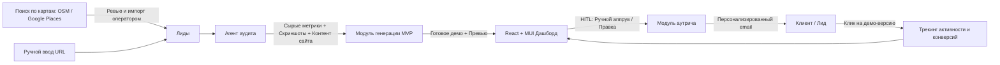
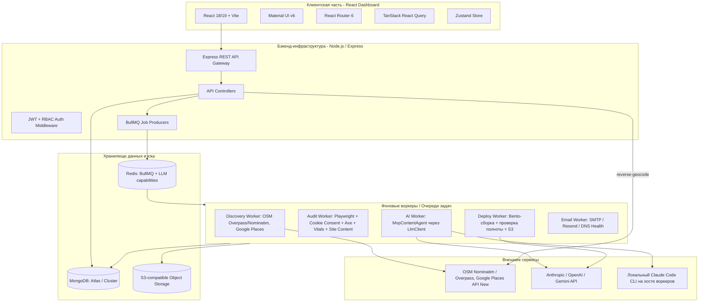
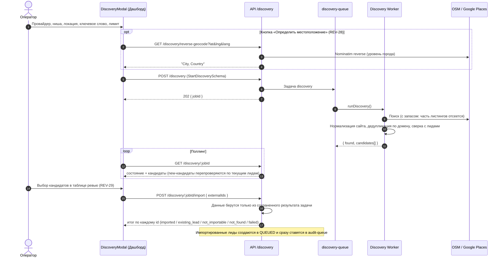
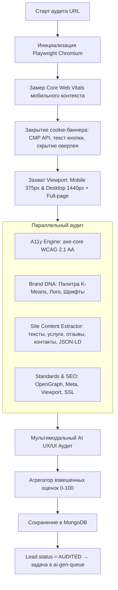
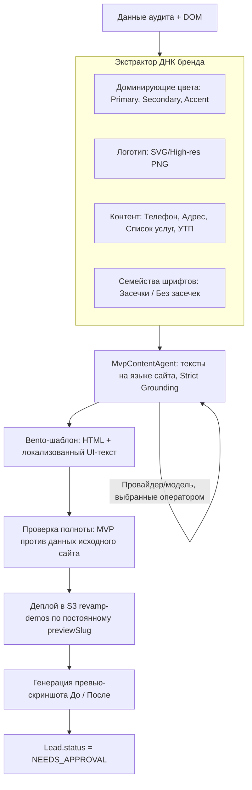
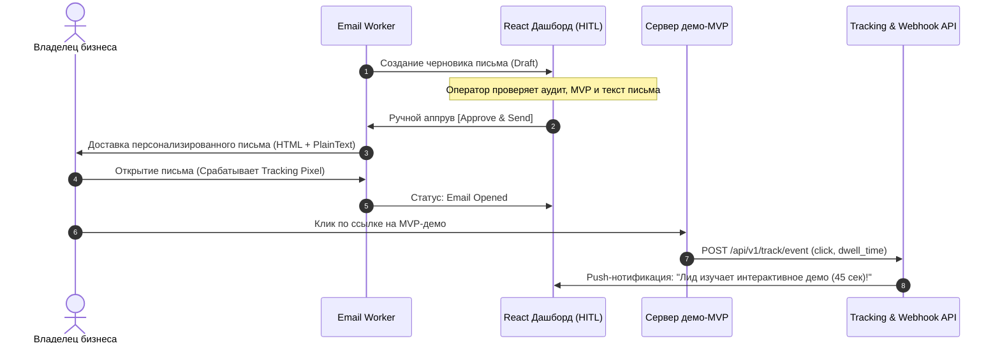
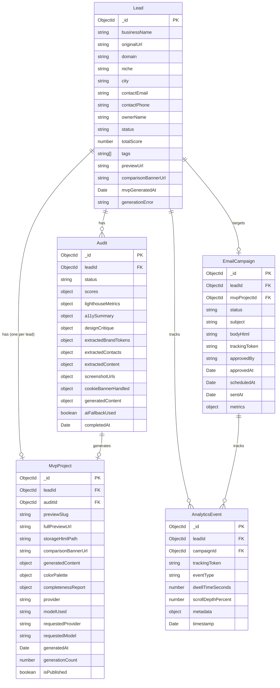
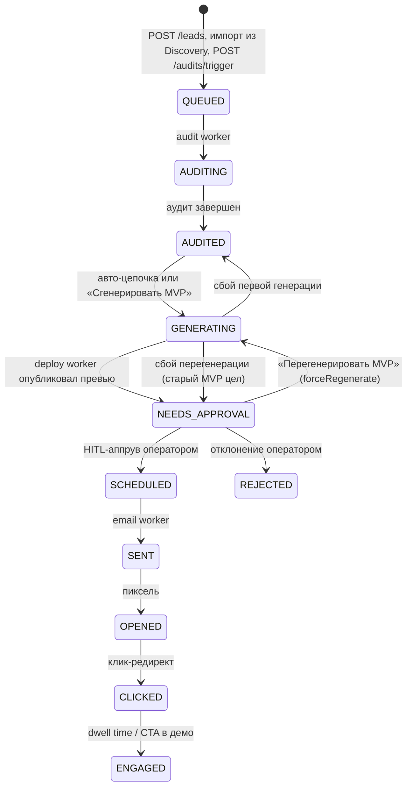
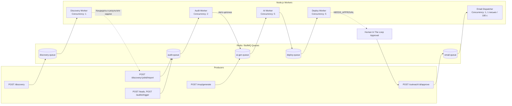
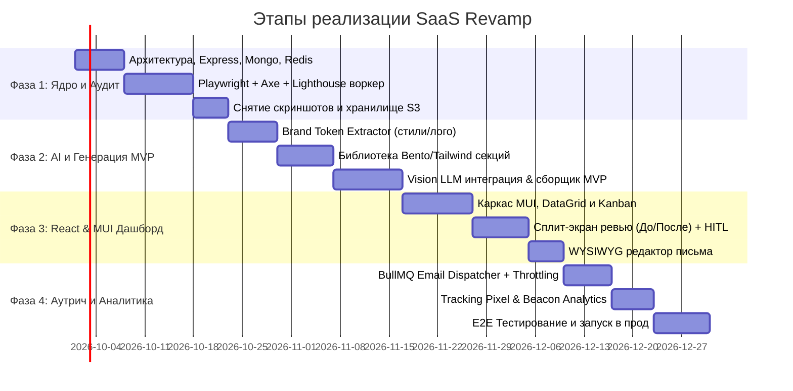

# Архитектурный Блюпринт: SaaS-система автоматизированного аудита и редизайна сайтов локального бизнеса (Revamp SaaS)

---

## 1. Введение и концепция системы

### 1.1. Назначение системы
Платформа предназначена для автоматизации B2B-лидогенерации и предпродажной подготовки (cold outreach) для веб-агентств, дизайн-студий и фрилансеров. Система находит или принимает на вход сайты локальных бизнесов (стоматологии, автосервисы, юридические конторы, салоны красоты и др.), выполняет глубокий многоуровневый аудит, автоматически синтезирует современный интерактивный MVP-редизайн с сохранением ДНК исходного бренда и готовит гиперперсонализированное коммерческое предложение с интерактивным демо.

Ключевой дифференциатор: **Human-In-The-Loop (HITL)** — перед отправкой письма оператор видит аудит, скриншоты «до/после», сгенерированный лендинг и персонализированный текст в удобном React/MUI дашборде и может подтвердить отправку или внести правки в один клик.



---

## 2. Общая архитектура и стек технологий



> Воркеры раз в 60 секунд публикуют в Redis (`revamp:llm-capabilities`, TTL 180 с) список LLM-провайдеров, которые они могут запустить (есть API-ключ, найден бинарник `claude`). API читает этот ключ для `GET /mvp/providers`, поскольку ключи и CLI живут на хосте воркеров, а не API (REV-32).

### Стек технологий:
* **Backend:** Node.js (v20+ LTS, TypeScript), Express.js.
* **База данных:** MongoDB (Mongoose ODM), реплика-сет, транзакции для операций статусов.
* **Очереди и кэш:** Redis (v7+) + BullMQ (для отказоустойчивой асинхронной обработки тяжелых задач браузера и LLM).
* **Headless Browser & Аудит:** Playwright (Chromium), `@axe-core/playwright`, замеры Core Web Vitals в браузере, `happy-dom` для разбора HTML сгенерированного MVP.
* **Поиск бизнесов (Discovery):** OpenStreetMap (Nominatim + Overpass, без ключа, ODbL) и Google Places API (New) Text Search (по ключу).
* **AI & LLM:** единый `LlmClient` для Anthropic, OpenAI, Gemini и локального Claude Code CLI; каталог провайдеров и моделей — в `@revamp/shared-types` (`LLM_PROVIDER_CATALOG`). Оператор выбирает провайдера и модель для каждой генерации MVP. LLM пишет только тексты и суждения; HTML строится детерминированным шаблоном.
* **Фронтенд:** React (v18+), TypeScript, Vite, Material UI (MUI v6), TanStack Query, Zustand, i18next (en, ru, be, pl, lt).
* **Email & Deliverability:** Nodemailer / Resend API / SendGrid, DKIM/SPF валидатор, генерация пикселей отслеживания и URL-редиректов.
* **Хостинг MVP-демо:** AWS S3 / Cloudflare R2 + CloudFront / Wildcard-поддомены (`*.preview.revampsaas.io`).

---

## 3. Архитектура и спецификация модулей

---

### Модуль 0: Поиск локальных бизнесов на картах (Discovery) — REV-26…REV-29

Модуль наполняет воронку лидами без ручного ввода URL: оператор задает нишу и локацию, система ищет бизнесы у картографического провайдера, а оператор выбирает, кого импортировать.



#### 0.1. Провайдеры
* **OpenStreetMap (по умолчанию, без ключа):** Nominatim превращает локацию в область Overpass (или радиус вокруг точки), Overpass возвращает объекты с тегами ниши (`OSM_NICHE_FILTERS`) и только с сайтом. Запросы идут с идентифицирующим `User-Agent` (`DISCOVERY_USER_AGENT`), как требуют правила Nominatim/Overpass; конкурентность воркера — `1`.
* **Google Places API (New) Text Search (по ключу `GOOGLE_PLACES_API_KEY`):** официальный API вместо парсинга страниц Google Maps (парсинг нарушает ToS). Лимит Google — 20 результатов на страницу, 60 всего.

#### 0.2. Классификация кандидатов
Воркер ничего не импортирует сам: он возвращает каждый листинг со статусом `DiscoveryCandidateStatus`:

| Статус | Значение |
|---|---|
| `new` | Бизнес с собственным сайтом, которого еще нет среди лидов; только такие можно импортировать |
| `existing_lead` | Домен уже есть среди лидов (с `leadId`) |
| `duplicate` | Тот же домен уже встречался в этой выдаче |
| `no_website` | Нет сайта, либо «сайт» — профиль соцсети или каталога |
| `invalid` | Листинг не прошел валидацию `DiscoveredBusinessSchema` |

Оператору предлагается не больше `limit` новых бизнесов; пропущенные показываются с причиной.

#### 0.3. Импорт и e-mail
* Лид создается через `LeadService.createLead` (статус `QUEUED`, теги `discovered` и `source:<provider>`) и сразу уходит в `audit-queue`.
* Если у листинга нет e-mail, лиду ставится `info@<domain>` и тег `email-guessed`; аудит заменяет его на e-mail, найденный на самом сайте.
* Ошибки конфигурации (нет ключа, локация не найдена, HTTP 400/401/403) завершают задачу как `UnrecoverableError`; таймауты Overpass ретраятся.

> **В работе (REV-35):** устойчивая идентичность лида (нормализованный домен, телефон в E.164, `source` + `externalId` листинга) и бэкфилл существующих лидов, чтобы уже импортированные бизнесы не предлагались повторно. Раздел будет обновлен после слияния.

---

### Модуль 1: Агент аудита (Audit Agent)

Агент аудита запускается в изолированном воркере и осуществляет комплексный сбор данных в четыре параллельных этапа.



#### 1.1. Этапы работы агента:
1. **Эмуляция и снятие снимков (Rendering & Screen Capture):**
   * Запуск Playwright в Headless-режиме с отключением блокировок краулинга (эмуляция актуального User-Agent). Навигация с таймаутом 25 с; браузер перезапускается каждые 20 задач.
   * **Закрытие cookie-баннеров (REV-33):** после навигации и до первого скриншота в обоих контекстах `CookieConsentService` принимает согласие через известные CMP (OneTrust, Cookiebot, Didomi, Quantcast, Usercentrics, CookieYes, Complianz, Osano, iubenda, Termly, TrustArc), затем кликает кнопку «Принять» по тексту (en/pl/ru/be/lt/de/fr/uk, включая iframe), затем скрывает оставшиеся оверлеи и снимает блокировку скролла. Бюджет 3 с, шаг никогда не роняет аудит. Мобильные Vitals снимаются до закрытия баннера (не влияет на CLS), axe — после (сканируется разметка самого сайта). Результат сохраняется в `Audit.cookieBannerHandled`.
   * Снятие скриншотов первого экрана (Above-the-fold) для двух брейкпоинтов:
     - Desktop: 1440x900
     - Mobile: 375x812 (iPhone 13/14 viewport)
   * **Полностраничные скриншоты (REV-21):** перед захватом страница прокручивается (подгрузка lazy-контента), анимации появления (AOS/WOW и т. п.) принудительно показываются, высота ограничивается (12 000 / 8 000 CSS px). Ужимается только ширина (1440 / 750 px), поэтому длинные страницы остаются читаемыми. Vision LLM по-прежнему получает только первый экран.
   * Сохранение изображений в S3/MinIO: `screenshots/{leadId}/{desktop,mobile,desktop-full,mobile-full}.webp`.
   * **Контент исходного сайта (REV-23):** `site-content.extractor.ts` выполняется внутри страницы и копирует из DOM (без генерации): title, meta description, H1 и заголовки, абзацы, услуги с описаниями, пункты навигации, реальные отзывы, контентные изображения (включая lazy и CSS-фоны), адрес и часы работы из видимого текста, данные schema.org `LocalBusiness` (JSON-LD: телефон, адрес, часы, рейтинг, год основания) и язык страницы. Приоритет контактов: schema.org > текстовые эвристики > совпадения по классам DOM. Результат — `Audit.extractedContent` и `Audit.extractedContacts`.

2. **Оценка доступности (Accessibility / a11y):**
   * Инжекция `@axe-core/playwright` в контекст страницы (после закрытия cookie-баннера).
   * Тестирование по стандартам WCAG 2.1 Level AA:
     - Цветовой контраст текста и фонов (Color Contrast Ratio < 4.5:1).
     - Отсутствующие или пустые атрибуты `alt` у изображений.
     - Доступность форм (отсутствие `<label>`, некорректные `for`/`id`).
     - Семантическая иерархия заголовков (`h1`-`h6`).
     - Фокус клавиатуры и ARIA-роли для интерактивных элементов.

3. **Соответствие веб-стандартам и производительность (Lighthouse & Standards):**
   * Запуск мобильного профиля Lighthouse:
     - Core Web Vitals: LCP (Largest Contentful Paint), INP (Interaction to Next Paint), CLS (Cumulative Layout Shift).
     - Наличие корректного Viewport мета-тега, HTTPS сертификата, фавикона, robots.txt, sitemap.xml.
     - Состояние микроразметки (Schema.org / OpenGraph / Twitter Cards).
     - Скорость загрузки и размер тяжелых неоптимизированных ассетов (PNG > 2MB, некэшируемые скрипты).

4. **Мультимодальный AI-анализ дизайна (Vision UX/UI Critique):**
   * Скриншоты отправляются в Vision LLM со специализированным системным промптом:
     - Оценка визуальной иерархии (Visual Hierarchy & Scannability).
     - Читаемость типографики на мобильных устройствах.
     - Заметность и привлекательность основного CTA (Call to Action).
     - Эффект «устаревшего сайта» (Dated Design Smell: градиенты 2010-х, неадаптивные таблицы, перегруженные меню).
     - Формирование списка из 3 критических UX-проблем и 3 очевидных точек роста (Quick Wins).

#### 1.2. Структура скоринга (Composite Score Formula):
$$\text{Total Score} = 0.35 \times S_{\text{Design/UX}} + 0.25 \times S_{\text{Performance}} + 0.20 \times S_{\text{Accessibility}} + 0.20 \times S_{\text{Standards/SEO}}$$

Каждый критерий нормализуется от 0 до 100. При оценке ниже 60 система генерирует конкретные продающие тезисы для холодного письма (например: *"Ваш мобильный сайт теряет до 45% клиентов из-за медленного LCP 4.8s и нечитаемого шрифта на смартфонах"*).

---

### Модуль 2: Модуль генерации уникальных MVP с сохранением брендового стиля

Модуль решает сложную инженерную задачу: не просто сгенерировать абстрактный лендинг, а создать **премиальную версию сайта конкретного бизнеса**, сохранив его айдентику (цвета, логотип, тексты, перечень услуг), но упаковав это в современный UX-каркас с конверсионными блоками.



#### 2.1. Спецификация пайплайна генерации:
1. **Экстракция бренд-токенов (Brand DNA Extraction):**
   * Парсинг вычисленных стилей (`window.getComputedStyle`) ключевых элементов: кнопок, заголовков, хедера.
   * Алгоритм кластеризации цветов (K-Means по изображениям и стилям) для выделения стабильной палитры:
     - `brandColorPrimary`
     - `brandColorSecondary`
     - `brandAccent`
     - `brandBackground`
   * Извлечение логотипа: поиск `<link rel="icon">`, селекторов `header img`, `nav svg`, `a[href="/"] img`.
   * Извлечение смысловых блоков (NLP/Regex): телефон, WhatsApp, email, физический адрес, график работы, прайс-лист/услуги, блок отзывов.

2. **Выбор компонентной сетки (Design System & Bento Layout):**
   * Используется модульная библиотека современных адаптивных секций на Tailwind CSS:
     - **Sticky Modern Header:** Логотип + Кнопка быстрого вызова + CTA «Записаться».
     - **Hero Section:** Усиленное УТП (переписанное через AI под формулу боли/выгоды) + форма мгновенного захвата контактов + социальные доказательства (бейджи Яндекс/Google карт).
     - **Bento Grid Services:** Карточки ключевых услуг бизнеса с современными иконками (Lucide/Heroicons).
     - **Trust & Reviews Block:** Интерактивная карусель отзывов клиентов.
     - **Interactive Booking Widget:** Интерактивное модальное окно для записи на прием / расчета стоимости.
     - **Footer & Location Map:** График работы, кликабельная интерактивная карта.

   * **Только реальные данные (REV-23):** шаблон не содержит выдуманных значений по умолчанию. Кнопка звонка, полоса доверия, отзывы, часы работы и контакты отображаются только при наличии извлеченных данных. Добавлены секции «О нас», hero-изображение, галерея и соцсети; адрес ведет на Google Maps. Бледный основной цвет заменяется читаемым фирменным или затемняется до контраста 3:1.
   * **Язык сайта (REV-25):** `<html lang>` получает BCP 47-тег исходного сайта, фиксированный UI-текст шаблона (подписи секций, форма, футер) и детерминированный fallback локализованы для en, ru, be, pl, lt (для прочих языков — английский UI при корректном `lang`).

3. **AI-адаптация контента (Copywriting Uplift):**
   * LLM переписывает тексты исходного сайта (`Audit.extractedContent`) в емкие, продающие офферы на **языке исходного сайта** (`outputLanguage`), сохраняя 100% фактической информации. Телефоны, e-mail и адреса LLM не выводит вовсе: они подставляются из проверенных данных.
   * Каждый запуск генерирует новые тексты; сохраненные ранее на аудите не переиспользуются.
   * Перед Zod-валидацией строки обрезаются до лимитов схемы (REV-34), поэтому одно слишком длинное поле не отбрасывает весь ответ.
   * **Выбор провайдера и модели (REV-30, REV-32):** оператор выбирает провайдера (`anthropic`, `openai`, `gemini`, `claude-cli`, dev-only `mock`) и модель в диалоге генерации; выбор действует только на эту задачу, иначе используется значение по умолчанию воркера (`MVP_LLM_PROVIDER`, либо первый найденный API-ключ). Провайдер без ключа или с ошибкой откатывается на детерминированные тексты и **никогда** не переключается на другой платный провайдер. `MvpProject` хранит выбранные (`requestedProvider/Model`) и фактические (`provider`, `modelUsed`) значения.
   * **Локальный Claude Code CLI (REV-30):** провайдер `claude-cli` запускает `claude -p` в headless-режиме под аккаунтом, в который залогинен CLI (без API-ключа): без инструментов, без MCP, без пользовательских настроек, во временной рабочей папке; промпт передается через stdin.

4. **Проверка полноты MVP (REV-36, REV-37):**
   * После рендеринга `MvpCompletenessService` разбирает HTML (`happy-dom`, без нового краулинга) и сверяет его с данными, извлеченными на аудите.
   * Поля и уровни: **critical** — `businessName`, `phone`, `email`, `address`; **important** — `workingHours`, `services`, `socialLinks`; **informational** — `logo`, `images`, `testimonials`, `rating`, `foundingYear`.
   * Статусы: `present`, `missing`, `altered` (есть, но другое), `not_in_source` (на исходном сайте нет), `unsourced` (контакт в MVP, которого нет на исходном сайте — вероятно, выдуман).
   * Если LLM настроен (`MVP_COMPLETENESS_LLM=true`), поля судит LLM: каждый вердикт должен дословно цитировать MVP. Код принимает вердикт, только если цитата есть в тексте, ссылках или URL изображений MVP, телефон/e-mail совпадают с источником после нормализации и имеют `tel:`/`mailto:`-ссылку, а «missing» не перекрывает найденное кодом совпадение. `not_in_source` и итоговый балл (веса 3/2/1 по уровням) всегда считает код.
   * При отсутствии провайдера, таймауте (`MVP_COMPLETENESS_LLM_TIMEOUT_MS`), ошибке или невалидном ответе после одного повтора используется сравнение только кодом; причина сохраняется в `llmError`. Сбой самого сравнения дает отчет `unverified` и никогда не роняет задачу.
   * Отчет валидируется Zod, сохраняется в `MvpProject.completenessReport` и пересчитывается при каждой генерации. Отчет носит рекомендательный характер: он ничего не одобряет, не блокирует и не отправляет.

5. **Компиляция, изоляция и деплой:**
   * Сборка страницы в один оптимизированный бандл (HTML + inline CSS/JS).
   * Инжекция аналитического скрипта трекинга (`revamp-tracker.js`): регистрирует факт входа владельца, скролл, клики по кнопкам демо.
   * Публикация в бакет `revamp-demos` по ключу `v/{previewSlug}/index.html` (slug — транслитерированное название бизнеса + 6 последних символов `leadId`).
   * Автоматический снимок созданного лендинга через Playwright для формирования баннера «До/После» (Split-screen Comparison, 1200x630).

6. **Перегенерация (REV-31):**
   * Правила `mvpGenerationMode` (`@revamp/validation`): из `AUDITED` — первая генерация; из `MVP_READY`, `NEEDS_APPROVAL`, `AWAITING_APPROVAL`, `APPROVED` — только с `forceRegenerate`; после постановки письма в отправку (`SCHEDULED` и далее) и во время генерации — запрещено (409).
   * Существующий проект сохраняет `previewSlug`: объекты в бакете перезаписываются (`Cache-Control: no-cache`), уже отправленная ссылка остается рабочей. `MvpProject` один на лид; обновляются `generatedAt` и `generationCount`, а превью в дашборде сбрасывает кэш по `Lead.mvpGeneratedAt`.
   * Лид остается в `GENERATING`, пока деплой не опубликует новое превью. После исчерпания ретраев лид возвращается в `AUDITED` (первая генерация) или `NEEDS_APPROVAL` (предыдущий MVP цел), а причина пишется в `Lead.generationError`.

---

### Модуль 3: Модуль персонализированных писем (Email Outreach)

Модуль отвечает за упаковку результатов аудита и созданного MVP в персональное письмо, исключающее ощущение шаблонного спама.



#### 3.1. Генератор структуры письма:
* **Тема (Subject Line):** Динамическая, персонализированная (например: *«Заметили 3 ошибки в мобильной версии {{businessName}} (и подготовили быстрый прототип)»*).
* **Тело письма:**
  1. *Персонализированное вступление:* упоминание конкретного города, специфики бизнеса.
  2. *Конкретные факты:* «Мы протестировали ваш сайт на смартфонах: оценка доступности {{a11yScore}}/100, время загрузки {{lcpTime}} сек».
  3. *Наглядная демонстрация:* Встроенный адаптивный GIF / скриншот «Старый сайт vs Новый адаптивный MVP».
  4. *Ценность без давления:* «Мы не берем денег за аудит — мы уже собрали для вас интерактивную концепцию с сохранением вашего фирменного стиля и логотипа: [Открыть прототип {{businessName}}]».
  5. *Call To Action:* Простая ссылка без сложных регистраций + предложение созвониться на 10 минут, если концепт понравился.

#### 3.2. Deliverability & Safeguards (Инфраструктура доставки):
* **Ротация доменов и почтовых ящиков:** Поддержка нескольких прогретых вторичных доменов (например, `getrevamp.co`, `revamp-audit.com`).
* **Ограничение скорости (Throttling):** Не более 15–20 писем в час с одного ящика для исключения попадания в спам-фильтры Google/Яндекс/Outlook.
* **Автоматическая валидация MX/DNS:** Предварительная проверка существования почтового ящика лида (ZeroBounce/Hunter API или встроенный SMTP handshake).
* **Соблюдение законов (CAN-SPAM / GDPR / 152-ФЗ):** Обязательный одноэтапный `Unsubscribe-Link` и физический адрес отправителя в футере.

---

### Модуль 4: Дашборд управления на React & Material UI (HITL & Analytics)

Дашборд служит единым рабочим местом оператора/менеджера по продажам.

```
+-----------------------------------------------------------------------------------------+
| [Logo] Revamp Admin       | Поиск по домену/лиду...        | [Квоты: 84/100] [Оператор v] |
+-----------------------------------------------------------------------------------------+
| [Панель]     | [Pipeline] Kanban: Воронка лидов                             [+ Новый аудит] |
| > Лиды       +--------------+--------------+--------------+--------------+--------------+
| > Аудиты     | В очереди (4)| Анализ (2)   | Ожидает (8)  | Отправлено(12| Кликнули (5) |
| > Шаблоны    | site1.ru     | site5.ru     | [!] auto.ru  | dental.ru    | VIP-law.ru   |
| > Почта      | bakery.com   | fitness.com  | law-help.ru  | clinic-spb.ru| [Демо: 3 мин]|
| > Аналитика  +--------------+--------------+--------------+--------------+--------------+
| > Настройки  |                                                                           |
|              | ДЕТАЛЬНЫЙ РЕВЬЮ-МОДАЛ (HITL APPROVAL GATE):                               |
|              | +-------------------------------+---------------------------------------+ |
|              | | ИСХОДНЫЙ САЙТ (Оценка: 38/100)| НОВЫЙ СГЕНЕРИРОВАННЫЙ MVP             | |
|              | | [Скриншот десктоп / мобайл]   | [Интерактивный фрейм: 100% отзывчивый]| |
|              | | - LCP: 5.4s (Критично)        | - Чистая палитра (Взята с логотипа)   | |
|              | | - A11y: 41/100 (Нет контраста)| - Добавлен виджет быстрой записи      | |
|              | +-------------------------------+---------------------------------------+ |
|              | | ЧЕРНОВИК ПИСЬМА ДЛЯ ОТПРАВКИ:                                         | |
|              | | Кому: director@auto.ru   | Тема: 3 проблемы в мобильной версии...     | |
|              | | [ WYSIWYG Редактор письма с подстановкой переменных ]                | |
|              | | [Перегенерировать MVP]   [Редактировать код]  [ ОДОБРИТЬ И ОТПРАВИТЬ ]| |
|              | +-----------------------------------------------------------------------+ |
+--------------+---------------------------------------------------------------------------+
```

#### 4.1. Архитектура фронтенд-приложения:
* **Компонентная система:** `@mui/material`, `@mui/icons-material`, `@mui/x-data-grid` для работы с большими таблицами лидов.
* **Темизация:** Кастомная дизайн-система на базе Material UI с поддержкой светлой/тёмной темы, современными скруглениями (border-radius: 12px), акцентными статусными чипами (Status Chips: `Draft`, `Auditing`, `ReviewRequired`, `Sent`, `Opened`, `Clicked`).
* **Управление состоянием и кэшем:**
  - `TanStack Query (React Query v5)`: инвалидация кэша списков лидов, polling для отображения прогресса аудита, генерации и поиска бизнесов.
  - `Zustand`: глобальное состояние активных фильтров, модальных окон предпросмотра и текущего выбранного лида; `useDiscoveryStore` (открыт ли поиск и активная задача — переживает закрытие модалки), `useLlmChoiceStore` (последний выбранный провайдер/модель), `useLanguageStore` (язык интерфейса).
* **Локализация (REV-24):** `i18next` + `react-i18next` с типизированными ключами. Английский словарь — источник, словари ru/be/pl/lt проверяются по нему на этапе компиляции. Язык: сохраненный выбор → язык браузера → английский; хранится в `localStorage`, `<html lang>` следует за ним. Даты форматируются по языку (для be — `ru-BY`, где у браузера нет белорусских данных). Тексты MUI core и DataGrid локализованы для en/ru/be/pl (для lt MUI локали не поставляет).

#### 4.2. Ключевые экраны:
1. **Pipeline Kanban & DataGrid:**
   * Переключение между табличным представлением (MUI DataGrid с фильтрацией по скорингу, нише, городу) и Kanban-доской статусов.
2. **Side-by-Side Audit & Comparison Inspector:**
   * Сплит-экран: Слева старый сайт с маркерами ошибок (красные оверлеи на элементах с низким контрастом или плохой версткой).
   * Справа: Интерактивный `<iframe>` со сгенерированным MVP с тулбаром смены брейкпоинтов (Desktop / Tablet / Mobile).
   * Полностраничные скриншоты исходного сайта в прокручиваемом просмотрщике со ссылкой «Открыть в полном размере» (REV-21).
   * Чек-лист полноты MVP (`CompletenessChecklist`, REV-36/37): поле, значение на исходном сайте, значение в MVP, статус, кто решил (LLM или код), метод и модель проверки.
   * Кто написал тексты MVP: провайдер и модель (`MvpSourceChip`, REV-32).
3. **HITL Review Modal (Окно подтверждения отправки):**
   * Быстрый предпросмотр темы и текста письма.
   * Кнопка инлайн-редактирования текста перед отправкой.
   * Кнопка «Перегенерировать MVP» с подтверждением и выбором провайдера/модели (REV-31, REV-32).
   * Если критическое поле MVP отсутствует, изменено или выдумано, одобрение требует дополнительного подтверждения (REV-36).
   * Большая акцентная кнопка «Подтвердить и отправить» (`Ctrl/Cmd + Enter`).
4. **Карточки Kanban:** кнопки «Сгенерировать MVP» (для `AUDITED`) и «Перегенерировать MVP» (для `NEEDS_APPROVAL`, `MVP_READY`, `AWAITING_APPROVAL`, `APPROVED`), чип «Пробелы в данных» при критических проблемах полноты, текст последней ошибки генерации (`generationError`).
5. **Поиск бизнесов (`DiscoveryModal` + `DiscoveryReview`, REV-27…REV-29):** кнопка в хедере открывает форму (провайдер, ниша, локация с автоопределением, ключевое слово, лимит). После отправки модалка опрашивает задачу; ее можно свернуть кнопкой «Выполнять в фоне». По завершении показывается таблица кандидатов с предвыбранными новыми бизнесами, переключателем «Показать пропущенные» и итогом импорта.
6. **Аналитический дашборд:**
   * Конверсионная воронка (Аудиты -> Отправлено -> Открыто -> Переходов на MVP -> Ответы).
   * График активности лидов (время нахождения на демо-сайте, клики по кнопке «Оставить заявку»).

---

## 4. Схема базы данных (MongoDB / Mongoose)

> Схемы ниже отражают фактические модели `apps/api/src/models` и `apps/workers/src/models` и типы `@revamp/shared-types` на момент REV-37. Коллекция `users` и RBAC (§7) пока не реализованы.



Результаты поиска бизнесов (Discovery) в MongoDB не хранятся: список кандидатов живет в результате BullMQ-задачи `discovery-queue` в Redis, и импорт читает его оттуда.

### Детальное описание коллекций:

#### 1. `leads`
```typescript
interface ILead {
  _id: Types.ObjectId;
  businessName: string;
  originalUrl: string;
  domain: string;                 // hostname без www, в нижнем регистре
  niche: 'dental' | 'auto' | 'legal' | 'beauty' | 'construction' | 'medical' | 'restaurant' | 'fitness' | 'other';
  city?: string;                  // улица сюда не пишется: полный адрес хранится в Audit.extractedContacts
  contactEmail: string;           // для лидов из Discovery может быть info@<domain> с тегом email-guessed
  contactPhone?: string;
  ownerName?: string;
  status: LeadStatus;             // см. жизненный цикл ниже
  totalScore?: number;
  tags: string[];                 // discovered, source:osm|google, email-guessed
  previewUrl?: string;
  comparisonBannerUrl?: string;
  mvpGeneratedAt?: Date;          // сброс кэша превью после перегенерации (REV-31)
  generationError?: string;       // причина последнего сбоя генерации (REV-31)
  createdAt: Date;
  updatedAt: Date;
}
```

**Жизненный цикл лида (фактические переходы):**



Статусы `PENDING`, `MVP_READY`, `AWAITING_APPROVAL`, `APPROVED`, `DISPATCHED`, `REPLIED`, `UNSUBSCRIBED` остаются в типе `LeadStatus` для совместимости и группируются дашбордом с соседними колонками Kanban, но воркеры их не выставляют.

#### 2. `audits`
```typescript
interface IAudit {
  _id: Types.ObjectId;
  leadId: Types.ObjectId;         // повторный аудит создает новый документ; воркер пишет в самый свежий
  status: 'QUEUED' | 'PROCESSING' | 'COMPLETED' | 'FAILED';
  scores: { total: number; design: number; accessibility: number; performance: number; standards: number }; // 0-100
  lighthouseMetrics: { lcp: number; fidOrInp?: number; cls: number; speedIndex?: number };
  a11ySummary: {
    violationsCount: number;
    contrastIssuesCount: number;
    missingAltCount: number;
    criticalViolations: Array<{ id: string; description: string; impact?: string; selector: string }>;
  };
  designCritique: {
    visualHierarchyRating: number;
    mobileFriendlinessRating: number;
    primaryCtaFound: boolean;
    datedDesignFactors: string[];
    criticalFlaws: Array<{ title: string; impact: string; recommendation: string }>;
    quickWins: string[];
  };
  extractedBrandTokens: {
    primaryColor: string;
    secondaryColor: string;
    accentColor: string;
    fontFamilies: string[];
    logoUrl?: string;
    faviconUrl?: string;
  };
  extractedServices?: string[];
  extractedContacts?: {           // REV-23: детерминированно с исходного сайта
    phone?: string; email?: string; address?: string; workingHours?: string;
    socialLinks: Array<{ platform: string; url: string }>;
  };
  extractedContent?: {            // REV-23: тексты и структура исходного сайта, дословно из DOM
    language?: string; title?: string; metaDescription?: string; ogImage?: string; h1?: string;
    headings: string[]; paragraphs: string[];
    serviceItems: Array<{ title: string; description?: string }>;
    navItems: string[];
    testimonials: Array<{ text: string; author?: string }>;
    images: string[];
    rating?: { value: number; count?: number };
    foundingYear?: number;
  };
  screenshotUrls: {
    desktopOriginal: string;
    mobileOriginal: string;
    desktopFull?: string;         // REV-21
    mobileFull?: string;          // REV-21
    comparisonBanner?: string;
  };
  cookieBannerHandled?: { desktop?: string; mobile?: string }; // REV-33: dismissed:cmp:<platform> | dismissed:text | ... | not_found | timeout | error
  generatedContent?: IMvpGeneratedContent; // последние тексты MvpContentAgent
  aiFallbackUsed?: boolean;
  errorMessage?: string;
  createdAt: Date;
  completedAt?: Date;
}
```

#### 3. `mvp_projects`
```typescript
interface IMvpProject {
  _id: Types.ObjectId;
  auditId: Types.ObjectId;
  leadId: Types.ObjectId;         // один проект на лид; перегенерация обновляет его на месте
  previewSlug: string;            // e.g. "dental-art-a1b2c3"; не меняется при перегенерации
  fullPreviewUrl: string;         // <S3_ENDPOINT>/revamp-demos/v/<slug>/index.html
  storageHtmlPath: string;        // v/<slug>/index.html
  comparisonBannerUrl?: string;   // banners/<slug>.webp, 1200x630
  generatedContent: {
    hero: { badge: string; headline: string; subheadline: string; primaryCtaText: string; secondaryCtaText: string };
    about?: { heading: string; body: string };
    servicesHeading?: string;
    services: Array<{ title: string; description: string; lucideIconName: string }>;
    trustSignals: Array<{ metric: string; label: string }>;
    offerNotice: string;
  };
  colorPalette: { primary: string; secondary: string; accent: string };
  isPublished: boolean;
  generatedAt?: Date;             // REV-31
  generationCount?: number;       // REV-31
  completenessReport?: {          // REV-36/37
    status: 'verified' | 'unverified';
    score?: number;               // 0-100, веса critical 3 / important 2 / informational 1
    hasCriticalIssues: boolean;
    checks: Array<{
      field: CompletenessField; tier: 'critical' | 'important' | 'informational';
      status: 'present' | 'missing' | 'altered' | 'not_in_source' | 'unsourced';
      originalValue?: string; mvpValue?: string; note?: string; judgedBy?: 'llm' | 'code';
    }>;
    method?: 'llm' | 'deterministic';
    model?: string;
    llmError?: string;
    error?: string;
    checkedAt: Date;
  };
  provider?: 'anthropic' | 'openai' | 'gemini' | 'claude-cli' | 'mock' | 'deterministic'; // REV-32
  modelUsed?: string;
  requestedProvider?: 'anthropic' | 'openai' | 'gemini' | 'claude-cli' | 'mock';
  requestedModel?: string;
  createdAt: Date;
  updatedAt: Date;
}
```

#### 4. `email_campaigns` & `analytics_events`
```typescript
interface IEmailCampaign {
  _id: Types.ObjectId;
  leadId: Types.ObjectId;
  auditId: Types.ObjectId;
  mvpProjectId: Types.ObjectId;
  status: 'DRAFT' | 'NEEDS_APPROVAL' | 'APPROVED' | 'SCHEDULED' | 'SENDING' | 'DELIVERED' | 'BOUNCED' | 'REJECTED';
  senderEmail: string;
  recipientEmail: string;
  subject: string;
  previewText?: string;
  bodyHtml: string;
  bodyPlainText?: string;
  trackingToken: string;
  requiresManualReview: boolean;
  approvedBy?: string;
  approvedAt?: Date;
  scheduledAt?: Date;
  sentAt?: Date;
  bouncedAt?: Date;
  bounceReason?: string;
  metrics: {
    openedAt?: Date;
    openCount: number;
    clickedAt?: Date;
    clickCount: number;
    demoVisitCount: number;
    totalDwellTimeSeconds: number;
  };
}

interface IAnalyticsEvent {
  leadId?: Types.ObjectId;
  campaignId?: Types.ObjectId;
  mvpProjectId?: Types.ObjectId;
  trackingToken?: string;
  eventType: 'open' | 'click' | 'pageview' | 'dwell_time' | 'cta_click' | 'booking_intent' | 'scroll_depth' | 'token_usage';
  dwellTimeSeconds?: number;
  scrollDepthPercent?: number;
  ipHash?: string;
  userAgent?: string;
  metadata?: Record<string, unknown>;
  timestamp: Date;
}
```

---

## 5. Спецификация REST API (Express.js)

Базовый путь: `/api/v1`. Тела запросов и query-параметры валидируются Zod-схемами из `@revamp/validation` (`validateBody` / `validateQuery`). Ответы: `{ success: true, data }` или `{ success: false, error: { code, message } }`. Эндпоинты с пометкой *(план)* описаны в первоначальном дизайне, но еще не реализованы.

### 5.1. Управление лидами и аудитами (`/leads`, `/audits`)
| Метод | Эндпоинт | Описание | Body / Параметры |
|---|---|---|---|
| `POST` | `/leads` | Создать лид (`QUEUED`) и поставить аудит в очередь | `CreateLeadSchema`: `{ businessName, originalUrl, contactEmail, niche, city?, contactPhone?, ownerName? }` |
| `GET` | `/leads` | Список лидов с фильтрами и пагинацией (`pagination.total`); каждый лид несет краткую сводку полноты MVP (`completeness`). `search` ищет подстроку без учета регистра (спецсимволы экранируются). Дашборд загружает все страницы по `limit=100` (REV-43) | `?status=&niche=&complexity=&search=&page=&limit=` (`limit` ≤ 100, по умолчанию 20) |
| `GET` | `/leads/stats` | Счетчики по всей воронке без учета фильтров списка → `{ total, byStatus }` (`ILeadStats`); источник KPI-карточек дашборда (REV-43) | — |
| `GET` | `/leads/:id` | Детальная карточка лида + связанный аудит | — |
| `POST` | `/audits/trigger` | Принудительный перезапуск аудита (новый документ `Audit`) | `{ leadId }` |
| `GET` | `/audits/:id` | Результаты аудита, метрики, ссылки на скриншоты | — |

### 5.2. Модуль генерации MVP (`/mvp`)
| Метод | Эндпоинт | Описание | Body / Параметры |
|---|---|---|---|
| `GET` | `/mvp/providers` | LLM-провайдеры и модели для генерации и доступность каждого по последнему отчету воркеров (REV-32) | — |
| `POST` | `/mvp/generate` | Запуск генерации/перегенерации MVP → `202 { jobId, status: 'GENERATING' }` | `GenerateMvpSchema`: `{ auditId, forceRegenerate?, provider?, model? }` |
| `GET` | `/mvp/:id` | Проект MVP по `_id`, `leadId`, `auditId` или `previewSlug` (с отчетом полноты) | — |
| `GET` | `/mvp/preview/:slug` | Редирект на опубликованное превью с заголовками CSP / `X-Frame-Options` | — |
| `PATCH` | `/mvp/:id/tokens` | Ручная коррекция палитры оператором | `UpdateMvpTokensSchema`: `{ primaryColor?, secondaryColor?, accentColor?, headline?, subheadline?, services? }` (сейчас сохраняется только палитра) |
| `POST` | `/mvp/:id/rebuild` | *(план)* Пересборка статики после правок оператора | — |

Коды ошибок `POST /mvp/generate`: `400` ошибка валидации (неизвестный провайдер или модель другого провайдера), `400 LLM_PROVIDER_NOT_ALLOWED` (dev-only провайдер `mock` в production), `404` (нет аудита/лида), `409 MVP_ALREADY_GENERATED` (MVP есть, а `forceRegenerate` не задан), `409 MVP_GENERATION_NOT_ALLOWED` (письмо уже в отправке или идет генерация).

### 5.3. Модуль аутрича и подтверждения (HITL) (`/outreach`)
| Метод | Эндпоинт | Описание | Body / Параметры |
|---|---|---|---|
| `GET` | `/outreach/pending` | Лиды, ожидающие ручного подтверждения (`NEEDS_APPROVAL`) | — |
| `POST` | `/outreach/:id/approve`| **[HITL Action]** Одобрить: лид → `SCHEDULED`, письмо в `email-queue` с джиттером | `{ subject?, body?, preheader?, approvedBy?, scheduleTime? }` |
| `POST` | `/outreach/:id/reject` | Отклонить отправку (лид → `REJECTED`) | `{ reason: string }` |
| `POST` | `/outreach/:id/test`   | Тестовое письмо на почту оператора | `{ testEmail: string }` |
| `PUT` | `/outreach/:id/draft` | *(план)* Сохранение черновика без отправки | `{ subject, bodyHtml }` |

### 5.4. Поиск локальных бизнесов (`/discovery`) — REV-26…REV-29
| Метод | Эндпоинт | Описание | Body / Параметры |
|---|---|---|---|
| `POST` | `/discovery` | Поставить поиск в `discovery-queue` → `202 { jobId }` | `StartDiscoverySchema`: `{ provider: 'osm'\|'google', niche, location, keyword?, limit (1-100, по умолч. 20) }` |
| `GET` | `/discovery/reverse-geocode` | Координаты браузера → `"City, Country"` через Nominatim (уровень города); `404` если не найдено, `502` при сбое Nominatim | `?lat&lng&lang` |
| `GET` | `/discovery/:jobId` | Состояние задачи (`waiting`/`active`/`completed`/`failed`/…), параметры, кандидаты; `new`-кандидаты перепроверяются по текущим лидам | — |
| `POST` | `/discovery/:jobId/import` | Импорт выбранных кандидатов как лидов; данные берутся только из результата задачи; `404` неизвестная задача, `409` задача не завершена | `ImportDiscoverySchema`: `{ externalIds: string[] (1-100) }` |

### 5.5. Трекинг активности и аналитика (`/track`, `/health`)
| Метод | Эндпоинт | Описание |
|---|---|---|
| `GET` | `/track/open/:token.gif` | 1x1 прозрачный пиксель отслеживания открытия письма (лид → `OPENED`) |
| `GET` | `/track/click/:token` | Редирект на демо-сайт с логированием клика (лид → `CLICKED`) |
| `POST` | `/track/mvp-event` | Beacon API: время на странице, скролл, клики в демо (лид → `ENGAGED`) |
| `GET` | `/track/revamp-tracker.js` | Скрипт трекинга для страниц MVP |
| `GET` | `/health` | Проверка доступности API, MongoDB и Redis |
| `GET` | `/analytics/overview` | *(план)* Метрики воронки, open rate, CTR, средний скоринг |

---

## 6. Архитектура очередей задач (BullMQ & Redis)

Для изоляции нагрузки и предотвращения утечек памяти Playwright задачи разделены по специализированным очередям с индивидуальными лимитами конкурентности. Имена очередей — `QUEUE_NAMES` в `apps/api/src/queues/queue.constants.ts` и `apps/workers/src/queues/queue.constants.ts`.



### Настройки воркеров:
1. **`discovery-queue` Worker:**
   * Concurrency: `1` (правила добросовестного использования Nominatim/Overpass).
   * Ретраи: 2 попытки с экспоненциальным откатом от 10 с; ошибки конфигурации завершаются `UnrecoverableError` без повтора.
2. **`audit-queue` Worker:**
   * Concurrency: `2` (Playwright ресурсоемок).
   * Sandbox: каждый запуск в отдельном контексте браузера, таймаут навигации 25 с, перезапуск браузера каждые 20 задач.
   * По завершении ставит задачу в `ai-gen-queue`. При старте воркеров лиды, застрявшие в `AUDITED` с завершенным аудитом, ставятся в очередь повторно (`recoverStalledAuditedLeads`).
3. **`ai-gen-queue` Worker:**
   * Concurrency: `5`. Ретраи: 3 попытки, экспоненциальный откат от 5 с; внутри задачи — до 3 обращений к LLM (температура 0.3 → 0.0 → 0.0), затем детерминированный fallback.
   * Payload несет `forceRegenerate`, `previousStatus` и выбор оператора (`provider`, `model`).
4. **`deploy-queue` Worker:**
   * Concurrency: `5`. Ретраи: 3 попытки, экспоненциальный откат от 5 с.
   * Рендер Bento, проверка полноты, выгрузка в `revamp-demos`, баннер «До/После», `Lead.status = NEEDS_APPROVAL`.
   * Обработчик `failed` (общий с AI-воркером, `generation-failure.ts`) после последнего ретрая возвращает лид из `GENERATING` и пишет `generationError`.
5. **`email-queue` Worker:**
   * Throttling: строго 1 письмо в 3 минуты (BullMQ limiter `max: 1, duration: 180000`).
   * Jitter: случайная задержка 15–45 секунд, рассчитываемая API при постановке задачи.

---

## 7. Безопасность, отказоустойчивость и соответствие нормам

1. **Изоляция сгенерированных MVP:**
   * Сгенерированный код размещается на отдельном домене (`*.revampdemo.com`), изолированном от основного приложения.
   * Строгая политика `Content-Security-Policy` (CSP): запрет `unsafe-eval`, ограничение подключения сторонних скриптов, песочница для `<iframe>` в дашборде (`sandbox="allow-scripts allow-same-origin"`).
2. **Защита от Abuse & Спам-блокировок:**
   * Blacklist доменов: исключение правительственных сайтов, банков, крупных корпораций, сайтов с явным указанием `no-outreach`.
   * Автоматический мониторинг репутации IP и доменов отправки (Postmaster Tools API).
3. **Аутентификация и права доступа в Дашборде:**
   * JWT Access/Refresh tokens в `httpOnly`, `Secure`, `SameSite=Strict` cookie.
   * RBAC (Role-Based Access Control):
     - `Admin`: настройка SMTP, API-ключей, управление пользователями.
     - `Operator / Reviewer`: просмотр лидов, правка писем, ручной аппрув отправки.
     - `Viewer`: просмотр аналитики без права отправки.
   * *Статус:* аутентификация и RBAC пока не реализованы; дашборд и API рассчитаны на одного оператора в закрытом окружении.
4. **Внешние источники данных и LLM (REV-26…REV-37):**
   * **Discovery:** запросы к Nominatim/Overpass идут с идентифицирующим `User-Agent` и конкурентностью 1; Google Maps не парсится, используется только официальный Places API. Импорт берет данные кандидатов только из сохраненного результата задачи, а не из тела запроса, поэтому клиент не может подменить сайт или контакты.
   * **Геолокация оператора:** обратное геокодирование проксируется через API и ограничено уровнем города, чтобы не возвращать улицу оператора.
   * **Локальный Claude Code CLI:** запуск в одноходовом headless-режиме без инструментов, MCP-серверов и пользовательских/проектных настроек, во временной рабочей папке (чтобы CLI не подхватил `CLAUDE.md`/`AGENTS.md` репозитория), с таймаутом `CLAUDE_CLI_TIMEOUT_MS`.
   * **Провайдеры LLM:** выбор оператора не переключает задачу на другой платный провайдер при сбое — только на детерминированный fallback. Dev-only провайдер `mock` отклоняется в production.
   * **Grounding:** LLM никогда не выводит телефоны, e-mail и адреса; проверка полноты помечает выдуманные контакты как `unsourced`, а одобрение лида с критическими проблемами требует дополнительного подтверждения оператора.

---

## 8. Дорожная карта разработки (Implementation Roadmap)



### Фаза 1: Фундамент и модуль аудита (Недели 1–3)
* Подготовка репозитория (Monorepo: `apps/api`, `apps/dashboard`, `packages/shared-types`).
* Настройка моделей MongoDB и базового Express API.
* Воркер аудита: Playwright + Lighthouse API + Axe-core, загрузка скриншотов в S3/MinIO.

### Фаза 2: Модуль генерации MVP (Недели 4–6)
* Парсинг CSS и извлечение палитры/логотипов.
* Шаблонизатор адаптивных лендингов на базе современных Tailwind-компонентов.
* Интеграция Vision AI для оценки исходного сайта и генерации улучшенных формулировок.
* Хостинг демо-страниц и автоматическая генерация баннеров «До/После».

### Фаза 3: React + Material UI Дашборд (Недели 7–9)
* Полнофункциональный интерфейс: список лидов, фильтры, статусные пайплайны.
* Экран сравнения (Split-screen Comparison View) с живым предпросмотром MVP.
* Модальное окно оператора: HITL-подтверждение, правка текста и регенерация блоков.

### Фаза 4: Почтовый аутрич и трекинг (Недели 10–12)
* Очередь отправки писем с защитой доменов (BullMQ + Nodemailer / Resend).
* Сервер отслеживания кликов, открытий и времени нахождения на демо-сайте.
* Экран аналитики конверсий и интеграционное тестирование всего цикла.

### Фаза 5: Развитие после релиза (REV-21 — REV-41)
После закрытия первоначальной дорожной карты (REV-1 — REV-20) работа продолжается отдельными тикетами в Linear по конвейеру «тикет → код → тесты → PR → merge». Состав и статусы — в [milestones.md](./milestones.md#6-развитие-после-релиза-rev-21--rev-41):
* Качество аудита: полностраничные скриншоты (REV-21), закрытие cookie-баннеров (REV-33).
* Качество MVP: контент исходного сайта вместо шаблонов (REV-23), язык исходного сайта (REV-25), лимиты полей (REV-34), проверка полноты кодом и LLM (REV-36, REV-37).
* Генерация: локальный Claude Code CLI (REV-30), перегенерация (REV-31), выбор провайдера и модели (REV-32).
* Лидогенерация: поиск бизнесов на картах (REV-26 — REV-29), фильтрация уже существующих лидов (REV-35, в работе).
* Дашборд: английский интерфейс (REV-22) и локализация en/ru/be/pl/lt (REV-24).
