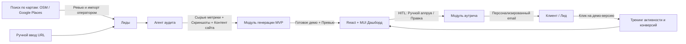
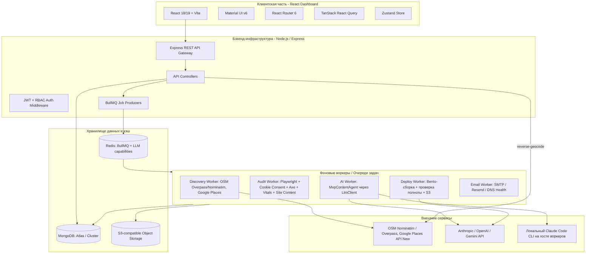
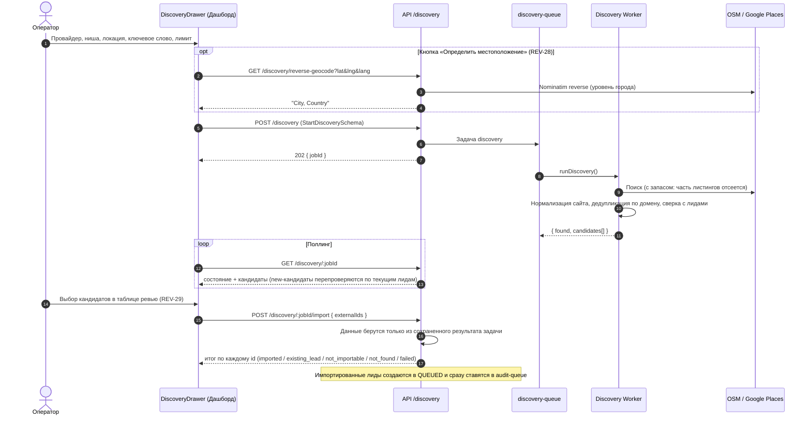
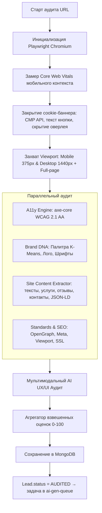
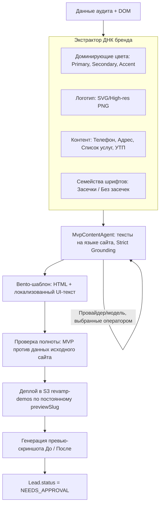
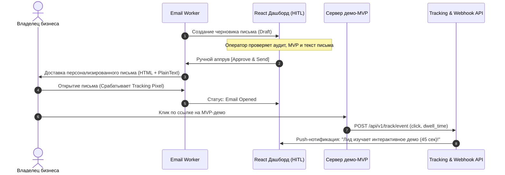
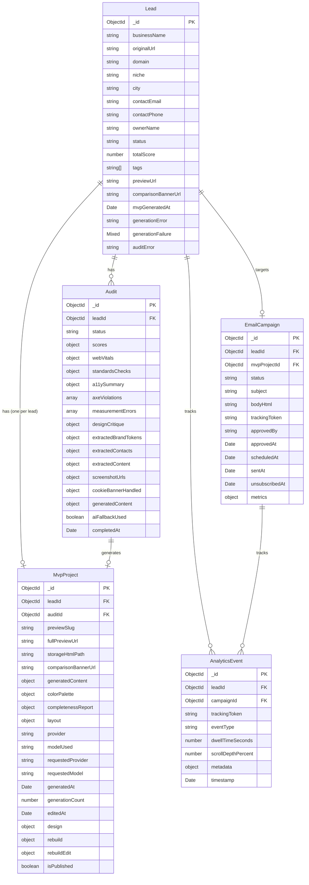
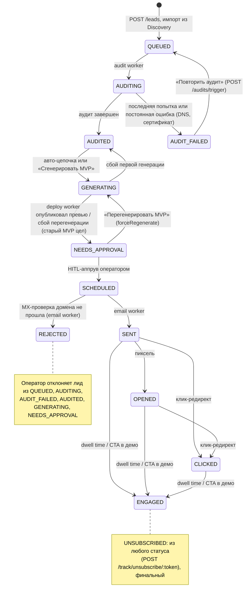
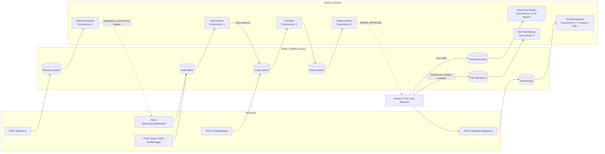
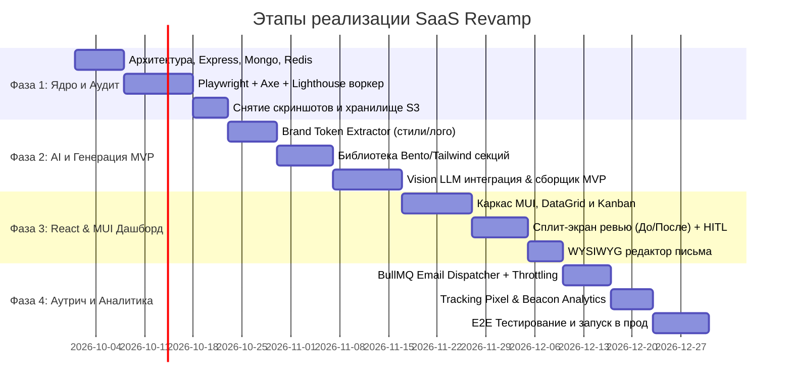

# Архитектурный Блюпринт: SaaS-система автоматизированного аудита и редизайна сайтов локального бизнеса (Revamp SaaS)

---

## 1. Введение и концепция системы

### 1.1. Назначение системы
Платформа предназначена для автоматизации B2B-лидогенерации и предпродажной подготовки (cold outreach) для веб-агентств, дизайн-студий и фрилансеров. Система находит или принимает на вход сайты локальных бизнесов (стоматологии, автосервисы, юридические конторы, салоны красоты и др.), выполняет глубокий многоуровневый аудит, автоматически синтезирует современный интерактивный MVP-редизайн с сохранением ДНК исходного бренда и готовит гиперперсонализированное коммерческое предложение с интерактивным демо.

Ключевой дифференциатор: **Human-In-The-Loop (HITL)** — перед отправкой письма оператор видит аудит, скриншоты «до/после», сгенерированный лендинг и персонализированный текст в удобном React/MUI дашборде и может подтвердить отправку или внести правки в один клик.


```mermaid
flowchart LR
    A0[Поиск по картам: OSM / Google Places] -->|Ревью и импорт оператором| A[Лиды]
    A1[Ручной ввод URL] --> A
    A --> B[Агент аудита]
    B -->|Сырые метрики + Скриншоты + Контент сайта| C[Модуль генерации MVP]
    C -->|Готовое демо + Превью| D[React + MUI Дашборд]
    D -->|HITL: Ручной аппрув / Правка| E[Модуль аутрича]
    E -->|Персонализированный email| F[Клиент / Лид]
    F -->|Клик на демо-версию| G[Трекинг активности и конверсий]
    G --> D
```

---

## 2. Общая архитектура и стек технологий


```mermaid
graph TB
    subgraph Frontend [Клиентская часть - React Dashboard]
        UI[React 18/19 + Vite]
        MUI[Material UI v6]
        Router[React Router 6]
        Query[TanStack React Query]
        State[Zustand Store]
    end

    subgraph API [Бэкенд-инфраструктура - Node.js / Express]
        Gateway[Express REST API Gateway]
        Auth[JWT + RBAC Auth Middleware]
        Controllers[API Controllers]
        Queues[BullMQ Job Producers]
    end

    subgraph Workers [Фоновые воркеры / Очереди задач]
        W_Disc[Discovery Worker: OSM Overpass/Nominatim, Google Places]
        W_Audit[Audit Worker: Playwright + Cookie Consent + Axe + Vitals + Site Content]
        W_AI[AI Worker: MvpContentAgent через LlmClient]
        W_Gen[Deploy Worker: Bento-сборка + проверка полноты + S3]
        W_Mail[Email Worker: SMTP / Resend / DNS Health]
    end

    subgraph Data [Хранилище данных и кэш]
        Mongo[(MongoDB: Atlas / Cluster)]
        Redis[(Redis: BullMQ + LLM capabilities)]
        S3[(S3-compatible Object Storage)]
    end

    subgraph External [Внешние сервисы]
        Maps[OSM Nominatim / Overpass, Google Places API New]
        LLM[Anthropic / OpenAI / Gemini API]
        CLI[Локальный Claude Code CLI на хосте воркеров]
    end

    UI --> Gateway
    Gateway --> Controllers
    Controllers --> Queues
    Queues --> Redis
    Redis --> Workers
    Workers --> Mongo
    Workers --> S3
    Controllers --> Mongo
    W_Disc --> Maps
    W_AI --> LLM
    W_AI --> CLI
    W_Gen --> LLM
    Controllers -->|reverse-geocode| Maps
```

> Воркеры раз в 60 секунд публикуют в Redis (`revamp:llm-capabilities`, TTL 180 с) список LLM-провайдеров, которые они могут запустить (есть API-ключ, найден бинарник `claude`). API читает этот ключ для `GET /mvp/providers`, поскольку ключи и CLI живут на хосте воркеров, а не API (REV-32).

### Стек технологий:
* **Backend:** Node.js (v20+ LTS, TypeScript), Express.js.
* **База данных:** MongoDB (Mongoose ODM), реплика-сет, транзакции для операций статусов. Схемы — в общем пакете `@revamp/db`, который используют API и воркеры (REV-48).
* **Очереди и кэш:** Redis (v7+) + BullMQ (для отказоустойчивой асинхронной обработки тяжелых задач браузера и LLM).
* **Headless Browser & Аудит:** Playwright (Chromium), `@axe-core/playwright`, замеры Core Web Vitals в браузере, `happy-dom` для разбора HTML сгенерированного MVP.
* **Поиск бизнесов (Discovery):** OpenStreetMap (Nominatim + Overpass, без ключа, ODbL) и Google Places API (New) Text Search (по ключу).
* **AI & LLM:** единый `LlmClient` для Anthropic, OpenAI, Gemini и локального Claude Code CLI; каталог провайдеров и моделей — в `@revamp/shared-types` (`LLM_PROVIDER_CATALOG`). Оператор выбирает провайдера и модель для каждой генерации MVP. LLM пишет только тексты и суждения; HTML строится детерминированным шаблоном.
* **Фронтенд:** React (v18+), TypeScript, Vite, Material UI (MUI v6), TanStack Query, Zustand, i18next (en, ru, be, pl, lt).
* **Email & Deliverability:** Nodemailer / Resend API / SendGrid, DKIM/SPF валидатор, генерация пикселей отслеживания и URL-редиректов.
* **Хостинг MVP-демо:** AWS S3 / Cloudflare R2 + CloudFront / Wildcard-поддомены (`*.preview.revampsaas.io`).

---

## 3. Архитектура и спецификация модулей

---

### Модуль 0: Поиск локальных бизнесов на картах (Discovery) — REV-26…REV-29

Модуль наполняет воронку лидами без ручного ввода URL: оператор задает нишу и локацию, система ищет бизнесы у картографического провайдера, а оператор выбирает, кого импортировать.


```mermaid
sequenceDiagram
    autonumber
    actor Op as Оператор
    participant UI as DiscoveryDrawer (Дашборд)
    participant API as API /discovery
    participant Q as discovery-queue
    participant W as Discovery Worker
    participant P as OSM / Google Places

    Op->>UI: Провайдер, ниша, локация, ключевое слово, лимит
    opt Кнопка «Определить местоположение» (REV-28)
        UI->>API: GET /discovery/reverse-geocode?lat&lng&lang
        API->>P: Nominatim reverse (уровень города)
        API-->>UI: "City, Country"
    end
    UI->>API: POST /discovery (StartDiscoverySchema)
    API->>Q: Задача discovery
    API-->>UI: 202 { jobId }
    Q->>W: runDiscovery()
    W->>P: Поиск (с запасом: часть листингов отсеется)
    W->>W: Нормализация сайта, дедупликация по домену, сверка с лидами
    W-->>Q: { found, candidates[] }
    loop Поллинг
        UI->>API: GET /discovery/:jobId
        API-->>UI: состояние + кандидаты (new-кандидаты перепроверяются по текущим лидам)
    end
    Op->>UI: Выбор кандидатов в таблице ревью (REV-29)
    UI->>API: POST /discovery/:jobId/import { externalIds }
    API->>API: Данные берутся только из сохраненного результата задачи
    API-->>UI: итог по каждому id (imported / existing_lead / not_importable / not_found / failed)
    Note over API: Импортированные лиды создаются в QUEUED и сразу ставятся в audit-queue
```

#### 0.1. Провайдеры
* **OpenStreetMap (по умолчанию, без ключа):** Nominatim превращает локацию в область Overpass (или радиус вокруг точки), Overpass возвращает объекты с тегами ниши (`OSM_NICHE_FILTERS`, например `real_estate` → `office=estate_agent` и `shop=estate_agent`; в Google Places — запрос `real estate agency`, REV-106) и только с сайтом. Запросы идут с идентифицирующим `User-Agent` (`DISCOVERY_USER_AGENT`), как требуют правила Nominatim/Overpass; конкурентность воркера — `1`.
* **Google Places API (New) Text Search (по ключу `GOOGLE_PLACES_API_KEY`):** официальный API вместо парсинга страниц Google Maps (парсинг нарушает ToS). Лимит Google — 20 результатов на страницу, 60 всего.

#### 0.2. Классификация кандидатов
Воркер ничего не импортирует сам: он возвращает каждый листинг со статусом `DiscoveryCandidateStatus`:

| Статус | Значение |
|---|---|
| `new` | Бизнес с собственным сайтом, которого еще нет среди лидов; только такие можно импортировать |
| `existing_lead` | Домен уже есть среди лидов (с `leadId`) |
| `duplicate` | Тот же домен уже встречался в этой выдаче |
| `no_website` | Нет сайта, либо «сайт» — профиль соцсети или каталога |
| `invalid` | Листинг не прошел валидацию `DiscoveredBusinessSchema` |

Оператору предлагается не больше `limit` новых бизнесов; пропущенные показываются с причиной.

**Повторный поиск без проверенных (REV-107).** `IDiscoveryJobData.excludeDomains` — домены, которые прошлые поиски уже предложили и проверили (до `DISCOVERY_MAX_EXCLUDED_DOMAINS` = 1000). `runDiscovery` после `classify` убирает листинги с этими доменами до сверки с лидами и оценки сайта, не засчитывает их в `limit` (поиск листает дальше) и возвращает их число в `IDiscoveryJobResult.skippedChecked`; перезапрос учитывает их (`maxResults = min((limit + исключено) × 3, 300)`). Дашборд (`searchAgainInput` в `useDiscovery.ts`) строит следующий поиск из параметров задачи: прошлые `excludeDomains` плюс домены предложенных кандидатов, новейшие 1000.

#### 0.2a. Предварительная оценка сайтов (REV-98)
Перед возвратом результата `runDiscovery` вызывает `assessCandidates` (`apps/workers/src/services/site-assessment.service.ts`) для каждого предложенного `new` кандидата: пул из `DISCOVERY_ASSESS_CONCURRENCY` (6) параллельных проверок, каждая с таймаутом `DISCOVERY_ASSESS_TIMEOUT_MS` (8000 мс).

1. `fetchHomePage`: `fetch` с `redirect: 'manual'`, до 5 редиректов, каждый хост проходит `isBlockedHost` (localhost, `.local`/`.internal`, частные IPv4, IPv6-литералы). Сбой https → повтор по http (ошибка сертификата запоминается). Не 2xx → `http_error`, не HTML → `not_html`, чтение до 2 МБ, кодировка из `Content-Type`.
2. `parseHomePage`: happy-dom `DOMParser` без загрузки и выполнения скриптов; год copyright ищется только в тексте страницы.
3. `detectBadSigns` / `detectComplexitySigns` (внутренние страницы — общий `collectInternalPages` из REV-38) → `explainVerdict`: вердикт, `verdictReason`, `signScore`, `signScoreNeeded`.
4. Результат проходит `SiteAssessmentSchema` и записывается в `candidate.assessment`; сбой — `{ outcome: 'failed', failure }` без вердикта.

| Вердикт | Простой сайт | Сложный сайт |
|---|---|---|
| `good` | баллы ≥ 2 | никогда |
| `maybe` | баллы = 1 | баллы ≥ 3 |
| `poor` | баллы = 0 | баллы < 3 |

Строгие признаки (нет HTTPS, плохой сертификат, нет `viewport`, таблицы/фреймы, Flash) дают 2 балла, остальные 1. Дашборд (`utils/siteAssessment.ts`, `CandidateAssessment.tsx`) показывает вердикт, признаки и аргумент вердикта, фильтрует и сортирует по вердикту и не предвыбирает слабых кандидатов.

#### 0.3. Импорт и e-mail
* Лид создается через `LeadService.createLead` (статус `QUEUED`, теги `discovered` и `source:<provider>`) и сразу уходит в `audit-queue`.
* Если у листинга нет e-mail, лиду ставится `info@<domain>` и тег `email-guessed`; аудит заменяет его на e-mail, найденный на самом сайте.
* Ошибки конфигурации (нет ключа, локация не найдена, HTTP 400/401/403) завершают задачу как `UnrecoverableError`; таймауты Overpass ретраятся.

> **В работе (REV-35):** устойчивая идентичность лида (нормализованный домен, телефон в E.164, `source` + `externalId` листинга) и бэкфилл существующих лидов, чтобы уже импортированные бизнесы не предлагались повторно. Раздел будет обновлен после слияния.

---

### Модуль 1: Агент аудита (Audit Agent)

Агент аудита запускается в изолированном воркере и осуществляет комплексный сбор данных в четыре параллельных этапа.


```mermaid
flowchart TD
    Start[Старт аудита URL] --> BrowserLaunch[Инициализация Playwright Chromium]
    BrowserLaunch --> Vitals[Замер Core Web Vitals мобильного контекста]
    Vitals --> Consent[Закрытие cookie-баннера: CMP API, текст кнопки, скрытие оверлея]
    Consent --> Capture[Захват Viewport: Mobile 375px & Desktop 1440px + Full-page]
    Capture --> ParallelWork
    
    subgraph ParallelWork [Параллельный аудит]
        Axe[A11y Engine: axe-core WCAG 2.1 AA]
        DOM[Brand DNA: Палитра K-Means, Лого, Шрифты]
        Content[Site Content Extractor: тексты, услуги, отзывы, контакты, JSON-LD]
        SEO[Standards & SEO: OpenGraph, Meta, Viewport, SSL]
    end

    ParallelWork --> VisionAnalysis[Мультимодальный AI UX/UI Аудит]
    VisionAnalysis --> ScoreAggregator[Агрегатор взвешенных оценок 0-100]
    ScoreAggregator --> SaveDB[Сохранение в MongoDB]
    SaveDB --> Chain[Lead.status = AUDITED → задача в ai-gen-queue]
```

#### 1.1. Этапы работы агента:
1. **Эмуляция и снятие снимков (Rendering & Screen Capture):**
   * Запуск Playwright в Headless-режиме с отключением блокировок краулинга (эмуляция актуального User-Agent). Навигация с таймаутом 25 с; браузер перезапускается каждые 20 задач.
   * **Закрытие cookie-баннеров (REV-33):** после навигации и до первого скриншота в обоих контекстах `CookieConsentService` принимает согласие через известные CMP (OneTrust, Cookiebot, Didomi, Quantcast, Usercentrics, CookieYes, Complianz, Osano, iubenda, Termly, TrustArc), затем кликает кнопку «Принять» по тексту (en/pl/ru/be/lt/de/fr/uk, включая iframe), затем скрывает оставшиеся оверлеи и снимает блокировку скролла. Бюджет 3 с, шаг никогда не роняет аудит. Мобильные Vitals снимаются до закрытия баннера (не влияет на CLS), axe — после (сканируется разметка самого сайта). Результат сохраняется в `Audit.cookieBannerHandled`.
   * Снятие скриншотов первого экрана (Above-the-fold) для двух брейкпоинтов:
     - Desktop: 1440x900
     - Mobile: 375x812 (iPhone 13/14 viewport)
   * **Полностраничные скриншоты (REV-21):** перед захватом страница прокручивается (подгрузка lazy-контента), анимации появления (AOS/WOW и т. п.) принудительно показываются, высота ограничивается (12 000 / 8 000 CSS px). Ужимается только ширина (1440 / 750 px), поэтому длинные страницы остаются читаемыми. Vision LLM по-прежнему получает только первый экран.
   * Сохранение изображений в S3/MinIO: `screenshots/{leadId}/{desktop,mobile,desktop-full,mobile-full}.webp`.
   * **Контент исходного сайта (REV-23):** `site-content.extractor.ts` выполняется внутри страницы и копирует из DOM (без генерации): title, meta description, H1 и заголовки, абзацы, услуги с описаниями, пункты навигации, реальные отзывы, контентные изображения (включая lazy и CSS-фоны), адрес и часы работы из видимого текста, данные schema.org `LocalBusiness` (JSON-LD: телефон, адрес, часы, рейтинг, год основания) и язык страницы. Приоритет контактов: schema.org > текстовые эвристики > совпадения по классам DOM. Результат — `Audit.extractedContent` и `Audit.extractedContacts`.

2. **Оценка доступности (Accessibility / a11y):**
   * Инжекция `@axe-core/playwright` в контекст страницы (после закрытия cookie-баннера).
   * Тестирование по стандартам WCAG 2.1 Level AA:
     - Цветовой контраст текста и фонов (Color Contrast Ratio < 4.5:1).
     - Отсутствующие или пустые атрибуты `alt` у изображений.
     - Доступность форм (отсутствие `<label>`, некорректные `for`/`id`).
     - Семантическая иерархия заголовков (`h1`-`h6`).
     - Фокус клавиатуры и ARIA-роли для интерактивных элементов.

3. **Соответствие веб-стандартам и производительность (Lighthouse & Standards):**
   * Запуск мобильного профиля Lighthouse:
     - Core Web Vitals: LCP (Largest Contentful Paint), INP (Interaction to Next Paint), CLS (Cumulative Layout Shift).
     - Наличие корректного Viewport мета-тега, HTTPS сертификата, фавикона, robots.txt, sitemap.xml.
     - Состояние микроразметки (Schema.org / OpenGraph / Twitter Cards).
     - Скорость загрузки и размер тяжелых неоптимизированных ассетов (PNG > 2MB, некэшируемые скрипты).
   * **Реализация (REV-99, REV-102):** Lighthouse не запускается (research.md, ADR 11); метрики хранятся в `Audit.webVitals`. `VitalsService` снимает метрики в мобильном контексте Playwright (375×812, без троттлинга) через `PerformanceObserver` с `buffered: true` (`performance.getEntriesByType` не отдаёт записи LCP и `layout-shift` в Chromium):
     - LCP — `startTime` последней записи `largest-contentful-paint`, в мс. Если записи нет, LCP не подменяется FCP или временем ответа — это ошибка измерения.
     - CLS — наибольшее окно сессии Core Web Vitals (сдвиги с разрывом < 1 с, окно ≤ 5 с) без сдвигов с `hadRecentInput` (Chromium помечает так и сдвиги первых ~500 мс после навигации); считается в `VitalsService.calculateCls`.
     - Стандарты и SEO (REV-102, REV-118) — HTTPS, viewport, title, мета-описание, один `h1`, фавикон (иконка в `<link>` или `/favicon.ico` через `page.request`, 3 с), Schema.org (JSON-LD с `@type` или микроданные) и OpenGraph; читает `readStandardsInDocument` (`standards.page.ts`, самодостаточная функция: в странице через `page.evaluate`, у MVP — в happy-dom); баллы `STANDARDS_POINTS` в `@revamp/shared-types` (20/20/10/10/10/10/10/10), результат — `Audit.standardsChecks`.
     - Нарушения axe-core сохраняются в `Audit.axeViolations` (`AxeService.toStoredViolations`: селектор и HTML до 300 символов, `failureSummary` до 500, до 20 узлов на правило, `nodeCount` — полное число).

4. **Мультимодальный AI-анализ дизайна (Vision UX/UI Critique):**
   * Скриншоты отправляются в Vision LLM со специализированным системным промптом:
     - Оценка визуальной иерархии (Visual Hierarchy & Scannability).
     - Читаемость типографики на мобильных устройствах.
     - Заметность и привлекательность основного CTA (Call to Action).
     - Эффект «устаревшего сайта» (Dated Design Smell: градиенты 2010-х, неадаптивные таблицы, перегруженные меню).
     - Формирование списка из 3 критических UX-проблем и 3 очевидных точек роста (Quick Wins).
   * **Провайдеры Vision (REV-51):** `VISION_LLM_PROVIDER` (`anthropic`, `openai`, `claude-cli`) или, если он пуст, по порядку: ключ Anthropic, ключ OpenAI, локальный Claude Code CLI (если `CLAUDE_CLI_PATH` найден). CLI получает оба скриншота первого экрана (mobile и desktop WebP) как image-блоки одного сообщения через `--input-format stream-json` / `--output-format stream-json` с теми же ограничениями, что и для текста: без инструментов, MCP, настроек и сохранения сессии, во временной рабочей папке. `modelUsed` = `claude-cli:<CLAUDE_CLI_MODEL>`, токены берутся из события `result` CLI (включая кэшированный ввод). Без доступного провайдера аудит завершается ошибкой (REV-45); детерминированная критика применяется только после 3 неудачных реальных вызовов (`aiFallbackUsed: true`, событие `token_usage` не пишется); она не оценивается: критерий дизайна исключается из итоговой оценки, а в `Audit.measurementErrors` пишется `design` с причиной (REV-101).
   * **Группировка секций (REV-113):** параллельно с критикой тот же класс провайдеров (`VISION_LLM_PROVIDER`, иначе `MVP_LLM_PROVIDER`, первый ключ, CLI) через `LlmClient` получает контур страницы (до 600 пронумерованных кусков) и до 6 тайлов полного desktop-скриншота 1440×1800 и отвечает только id (`SiteGroupingAnswerSchema`). `readPageSections` собирает секции по id и сохраняет их в `Audit.siteSections` с `source: 'llm'`. Чтение правилами REV-109 во время работы не сохраняется и не перестраивается (REV-132): при сбое секций нет, причина — в `Audit.siteSectionsError` и `Audit.siteSectionsErrorReason` (`SITE_GROUPING_FAILURES`: `not_configured`, `call_failed`, `invalid_answer`, `ineligible` — чтение модели не проходит `rebuildEligibility`), плюс `measurementErrors` `sections`. Признак устаревшего шрифта берет типографику из сырых фактов страницы (`PageSectionsResult.typography`), без модели. Токены — событие `token_usage` со стадией `audit_section_grouping`.

#### 1.2. Структура скоринга (Composite Score Formula):
$$\text{Total Score} = 0.35 \times S_{\text{Design/UX}} + 0.25 \times S_{\text{Performance}} + 0.20 \times S_{\text{Accessibility}} + 0.20 \times S_{\text{Standards/SEO}}$$

Каждый критерий нормализуется от 0 до 100. **Частичная оценка (REV-100):** если детерминированное измерение не удалось (производительность, доступность или стандарты), его критерий не заполняется ни нулём, ни подставным значением, а исключается из формулы; веса оставшихся критериев масштабируются до суммы 1 (например, без производительности: $\text{Total} = (0.35 S_{D} + 0.20 S_{A} + 0.20 S_{S}) / 0.75$). Причина сохраняется в `Audit.measurementErrors`, дашборд показывает её на шаге «Аудит», а письмо не упоминает неизмеренную метрику. Шаблонная критика дизайна (сбой Vision-модели) тоже считается неизмеренным критерием `design` (REV-101); если не измерен ни один критерий, аудит завершается ошибкой.

При оценке ниже 60 система генерирует конкретные продающие тезисы для холодного письма (например: *"Ваш мобильный сайт теряет до 45% клиентов из-за медленного LCP 4.8s и нечитаемого шрифта на смартфонах"*).

---

### Модуль 2: Модуль генерации уникальных MVP с сохранением брендового стиля

Модуль решает сложную инженерную задачу: не просто сгенерировать абстрактный лендинг, а создать **премиальную версию сайта конкретного бизнеса**, сохранив его айдентику (цвета, логотип, тексты, перечень услуг), но упаковав это в современный UX-каркас с конверсионными блоками.


```mermaid
flowchart TD
    AuditData[Данные аудита + DOM] --> TokenExtractor[Brand Token Extractor]
    
    subgraph TokenExtractor [Экстрактор ДНК бренда]
        Pal[Доминирующие цвета: Primary, Secondary, Accent]
        Logo[Логотип: SVG/High-res PNG]
        Copy[Контент: Телефон, Адрес, Список услуг, УТП]
        Fonts[Семейства шрифтов: Засечки / Без засечек]
    end

    TokenExtractor --> AICodeGen[MvpContentAgent: тексты на языке сайта, Strict Grounding]
    AICodeGen -->|Провайдер/модель, выбранные оператором| AICodeGen
    AICodeGen --> CodeAssembly[Bento-шаблон: HTML + локализованный UI-текст]
    CodeAssembly --> Completeness[Проверка полноты: MVP против данных исходного сайта]
    Completeness --> StaticDeploy[Деплой в S3 revamp-demos по постоянному previewSlug]
    StaticDeploy --> OpenGraph[Генерация превью-скриншота До / После]
    OpenGraph --> Review[Lead.status = NEEDS_APPROVAL]
```

#### 2.1. Спецификация пайплайна генерации:
1. **Экстракция бренд-токенов (Brand DNA Extraction):**
   * Парсинг вычисленных стилей (`window.getComputedStyle`) ключевых элементов: кнопок, заголовков, хедера.
   * Алгоритм кластеризации цветов (K-Means по изображениям и стилям) для выделения стабильной палитры:
     - `brandColorPrimary`
     - `brandColorSecondary`
     - `brandAccent`
     - `brandBackground`
   * Извлечение логотипа: поиск `<link rel="icon">`, селекторов `header img`, `nav svg`, `a[href="/"] img`.
   * Извлечение смысловых блоков (NLP/Regex): телефон, WhatsApp, email, физический адрес, график работы, прайс-лист/услуги, блок отзывов.

2. **Выбор компонентной сетки (Design System & Bento Layout):**
   * Используется модульная библиотека современных адаптивных секций на Tailwind CSS:
     - **Sticky Modern Header:** Логотип + Кнопка быстрого вызова + CTA «Записаться».
     - **Hero Section:** Усиленное УТП (переписанное через AI под формулу боли/выгоды) + форма мгновенного захвата контактов + социальные доказательства (бейджи Яндекс/Google карт).
     - **Bento Grid Services:** Карточки ключевых услуг бизнеса с современными иконками (Lucide/Heroicons).
     - **Trust & Reviews Block:** Интерактивная карусель отзывов клиентов.
     - **Interactive Booking Widget:** Интерактивное модальное окно для записи на прием / расчета стоимости.
     - **Footer & Location Map:** График работы, кликабельная интерактивная карта.

   * **Только реальные данные (REV-23):** шаблон не содержит выдуманных значений по умолчанию. Кнопка звонка, полоса доверия, отзывы, часы работы и контакты отображаются только при наличии извлеченных данных. Добавлены секции «О нас», hero-изображение, галерея и соцсети; адрес ведет на Google Maps. Бледный основной цвет заменяется читаемым фирменным или затемняется до контраста 3:1.
   * **Язык сайта (REV-25, REV-116):** экстрактор читает язык от самого точного источника: `<html lang>`, затем `<meta http-equiv="content-language">`, затем детерминированная догадка по тексту (стоп-слова и буквы, только en/ru/be/pl/lt, без LLM; нет явного победителя — нет языка) и записывает источник в `extractedContent.languageSource` (`SITE_LANGUAGE_SOURCES`: `html` | `meta` | `text`). `<html lang>` получает BCP 47-тег исходного сайта (английский — только когда язык неизвестен), фиксированный UI-текст шаблона (подписи секций, форма, футер) и детерминированный fallback локализованы для en, ru, be, pl, lt (для прочих языков — английский UI при корректном `lang`).
   * **Варианты макета (REV-54):** вместо одной Bento-структуры шаблон рендерит один из четырех макетов (`MVP_LAYOUT_VARIANTS`): `bento` (исходный, по умолчанию и для старых MVP), `split` (hero из текста и фото, галерея сразу после hero, услуги плитками), `editorial` (типографический, заголовки с засечками, сначала «О нас», услуги нумерованным списком) и `compact` (короткая визитка: темный hero с проверенными контактами рядом с заголовком, компактные плитки услуг). Все макеты выводят одни и те же проверенные данные; меняются только разметка, CSS и порядок секций. Применяется CSS только выбранного макета (`<style id="revamp-layout-css">`); CSS, hero и блок услуг остальных макетов лежат в инертных `<template data-revamp-layout="…">` для живого переключения (REV-84). Порядок секций задает `LAYOUT_SECTION_ORDER`.
   * **Выбор макета** детерминирован (`layout-selection.service.ts`, без LLM) и делается в `deploy-queue` по данным аудита: сайт с ≤2 услугами или одностраничная визитка с ≤4 услугами → `compact`; визуальные ниши (`restaurant`, `beauty`, `fitness`, `construction`, `auto`) с hero-фото и ≥2 изображениями → `split`; экспертные ниши (`legal`, `medical`, `dental`) с ≥6 абзацами текста → `editorial`; прочие сайты с hero-фото и ≥6 изображениями → `split`; блок «О нас», ≥8 абзацев и <4 изображений → `editorial`; иначе `bento`. Результат валидируется `MvpLayoutSelectionSchema` и сохраняется в `MvpProject.layout` (`variant` + коды причин, например `rule:visual_niche`, `images:8`); перегенерация по тому же аудиту дает тот же макет. Дашборд показывает макет чипом в инспекторе.
   * **Макет по структуре оригинала (REV-104):** аудит в десктопном контексте читает главную страницу в DOM (`collectSiteLayoutInPage`, `site-layout.service.ts`, без LLM): раскрывает обертки до блоков верхнего уровня (шапка, подвал и плавающие виджеты исключаются, в том числе `div.header` / `#footer`), определяет вид каждого блока по заголовку, затем по id и классам, затем по структуре (карта, форма, цитаты, цены, фото), первый экран (фото сбоку / фоном / слайдер, выравнивание заголовка, тон фона по яркости и насыщенности), шапку (число пунктов меню, логотип по центру, липкость, кнопка) и плотность (медиана пустого места секций). `readSiteLayout` валидирует результат (`SiteLayoutSchema`) и пишет `Audit.siteLayout`, а если блоков меньше двух или первый блок не на первом экране — `Audit.siteLayoutError`. `deriveMvpLayout` в `deploy-queue` выбирает вариант (маленькая визитка → `compact`; фото на первом экране и hero-фото → `split`; текстовый hero слева на экспертном или текстовом сайте → `editorial`; иначе `bento`) и спецификацию дизайна `MvpProject.layout.design`: порядок секций как у оригинала, сторона фото или `behind`, выравнивание, тон первого экрана, плотность, шапка. Шаблон рендерит `mergeDesigns(layout.design, design)` — свой дизайн оператора поверх выведенного; ручной выбор макета (`manualMvpLayout`) и перегенерация сохраняют выведенный вид, а перегенерация — и выбранный оператором вариант. Без прочитанной структуры работает прежний выбор по правилам с кодом `site_layout:unread`, и чип макета говорит об этом.
   * **Свой дизайн (REV-92):** `apps/workers/src/templates/design.ts` превращает `MvpProject.design` в `<style id="revamp-design-css">` после CSS макета (все правила `!important`, стили элементов с префиксом `body.revamp-designed`, поэтому перекрывают тему первого экрана), порядок секций (`resolveSectionOrder`: сначала перечисленные в дизайне, затем остальные в порядке макета, затем прочие блоки) и разметку своих блоков (`<section data-revamp-section="block-N">`, CTA ведет на `#booking`). Скрытые секции не рендерятся, скрытая полоса доверия не попадает ни в первый экран, ни в `<template>` других макетов. Скрипт живой смены макета получает порядок секций уже с учетом дизайна. Шрифты — только системные стеки. Без дизайна (или с пустым) HTML побайтно совпадает с прежним.
   * **Свой CSS (REV-93):** `design.customCss` выводится отдельным `<style id="revamp-custom-css">` после стилей дизайна. `sanitizeMvpCss` (`templates/css-sanitizer.ts`, PostCSS) принимает CSS только целиком: селекторы с хуками `data-revamp-*`, классами или id страницы (без `html`, `body`, `:root` и чужих атрибутов); только `@media`, `@supports`, `@keyframes`; без `url()`, `image-set()`, `expression()`, `attr()`, экранирования и `<`; без скрытия (`display:none`, `visibility`, прозрачность ниже 0,2, нулевые размеры, `scale(0)`, `clip`/`mask`, большие отрицательные смещения, перекрывающие псевдоэлементы); прозрачный текст только с `background-clip: text`; `content` только `""`; `position: fixed/sticky` только у `.site-header`. Агент правок проверяет CSS перед сохранением, шаблон — повторно при рендере (не прошедший проверку CSS не выводится, публикация не падает).
   * **Ручная смена макета (REV-84):** на шаге «Прототип» оператор выбирает любой из четырех макетов. Дашборд отправляет в песочницу `postMessage({ type: 'REVAMP_SET_LAYOUT', layout, animate })`; скрипт страницы подставляет CSS, hero и блок услуг из `<template>`, переставляет секции и анимирует переход через View Transitions (секции и hero плавно переезжают, старый и новый вид перетекают с легким размытием; без View Transitions — затухание через Web Animations; при `prefers-reduced-motion` — мгновенно). iframe не перезагружается. Выбор сохраняется `PATCH /mvp/:id/layout` в `MvpProject.layout` с причиной `rule:manual` (факты аудита сохраняются), после чего `deploy-queue` перерисовывает опубликованный бандл (`mode: 'relayout'`). LLM не вызывается.
   * **Перестройка оригинала (REV-110):** вариант `original` рендерит главную страницу оригинала по секциям из `Audit.siteSections`, без LLM. `planRebuild` (`rebuild-plan.service.ts`, чистая функция) принимает все решения и возвращает `IRebuildPlan` (`RebuildPlanSchema`): секции по порядку, ссылки (на другие страницы отбрасываются, призывы и хосты записи — на `#booking`), встраивания из списка, форма записи вместо формы оригинала (`booking:replaced`, иначе `booking:appended` перед подвалом; форма подвала не занимает слот и записывается как пропущенное встраивание `second_form`), проверенные контакты и настройка (контраст `contrast:<i>`, затемнение `overlay:<i>`, `alt:<n>`, `font:body-16`, `line-height:1.5`, `collapse:<i>`, `h1:hidden`, `footer:added`). `renderRebuild` (`templates/rebuild/`: `index.ts`, `sections.ts` — один рендерер на расположение, `chrome.ts` — шапка и подвал, `styles.ts`, `script.ts` — слайдер) превращает план в разметку; стили задаются переменными плана (`--rb-*`), а не CSS под сайт. Список, где каждый элемент — одна простая строка (без заголовка, фото, подзаголовка, цены и оценки), рисуется маркированным `<ul class="rb-list rb-bullets">`, по левому краю и в центрированной секции (REV-122). Общие части (форма записи, трекер, фавикон, `escapeHtml`) вынесены в `templates/shared/`, вывод Bento не изменился. Единая точка входа — `renderMvp` (`services/mvp-render.ts`): `rebuildEligibility` (`@revamp/validation`) проверяет аудит (`rebuild:unread`, `rebuild:no_content`, `rebuild:low_coverage` при покрытии < `REBUILD_MIN_COVERAGE` 0,85, `rebuild:flat` (REV-112) при плоском чтении: на странице от `REBUILD_FLAT_MIN_PAGE_CHARS` 1500 знаков одна секция `hero`/`content` держит больше `REBUILD_MAX_SECTION_SHARE` 0,5 текста секций или заголовок есть меньше чем у `REBUILD_MIN_HEADING_SHARE` 0,25 из них; текст считает `siteSectionChars` из `@revamp/validation`, общий с покрытием читателя), неверный план (`rebuild:invalid`) или HTML больше 300 КБ (`rebuild:too_large`); с REV-132 и группировка: `grouping:<причина>` или `grouping:rules_reading` для чтения не моделью (аудиты до REV-132). Возврата к Bento нет (REV-132): `renderMvp` бросает `MvpRenderError` (`IMvpRenderFailure`: `code` `MVP_REBUILD_UNAVAILABLE` | `MVP_MODERNIZE_UNAVAILABLE`, `reason`, `level`, `message`, `at`), задача деплоя падает окончательно (`UnrecoverableError`, без ретраев). Генерация пишет код и причину в `Lead.generationFailure`; `relayout-mvp` ничего не загружает (опубликованная страница остается), пишет `MvpProject.renderFailure` и при сбое модернизации возвращает сохраненный уровень к опубликованному (только если выбор не менялся); следующая публикация снимает `renderFailure`. Оператор может сгенерировать MVP шаблоном: `POST /mvp/generate { layout }` с вариантом Bento передается в задачу деплоя как ручной выбор. Тот же путь у `deploy-queue` (генерация) и `relayout-mvp` (палитра, макет): при смене рендерера (перестройка ↔ Bento) обновляется `MvpProject.editedAt`, чтобы превью перезагрузилось. Новая генерация без палитры оператора оставляет цвета Bento прежними; у перестройки сохраненный `colorPalette.primary` — цвет кнопок сайта. **Правка перестройки (REV-111):** `MvpProject.rebuildEdit` (`IRebuildEdit`, `RebuildEditSchema`) — порядок и скрытие секций по id `s-<index>`, удаленные куски `s-<i>.t<n>|i<n>|x<n>`, стиль секции (`background`: `original`/`page`/`tinted`/`brand`/`dark`, `align`, `density`), тема (`font`, `density`, `corners`, `headingCase`), `customCss` через `sanitizeMvpCss` (у каждой секции `data-revamp-section`, хуки `REBUILD_CSS_HOOKS`, липкой может быть и `.rb-header`) и `auditId`. `planRebuild` применяет правку при планировании: пропуски `hidden` / `dropped` (новые виды `text`, `item`), коды `edit:order`, `edit:style:<i>`, `edit:theme`, `edit:css-dropped`; без правки план прежний. Правка для другого аудита не применяется (`editForAudit`), перегенерация по новому аудиту снимает ее. `mvp-edit-queue` для `original` вызывает `RebuildEditService` вместо агента правок Bento, сброс снимает `rebuildEdit`. `relayout-mvp` после публикации пересчитывает `completenessReport` кодом (`check`, без LLM) — для обоих рендереров. `PATCH /mvp/:id/layout` с `original` для аудита, который нельзя перестроить, — `409 MVP_REBUILD_UNAVAILABLE` (`details.reason`, при сбое модели — `details.error`); новый выбор снимает `renderFailure`, тот же выбор после сбоя ставится в очередь заново. **Уровень модернизации (REV-114):** `layout.rebuildLevel` (`faithful` | `modern`, только у `original`) выбирает `rebuildLevelFor`: ручной (`modernize:manual`) сохраняется, иначе `modern` при `Audit.siteEra.dated`, иначе `faithful`; причины `modernize:dated`, `dated:<балл>`, `modernize:manual` (`modernize:default` бывает только у MVP до REV-132 и снимается при следующей отрисовке). Признаки считает `readSiteEra` (`site-era.service.ts`, чистая функция) после чтения секций: сигналы `parseHomePage` (REV-98) с уже загруженной страницы плюс `contentWidth` и долю блоков на всю ширину из `collectSiteSectionsInPage` и шрифт тела; вес и порог — `SITE_DATED_SIGNS`, `SITE_DATED_THRESHOLD`. При `modern` воркер (`deploy.worker`, `relayout-mvp` при первом переключении) берет `MvpProject.modernize` этого аудита (`modernizeForAudit`) или вызывает `RebuildModernizeService` (текст, без скриншотов, провайдер копирайтинга; Zod + `checkRebuildEdit`, одна повторная попытка) и сохраняет результат: дизайн модели (`source: 'llm'`) или сбой без дизайна (`source: 'failed'`, `error`: `not_configured` | `call_failed` | `invalid_answer`; REV-132). `defaultModernDesign` — только стартовая точка для модели. Сохраненный сбой или `source: 'default'` до REV-132 не применяются: следующая задача снова вызывает модель (в одной задаче — один раз). Без дизайна модели отрисовка на `modern` падает с `MVP_MODERNIZE_UNAVAILABLE`, без перехода к `faithful`; при непроходящем `rebuildEligibility` модель не вызывается. `renderMvp` передает `modernize.design` только на уровне `modern`; `planRebuild` объединяет его с правкой оператора (`mergeRebuildEdits`, у оператора приоритет по полю; `order`, `hidden`, `dropped`, `customCss` — только оператора), коды вида — `modernize:*` (`cards:<i>`, `side:<i>`, `fill:<i>`, `hero-photo:<s-i.mn>`, `hero-cta`, `type`), оператора — `edit:*`. Секция получает `mediaFit` / `mediaMax` (`RebuildPlanSchema`: 1..1200), рендерер пишет `data-media-fit="fill"` и `--rb-media-max`. `MvpProject.rebuild.level` пишется при каждой перестройке, `editedAt` ставится при смене уровня.
   * **Иконка страницы (REV-56):** каждый макет объявляет `<link rel="icon">` в `<head>`: URL логотипа сайта, если он известен, иначе монограмма (извлеченная или сгенерированная из инициалов) как `data:image/svg+xml` URI. Поэтому MVP, открытый во вкладке, не запрашивает `/favicon.ico` с корня хранилища (MinIO отвечает на такой запрос 403).

3. **AI-адаптация контента (Copywriting Uplift):**
   * LLM переписывает тексты исходного сайта (`Audit.extractedContent`) в емкие, продающие офферы на **языке исходного сайта** (`outputLanguage`), сохраняя 100% фактической информации. Телефоны, e-mail и адреса LLM не выводит вовсе: они подставляются из проверенных данных.
   * Каждый запуск генерирует новые тексты; сохраненные ранее на аудите не переиспользуются.
   * Перед Zod-валидацией строки обрезаются до лимитов схемы (REV-34), поэтому одно слишком длинное поле не отбрасывает весь ответ.
   * **Выбор провайдера и модели (REV-30, REV-32):** оператор выбирает провайдера (`anthropic`, `openai`, `gemini`, `claude-cli`) и модель в диалоге генерации; выбор действует только на эту задачу, иначе используется значение по умолчанию воркера (`MVP_LLM_PROVIDER`, либо первый найденный API-ключ). Провайдер с ошибкой вызова откатывается на детерминированные тексты и **никогда** не переключается на другой платный провайдер. Провайдер без ключа или отсутствие провайдера — ошибка задачи (REV-45). `MvpProject` хранит выбранные (`requestedProvider/Model`) и фактические (`provider`, `modelUsed`) значения.
   * **Локальный Claude Code CLI (REV-30):** провайдер `claude-cli` запускает `claude -p` в headless-режиме под аккаунтом, в который залогинен CLI (без API-ключа): без инструментов, без MCP, без пользовательских настроек, во временной рабочей папке; промпт передается через stdin.

4. **Проверка полноты MVP (REV-36, REV-37):**
   * После рендеринга `MvpCompletenessService` разбирает HTML (`happy-dom`, без нового краулинга) и сверяет его с данными, извлеченными на аудите.
   * Поля и уровни: **critical** — `businessName`, `phone`, `email`, `address`; **important** — `workingHours`, `services`, `socialLinks`; **informational** — `logo`, `images`, `testimonials`, `rating`, `foundingYear`.
   * Статусы: `present`, `missing`, `altered` (есть, но другое), `not_in_source` (на исходном сайте нет), `unsourced` (контакт в MVP, которого нет на исходном сайте — вероятно, выдуман).
   * Если LLM настроен (`MVP_COMPLETENESS_LLM=true`), поля судит LLM: каждый вердикт должен дословно цитировать MVP. Код принимает вердикт, только если цитата есть в тексте, ссылках или URL изображений MVP, телефон/e-mail совпадают с источником после нормализации и имеют `tel:`/`mailto:`-ссылку, а «missing» не перекрывает найденное кодом совпадение. `not_in_source` и итоговый балл (веса 3/2/1 по уровням) всегда считает код.
   * При отсутствии провайдера, таймауте (`MVP_COMPLETENESS_LLM_TIMEOUT_MS`), ошибке или невалидном ответе после одного повтора используется сравнение только кодом; причина сохраняется в `llmError`. Сбой самого сравнения дает отчет `unverified` и никогда не роняет задачу.
   * Отчет валидируется Zod, сохраняется в `MvpProject.completenessReport` и пересчитывается при каждой генерации, а при каждой повторной публикации (правка, палитра, макет, сброс) — кодом без LLM (REV-111), чтобы описывать опубликованную страницу. Отчет носит рекомендательный характер: он ничего не одобряет, не блокирует и не отправляет.

5. **Компиляция, изоляция и деплой:**
   * Сборка страницы в один оптимизированный бандл (HTML + inline CSS/JS).
   * Инжекция аналитического скрипта трекинга (`revamp-tracker.js`): регистрирует факт входа владельца, скролл, клики по кнопкам демо.
   * MVP раздается с хоста хранилища (MinIO / `PREVIEW_DOMAIN`), поэтому скрипт подключается по абсолютному адресу API (REV-52): `<script src="{PUBLIC_API_URL}/track/revamp-tracker.js" data-api="{origin PUBLIC_API_URL}" data-token="…">`, и события уходят на `{PUBLIC_API_URL}/track/mvp-event`. Относительный путь `/api/v1/...` разрешился бы в хранилище (403). Без `PUBLIC_API_URL` скрипт не встраивается. Адрес фиксируется при генерации: после его смены MVP нужно перегенерировать.
   * Публикация в бакет `revamp-demos` по ключу `v/{previewSlug}/index.html` (slug — транслитерированное название бизнеса + 6 последних символов `leadId`).
   * Автоматический снимок созданного лендинга через Playwright для формирования баннера «До/После» (Split-screen Comparison, 1200x630). На баннере только измеренные значения (REV-126): LCP, нарушения axe и балл стандартов оригинала (`comparableStandardsScore`), балл стандартов MVP (`checkMvpStandards` до выгрузки, тот же, что пишется в `MvpProject.standards`); неизмеренное опускается, без скриншота оригинала — надпись «not available».

6. **Перегенерация (REV-31):**
   * Правила `mvpGenerationMode` (`@revamp/validation`): из `AUDITED` — первая генерация; из `NEEDS_APPROVAL` — только с `forceRegenerate`; после постановки письма в отправку (`SCHEDULED` и далее) и во время генерации — запрещено (409).
   * Существующий проект сохраняет `previewSlug`: объекты в бакете перезаписываются (`Cache-Control: no-cache`), уже отправленная ссылка остается рабочей. `MvpProject` один на лид; обновляются `generatedAt` и `generationCount`, а превью в дашборде сбрасывает кэш по `Lead.mvpGeneratedAt`.
   * Лид остается в `GENERATING`, пока деплой не опубликует новое превью. После исчерпания ретраев (или сразу при окончательной ошибке `UnrecoverableError`, REV-132) лид возвращается в `AUDITED` (первая генерация) или `NEEDS_APPROVAL` (предыдущий MVP цел), а причина пишется в `Lead.generationError`; сбой перестройки или модернизации — еще и код с причиной в `Lead.generationFailure`.
   * Дашборд (REV-53): `MvpPreviewFrame` закрывает превью оверлеем от клика «Перегенерировать» до загрузки новой версии в iframe. Мутация генерации имеет ключ `['generate-mvp']` и остается в ожидании, пока список лидов не покажет `GENERATING` (`useIsMvpGenerationPending`), поэтому разрыва между кликом и оверлеем нет. Если URL превью не изменился (сбой), оверлей снимается сразу, а если новая версия не загрузилась, то через 20 с. `sandbox` iframe не меняется.

---

### Модуль 3: Модуль персонализированных писем (Email Outreach)

Модуль отвечает за упаковку результатов аудита и созданного MVP в персональное письмо, исключающее ощущение шаблонного спама.


```mermaid
sequenceDiagram
    autonumber
    actor Lead as Владелец бизнеса
    participant MailWorker as Email Worker
    participant Dashboard as React Дашборд (HITL)
    participant PreviewEngine as Сервер демо-MVP
    participant Tracking as Tracking & Webhook API

    MailWorker->>Dashboard: Создание черновика письма (Draft)
    Note over Dashboard: Оператор проверяет аудит, MVP и текст письма
    Dashboard->>MailWorker: Ручной аппрув [Approve & Send]
    MailWorker->>Lead: Доставка персонализированного письма (HTML + PlainText)
    Lead->>MailWorker: Открытие письма (Срабатывает Tracking Pixel)
    MailWorker->>Dashboard: Статус: Email Opened
    Lead->>PreviewEngine: Клик по ссылке на MVP-демо
    PreviewEngine->>Tracking: POST /api/v1/track/event (click, dwell_time)
    Tracking->>Dashboard: Push-нотификация: "Лид изучает интерактивное демо (45 сек)!"
```

#### 3.1. Генератор структуры письма:
* **Тема (Subject Line):** Динамическая, персонализированная (например: *«Заметили 3 ошибки в мобильной версии {{businessName}} (и подготовили быстрый прототип)»*).
* **Тело письма:**
  1. *Персонализированное вступление:* упоминание конкретного города, специфики бизнеса.
  2. *Конкретные факты:* «Мы протестировали ваш сайт на смартфонах: оценка доступности {{a11yScore}}/100, время загрузки {{lcpTime}} сек».
  3. *Наглядная демонстрация:* Встроенный адаптивный GIF / скриншот «Старый сайт vs Новый адаптивный MVP».
  4. *Ценность без давления:* «Мы не берем денег за аудит — мы уже собрали для вас интерактивную концепцию с сохранением вашего фирменного стиля и логотипа: [Открыть прототип {{businessName}}]».
  5. *Call To Action:* Простая ссылка без сложных регистраций + предложение созвониться на 10 минут, если концепт понравился.

#### 3.2. Deliverability & Safeguards (Инфраструктура доставки):
* **Ротация доменов и почтовых ящиков:** Поддержка нескольких прогретых вторичных доменов (например, `getrevamp.co`, `revamp-audit.com`).
* **Ограничение скорости (Throttling):** Не более 15–20 писем в час с одного ящика для исключения попадания в спам-фильтры Google/Яндекс/Outlook.
* **Автоматическая валидация MX/DNS:** Предварительная проверка существования почтового ящика лида (ZeroBounce/Hunter API или встроенный SMTP handshake).
* **Соблюдение законов (CAN-SPAM / GDPR / 152-ФЗ):** Обязательный одноэтапный `Unsubscribe-Link` и физический адрес отправителя в футере.

---

### Модуль 4: Дашборд управления на React & Material UI (HITL & Analytics)

Дашборд служит единым рабочим местом оператора/менеджера по продажам.

```
+-----------------------------------------------------------------------------------------+
| [Logo] Revamp Admin       | Поиск по домену/лиду...        | [Квоты: 84/100] [Оператор v] |
+-----------------------------------------------------------------------------------------+
| [Панель]     | [Pipeline] Kanban: Воронка лидов                             [+ Новый аудит] |
| > Лиды       +--------------+--------------+--------------+--------------+--------------+
| > Аудиты     | В очереди (4)| Анализ (2)   | Ожидает (8)  | Отправлено(12| Кликнули (5) |
| > Шаблоны    | site1.ru     | site5.ru     | [!] auto.ru  | dental.ru    | VIP-law.ru   |
| > Почта      | bakery.com   | fitness.com  | law-help.ru  | clinic-spb.ru| [Демо: 3 мин]|
| > Аналитика  +--------------+--------------+--------------+--------------+--------------+
| > Настройки  |                                                                           |
|              | ДЕТАЛЬНЫЙ РЕВЬЮ-МОДАЛ (HITL APPROVAL GATE):                               |
|              | +-------------------------------+---------------------------------------+ |
|              | | ИСХОДНЫЙ САЙТ (Оценка: 38/100)| НОВЫЙ СГЕНЕРИРОВАННЫЙ MVP             | |
|              | | [Скриншот десктоп / мобайл]   | [Интерактивный фрейм: 100% отзывчивый]| |
|              | | - LCP: 5.4s (Критично)        | - Чистая палитра (Взята с логотипа)   | |
|              | | - A11y: 41/100 (Нет контраста)| - Добавлен виджет быстрой записи      | |
|              | +-------------------------------+---------------------------------------+ |
|              | | ЧЕРНОВИК ПИСЬМА ДЛЯ ОТПРАВКИ:                                         | |
|              | | Кому: director@auto.ru   | Тема: 3 проблемы в мобильной версии...     | |
|              | | [ WYSIWYG Редактор письма с подстановкой переменных ]                | |
|              | | [Перегенерировать MVP]   [Редактировать код]  [ ОДОБРИТЬ И ОТПРАВИТЬ ]| |
|              | +-----------------------------------------------------------------------+ |
+--------------+---------------------------------------------------------------------------+
```

#### 4.1. Архитектура фронтенд-приложения:
* **Компонентная система:** `@mui/material`, `@mui/icons-material`, `@mui/x-data-grid` для работы с большими таблицами лидов.
* **Темизация (REV-49):** дизайн-система в духе Hyperliquid, целиком в теме MUI (`apps/dashboard/src/theme/theme.ts`). Основной режим — тёмный: глубокий сине-зелёный почти черный фон (`#0B1418` / `#0F1A1F`) и один мятный акцент (`#97FCE4`); светлый режим использует те же оттенки, затемнённые для белого фона. Токены (`TOKENS`): фон, поверхности (`surface.sunken` / `surface.raised`), границы (`border.subtle` / `border.strong`), текст, семантические цвета с `soft`-подложкой, цвета этапов воронки (`palette.stage.*`: колонки Kanban). Формы плоские и плотные: скругления 4–10 px (`RADIUS`), рамки 1px вместо теней, компактные поля ввода, табличные цифры (`tabular-nums`, вариант типографики `metric` для KPI). Цветные чипы статусов — тонированная подложка + цвет текста того же тона. Все пары текст/фон проходят WCAG AA (≥ 4.5:1), это проверяется тестом `theme.spec.ts`. В компонентах нет захардкоженных цветов: только токены темы (исключения — пресеты цвета бренда MVP и превью письма, которое намеренно показывает светлый почтовый клиент на токенах светлой темы).
* **Управление состоянием и кэшем:**
  - `TanStack Query (React Query v5)`: инвалидация кэша списков лидов, polling для отображения прогресса аудита, генерации и поиска бизнесов.
  - `Zustand`: глобальное состояние активных фильтров; открытый лид задается маршрутом `/leads/:id` (REV-76), а черновик письма хранит само ревью лида (`useEmailDraft`, REV-77); `useDiscoveryStore` (открыт ли поиск и активная задача — переживает закрытие модалки), `useLlmChoiceStore` (последний выбранный провайдер/модель), `useLanguageStore` (язык интерфейса), `useSidebarStore` (свернуто ли боковое меню, REV-46; хранится в `localStorage`).
* **Локализация (REV-24):** `i18next` + `react-i18next` с типизированными ключами. Английский словарь — источник, словари ru/be/pl/lt проверяются по нему на этапе компиляции. Язык: сохраненный выбор → язык браузера → английский; хранится в `localStorage`, `<html lang>` следует за ним. Даты форматируются по языку (для be — `ru-BY`, где у браузера нет белорусских данных). Тексты MUI core и DataGrid локализованы для en/ru/be/pl (для lt MUI локали не поставляет).
* **Боковое меню (REV-39, REV-46):** только пункты с существующими экранами, активный пункт берется из текущего экрана. Сворачивается в полосу иконок (72px) с подсказками-названиями; выбор сохраняется между перезагрузками.

#### 4.2. Ключевые экраны:
0. **Очередь ревью (`/`, `ReviewQueuePage`, REV-79):** вкладки групп «Ждут вас», «В работе», «Аутрич», «Закрыты» со счетчиками (`LEAD_STATUS_BUCKET`), список группы 380px и ревью выбранного лида (`LeadReview`) рядом. Группа и лид — в query-параметрах `bucket` и `lead`; после одобрения или отклонения выбирается следующий лид, а выбранный лид, который воркер перевел в другую группу, остается в списке до перехода оператора к другому лиду (`keepSelectedLead`, REV-86). Быстрые фильтры списка по статусу и диапазону оценки (REV-80) — локальное состояние страницы, привязанное к группе, в URL не попадают. Порядок, выбор, фильтры и правила клавиш `J` / `K` / `Enter` — чистые функции в `utils/reviewQueue.ts` (`keepSelectedLead`, `filterQueue`, `queueStatusOptions`, `scoreBandOptions`, `scoreBand`), слушатель клавиш — `useQueueHotkeys`. Кнопка «Открыть на весь экран» в заголовке ревью (слот `headerActions` у `LeadReview`, REV-89) открывает выбранный лид на `/leads/:id` через тот же `useOpenLead`, что и `Enter`.
1. **Pipeline Kanban & DataGrid:**
   * Переключение между табличным представлением (MUI DataGrid с фильтрацией по скорингу, нише, городу) и Kanban-доской статусов.
2. **Ревью лида в три шага (`LeadReview`, `/leads/:id`, REV-77):** на экране один шаг, внизу панель действий (`ReviewActionBar`) с одним основным действием на шаг (Далее, Далее, Одобрить и отправить) и «Отклонить лид» на каждом шаге. Одобрение есть только на шаге «Письмо» и включается через 500 мс после его открытия; все шаги смонтированы, поэтому правки письма (`useEmailDraft`) и iframe переживают переходы.
   * Шаг 1 «Аудит» (`AuditStep`): скриншот исходного сайта (Desktop / Mobile), метрики LCP, a11y, мобильность; под каждым значением строка о том, как оно измерено и какие значения хорошие (LCP на телефоне 375px, хорошо до 2,5 с; число нарушенных правил WCAG 2.1 A/AA по axe-core, а не элементов; оценка мобильной версии от Vision-модели по скриншотам), REV-103. Колонка находок (380px) стоит рядом со скриншотом только с брейкпоинта `xl` (1536px, `AUDIT_ROW_BREAKPOINT`); уже — находки идут под скриншотом во всю ширину, чтобы рядом со списком очереди (380px) они не сжимались (REV-83).
   * Шаг 2 «Прототип» (`PrototypeStep`): интерактивный `<iframe sandbox="allow-scripts allow-same-origin">` со сгенерированным MVP, тулбар брейкпоинтов (Desktop / Tablet / Mobile), перегенерация и палитра.
   * Полностраничные скриншоты исходного сайта в прокручиваемом просмотрщике со ссылкой «Открыть в полном размере» (REV-21).
   * Чек-лист полноты MVP (`CompletenessChecklist`, REV-36/37): поле, значение на исходном сайте, значение в MVP, статус, кто решил (LLM или код), метод и модель проверки.
   * Кто написал тексты MVP: провайдер и модель (`MvpSourceChip`, REV-32).
3. **Шаг 3 «Письмо» (подтверждение отправки, HITL):**
   * Быстрый предпросмотр темы и текста письма.
   * Кнопка инлайн-редактирования текста перед отправкой.
   * Кнопка «Перегенерировать MVP» с подтверждением и выбором провайдера/модели (REV-31, REV-32).
   * Если критическое поле MVP отсутствует, изменено или выдумано, одобрение требует дополнительного подтверждения (REV-36).
   * Большая акцентная кнопка «Подтвердить и отправить» (`Ctrl/Cmd + Enter`).
4. **Карточки Kanban:** кнопки «Сгенерировать MVP» (для `AUDITED`) и «Перегенерировать MVP» (для `NEEDS_APPROVAL`), чип «Пробелы в данных» при критических проблемах полноты, текст последней ошибки генерации (`generationError`). Для `AUDIT_FAILED`: чип «Аудит не удался» с причиной, кнопки «Повторить аудит» и «Отклонить» (REV-44).
5. **Поиск бизнесов (`DiscoveryDrawer` + `DiscoveryReview`, REV-27…REV-29, REV-78):** кнопка «Найти компании» в хедере и значок «Найти компании» на панели навигации открывают правую панель шириной 600px с шагами **Где → Проверка → Импорт**. Шаг не хранится отдельно, а выводится из стора (`discoveryStep`): нет активной задачи — «Где» (провайдер, город/район с автоопределением, ниша, ключевое слово, лимит); есть задача — «Проверка» (очередь/поиск с прогрессом, ошибка, результат до REV-29 или список кандидатов); есть итог импорта (`useDiscoveryStore.importResult`) — «Импорт» (сводка: импортировано / не импортировано / ошибки, «Проверить оставшиеся», «Новый поиск», «Готово»). Поэтому закрытие панели во время поиска и повторное открытие возвращают на тот же шаг. «Изменить поиск» и «Назад» возвращают на «Где» с параметрами прошлого поиска. Пока поиск идет, панель можно свернуть кнопкой «Выполнять в фоне»; тогда кнопка в хедере (`DiscoveryButton`, REV-40) сама опрашивает задачу через общий `discoveryStatusQueryOptions` и показывает спиннер, бейдж с числом новых бизнесов или ошибку, пока оператор не откроет результат (`useDiscoveryStore.resultsSeen`). Панель поиска и `DiscoveryFinishWatcher` смонтированы в `Layout`, поэтому задача отслеживается на любой странице; при завершении задачи в фоне `DiscoveryFinishWatcher` показывает уведомление (новые бизнесы / ничего нового / ошибка), клик по которому открывает панель (REV-41, один раз на задачу через `notifiedJobId`).
6. **Аналитический дашборд:**
   * Конверсионная воронка (Аудиты -> Отправлено -> Открыто -> Переходов на MVP -> Ответы).
   * График активности лидов (время нахождения на демо-сайте, клики по кнопке «Оставить заявку»).

---

## 4. Схема базы данных (MongoDB / Mongoose)

> Схемы ниже отражают фактические модели и типы `@revamp/shared-types`. Модели Mongoose определены один раз в пакете `@revamp/db` (`packages/db/src/models`); `apps/api/src/models` и `apps/workers/src/models` только реэкспортируют их (REV-48), поэтому API и воркеры всегда работают с одной схемой. Коллекция `users` и RBAC (§7) пока не реализованы.


```mermaid
erDiagram
    Lead ||--o{ Audit : has
    Lead ||--o| MvpProject : "has (one per lead)"
    Audit ||--o| MvpProject : generates
    Lead ||--o| EmailCampaign : targets
    Lead ||--o{ AnalyticsEvent : tracks
    EmailCampaign ||--o{ AnalyticsEvent : tracks

    Lead {
        ObjectId _id PK
        string businessName
        string originalUrl
        string domain
        string niche
        string city
        string contactEmail
        string contactPhone
        string ownerName
        string status
        number totalScore
        string[] tags
        string previewUrl
        string comparisonBannerUrl
        Date mvpGeneratedAt
        string generationError
        Mixed generationFailure
        string auditError
    }

    Audit {
        ObjectId _id PK
        ObjectId leadId FK
        string status
        object scores
        object webVitals
        object standardsChecks
        object a11ySummary
        array axeViolations
        array measurementErrors
        object designCritique
        object extractedBrandTokens
        object extractedContacts
        object extractedContent
        object screenshotUrls
        object cookieBannerHandled
        object generatedContent
        boolean aiFallbackUsed
        Date completedAt
    }

    MvpProject {
        ObjectId _id PK
        ObjectId leadId FK
        ObjectId auditId FK
        string previewSlug
        string fullPreviewUrl
        string storageHtmlPath
        string comparisonBannerUrl
        object generatedContent
        object colorPalette
        object completenessReport
        object layout
        string provider
        string modelUsed
        string requestedProvider
        string requestedModel
        Date generatedAt
        number generationCount
        Date editedAt
        object design
        object rebuild
        object rebuildEdit
        boolean isPublished
    }

    EmailCampaign {
        ObjectId _id PK
        ObjectId leadId FK
        ObjectId mvpProjectId FK
        string status
        string subject
        string bodyHtml
        string trackingToken
        string approvedBy
        Date approvedAt
        Date scheduledAt
        Date sentAt
        Date unsubscribedAt
        object metrics
    }

    AnalyticsEvent {
        ObjectId _id PK
        ObjectId leadId FK
        ObjectId campaignId FK
        string trackingToken
        string eventType
        number dwellTimeSeconds
        number scrollDepthPercent
        object metadata
        Date timestamp
    }
```

Результаты поиска бизнесов (Discovery) в MongoDB не хранятся: список кандидатов живет в результате BullMQ-задачи `discovery-queue` в Redis (вместе с оценкой сайта `assessment`, REV-98), и импорт читает его оттуда.

### Детальное описание коллекций:

#### 1. `leads`
```typescript
interface ILead {
  _id: Types.ObjectId;
  businessName: string;
  originalUrl: string;
  domain: string;                 // hostname без www, в нижнем регистре
  niche: 'dental' | 'auto' | 'legal' | 'beauty' | 'construction' | 'medical' | 'restaurant' | 'fitness' | 'real_estate' | 'other';
  city?: string;                  // улица сюда не пишется: полный адрес хранится в Audit.extractedContacts
  contactEmail?: string;          // необязателен (REV-45): аудит берет e-mail с сайта; для Discovery может быть info@<domain> с тегом email-guessed
  contactPhone?: string;
  ownerName?: string;
  status: LeadStatus;             // см. жизненный цикл ниже
  totalScore?: number;
  tags: string[];                 // discovered, source:osm|google, email-guessed
  previewUrl?: string;
  comparisonBannerUrl?: string;
  mvpGeneratedAt?: Date;          // сброс кэша превью после перегенерации (REV-31)
  generationError?: string;       // причина последнего сбоя генерации (REV-31)
  generationFailure?: IMvpRenderFailure;   // REV-132: код и причина, когда перестройку или модернизацию не дала модель (как MvpProject.renderFailure)
  auditError?: string;            // причина окончательного сбоя аудита, одна строка (REV-44)
  createdAt: Date;
  updatedAt: Date;
}
```

**Жизненный цикл лида (фактические переходы):**


```mermaid
stateDiagram-v2
    [*] --> QUEUED: POST /leads, импорт из Discovery
    QUEUED --> AUDITING: audit worker
    AUDITING --> AUDITED: аудит завершен
    AUDITING --> AUDIT_FAILED: последняя попытка или постоянная ошибка (DNS, сертификат)
    AUDIT_FAILED --> QUEUED: «Повторить аудит» (POST /audits/trigger)
    AUDITED --> GENERATING: авто-цепочка или «Сгенерировать MVP»
    GENERATING --> NEEDS_APPROVAL: deploy worker опубликовал превью / сбой перегенерации (старый MVP цел)
    GENERATING --> AUDITED: сбой первой генерации
    NEEDS_APPROVAL --> GENERATING: «Перегенерировать MVP» (forceRegenerate)
    NEEDS_APPROVAL --> SCHEDULED: HITL-аппрув оператором
    SCHEDULED --> SENT: email worker
    SCHEDULED --> REJECTED: MX-проверка домена не прошла (email worker)
    SENT --> OPENED: пиксель
    SENT --> CLICKED: клик-редирект
    SENT --> ENGAGED: dwell time / CTA в демо
    OPENED --> CLICKED: клик-редирект
    OPENED --> ENGAGED: dwell time / CTA в демо
    CLICKED --> ENGAGED: dwell time / CTA в демо
    note right of REJECTED
        Оператор отклоняет лид из QUEUED, AUDITING,
        AUDIT_FAILED, AUDITED, GENERATING, NEEDS_APPROVAL
    end note
    note right of ENGAGED
        UNSUBSCRIBED: из любого статуса
        (POST /track/unsubscribe/:token), финальный
    end note
```

Диаграмма повторяет таблицу `LEAD_TRANSITIONS` из `@revamp/validation` (REV-62): `canTransition(from, to)` и `leadStatusesInto(to)` используют все места, где меняется статус лида (маршруты API, трекинг, воркеры аудита, генерации, деплоя и отправки), обычно как атомарный фильтр `findOneAndUpdate({ _id, status: { $in: leadStatusesInto(to) } })`. Повтор задачи BullMQ может заново выставить тот же статус (`includeSelf`), но устаревшая задача или поздний трекинг никогда не переводят лид назад: аудит пропускает лид, который уже не в `QUEUED`; воркер генерации пропускает лид, который не может перейти в `GENERATING`; deploy worker переводит в `NEEDS_APPROVAL` только лид в `GENERATING`; `SENT` и отказ по MX не перезаписывают отписку, пришедшую во время отправки.

`UNSUBSCRIBED` выставляет только `POST /track/unsubscribe/:token` (REV-73); одобрение и email worker такому лиду отказывают. Статусы `PENDING`, `MVP_READY`, `AWAITING_APPROVAL`, `APPROVED`, `DISPATCHED`, `REPLIED` удалены из `LeadStatus` (REV-62); `npm run migrate:lead-statuses --workspace=@revamp/api` переводит сохраненные лиды: `PENDING` → `QUEUED`, `MVP_READY`/`AWAITING_APPROVAL`/`APPROVED` → `NEEDS_APPROVAL`, `DISPATCHED` → `SENT`, `REPLIED` → `ENGAGED`. Дашборд относит каждый статус к колонке Kanban в `apps/dashboard/src/utils/leadStages.ts`.

#### 2. `audits`
```typescript
interface IAudit {
  _id: Types.ObjectId;
  leadId: Types.ObjectId;         // повторный аудит создает новый документ; воркер пишет в самый свежий
  status: 'QUEUED' | 'PROCESSING' | 'COMPLETED' | 'FAILED';
  // 0-100; неизмеренный критерий отсутствует, total взвешен по измеренным (REV-100); design нет при шаблонной критике (REV-101)
  scores: { total: number; design?: number; accessibility?: number; performance?: number; standards?: number };
  // Только измеренные в странице LCP (мс) и CLS; Speed Index и INP не хранятся — headless-загрузка их не измеряет (REV-105)
  webVitals: { lcp?: number; cls?: number };     // до REV-102 — lighthouseMetrics (migrate:audit-vitals)
  // Проверки стандартов (REV-102); отсутствуют, если страницу не удалось прочитать
  standardsChecks?: { https: boolean; viewport: boolean; title: boolean; metaDescription?: boolean; singleH1?: boolean; favicon: boolean; structuredData: boolean; openGraph: boolean };   // metaDescription, singleH1 — REV-118, у аудитов до него нет
  // Измерения, которые не удалось снять, и причина; их значения в документе отсутствуют (REV-100)
  measurementErrors?: Array<{ measurement: 'performance' | 'accessibility' | 'standards' | 'design' | 'sections'; message: string }>; // sections (REV-113): секции прочитаны правилами вместо Vision-модели, не оценивается
  a11ySummary?: {                  // отсутствует, если сканирование axe не удалось
    violationsCount: number;
    contrastIssuesCount: number;
    missingAltCount: number;
    criticalViolations: Array<{ id: string; description: string; impact?: string; selector: string }>;
  };
  // Все нарушения axe-core с усечением (REV-102); отсутствуют, если сканирование не удалось
  axeViolations?: Array<{
    id: string; impact?: string; description: string; help: string; helpUrl: string; tags: string[];
    nodeCount: number; nodes: Array<{ target: string; html: string; failureSummary?: string }>;
  }>;
  designCritique: {
    visualHierarchyRating: number;
    mobileFriendlinessRating: number;
    primaryCtaFound: boolean;
    datedDesignFactors: string[];
    criticalFlaws: Array<{ title: string; impact: string; recommendation: string }>;
    quickWins: string[];
  };
  extractedBrandTokens: {
    primaryColor: string;
    secondaryColor: string;
    accentColor: string;
    fontFamilies: string[];
    logoUrl?: string;
    faviconUrl?: string;
  };
  extractedServices?: string[];
  siteLayout?: {                  // REV-104: структура главной страницы оригинала, из DOM (SiteLayoutSchema)
    sections: Array<{ kind: 'services' | 'pricing' | 'gallery' | 'about' | 'team' | 'reviews' | 'faq' | 'contact' | 'map' | 'other'; heading?: string }>;  // ниже первого экрана, по порядку, до 20
    hero: { media: 'none' | 'side' | 'background' | 'slider'; mediaSide?: 'left' | 'right'; align: 'left' | 'center'; tone: 'light' | 'tinted' | 'dark' | 'brand' };
    nav: { itemCount: number; centeredLogo: boolean; sticky: boolean; hasCta: boolean };
    density: 'compact' | 'comfortable' | 'airy';
  };
  siteLayoutError?: string;       // REV-104: почему структуру не удалось прочитать; тогда макет выбирают правила
  siteSections?: Mixed;           // REV-109: главная страница по секциям, из DOM (SiteSectionsSchema, лимиты SITE_SECTIONS_LIMITS): sections[{ index, role: header|hero|content|footer, kind, arrangement, columns?, mediaSide?, intro, items[{ title?, subtitle?, text[], image?, backgroundImage? (REV-110: фон-фото карточки или слайда), price?, rating? (0..5), links[] }], itemStyle?, extra[], images[], embeds[], style, truncated? }], typography?, skipped[{ index, reason: noise|empty|duplicate|cap|unassigned (REV-113), heading?, sample }], coverage{ pageChars, capturedChars, ratio, uncaptured[] }, source?: rules|llm (REV-113: кто прочитал — правила DOM или Vision-модель по id)
  siteSectionsError?: string;     // REV-109: почему секции не удалось прочитать; аудит при этом не падает
  siteSectionsErrorReason?: 'not_configured' | 'call_failed' | 'invalid_answer' | 'ineligible';   // REV-132: почему Vision-модель не дала секций; без нее перестройки нет
  siteEra?: Mixed;                // REV-114: насколько устарел вид главной страницы (SiteEraSchema): { dated, score, signs: SiteDatedSign[], contentWidth? }; dated — score >= SITE_DATED_THRESHOLD (3); из HTML и DOM, без LLM
  siteEraError?: string;          // REV-114: почему признаки не удалось прочитать; аудит при этом не падает, уровень остается faithful
  extractedContacts?: {           // REV-23: детерминированно с исходного сайта
    phone?: string; email?: string; address?: string; workingHours?: string;
    socialLinks: Array<{ platform: string; url: string }>;
  };
  extractedContent?: {            // REV-23: тексты и структура исходного сайта, дословно из DOM
    language?: string; title?: string; metaDescription?: string; ogImage?: string; h1?: string;
    languageSource?: 'html' | 'meta' | 'text';  // REV-116: откуда взят language
    headings: string[]; paragraphs: string[];
    serviceItems: Array<{ title: string; description?: string }>;
    navItems: string[];
    testimonials: Array<{ text: string; author?: string }>;
    images: string[];
    rating?: { value: number; count?: number };
    foundingYear?: number;
  };
  screenshotUrls: {
    desktopOriginal: string;
    mobileOriginal: string;
    desktopFull?: string;         // REV-21
    mobileFull?: string;          // REV-21
    comparisonBanner?: string;
  };
  cookieBannerHandled?: { desktop?: string; mobile?: string }; // REV-33: dismissed:cmp:<platform> | dismissed:text | ... | not_found | timeout | error
  generatedContent?: IMvpGeneratedContent; // последние тексты MvpContentAgent
  aiFallbackUsed?: boolean;
  errorMessage?: string;
  createdAt: Date;
  completedAt?: Date;
}
```

#### 3. `mvp_projects`
```typescript
interface IMvpProject {
  _id: Types.ObjectId;
  auditId: Types.ObjectId;
  leadId: Types.ObjectId;         // один проект на лид; перегенерация обновляет его на месте
  previewSlug: string;            // e.g. "dental-art-a1b2c3"; не меняется при перегенерации
  fullPreviewUrl: string;         // <S3_ENDPOINT>/revamp-demos/v/<slug>/index.html
  storageHtmlPath: string;        // v/<slug>/index.html
  comparisonBannerUrl?: string;   // banners/<slug>.webp, 1200x630
  generatedContent: {
    hero: { badge: string; headline: string; subheadline: string; primaryCtaText: string; secondaryCtaText: string };
    about?: { heading: string; body: string };
    servicesHeading?: string;
    services: Array<{ title: string; description: string; lucideIconName: string }>;
    trustSignals: Array<{ metric: string; label: string }>;
    offerNotice: string;
  };
  colorPalette: { primary: string; secondary: string; accent: string };
  isPublished: boolean;
  generatedAt?: Date;             // REV-31
  generationCount?: number;       // REV-31
  editedAt?: Date;                // REV-85: последнее изменение своими словами, опубликованное заново
  design?: {                      // REV-92: свой дизайн, шаблон применяет его при каждом рендере
    sectionOrder?: ('about' | 'services' | 'gallery' | 'reviews' | 'block-1' | 'block-2' | 'block-3')[];
    hidden?: ('about' | 'services' | 'gallery' | 'reviews' | 'trust')[];   // первый экран, запись и контакты — никогда
    hero?: { align?: 'left' | 'center'; order?: ('badge' | 'headline' | 'subheadline' | 'actions' | 'trust' | 'image')[]; imageSide?: 'left' | 'right' | 'behind' };  // behind — фото фоном под затемнением (REV-104)
    header?: { layout?: 'standard' | 'centered'; links?: boolean };   // REV-104: логотип по центру, ссылки на секции в шапке
    theme?: { font?: MvpDesignFont; density?: 'compact' | 'comfortable' | 'airy'; corners?: 'sharp' | 'soft' | 'rounded' | 'extra-round'; heroStyle?: 'light' | 'tinted' | 'dark' | 'brand' };
    elements?: Partial<Record<MvpDesignElement, { size?, weight?, align?, transform?, tracking?, color?, background?, radius?, shadow?, border? }>>;
    customCss?: string;           // REV-93: до 4 КБ, только после sanitizeMvpCss
    blocks?: Array<{ id: 'block-1' | 'block-2' | 'block-3'; type: 'highlight' | 'features' | 'cta'; style?: 'plain' | 'tinted' | 'brand' | 'dark'; title: string; body?: string; items?: { title; text?; icon? }[]; buttonText?: string }>;
  };
  layout?: {                      // REV-54; нет у MVP, созданных до REV-54 (Bento)
    variant: 'original' | 'bento' | 'split' | 'editorial' | 'compact';   // original — перестройка оригинала (REV-110)
    reasons: string[];            // коды причин выбора: 'rule:image_rich', 'niche:dental', 'images:8'; 'rule:derived', 'site_layout:unread' (REV-104)
    design?: MvpDesign;           // REV-104: вид, выведенный из структуры оригинала; `design` оператора накладывается поверх
    rebuildLevel?: 'faithful' | 'modern';   // REV-114: только у original; нет значения — faithful; причины 'modernize:dated', 'dated:<балл>', 'modernize:manual' ('modernize:default' — только до REV-132)
  };
  rebuild?: {                     // REV-110 (MvpRebuildSummarySchema); есть, только если MVP отрендерен перестройкой, при Bento-рендере снимается ($unset)
    coverage: number;             // Audit.siteSections.coverage.ratio
    sections: number;             // сколько секций отрендерено
    omitted: Array<{ what: 'section' | 'nav_link' | 'link' | 'embed' | 'image' | 'text' | 'item'; reason: string; sample?: string }>;   // до 80; секция, опустевшая после отбрасывания ссылок, — what 'section', reason 'empty'; скрытая оператором — reason 'hidden'; удаленный абзац / элемент — 'text' / 'item', reason 'dropped' (REV-111)
    level?: 'faithful' | 'modern';   // REV-114: уровень, которым отрисована страница
    tuning: string[];             // коды исправлений: 'contrast:3', 'overlay:1', 'alt:12', 'font:body-16', 'line-height:1.5', 'collapse:11', 'h1:hidden', 'booking:replaced', 'footer:added', 'seo:description' | 'seo:og' | 'seo:jsonld' (REV-118: тег, которого не было у оригинала), 'wall:9' (REV-122: заметка, не исправление — секция от `REBUILD_WALL_MIN_PARAGRAPHS` = 10 абзацев и больше чем в `REBUILD_WALL_MEDIAN_FACTOR` = 3 раза медианы остальных секций страницы, `textWalls`; вид `text-wall` в списке изменений); до 120
    facts?: Array<{               // REV-119: измерения за кодами (у новых сводок всегда есть, хотя бы []; нет — сводка до REV-119)
      code: string;                 // код из tuning
      section?: string;             // заголовок секции на оригинале (нет — у секции нет заголовка)
      from?: string | number; to?: string | number;   // цвет текста (contrast), размер шрифта в px (font:body-16), межстрочный интервал (line-height:1.5)
      background?: string;          // фон, на котором проверен цвет (contrast)
      ratioBefore?: number; ratioAfter?: number;      // коэффициенты контраста, округлены вниз до сотых
      value?: number;               // непрозрачность затемнения (overlay), длина свернутого текста (collapse), число абзацев (wall)
      median?: number;              // REV-122: медиана абзацев остальных секций страницы (wall)
    }>;
  };
  performance?: {                 // REV-119 (MvpPerformanceSchema): опубликованная страница в мобильном профиле аудита, LCP и CLS тем же кодом в странице (VitalsService.readVitalsInPage); при каждой публикации
    webVitals: { lcp?: number; cls?: number };   // lcp в мс; без LCP — error, подставного числа нет
    score?: number;               // calculatePerformanceScore, как у оригинала; только при LCP
    host: string;                 // где измерено: хост превью, а не хостинг бизнеса
    measuredAt: Date;
    error?: string;               // 'The page reported no largest-contentful-paint entry' или причина сбоя загрузки
  };
  standards?: {                   // REV-118 (MvpStandardsSchema): проверки опубликованной страницы теми же правилами, что и аудит; пересчитываются при каждой публикации
    checks: { https: boolean; viewport: boolean; title: boolean; metaDescription: boolean; singleH1: boolean; favicon: boolean; structuredData: boolean; openGraph: boolean };   // https — готовность к HTTPS: ничего не грузится по http://
    score: number;                // сумма баллов STANDARDS_POINTS пройденных проверок
  };
  modernize?: {                   // REV-114 (RebuildModernizeSchema): вид уровня modern, только id и фиксированные значения; по аудиту
    auditId: string;              // для другого аудита не применяется (modernizeForAudit), перегенерация по новому аудиту снимает
    source: 'llm' | 'failed';     // llm — ответ RebuildModernizeService; failed — модель не дала дизайна (REV-132); 'default' до REV-132 не применяется
    design?: RebuildModernizeAnswer;  // только у llm: подмножество IRebuildEdit без order, hidden, dropped, customCss; плюс sections[id].arrangement|mediaSide|media, hero { photo, style }, theme.typeScale
    error?: 'not_configured' | 'call_failed' | 'invalid_answer';   // только у failed (MODERNIZE_FAILURES)
    message?: string;             // подробность сбоя
  };
  renderFailure?: {               // REV-132 (MvpRenderFailureSchema): почему последняя перерисовка не опубликована; опубликованная страница осталась; снимается публикацией
    code: 'MVP_REBUILD_UNAVAILABLE' | 'MVP_MODERNIZE_UNAVAILABLE';
    reason: string;               // RebuildUnavailableReason (grouping:* | rebuild:*) или ModernizeFailure
    level?: 'faithful' | 'modern';
    message?: string;
    at: Date;
  };
  rebuildEdit?: {                 // REV-111 (RebuildEditSchema): правка перестройки оператором, только id и фиксированные значения
    auditId: string;              // аудит, из которого id; правка для другого аудита не применяется
    order?: string[];             // 's-<index>' в новом порядке; остальные — после, в исходном
    hidden?: string[];            // скрытые секции
    dropped?: string[];           // 's-<i>.t<n>' абзац, 's-<i>.i<n>' элемент, 's-<i>.x<n>' доп. блок; до 200
    sections?: Record<string, { background?: 'original' | 'page' | 'tinted' | 'brand' | 'dark'; align?: 'left' | 'center'; density?: 'compact' | 'comfortable' | 'airy'; arrangement?: 'card-grid' | 'list'; mediaSide?: 'left' | 'right'; media?: 'natural' | 'fill' }>;   // arrangement, mediaSide, media — REV-114
    hero?: { photo: string; style: 'split' | 'banner' };   // REV-114: photo — 's-<i>.m<n>', n-е фото секции; style banner — фото от 1000 px
    theme?: { font?: MvpDesignFont; density?: 'compact' | 'comfortable' | 'airy'; corners?: 'sharp' | 'soft' | 'rounded' | 'extra-round'; headingCase?: 'none' | 'uppercase'; typeScale?: 'original' | 'modern' };
    customCss?: string;           // прошел sanitizeMvpCss, до 4 КБ
  };
  completenessReport?: {          // REV-36/37
    status: 'verified' | 'unverified';
    score?: number;               // 0-100, веса critical 3 / important 2 / informational 1
    hasCriticalIssues: boolean;
    checks: Array<{
      field: CompletenessField; tier: 'critical' | 'important' | 'informational';
      status: 'present' | 'missing' | 'altered' | 'not_in_source' | 'unsourced';
      originalValue?: string; mvpValue?: string; note?: string; judgedBy?: 'llm' | 'code';
    }>;
    method?: 'llm' | 'deterministic';
    model?: string;
    llmError?: string;
    error?: string;
    checkedAt: Date;
  };
  provider?: 'anthropic' | 'openai' | 'gemini' | 'claude-cli' | 'deterministic'; // REV-32
  modelUsed?: string;
  requestedProvider?: 'anthropic' | 'openai' | 'gemini' | 'claude-cli';
  requestedModel?: string;
  createdAt: Date;
  updatedAt: Date;
}
```

#### 4. `email_campaigns` & `analytics_events`
```typescript
interface IEmailCampaign {
  _id: Types.ObjectId;
  leadId: Types.ObjectId;
  auditId: Types.ObjectId;
  mvpProjectId: Types.ObjectId;
  status: 'DRAFT' | 'NEEDS_APPROVAL' | 'APPROVED' | 'SCHEDULED' | 'SENDING' | 'DELIVERED' | 'BOUNCED' | 'REJECTED' | 'UNSUBSCRIBED';
  senderEmail: string;
  recipientEmail: string;
  subject: string;
  previewText?: string;
  bodyHtml: string;        // draftToHtml(body, preheader): экранированный HTML одобренного черновика (REV-72)
  bodyPlainText?: string;  // одобренный черновик как есть, без {{переменных}} (REV-72)
  trackingToken: string;
  requiresManualReview: boolean;
  approvedBy?: string;
  approvedAt?: Date;
  scheduledAt?: Date;
  sentAt?: Date;
  bouncedAt?: Date;
  bounceReason?: string;
  unsubscribedAt?: Date;   // первый POST /track/unsubscribe/:token (REV-73)
  metrics: {
    openedAt?: Date;
    openCount: number;
    clickedAt?: Date;
    clickCount: number;
    demoVisitCount: number;
    totalDwellTimeSeconds: number;
  };
}

interface IAnalyticsEvent {
  leadId?: Types.ObjectId;
  campaignId?: Types.ObjectId;
  mvpProjectId?: Types.ObjectId;
  trackingToken?: string;
  eventType: 'open' | 'click' | 'pageview' | 'dwell_time' | 'cta_click' | 'booking_intent' | 'scroll_depth' | 'token_usage' | 'unsubscribe';
  dwellTimeSeconds?: number;
  scrollDepthPercent?: number;
  ipHash?: string;
  userAgent?: string;
  metadata?: Record<string, unknown>;
  timestamp: Date;
}
```

---

## 5. Спецификация REST API (Express.js)

Базовый путь: `/api/v1`. Тела запросов и query-параметры валидируются Zod-схемами из `@revamp/validation` (`validateBody` / `validateQuery`). Ответы: `{ success: true, data }` или `{ success: false, error: { code, message, details? } }`. Эндпоинты с пометкой *(план)* описаны в первоначальном дизайне, но еще не реализованы.

**Формат ошибок (REV-63).** Все ошибки API имеют один формат: `{ success: false, error: { code, message, details? } }` (`IApiErrorResponse` из `@revamp/shared-types`). `code` — машиночитаемый код из `API_ERROR_CODES`, по нему клиент выбирает поведение; `message` — текст для оператора; `details` — необязательный контекст (например, `{ status }` лида или список ошибок Zod). Маршруты и сервисы не пишут JSON ошибок сами, а бросают `AppError(statusCode, code, message, details?)`; ответ формирует только `errorHandler`. Дашборд читает только `error.code` / `error.message` и бросает `ApiError` (`message`, `status`, `code`, `details`).

**Типы ответов в дашборде (REV-67).** Дашборд не объявляет форму ответов заново: лид, аудит и проект MVP типизированы как `Serialized<ILead>`, `Serialized<IAudit>`, `Serialized<IMvpProject>` (`Serialized<T>` из `@revamp/shared-types` превращает `Date` в ISO-строку, как в JSON). Мапперы читают только поля, которые возвращает API; лид без `_id` считается некорректным ответом. `GET /leads` не возвращает id аудита, поэтому дашборд запрашивает `GET /audits/:id` с id лида, и API отдает последний аудит лида.

| HTTP | `code` | Когда |
|---|---|---|
| `400` | `VALIDATION_ERROR` | Тело, query или params не прошли Zod-схему; `message` — первая ошибка (`path: message`), `details.issues` — все ошибки Zod |
| `400` | `INVALID_ID` | Неверный ObjectId (Mongoose `CastError` или проверка в маршрутах `/outreach`, `PATCH /mvp/:id/tokens` и `PATCH /mvp/:id/layout`) |
| `400` | `INVALID_JSON` | Тело запроса — невалидный JSON |
| `413` | `PAYLOAD_TOO_LARGE` | Тело больше лимита `express.json` (10 МБ) |
| `409` | `DUPLICATE` | Нарушение уникального индекса MongoDB (код `11000`) |
| `404` | `NOT_FOUND` | Неизвестный маршрут |
| `500` | `INTERNAL` | Непредвиденная ошибка; в production `message` = `Internal server error` |
| `400` | `INVALID_URL` | `POST /leads`: `originalUrl` не разбирается как URL |
| `404` | `LEAD_NOT_FOUND` | Лид не найден (`/leads/:id`, `/audits/trigger`, `/mvp/generate`, `PATCH /mvp/:id/layout`, `/outreach/*`) |
| `409` | `LEAD_NOT_AUDITABLE` | `POST /audits/trigger`: лид не в `QUEUED` / `AUDIT_FAILED` или изменился во время постановки; `details.status` |
| `404` | `AUDIT_NOT_FOUND` | `GET /audits/:id` |
| `400` | `LLM_PROVIDER_NOT_ALLOWED` | `POST /mvp/generate`: dev-only провайдер в production |
| `404` | `NO_COMPLETED_AUDIT` | `POST /mvp/generate`: у лида нет завершенного аудита |
| `409` | `MVP_GENERATION_NOT_ALLOWED` | `POST /mvp/generate`: статус лида не позволяет генерацию или лид изменился во время постановки; `details.status` |
| `409` | `MVP_ALREADY_GENERATED` | `POST /mvp/generate`: MVP уже есть, а `forceRegenerate` не задан; `details.status` |
| `404` | `MVP_NOT_FOUND` | `GET /mvp/:id`, `PATCH /mvp/:id/tokens`, `PATCH /mvp/:id/layout` |
| `409` | `MVP_LAYOUT_CHANGE_NOT_ALLOWED` | `PATCH /mvp/:id/layout`: лид не в `NEEDS_APPROVAL` (идет генерация или аутрич уже запланирован/отправлен); `details.status` (REV-84) |
| `409` | `MVP_PALETTE_CHANGE_NOT_ALLOWED` | `PATCH /mvp/:id/tokens`: лид не в `NEEDS_APPROVAL` (идет генерация или аутрич уже запланирован/отправлен); `details.status` (REV-90) |
| `409` | `MVP_EDIT_NOT_ALLOWED` | `POST /mvp/:id/edit`: лид не в `NEEDS_APPROVAL`; `details.status` (REV-85) |
| `409` | `MVP_REBUILD_UNAVAILABLE` | `PATCH /mvp/:id/layout` с `original`: аудит нельзя перестроить; `details.reason` (`grouping:not_configured`, `grouping:call_failed`, `grouping:invalid_answer`, `grouping:ineligible`, `grouping:rules_reading` (REV-132), `rebuild:unread`, `rebuild:no_content`, `rebuild:low_coverage`, `rebuild:flat`), `details.facts` (например `coverage:0.7` или `flat:share=0.55`, `flat:headings=0/3`) и `details.error` — сбой Vision-модели (REV-110, REV-112, REV-132). Тот же код с причиной пишут воркеры в `Lead.generationFailure` / `MvpProject.renderFailure` |
| — | `MVP_MODERNIZE_UNAVAILABLE` | Не ответ API: код, с которым воркеры пишут в `Lead.generationFailure` / `MvpProject.renderFailure`, что модель не дала вида уровня `modern` (`not_configured`, `call_failed`, `invalid_answer`; REV-132) |
| `502` | `MVP_EDIT_FAILED` | `POST /mvp/:id/edit`: изменение не применено — провайдер LLM не настроен или вернул ошибку, ответ не прошел Zod или Strict Grounding; `message` содержит причину (REV-85). Для страницы, написанной моделью (REV-139), — также `PATCH /mvp/:id/tokens` и восстановление версии; `details.reason` (`not_configured`, `call_failed`, `invalid_page`), `details.problems` |
| `409` | `MVP_PREVIOUS_GENERATOR` | `POST /mvp/:id/edit`, `PATCH /mvp/:id/tokens`, `POST /mvp/:id/versions/:n/restore`: MVP сделан прежним генератором (нет `page`/`theme`), к нему применима только перегенерация (REV-139) |
| `404` | `MVP_VERSION_NOT_FOUND` | `POST /mvp/:id/versions/:n/restore`: версии `n` нет в `MvpProject.versions` (REV-139) |
| `409` | `MVP_VERSION_UNUSABLE` | `POST /mvp/:id/versions/:n/restore`: версия не проходит проверку страницы по текущему аудиту (например, `{{hours}}` без часов работы); `details.problems`, ничего не опубликовано (REV-139) |
| `504` | `MVP_EDIT_TIMEOUT` | `POST /mvp/:id/edit`: воркеры не ответили вовремя (REV-85; с REV-139 — 420 с на изменение, 120 с на палитру, шрифты и восстановление). Воркер начинает публикацию, только если до конца ожидания осталось не меньше `PUBLISH_MARGIN_MS` (90 с); если задача уже выполнялась, `message` говорит, что изменение еще может быть опубликовано |
| `404` | `PREVIEW_NOT_FOUND` | `GET /mvp/preview/:slug` |
| `409` | `LEAD_NOT_AWAITING_APPROVAL` | `POST /outreach/:id/approve`: лид не в `NEEDS_APPROVAL` |
| `409` | `LEAD_NOT_REJECTABLE` | `POST /outreach/:id/reject`: outreach уже одобрен или лид закрыт |
| `409` | `NO_CONTACT_EMAIL` | `POST /outreach/:id/approve`: у лида нет e-mail |
| `503` | `EMAIL_PROVIDER_NOT_CONFIGURED` | `POST /outreach/:id/test`: `EMAIL_PROVIDER` не задан в API или у воркеров |
| `504` | `EMAIL_TEST_TIMEOUT` | `POST /outreach/:id/test`: воркеры не ответили за 30 с |
| `502` | `EMAIL_SEND_FAILED` | `POST /outreach/:id/test`: ошибка почтового провайдера |
| `404` | `DISCOVERY_JOB_NOT_FOUND` | `GET /discovery/:jobId`, `POST /discovery/:jobId/import` |
| `409` | `DISCOVERY_JOB_NOT_COMPLETED` | `POST /discovery/:jobId/import`: задача еще не завершена |
| `502` | `GEOCODING_UNAVAILABLE` | `GET /discovery/reverse-geocode`: сбой Nominatim |
| `404` | `PLACE_NOT_FOUND` | `GET /discovery/reverse-geocode`: место не найдено |

С REV-139 у страницы, написанной моделью, `PATCH /mvp/:id/tokens` принимает `UpdateMvpTokensSchema` `{ colors?: { primary, accent, bg, surface, text } | null, fonts?: { heading, body } | null }` (текст на `bg` и `surface` с контрастом не ниже 4,5:1, шрифты — пара из `MVP_FONT_CHOICES`, `null` снимает группу), а `POST /mvp/:id/edit` переписывает страницу моделью; обе задачи идут в `mvp-page-queue` (воркер по одной задаче). `PATCH /mvp/:id/layout` и `DELETE /mvp/:id/design` удалены, код `MVP_MODEL_DESIGNED` снят. Полное описание этих маршрутов в §5.2–5.3 обновляется в REV-142.

Исключения: `GET /health` отвечает `503` телом отчета о состоянии (`status: "degraded"`), а страницы отписки `/track/unsubscribe/:token` — HTML.

### 5.1. Управление лидами и аудитами (`/leads`, `/audits`)
| Метод | Эндпоинт | Описание | Body / Параметры |
|---|---|---|---|
| `POST` | `/leads` | Создать лид (`QUEUED`) и поставить аудит в очередь | `CreateLeadSchema`: `{ businessName, originalUrl, contactEmail?, niche, city?, contactPhone?, ownerName? }` (без e-mail аудит берет его с сайта, REV-45) |
| `GET` | `/leads` | Список лидов с фильтрами и пагинацией (`pagination.total`); каждый лид несет краткую сводку полноты MVP (`completeness`). `search` ищет подстроку без учета регистра (спецсимволы экранируются). Дашборд загружает все страницы по `limit=100` (REV-43) | `?status=&niche=&complexity=&search=&page=&limit=` (`limit` ≤ 100, по умолчанию 20) |
| `GET` | `/leads/stats` | Счетчики по всей воронке без учета фильтров списка → `{ total, byStatus }` (`ILeadStats`); источник KPI-карточек дашборда (REV-43) | — |
| `GET` | `/leads/:id` | Детальная карточка лида + связанный аудит | — |
| `POST` | `/audits/trigger` | Перезапуск аудита (новый документ `Audit`) для лида в `QUEUED` или `AUDIT_FAILED` (→ `QUEUED`); иначе `409 LEAD_NOT_AUDITABLE` (REV-62) | `{ leadId }` |
| `GET` | `/audits/:id` | Результаты аудита, метрики, ссылки на скриншоты | — |

### 5.2. Модуль генерации MVP (`/mvp`)
| Метод | Эндпоинт | Описание | Body / Параметры |
|---|---|---|---|
| `GET` | `/mvp/providers` | LLM-провайдеры и модели для генерации и доступность каждого по последнему отчету воркеров (REV-32) | — |
| `POST` | `/mvp/generate` | Запуск генерации/перегенерации MVP → `202 { jobId, status: 'GENERATING' }` | `GenerateMvpSchema`: `{ auditId, forceRegenerate?, provider?, model? }` |
| `GET` | `/mvp/:id` | Проект MVP по `_id`, `leadId`, `auditId` или `previewSlug` (с отчетом полноты); `404 MVP_NOT_FOUND`, если MVP нет (REV-45) | — |
| `GET` | `/mvp/preview/:slug` | Редирект на опубликованное превью с заголовками CSP / `X-Frame-Options`; `404 PREVIEW_NOT_FOUND`, если превью нет | — |
| `PATCH` | `/mvp/:id/tokens` | Ручная коррекция палитры оператором по `_id` проекта MVP (не лида): записываются только переданные цвета, ответ — сохраненный проект MVP; `400 INVALID_ID` для неверного id, `404 MVP_NOT_FOUND` для неизвестного, в обоих случаях ничего не записывается (REV-65). Затем ставит в `deploy-queue` задачу `relayout-mvp` (тот же debounce 1,5 с), которая перерисовывает опубликованный бандл в сохраненной палитре и макете (REV-90). `404 LEAD_NOT_FOUND`, `409 MVP_PALETTE_CHANGE_NOT_ALLOWED` вне `NEEDS_APPROVAL` | `UpdateMvpTokensSchema`: `{ primaryColor?, secondaryColor?, accentColor?, headline?, subheadline?, services? }` (сейчас сохраняется только палитра) |
| `PATCH` | `/mvp/:id/layout` | Макет MVP, выбранный оператором (REV-84), по `_id` проекта MVP: сохраняет `layout` с причиной `rule:manual` и ставит в `deploy-queue` задачу `relayout-mvp` (debounce 1,5 с на MVP), которая перерисовывает опубликованный бандл из сохраненных текстов; ответ — сохраненный проект MVP. Тот же макет (и тот же уровень) — `200` без записи и задачи. С `level` (REV-114) сохраняется еще и `rebuildLevel` с причиной `modernize:manual`; первое переключение на `modern` считает и сохраняет `MvpProject.modernize` внутри задачи. `400 INVALID_ID`, `404 MVP_NOT_FOUND` / `LEAD_NOT_FOUND`, `409 MVP_LAYOUT_CHANGE_NOT_ALLOWED` вне `NEEDS_APPROVAL`, `409 MVP_REBUILD_UNAVAILABLE` для `original` при аудите, который нельзя перестроить (REV-110; ничего не сохраняется и задача не ставится). Генерация и LLM не запускаются, статус лида не меняется | `UpdateMvpLayoutSchema`: `{ variant: 'original' \| 'bento' \| 'split' \| 'editorial' \| 'compact', level?: 'faithful' \| 'modern' }`; `level` только с `original` (иначе `400 VALIDATION_ERROR`) |
| `POST` | `/mvp/:id/versions/:n/restore` | Восстановление версии страницы, написанной моделью (REV-139): задача `restore` в `mvp-page-queue` (ожидание до 120 с) читает `v/<slug>/versions/<n>.html`, проверяет ее по текущему аудиту и публикует с текущими цветами и шрифтами оператора как новую версию `restore` (`from: n`). `200 { applied, version?, mvp }` (`applied: false, reason: 'unchanged'`, если страница та же). `400 VALIDATION_ERROR` / `INVALID_ID`, `404 MVP_NOT_FOUND` / `MVP_VERSION_NOT_FOUND`, `409 MVP_PREVIOUS_GENERATOR` / `MVP_EDIT_NOT_ALLOWED` / `MVP_VERSION_UNUSABLE`, `502 MVP_EDIT_FAILED`, `504 MVP_EDIT_TIMEOUT` | `MvpVersionParamsSchema`: `n` ≥ 1 |
| `POST` | `/mvp/:id/rebuild` | *(план)* Пересборка статики после правок оператора | — |

Коды ошибок `POST /mvp/generate`: `400 VALIDATION_ERROR` (неизвестный провайдер или модель другого провайдера), `400 LLM_PROVIDER_NOT_ALLOWED` (dev-only провайдер в production; сейчас таких нет), `404 NO_COMPLETED_AUDIT` / `404 LEAD_NOT_FOUND`, `409 MVP_ALREADY_GENERATED` (MVP есть, а `forceRegenerate` не задан), `409 MVP_GENERATION_NOT_ALLOWED` (письмо уже в отправке или идет генерация).

Выбор аудита для генерации (REV-55): у лида может быть несколько аудитов (каждый повтор создает новый). `auditId` в запросе — id аудита или, если у дашборда его нет, id лида. Берется указанный аудит, если он `COMPLETED`, иначе самый новый `COMPLETED` аудит этого лида; `FAILED` или незавершенный аудит (без контента сайта) никогда не используется. API передает id найденного аудита в задачу `ai-gen-queue`, а AI- и deploy-воркеры загружают именно его (по тому же правилу, с проверкой `leadId`). Нет завершенного аудита — `404` в API и ошибка задачи в воркерах.

### 5.3. Модуль аутрича и подтверждения (HITL) (`/outreach`)
| Метод | Эндпоинт | Описание | Body / Параметры |
|---|---|---|---|
| `GET` | `/outreach/pending` | Лиды, ожидающие ручного подтверждения (`NEEDS_APPROVAL`) | — |
| `POST` | `/outreach/:id/approve`| **[HITL Action]** Одобрить: лид → `SCHEDULED`, письмо в `email-queue` с джиттером. Только из `NEEDS_APPROVAL`, атомарно (`findOneAndUpdate` с фильтром статуса); иначе `409 LEAD_NOT_AWAITING_APPROVAL` (REV-59). `409 NO_CONTACT_EMAIL`, если у лида нет e-mail (REV-45); `404 LEAD_NOT_FOUND`. Дашборд присылает черновик в том виде, как его показывает превью, с подставленными переменными (REV-72). `body` — простой текст: он сохраняется в `bodyPlainText`, а в `bodyHtml` — экранированный HTML с абзацами, переносами строк и скрытым preheader (`draftToHtml` из `@revamp/shared-types`, та же функция, что у тестовой отправки). `subject` (1–300 символов) и `body` (1–20000) обязательны, текста по умолчанию нет: без них `400` и ничего не меняется (REV-61) | `{ subject, body, preheader?, approvedBy?, scheduleTime? }` |
| `POST` | `/outreach/:id/reject` | Отклонить отправку (лид → `REJECTED`). Только до одобрения, атомарно; для `SCHEDULED` и далее, `REJECTED`, `UNSUBSCRIBED` — `409 LEAD_NOT_REJECTABLE` (REV-59); `404 LEAD_NOT_FOUND` | `{ reason: string }` |
| `POST` | `/mvp/:id/edit` | Изменение MVP своими словами (REV-85) по `_id` проекта MVP: ставит задачу в `mvp-edit-queue` и ждет результата до 150 с. Воркер спрашивает LLM-агента правок (для MVP в макете `original` — агента правки перестройки, REV-111, который меняет `rebuildEdit`), проверяет ответ (Zod и Strict Grounding), сохраняет только измененные тексты / цвет (`primary` и `accent`) / макет (`rule:manual`) и `editedAt`, затем перерисовывает опубликованный бандл. `200 { applied, summary, changes: ('content' \| 'palette' \| 'layout')[], mvp }` (при `applied: false` ничего не записано, `summary` — причина). `400 INVALID_ID`, `404 MVP_NOT_FOUND` / `LEAD_NOT_FOUND`, `409 MVP_EDIT_NOT_ALLOWED`, `502 MVP_EDIT_FAILED`, `504 MVP_EDIT_TIMEOUT`. Статус лида не меняется | `EditMvpSchema`: `{ instruction: string (3–500, trim) }` |
| `DELETE` | `/mvp/:id/design` | Сброс своего дизайна MVP (REV-92): та же задача `mvp-edit-queue` с `action: 'reset-design'` без LLM — `design` (у перестройки — `rebuildEdit`, REV-111) снимается, `editedAt` обновляется, бандл перерисовывается до ответа. `200 { applied, summary, changes, mvp }` (`applied: false`, если дизайна не было). Ошибки как у `POST /mvp/:id/edit` | — |
| `POST` | `/outreach/:id/test`   | Отправляет текущий черновик (как в превью, с подставленными переменными) на почту оператора через `email-test-queue` и ждёт результата воркера до 30 с (REV-60). Не проходит HITL-гейт, не добавляет пиксель открытий и не меняет лид и `EmailCampaign`. `200` с `{ to, messageId, provider, sentAt }`; `503 EMAIL_PROVIDER_NOT_CONFIGURED`, если `EMAIL_PROVIDER` не задан в API или у воркеров; `502 EMAIL_SEND_FAILED` при ошибке провайдера; `504 EMAIL_TEST_TIMEOUT`, если воркеры не ответили (ожидающая задача удаляется); `404 LEAD_NOT_FOUND`; `400` для неверного id или тела | `{ testEmail, subject, body, preheader? }` |
| `PUT` | `/outreach/:id/draft` | *(план)* Сохранение черновика без отправки | `{ subject, bodyHtml }` |

### 5.4. Поиск локальных бизнесов (`/discovery`) — REV-26…REV-29
| Метод | Эндпоинт | Описание | Body / Параметры |
|---|---|---|---|
| `POST` | `/discovery` | Поставить поиск в `discovery-queue` → `202 { jobId }` | `StartDiscoverySchema`: `{ provider: 'osm'\|'google', niche, location, keyword?, limit (1-100, по умолч. 20), excludeDomains? (до 1000 доменов, REV-107) }` |
| `GET` | `/discovery/reverse-geocode` | Координаты браузера → `"City, Country"` через Nominatim (уровень города); `404 PLACE_NOT_FOUND` если не найдено, `502 GEOCODING_UNAVAILABLE` при сбое Nominatim | `?lat&lng&lang` |
| `GET` | `/discovery/:jobId` | Состояние задачи (`waiting`/`active`/`completed`/`failed`/…), параметры, кандидаты; `new`-кандидаты перепроверяются по текущим лидам | — |
| `POST` | `/discovery/:jobId/import` | Импорт выбранных кандидатов как лидов; данные берутся только из результата задачи; `404 DISCOVERY_JOB_NOT_FOUND` неизвестная задача, `409 DISCOVERY_JOB_NOT_COMPLETED` задача не завершена | `ImportDiscoverySchema`: `{ externalIds: string[] (1-100) }` |

### 5.5. Трекинг активности и аналитика (`/track`, `/health`)
| Метод | Эндпоинт | Описание |
|---|---|---|
| `GET` | `/track/open/:token.gif` | 1x1 прозрачный пиксель отслеживания открытия письма (лид → `OPENED`) |
| `GET` | `/track/click/:token` | Редирект на демо-сайт с логированием клика (лид → `CLICKED`) |
| `POST` | `/track/mvp-event` | Beacon API: время на странице, скролл, клики в демо (лид → `ENGAGED`) |
| `GET` | `/track/unsubscribe/:token` | HTML-страница подтверждения отписки с кнопкой (POST на тот же адрес); ничего не меняет, чтобы сканеры ссылок не отписывали получателей (RFC 8058). «Вы отписаны», если отписка уже была; `404` для неизвестного токена (REV-73) |
| `POST` | `/track/unsubscribe/:token` | One-click отписка (RFC 8058, тело `List-Unsubscribe=One-Click`) и кнопка подтверждения: лид и `EmailCampaign` → `UNSUBSCRIBED`, `unsubscribedAt`, событие `unsubscribe`; `200`, идемпотентно; `404` для неизвестного токена без изменений (REV-73) |
| `GET` | `/track/revamp-tracker.js` | Скрипт трекинга для страниц MVP (`Cross-Origin-Resource-Policy: cross-origin`, чтобы страница из хранилища могла его загрузить) |
| `GET` | `/health` | Проверка доступности API, MongoDB и Redis: `200` (`status: "ok"`), когда MongoDB `connected` и Redis `ready`/`connect`; иначе `503` с тем же телом (`status: "degraded"`, в `services` — фактические статусы), чтобы Docker `HEALTHCHECK` (`curl -f`) перезапускал контейнер без БД (REV-66) |
| `GET` | `/analytics/overview` | *(план)* Метрики воронки, open rate, CTR, средний скоринг |

**Завершение работы API (REV-66):** по `SIGTERM`/`SIGINT` сервер перестаёт принимать запросы и сразу закрывает простаивающие keep-alive сокеты; незавершённые запросы получают 5 с, после чего соединения закрываются принудительно. Затем закрываются очереди BullMQ (и `QueueEvents` тестовых писем и изменений MVP, REV-85), соединение Redis и MongoDB, процесс завершается с кодом `0`. Если шаг зависает, через 8 с (меньше 10 с по умолчанию у `docker stop`) процесс завершается с кодом `1`.

**CORS для `/track/*` (REV-52):** кроме `CORS_ORIGIN` дашборда, разрешены origin хранилища MVP (`S3_ENDPOINT` локально) и `https://{PREVIEW_DOMAIN}`. `navigator.sendBeacon` всегда отправляет запрос с `credentials: include`, поэтому ответ содержит `Access-Control-Allow-Credentials: true` при явном списке origin (не `*`). Остальные маршруты API доступны только `CORS_ORIGIN`.

---

## 6. Архитектура очередей задач (BullMQ & Redis)

Для изоляции нагрузки и предотвращения утечек памяти Playwright задачи разделены по специализированным очередям с индивидуальными лимитами конкурентности. Имена очередей — `QUEUE_NAMES` в `@revamp/shared-types` (REV-48); `queues/queue.constants.ts` API и воркеров реэкспортирует их.


```mermaid
graph LR
    subgraph Producers
        API_Disc[POST /discovery]
        API_Import[POST /discovery/:jobId/import]
        API_Post[POST /leads, POST /audits/trigger]
        API_Gen[POST /mvp/generate]
        API_Approve[POST /outreach/:id/approve]
    end

    subgraph Redis_Queues [Redis / BullMQ Queues]
        Q_Disc[(discovery-queue)]
        Q_Audit[(audit-queue)]
        Q_AI[(ai-gen-queue)]
        Q_Deploy[(deploy-queue)]
        Q_Mail[(email-queue)]
        Q_Test[(email-test-queue)]
        Q_Edit[(mvp-edit-queue)]
    end

    subgraph Workers_Pool [Node.js Workers]
        W0[Discovery Worker<br/>Concurrency: 1]
        W1[Audit Worker<br/>Concurrency: 2]
        W2[AI Worker<br/>Concurrency: 5]
        W3[Deploy Worker<br/>Concurrency: 5]
        W4[Email Dispatcher<br/>Concurrency: 1, 1 письмо / 180 с]
        W5[Email Test Sender<br/>Concurrency: 1, без лимита]
        W6[MVP Edit Worker<br/>Concurrency: 2]
    end

    API_Disc --> Q_Disc --> W0
    W0 -.->|Кандидаты в результате задачи| API_Import
    API_Import --> Q_Audit
    API_Post --> Q_Audit
    Q_Audit --> W1
    W1 -->|Авто-цепочка| Q_AI
    API_Gen --> Q_AI
    Q_AI --> W2
    W2 --> Q_Deploy
    Q_Deploy --> W3
    W3 -.->|NEEDS_APPROVAL| HITL[Human In The Loop Approval]
    HITL --> API_Approve
    API_Approve --> Q_Mail
    Q_Mail --> W4
    HITL -->|Тест себе| Q_Test --> W5
    HITL -->|Изменение своими словами| Q_Edit --> W6
```

### Настройки воркеров:
1. **`discovery-queue` Worker:**
   * Concurrency: `1` (правила добросовестного использования Nominatim/Overpass).
   * Ретраи: 2 попытки с экспоненциальным откатом от 10 с; ошибки конфигурации завершаются `UnrecoverableError` без повтора.
2. **`audit-queue` Worker:**
   * Concurrency: `2` (Playwright ресурсоемок).
   * Sandbox: каждый запуск в отдельном контексте браузера, таймаут навигации 25 с, перезапуск браузера каждые 20 задач.
   * Ретраи: 3 попытки, экспоненциальный откат от 3 с. Постоянные ошибки навигации (`ERR_NAME_NOT_RESOLVED`, `ERR_CERT_*`, `ERR_INVALID_URL`) завершаются `UnrecoverableError` без повтора. После последней попытки лид переходит из `AUDITING` в `AUDIT_FAILED` с причиной в `auditError` (`audit-failure.ts`, REV-44). Лиды, застрявшие до исправления, переводятся скриптом `backfill:stuck-audits`.
   * По завершении ставит задачу в `ai-gen-queue`. При старте воркеров лиды, застрявшие в `AUDITED` с завершенным аудитом, ставятся в очередь повторно (`recoverStalledAuditedLeads`).
3. **`ai-gen-queue` Worker:**
   * Concurrency: `5`. Ретраи: 3 попытки, экспоненциальный откат от 5 с; внутри задачи — до 3 обращений к LLM (температура 0.3 → 0.0 → 0.0), затем детерминированный fallback.
   * Payload несет `forceRegenerate`, `previousStatus` и выбор оператора (`provider`, `model`).
4. **`deploy-queue` Worker:**
   * Concurrency: `5`. Ретраи: 3 попытки, экспоненциальный откат от 5 с.
   * Рендер Bento, проверка полноты, выгрузка в `revamp-demos`, баннер «До/После», `Lead.status = NEEDS_APPROVAL`.
   * Обработчик `failed` (общий с AI-воркером, `generation-failure.ts`) после последнего ретрая — или сразу при `UnrecoverableError` (REV-132) — возвращает лид из `GENERATING` и пишет `generationError`, а у сбоя отрисовки еще `generationFailure`.
   * Задачи `relayout-mvp` (`mode: 'relayout'`, REV-84, REV-90): перерисовка опубликованного MVP в сохраненном макете и палитре (`MvpProject.colorPalette` вместо цветов аудита) из `MvpProject.generatedContent` тем же детерминированным шаблоном, выгрузка в тот же slug и новый баннер «До/После». Без LLM, без проверки полноты и без смены статуса лида; лид вне `NEEDS_APPROVAL` пропускается. После выгрузки макет читается снова, и если оператор успел сменить его, бандл перерисовывается (до 3 проходов). Сбой такой задачи не трогает лид. После каждой выгрузки (и при генерации) воркер снимает LCP и CLS опубликованной страницы (`measureMvpPerformance` → `BrowserService.measurePageVitals`, мобильный профиль аудита) и пишет `completenessReport`, `standards` и `performance` одним обновлением со сводкой перестройки и `editedAt` (REV-119), чтобы дашборд, который перестает ждать по этому обновлению, не показал проверки прошлой страницы.
5. **`email-queue` Worker:**
   * Throttling: строго 1 письмо в 3 минуты (BullMQ limiter `max: 1, duration: 180000`).
   * Jitter: случайная задержка 15–45 секунд, рассчитываемая API при постановке задачи.
   * Провайдер: `EMAIL_PROVIDER` (`resend`, `sendgrid` или `smtp`), значения по умолчанию нет. Без него задача отправки завершается ошибкой, а не помечает письмо отправленным (REV-45).
   * Содержимое: `bodyHtml` и `bodyPlainText` кампании отправляются как HTML- и текстовая части письма без изменений. Оба заполняются при одобрении из того же черновика, что видел оператор, поэтому реальное письмо совпадает с тестовым (REV-72).
   * Не больше одного письма на одобрение (REV-61). Перед отправкой воркер атомарно захватывает кампанию (`SCHEDULED`/`APPROVED` → `SENDING`, `findOneAndUpdate` с фильтром статуса). Сразу после того как провайдер принял письмо, кампания получает `DELIVERED` и `sentAt`, затем лид — `SENT`. Если провайдер вернул ошибку, захват снимается (`SENDING` → `SCHEDULED`) и ретрай отправляет письмо. Ретрай пропускает кампанию в `SENDING` (письмо могло уже уйти) и для кампании в `DELIVERED` только дописывает `SENT` у лида, без повторной отправки.
   * Только одобренный текст (REV-61): без кампании или с пустыми темой/телом задача падает с `UnrecoverableError` без ретраев и ничего не отправляет. Текста по умолчанию нет.
6. **`email-test-queue` Worker (REV-60):**
   * Тестовая отправка черновика оператору. Отдельная очередь, чтобы тест не ждал лимита аутрича и не задерживал его: concurrency `1`, без limiter, 1 попытка без ретраев (оператор ждёт ответа).
   * Тот же `emailService` и провайдер, что у `email-queue`, но без HITL-гейта, MX-проверки и пикселя открытий (`trackOpens: false`); тема с префиксом `[Test]`. Лид и `EmailCampaign` не читаются и не меняются.
   * API ждёт результата через `QueueEvents` до 30 с. Без провайдера задача падает с `EMAIL_PROVIDER_NOT_CONFIGURED`, и API отвечает `503`.
7. **`mvp-edit-queue` Worker (REV-85):**
   * Изменение MVP своими словами: concurrency `2`, 1 попытка без ретраев (оператор ждёт ответа), API ждёт результата через `QueueEvents` до 150 с.
   * `MvpEditService` (агент 5 в `AGENTS.md`) получает инструкцию, контекст генерации (`buildGroundingContext`), текущие тексты, цвет и макет, допустимые цвета (текущий, цвета бренда из аудита, `MVP_COLOR_PRESETS`) и макеты. Ответ проходит `MvpEditOutputSchema`, затем код отклоняет числа, e-mail и ссылки, которых нет в `buildGroundingCorpus` и текущих текстах, и цвет вне списка; тексты дополнительно проходят `enforceStrictGrounding`. Любое нарушение — ошибка задачи без записи.
   * Агент может вернуть и весь новый дизайн `design` (REV-92): `null` — без изменений, `{}` — сбросить; текст блоков проходит ту же проверку фактов, дизайн сохраняется целиком или снимается (`$unset`). Задача `action: 'reset-design'` снимает дизайн без обращения к модели.
   * Записываются только измененные части и `editedAt`; затем воркер сам вызывает `republishSavedMvp` (тот же путь, что `relayout-mvp`) и отвечает после выгрузки, чтобы дашборд перезагрузил превью. Задача несет `deadline`: после ухода API по таймауту изменение не применяется; лид, покинувший `NEEDS_APPROVAL` за время ответа модели, тоже.

---

## 7. Безопасность, отказоустойчивость и соответствие нормам

1. **Изоляция сгенерированных MVP:**
   * Сгенерированный код размещается на отдельном домене (`*.revampdemo.com`), изолированном от основного приложения.
   * Строгая политика `Content-Security-Policy` (CSP): запрет `unsafe-eval`, ограничение подключения сторонних скриптов, песочница для `<iframe>` в дашборде (`sandbox="allow-scripts allow-same-origin"`).
2. **Защита от Abuse & Спам-блокировок:**
   * Blacklist доменов: исключение правительственных сайтов, банков, крупных корпораций, сайтов с явным указанием `no-outreach`.
   * Автоматический мониторинг репутации IP и доменов отправки (Postmaster Tools API).
3. **Аутентификация и права доступа в Дашборде:**
   * JWT Access/Refresh tokens в `httpOnly`, `Secure`, `SameSite=Strict` cookie.
   * RBAC (Role-Based Access Control):
     - `Admin`: настройка SMTP, API-ключей, управление пользователями.
     - `Operator / Reviewer`: просмотр лидов, правка писем, ручной аппрув отправки.
     - `Viewer`: просмотр аналитики без права отправки.
   * *Статус:* аутентификация и RBAC пока не реализованы; дашборд и API рассчитаны на одного оператора в закрытом окружении.
4. **Внешние источники данных и LLM (REV-26…REV-37):**
   * **Discovery:** запросы к Nominatim/Overpass идут с идентифицирующим `User-Agent` и конкурентностью 1; Google Maps не парсится, используется только официальный Places API. Импорт берет данные кандидатов только из сохраненного результата задачи, а не из тела запроса, поэтому клиент не может подменить сайт или контакты.
   * **Геолокация оператора:** обратное геокодирование проксируется через API и ограничено уровнем города, чтобы не возвращать улицу оператора.
   * **Локальный Claude Code CLI:** запуск в одноходовом headless-режиме без инструментов, MCP-серверов и пользовательских/проектных настроек, во временной рабочей папке (чтобы CLI не подхватил `CLAUDE.md`/`AGENTS.md` репозитория), с таймаутом `CLAUDE_CLI_TIMEOUT_MS`.
   * **Провайдеры LLM:** выбор оператора не переключает задачу на другой платный провайдер при сбое — только на детерминированный fallback. Без настроенного провайдера генерация и Vision-критика завершаются ошибкой (REV-45).
   * **Grounding:** LLM никогда не выводит телефоны, e-mail и адреса; проверка полноты помечает выдуманные контакты как `unsourced`, а одобрение лида с критическими проблемами требует дополнительного подтверждения оператора.

---

## 8. Дорожная карта разработки (Implementation Roadmap)


```mermaid
gantt
    title Этапы реализации SaaS Revamp
    dateFormat  YYYY-MM-DD
    section Фаза 1: Ядро и Аудит
    Архитектура, Express, Mongo, Redis     :2026-10-01, 7d
    Playwright + Axe + Lighthouse воркер  :2026-10-08, 10d
    Снятие скриншотов и хранилище S3       :2026-10-18, 5d

    section Фаза 2: AI и Генерация MVP
    Brand Token Extractor (стили/лого)     :2026-10-23, 7d
    Библиотека Bento/Tailwind секций       :2026-10-30, 8d
    Vision LLM интеграция & сборщик MVP    :2026-11-07, 10d

    section Фаза 3: React & MUI Дашборд
    Каркас MUI, DataGrid и Kanban          :2026-11-17, 10d
    Сплит-экран ревью (До/После) + HITL    :2026-11-27, 8d
    WYSIWYG редактор письма                :2026-12-05, 5d

    section Фаза 4: Аутрич и Аналитика
    BullMQ Email Dispatcher + Throttling   :2026-12-10, 7d
    Tracking Pixel & Beacon Analytics      :2026-12-17, 6d
    E2E Тестирование и запуск в прод       :2026-12-23, 8d
```

### Фаза 1: Фундамент и модуль аудита (Недели 1–3)
* Подготовка репозитория (Monorepo: `apps/api`, `apps/dashboard`, `packages/shared-types`).
* Настройка моделей MongoDB и базового Express API.
* Воркер аудита: Playwright + Lighthouse API + Axe-core, загрузка скриншотов в S3/MinIO.

### Фаза 2: Модуль генерации MVP (Недели 4–6)
* Парсинг CSS и извлечение палитры/логотипов.
* Шаблонизатор адаптивных лендингов на базе современных Tailwind-компонентов.
* Интеграция Vision AI для оценки исходного сайта и генерации улучшенных формулировок.
* Хостинг демо-страниц и автоматическая генерация баннеров «До/После».

### Фаза 3: React + Material UI Дашборд (Недели 7–9)
* Полнофункциональный интерфейс: список лидов, фильтры, статусные пайплайны.
* Экран сравнения (Split-screen Comparison View) с живым предпросмотром MVP.
* Модальное окно оператора: HITL-подтверждение, правка текста и регенерация блоков.

### Фаза 4: Почтовый аутрич и трекинг (Недели 10–12)
* Очередь отправки писем с защитой доменов (BullMQ + Nodemailer / Resend).
* Сервер отслеживания кликов, открытий и времени нахождения на демо-сайте.
* Экран аналитики конверсий и интеграционное тестирование всего цикла.

### Фаза 5: Развитие после релиза (REV-21 — REV-41)
После закрытия первоначальной дорожной карты (REV-1 — REV-20) работа продолжается отдельными тикетами в Linear по конвейеру «тикет → код → тесты → PR → merge». Состав и статусы — в [milestones.md](./milestones.md#6-развитие-после-релиза-rev-21--rev-41):
* Качество аудита: полностраничные скриншоты (REV-21), закрытие cookie-баннеров (REV-33).
* Качество MVP: контент исходного сайта вместо шаблонов (REV-23), язык исходного сайта (REV-25), лимиты полей (REV-34), проверка полноты кодом и LLM (REV-36, REV-37).
* Генерация: локальный Claude Code CLI (REV-30), перегенерация (REV-31), выбор провайдера и модели (REV-32).
* Лидогенерация: поиск бизнесов на картах (REV-26 — REV-29), фильтрация уже существующих лидов (REV-35, в работе).
* Дашборд: английский интерфейс (REV-22) и локализация en/ru/be/pl/lt (REV-24).
