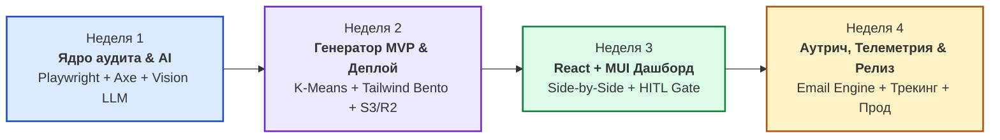
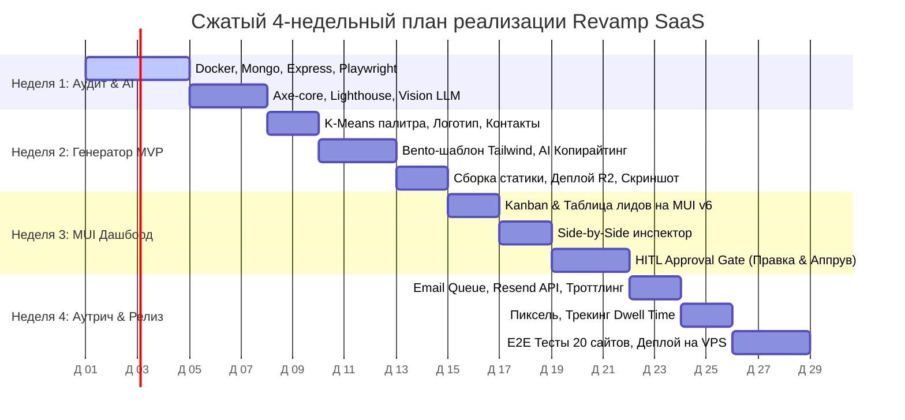

# УСКОРЕННАЯ ДОРОЖНАЯ КАРТА: 4-НЕДЕЛЬНЫЙ СПРИНТ-ПЛАН (MILESTONES.MD)
## Проект: Revamp SaaS — Автоматизированный аудит сайтов и генерация MVP

---

## 1. Стратегия сжатия сроков (С 12 до 4 недель)

Чтобы запустить полнофункциональную работающую систему за **4 календарные недели (1 месяц)**, применяется стратегия **Lean Scoping & Accelerator Pattern**:

### Что мы СОХРАНЯЕМ (100% ключевой ценности):
1. Автоматический аудит: Playwright + Axe-core (WCAG 2.1 AA) + Lighthouse (LCP) + Vision LLM.
2. Брендовый MVP: извлечение цветов (K-Means), логотипа, контактов, сборка современного адаптивного Bento-лендинга на Tailwind CSS и хостинг на публичном URL.
3. React + Material UI Дашборд: воронка лидов, сплит-инспектор (До / После), инлайн-редактор и ручной аппрув (HITL).
4. Персонализированная отправка писем с превью-сравнением и ссылкой на демо.
5. Базовая аналитика: трекинг открытия писем и времени нахождения на демо-сайте.

### За счет чего сокращаем сроки (Scope Pruning):
* **Отказ от сложного RBAC/Multi-tenancy:** На старте используется Single-Tenant режим (один пароль администратора / API-ключ в `.env`). Экономия: **~1.5 недели**.
* **Единый универсальный Bento-шаблон:** Вместо верстки 10 шаблонов под разные ниши создается **1 модульный, ультрасовременный Bento-каркас**, который идеально адаптируется под любые услуги (стоматология, автосервис, юристы, клиники) за счет смены палитры, иконок и текстов. Экономия: **~2 недели**.
* **Использование Resend / SendGrid API:** Вместо сложной самописной инфраструктуры ротации SMTP-серверов и прогрева IP на старте подключается готовый провайдер с простым BullMQ-троттлингом. Экономия: **~1.5 недели**.
* **Монолитный монорепозиторий:** Бэкенд API и воркеры запускаются в рамках единой кодовой базы TypeScript, разделяя общие модули без сложного сетевого оверхеда. Экономия: **~1 неделя**.

---

## 2. Граф 4-недельного спринта

---

## 3. Детальный понедельный план (Спринты 1–4)

---

### НЕДЕЛЯ 1: Инфраструктура, краулер и ядро аудита (Дни 1–7)
* **Цель недели:** Подать на вход URL $\rightarrow$ через 40 секунд получить в базе данных полный отчет со скриншотами, замерами LCP, нарушениями a11y и оценкой от Vision LLM.

#### План по дням:
* **День 1–2 (Базовая среда):**
  - Инициализация структуры репозитория (Express.js + TypeScript, React + Vite + MUI).
  - Docker Compose: MongoDB + Redis + MinIO/S3 (локальное хранилище ассетов).
  - Базовые модели Mongoose: `Lead`, `Audit`. Настройка очереди BullMQ `audit-queue`.
* **День 3–4 (Краулер и скриншоты):**
  - Воркер на Playwright: снятие скриншотов Desktop ($1440\times900$) и Mobile ($375\times812$).
  - Сжатие в WebP и выгрузка в S3/MinIO.
  - Изоляция процессов: автозакрытие контекстов браузера, защита от утечек памяти.
* **День 5 (Axe-core & Lighthouse):**
  - Инжекция `@axe-core/puppeteer`: фиксация нарушений WCAG 2.1 AA (контрастность, теги `alt`, лейблы форм).
  - Lighthouse мобильный профиль: замер LCP, CLS, проверка SSL и мобильного Viewport.
* **День 6–7 (Vision LLM & Скоринг):**
  - Интеграция Claude 3.5 Sonnet / GPT-4o: отправка мобильного скриншота, промпт на выявление 3 критических багов и 3 Quick Wins.
  - Валидация ответа через схему Zod.
  - Расчет итогового скоринга ($0–100$).
* **Результат недели (DoD):** API-запрос `POST /api/v1/leads` сохраняет в Mongo полный аудит с рабочими ссылками на скриншоты и оценками.

---

### НЕДЕЛЯ 2: Экстрактор айдентики, генератор MVP и песочница хостинга (Дни 8–14)
* **Цель недели:** На базе данных аудита автоматически синтезировать адаптивный брендовый лендинг и выложить его на публичный URL `preview.revamp.io/v/:slug`.

#### План по дням:
* **День 8–9 (Парсер бренда и фактуры):**
  - K-Means кластеризация CSS-стилей: расчет доминирующей палитры (`Primary`, `Secondary`, `Accent`).
  - Парсер логотипа/фавикона из DOM (с фолбэком на стильную типографическую монограмму).
  - Извлечение контактных данных (телефон, адрес, график) и списка услуг из оригинального сайта.
* **День 10–11 (Универсальный Bento-шаблон на Tailwind CSS):**
  - Разработка чистого, отзывчивого HTML/Tailwind шаблона:
    1. *Header:* Логотип, телефон в 1 клик, кнопка записи.
    2. *Hero:* Усиленный оффер, форма быстрого захвата, бейджи доверия.
    3. *Bento Services:* 4–6 карточек услуг с Lucide-иконками.
    4. *Social Proof & Reviews:* Блок отзывов с картами.
    5. *Interactive Booking:* Интерактивная форма записи.
    6. *Footer:* Карта, контакты, часы работы.
* **День 12 (AI Copywriting Uplift):**
  - Промпт для переписывания сухих текстов сайта в сильные офферы.
  - **Strict Grounding:** сверка сгенерированного текста с спарсенным DOM (запрет выдумывать несуществующие услуги или менять телефоны).
* **День 13–14 (Сборка бандла, деплой и превью-баннер):**
  - Компиляция статического файла `index.html` (до 300 Кб).
  - Выгрузка в бакет Cloudflare R2 / S3.
  - Playwright делает автоматический скриншот нового сайта и генерирует промо-коллаж «До / После».
* **Результат недели (DoD):** Готовый работающий MVP-сайт доступен по публичной ссылке в браузере, содержит цвета и логотип оригинального бизнеса.

---

### НЕДЕЛЯ 3: React + Material UI Дашборд и HITL Approval Gate (Дни 15–21)
* **Цель недели:** Создать удобное рабочее место оператора: просмотр воронки, сплит-экран ревью сайта и ручной аппрув отправки за 20 секунд.

#### План по дням:
* **День 15–16 (Интерфейс воронки на MUI v6):**
  - Темизация Material UI (шрифт Inter, скругления 12px, акцентная палитра, Dark/Light mode).
  - Экран лидов: переключение между Kanban-доской (`Queued -> Needs Review -> Sent -> Viewed`) и таблицей `@mui/x-data-grid`.
  - Форма быстрого добавления нового сайта на аудит.
* **День 17–18 (Side-by-Side инспектор):**
  - Сплит-модалка ревью:
    - *Слева:* Скриншот оригинального сайта с подсветкой ошибок (LCP, контрастность).
    - *Справа:* Интерактивный `<iframe>` нового MVP с тулбаром смены брейкпоинтов: Mobile (375px), Tablet (768px), Desktop (100%).
* **День 19–21 (HITL Approval Gate):**
  - Color Picker: изменение основного цвета бренда в 1 клик с моментальным обновлением во фрейме.
  - Редактор черновика письма: предпросмотр темы и текста, инлайн-редактирование.
  - Кнопка «Одобрить и отправить» (`Cmd/Ctrl + Enter`) $\rightarrow$ переводит лид в `SCHEDULED`.
  - Кнопка «Отправить тестовое себе» на почту оператора.
* **Результат недели (DoD):** Оператор видит полный список лидов, открывает модалку, оценивает сплит-экран, при необходимости правит текст и утверждает отправку.

---

### НЕДЕЛЯ 4: Почтовый аутрич, трекинг активности и запуск (Дни 22–28)
* **Цель недели:** Доставка персонализированных писем, трекинг действий клиента на демо-сайте, финальное тестирование и развертывание на боевом сервере.

#### План по дням:
* **День 22–23 (Email Dispatcher с троттлингом):**
  - Интеграция Resend / SendGrid API через очередь BullMQ.
  - Троттлинг: отправка 1 письма в 3 минуты с рандомизированным джиттером (15–45 сек).
  - Проверка MX-записей домена получателя перед отправкой (отсечение несуществующих ящиков).
  - Ссылка отписки (`List-Unsubscribe`) в заголовках и футере.
* **День 24–25 (Телеметрия и трекинг):**
  - Невидимый GIF-пиксель $1\times1$ для отслеживания открытия письма (`/api/v1/track/open/:token.gif`).
  - Редирект-прокси для логирования кликов по ссылке на демо (`/api/v1/track/click/:token`).
  - Легковесный трекер `revamp-tracker.js` на странице демо: отправка времени нахождения (Dwell Time) через Beacon API и кликов по CTA.
  - Отображение статусов в реальном времени (`OPENED`, `CLICKED`, `ENGAGED`).
* **День 26–27 (Сквозное тестирование и устранение багов):**
  - E2E прогон 20 реальных сайтов малого бизнеса (стоматологии, автосервисы, юристы).
  - Проверка устойчивости воркеров к таймаутам и защите Cloudflare.
  - Оптимизация расхода токенов LLM (WebP сжатие до 1024px).
* **День 28 (Боевой деплой):**
  - Развертывание API и воркеров в Docker на VPS (Hetzner).
  - Подключение MongoDB Atlas и Redis.
  - Публикация дашборда на Cloudflare Pages / Vercel.
  - Финальный тестовый прогон.
* **Результат недели (DoD):** Полностью автономная, проверенная система работает в продакшене.

---

## 4. Сводный календарный график (Диаграмма Ганта)

---

## 5. Главные риски 4-недельного графика и их нейтрализация

| Риск срыва сроков | Вероятность | Как предотвращаем |
|---|:---:|---|
| **Застревание на верстке десятков разных шаблонов** | Высокая | Используем строго **1 универсальный Bento-каркас**, который кастомизируется исключительно за счет динамической палитры, иконок и текстов. |
| **Утечки памяти и нестабильность Playwright** | Средняя | Жесткий лимит параллелизма (`concurrency = 2`), принудительный `context.close()` и таймаут 25 сек на страницу. |
| **Сложности с настройкой почтовых серверов** | Высокая | Отказ от самописных SMTP-серверов в пользу проверенного API (Resend / SendGrid) с готовой доставляемостью. |
| **Затягивание верстки UI дашборда** | Средняя | Использование готовых компонентов Material UI (`@mui/x-data-grid`, Dialog, Chips) без изобретения кастомных дизайн-систем с нуля. |

## 6. Развитие после релиза (REV-21 — REV-41)

После закрытия 4-недельного плана (REV-1 — REV-20) проект развивается отдельными тикетами. Начиная с REV-25 каждый баг и каждая фича проходят обязательный конвейер из `AGENTS.md` кодового репозитория: **тикет в Linear → ветка `ymorpheus/rev-<n>-...` → тесты и гейты → PR → merge → закрытие тикета**. Статусы ниже актуальны на 26.09.2026.

| Задача | Содержание | Область | Статус |
|:---:|---|---|:---:|
| [**REV-21**](https://linear.app/revamp-proect/issue/REV-21) | Полностраничные скриншоты десктопа и мобайла и их просмотр в инспекторе | Аудит | ✅ Done |
| [**REV-22**](https://linear.app/revamp-proect/issue/REV-22) | Перевод продукта на английский (дашборд, MVP, промпты, баннеры, письма) | Продукт | ✅ Done |
| [**REV-23**](https://linear.app/revamp-proect/issue/REV-23) | MVP из собственного контента исходного сайта вместо шаблонов | MVP | ✅ Done |
| [**REV-24**](https://linear.app/revamp-proect/issue/REV-24) | Локализация дашборда (en, ru, be, pl, lt) | Дашборд | ✅ Done |
| [**REV-25**](https://linear.app/revamp-proect/issue/REV-25) | Генерация MVP на языке исходного сайта | MVP | ✅ Done |
| [**REV-26**](https://linear.app/revamp-proect/issue/REV-26) | Поиск локальных бизнесов на картах (OSM, Google Places) | Discovery | ✅ Done |
| [**REV-27**](https://linear.app/revamp-proect/issue/REV-27) | Интерфейс поиска бизнесов в дашборде | Discovery | ✅ Done |
| [**REV-28**](https://linear.app/revamp-proect/issue/REV-28) | Автоопределение местоположения оператора в форме поиска | Discovery | ✅ Done |
| [**REV-29**](https://linear.app/revamp-proect/issue/REV-29) | Ревью найденных бизнесов перед импортом в лиды | Discovery | ✅ Done |
| [**REV-30**](https://linear.app/revamp-proect/issue/REV-30) | Генерация текстов MVP через локальный Claude Code CLI | MVP / LLM | ✅ Done |
| [**REV-31**](https://linear.app/revamp-proect/issue/REV-31) | Перегенерация MVP для лида из дашборда | MVP | ✅ Done |
| [**REV-32**](https://linear.app/revamp-proect/issue/REV-32) | Выбор LLM-провайдера и модели для генерации MVP | MVP / LLM | ✅ Done |
| [**REV-33**](https://linear.app/revamp-proect/issue/REV-33) | Закрытие cookie-баннеров перед скриншотами аудита | Аудит | ✅ Done |
| [**REV-34**](https://linear.app/revamp-proect/issue/REV-34) | Fallback при слишком длинном поле в ответе LLM | MVP / LLM | ✅ Done |
| [**REV-35**](https://linear.app/revamp-proect/issue/REV-35) | Не предлагать при поиске бизнесы, которые уже есть в лидах | Discovery | 🔄 In Progress |
| [**REV-36**](https://linear.app/revamp-proect/issue/REV-36) | Проверка MVP на потерю ключевых данных исходного сайта | MVP | ✅ Done |
| [**REV-37**](https://linear.app/revamp-proect/issue/REV-37) | Сравнение MVP с исходным сайтом через LLM с проверкой цитат кодом | MVP / LLM | ✅ Done |
| [**REV-38**](https://linear.app/revamp-proect/issue/REV-38) | Оценка сложности сайта на аудите и приоритет одностраничных сайтов-визиток | Аудит | ⏳ Backlog |
| [**REV-39**](https://linear.app/revamp-proect/issue/REV-39) | Удалить неработающие пункты навигации в сайдбаре дашборда | Дашборд | ⏳ Backlog |
| [**REV-40**](https://linear.app/revamp-proect/issue/REV-40) | Индикатор прогресса поиска бизнесов в фоне | Discovery | ⏳ Backlog |
| [**REV-41**](https://linear.app/revamp-proect/issue/REV-41) | Автоматически открывать результаты поиска бизнесов, завершенного в фоне | Discovery | ⏳ Backlog |

### Definition of Done для тикетов после релиза
- [ ] Тикет в команде REV с разделами `Problem`, `Expected`, `Acceptance criteria` и меткой `Bug` / `Feature`.
- [ ] Тесты Vitest для всех затронутых слоев (схемы, сервисы, эндпоинты, воркеры, сторы).
- [ ] Локальные гейты пройдены: `npm run build:packages`, `npm run typecheck`, `npm run lint`, `npm test`, `npm run build`.
- [ ] Изменение проверено в запущенном дашборде в Chrome, без новых ошибок в консоли.
- [ ] Новые строки интерфейса добавлены во все 5 словарей (en, ru, be, pl, lt).
- [ ] PR с разделами `Problem` / `Changes` / `Verification` привязан к тикету; после merge тикет переведен в `Done`.

### Итоги по направлениям
* **Аудит:** полностраничные скриншоты с автопрокруткой и ограничением высоты; закрытие cookie-баннеров 11 платформ согласия и по тексту кнопки на 8 языках.
* **Качество MVP:** контент, контакты и язык исходного сайта; никаких выдуманных данных; отчет полноты с баллом и проверенными цитатами LLM; дополнительное подтверждение при критических проблемах.
* **LLM:** единый `LlmClient`, каталог провайдеров и моделей, выбор оператором на каждую генерацию, локальный Claude Code CLI, отчет доступности провайдеров от воркеров.
* **Лидогенерация:** поиск на OpenStreetMap и Google Places, автоопределение города, ревью и выборочный импорт кандидатов; следующий шаг — устойчивая идентичность лидов (REV-35) и UX фонового поиска (REV-40, REV-41).
* **Дашборд:** английский как исходный язык, локализация на 5 языков, перегенерация MVP, чек-лист полноты.

---

Связанные проектные документы:
* Архитектура и стек: [`blueprint.md`](./blueprint.md)
* Спецификация требований (SRS): [`spec.md`](./spec.md)
* Исследования и сценарии: [`research.md`](./research.md)
* Инструкции для ИИ-агентов: [`AGENTS.md`](./AGENTS.md)
