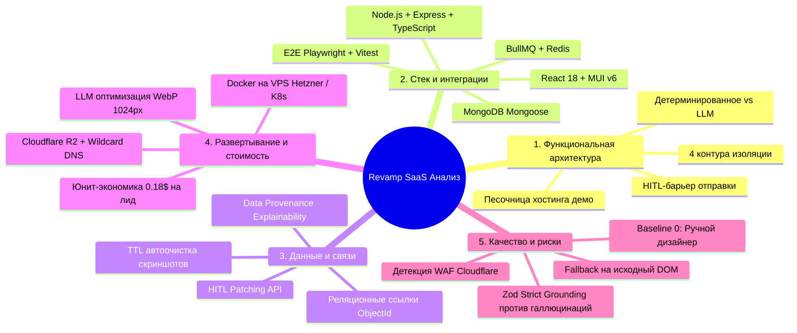

# ИССЛЕДОВАНИЕ И АНАЛИТИЧЕСКИЙ ОТЧЕТ ПО АРХИТЕКТУРЕ И РЕАЛИЗАЦИИ СИСТЕМЫ REVAMP SAAS
---
## 1. Введение и контекст исследования
Настоящий документ консолидирует результаты системного, архитектурного и технологического анализа проектируемой SaaS-платформы **Revamp SaaS** — системы автоматизированного аудита сайтов локального бизнеса, синтеза брендовых MVP-редизайнов и холодного почтового аутрича с подтверждением человеком (**Human-In-The-Loop, HITL**).
В отчете сведены воедино:
1. Системный анализ по 5 ключевым инженерным областям (Архитектура, Стек, Данные, Развертывание/Стоимость, Качество/Риски).
2. Сквозной детальный разбор эталонного пользовательского сценария (Golden Path).
3. Архитектурные решения (Architecture Decision Records, ADR).
4. Модель юнит-экономики и оптимизации вычислительных затрат.
Связанные документы проекта:
* Архитектурный проект и спецификация компонентов: [BLUEPRINT.md](file:///Users/yurykurouski/code/ehu/Revamp-docs/blueprint.md)
* Спецификация требований к программному обеспечению: [SRS.md](file:///Users/yurykurouski/code/ehu/Revamp-docs/spec.md)
---
## 2. Сравнительный анализ по пяти ключевым областям

---
### 2.1. Функциональная архитектура и границы ответственности
#### Анализ разделения обязанностей (Separation of Concerns):
Система разделена на 4 изолированных контура:
1. **Клиентский контур (UI Layer — React + Material UI):**
   * *Обязанности:* Управление жизненным циклом лидов через Kanban/DataGrid, визуализация сплит-экрана «Старый сайт с оверлеями ошибок vs Новый MVP в `<iframe>`», инлайн-редактирование текста письма и параметров бренда, интерфейс подтверждения отправки (HITL Approval Gate), отображение аналитики воронки.
   * *Граница:* Не имеет прямого доступа к базе данных или внешним API нейросетей; общается исключительно с Express API Gateway через JWT.
2. **Серверный оркестратор (API Gateway — Node.js / Express):**
   * *Обязанности:* Аутентификация операторов (RBAC), строгая валидация входящих DTO через `Zod`, постановка задач в очереди BullMQ, обслуживание HITL-эндпоинтов, прием событий телеметрии (трекинг-пиксели, Beacon API).
   * *Граница:* Не выполняет синхронно «тяжелые» вычисления (Lighthouse, запуск браузера, генерация текстов). Все ресурсоемкие операции делегируются асинхронным воркерам через Redis.
3. **Контур фоновых воркеров (Worker Layer — BullMQ + Redis):**
   * *Обязанности:* 
     - `AuditWorker`: Управление процессами Headless Chromium (Playwright), запуск axe-core (WCAG 2.1 AA) и Lighthouse, снятие десктопных и мобильных скриншотов.
     - `ExtractorWorker`: K-Means кластеризация стилей, выделение палитры бренда, парсинг логотипов и фактуры бизнеса.
     - `AiWorker`: Взаимодействие с мультимодальными моделями.