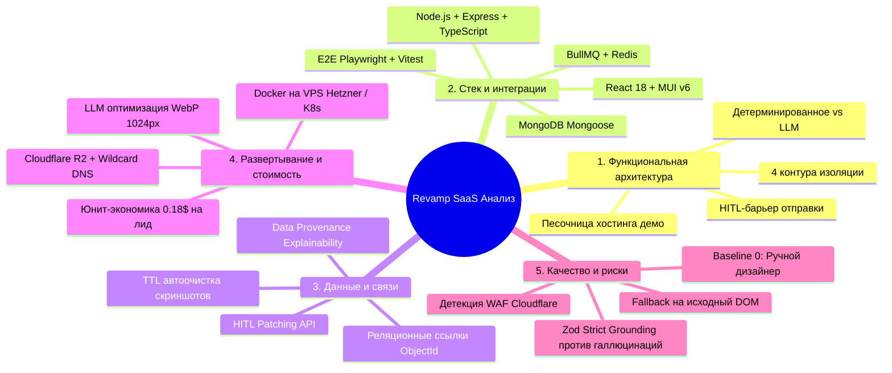
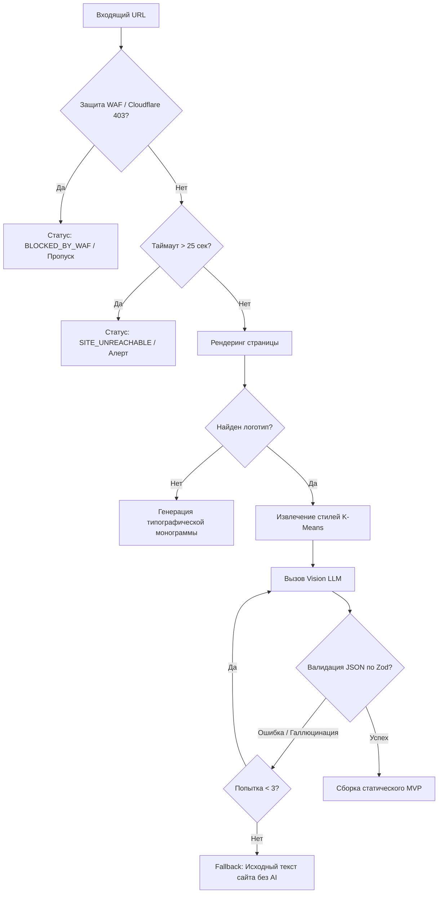

# ИССЛЕДОВАНИЕ И АНАЛИТИЧЕСКИЙ ОТЧЕТ ПО АРХИТЕКТУРЕ И РЕАЛИЗАЦИИ СИСТЕМЫ REVAMP SAAS

---

## 1. Введение и контекст исследования

Настоящий документ консолидирует результаты системного, архитектурного и технологического анализа проектируемой SaaS-платформы **Revamp SaaS** — системы автоматизированного аудита сайтов локального бизнеса, синтеза брендовых MVP-редизайнов и холодного почтового аутрича с подтверждением человеком (**Human-In-The-Loop, HITL**).

В отчете сведены воедино:
1. Системный анализ по 5 ключевым инженерным областям (Архитектура, Стек, Данные, Развертывание/Стоимость, Качество/Риски).
2. Сквозной детальный разбор эталонного пользовательского сценария (Golden Path).
3. Архитектурные решения (Architecture Decision Records, ADR).
4. Модель юнит-экономики и оптимизации вычислительных затрат.

Связанные документы проекта:
* Архитектурный проект и спецификация компонентов: [blueprint.md](file:///Users/yurykurouski/code/ehu/Revamp-docs/blueprint.md)
* Спецификация требований к программному обеспечению: [spec.md](file:///Users/yurykurouski/code/ehu/Revamp-docs/spec.md)

---

## 2. Сравнительный анализ по пяти ключевым областям



---

### 2.1. Функциональная архитектура и границы ответственности

#### Анализ разделения обязанностей (Separation of Concerns):
Система разделена на 4 изолированных контура:

1. **Клиентский контур (UI Layer — React + Material UI):**
   * *Обязанности:* Управление жизненным циклом лидов через Kanban/DataGrid, визуализация сплит-экрана «Старый сайт с оверлеями ошибок vs Новый MVP в `<iframe>`», инлайн-редактирование текста письма и параметров бренда, интерфейс подтверждения отправки (HITL Approval Gate), отображение аналитики воронки.
   * *Граница:* Не имеет прямого доступа к базе данных или внешним API нейросетей; общается исключительно с Express API Gateway через JWT.

2. **Серверный оркестратор (API Gateway — Node.js / Express):**
   * *Обязанности:* Аутентификация операторов (RBAC), строгая валидация входящих DTO через `Zod`, постановка задач в очереди BullMQ, обслуживание HITL-эндпоинтов, прием событий телеметрии (трекинг-пиксели, Beacon API).
   * *Граница:* Не выполняет синхронно «тяжелые» вычисления (Lighthouse, запуск браузера, генерация текстов). Все ресурсоемкие операции делегируются асинхронным воркерам через Redis.

3. **Контур фоновых воркеров (Worker Layer — BullMQ + Redis):**
   * *Обязанности:* 
     - `AuditWorker`: Управление процессами Headless Chromium (Playwright), запуск axe-core (WCAG 2.1 AA) и Lighthouse, снятие десктопных и мобильных скриншотов.
     - `ExtractorWorker`: K-Means кластеризация стилей, выделение палитры бренда, парсинг логотипов и фактуры бизнеса.
     - `AiWorker`: Взаимодействие с мультимодальными моделями.
     - `DeployWorker`: Компиляция статических бандлов Tailwind и загрузка в S3/R2.
     - `EmailWorker`: Троттлинг отправки (1 письмо в 3 минуты) и доставка сообщений.

4. **Внешние провайдеры (External AI & Cloud Services):**
   * *Обязанности:* Предоставление мультимодальных рассуждений (Vision LLM), хранение медиа-ассетов (S3/R2), ретрансляция почты (SMTP Relays).

#### Принцип разделения «Детерминированное vs Недетерминированное»:
| Задача | Исполнитель | Тип выполнения | Обоснование |
|---|---|---|---|
| Замер контрастности текста | `@axe-core/puppeteer` | Детерминированное | Математический расчет соотношения яркости по формуле WCAG. Исключает галлюцинации. |
| Замер скорости LCP / CLS | Google Lighthouse Engine | Детерминированное | Стандартизированный замер таймингов браузера. |
| Парсинг телефонов / цен / адресов | DOM-селекторы + Regex | Детерминированное | Фактические данные клиента не должны искажаться. |
| Кластеризация цветов бренда | Алгоритм K-Means по CSS | Детерминированное | Математическое выделение доминирующих hex-кодов. |
| Анализ визуальной иерархии и дизайна | Vision LLM (Claude / GPT-4o) | Недетерминированное | Требуется человекоподобная эстетическая оценка интерфейса. |
| Маркетинговое усиление УТП | LLM (Prompt + Context) | Недетерминированное | Копирайтинг и формулирование ценностного предложения. |

---

### 2.2. Стек технологий, интеграции и верификация интерфейса

#### Обоснование выбора стека:
* **Node.js / Express (TypeScript):** Playwright и Google Lighthouse разработаны на JavaScript/TypeScript. Использование Node.js устраняет межъязыковой оверхед (в отличие от связок Python-Playwright), позволяет переиспользовать единые типы данных (`shared-types`) между бэкендом и React-дашбордом.
* **MongoDB + Mongoose:** Отчеты аудита имеют сложную иерархическую структуру (дерево нарушений a11y, таймлайны Lighthouse, ответы LLM). Документная модель MongoDB позволяет сохранять отчеты единым документом без сложной реляционной нормализации в десятки таблиц.
* **BullMQ + Redis:** Промышленный стандарт для фоновых очередей в экосистеме Node.js. Из коробки поддерживает параллелизм (concurrency), лимиты частоты (rate-limiting), задержки (delayed jobs), автоматические ретраи и мониторинг через Bull-Board.
* **Material UI (MUI v6):** Предоставляет зрелые корпоративные компоненты: `@mui/x-data-grid` для работы с тысячами лидов (сортировка, фильтрация, серверная пагинация), модальные окна, тулбары и развитую систему адаптивных тем.

#### Стратегия верификации интерфейса (Frontend Verification):
1. **Playwright E2E-тесты:** Автоматический прогон полного пользовательского сценария в реальном браузере: вход в дашборд $\rightarrow$ выбор лида со статусом `NEEDS_APPROVAL` $\rightarrow$ проверка отображения Side-by-Side инспектора $\rightarrow$ редактирование текста письма $\rightarrow$ нажатие кнопки «Одобрить и отправить».
2. **Интеграционное тестирование компонентов (Vitest + React Testing Library):** Изолированная проверка модального окна HITL-аппрува, валидация полей ввода, проверка реакции на нажатие горячих клавиш (`Cmd/Ctrl + Enter`).
3. **Iframe-тестирование коммуникации:** Проверка двусторонней передачи событий через `postMessage` между родительским дашбордом и сгенерированным MVP внутри песочницы `<iframe>` (динамическая смена цветов, переключение брейкпоинтов $375$px / $768$px / $1440$px).

---

### 2.3. Управление данными: связи, жизненный цикл и объяснимость (Explainability)

#### Схема реляционных связей:
```
[Lead] (1) ────< (N) [Audit]
  │                     │
  │ (1:1)               └── (1:1) ──> [MvpProject]
  ▼                                          │
[EmailCampaign] (1) ───< (N) [EmailLog]      │
  ▲                                          ▼
  └───────────────────────────< (N) [AnalyticsEvents]
```

#### Жизненный цикл данных (CRUD, мутации, удаление):
* **Создание:** URL вносится через форму $\rightarrow$ создается запись `Lead` (статус `QUEUED`) и связанная пустая сущность `Audit`.
* **Мутации и HITL-коррекция:** Оператор может скорректировать данные перед отправкой. Запрос `PATCH /api/v1/mvp/:id/tokens` изменяет дизайн-токены в базе и инициирует быструю пересборку статического HTML (занимает $<2$ секунд).
* **Удаление и политики очистки (Storage Lifecycle):**
  - Скриншоты оригинальных сайтов удаляются из S3 автоматически через 60 дней по правилу S3 Lifecycle Rule.
  - По запросу на отписку (Unsubscribe) персональный email хешируется по алгоритму SHA-256 и переносится в глобальный стоп-лист, исходный лид помечается `UNSUBSCRIBED`, персональные данные обезличиваются.

#### Происхождение результата (Data Provenance & Explainability):
Каждый вывод в системе подтвержден фактическими артефактами:
* **Accessibility (a11y):** Каждая ошибка содержит точный CSS-селектор в исходном DOM, зафиксированный коэффициент контраста, ссылку на нарушенный пункт стандарта WCAG 2.1 AA и визуальный скриншот проблемного элемента.
* **Производительность (LCP/Speed):** Привязана к кадрам покадровой загрузки (Filmstrip) из сырого отчета Lighthouse JSON с указанием URL блокирующих ресурсов.
* **UX-критика нейросети:** Содержит ID использованной модели, версию системного промпта и привязана к конкретному скриншоту первого экрана.

---

### 2.4. Развертывание, инфраструктура и юнит-экономика затрат

#### Инфраструктурная топология:
* **API и воркеры:** Docker-контейнеры на управляемом VPS (Hetzner / DigitalOcean, 4 vCPU, 8 GB RAM) под управлением Docker Compose или Coolify.
* **База данных:** MongoDB Atlas (тариф M10/M20) с ежедневными автоматическими снимками.
* **Очереди:** Redis Cluster / Managed Redis с включенным AOF-логированием.
* **Фронтенд Дашборда:** Статический хостинг на Cloudflare Pages / Vercel (быстрый CDN, SSL из коробки).
* **Хостинг MVP-демо:** Бакет Cloudflare R2 (нулевая стоимость исходящего egress-трафика) + Wildcard SSL на домене `*.preview.revampdemo.com`.

#### Структура себестоимости обработки 1000 лидов:

| Статья затрат | Механизм расхода | Стоимость на 1000 лидов | Методы оптимизации расхода |
|---|---|:---:|---|
| **Мультимодальные LLM (Vision + Copy)** | Анализ скриншотов первого экрана + генерация продающего УТП | **$110.00** | 1. Сжатие скриншотов в WebP до макс. 1024px по ширине (экономия токенов 65%).<br>2. Prompt Caching системных промптов (скидка 75% на ввод).<br>3. Использование Flash/Haiku моделей для DOM-парсинга. |
| **Вычислительные ресурсы (Playwright)** | Рендеринг Chromium, снятие скриншотов, расчет Lighthouse | **$40.00** | 1. Блокировка загрузки видео, трекеров и тяжелых сторонних скриптов через `route.abort()`.<br>2. Жесткий лимит воркеров (concurrency = 2 на ядро CPU).<br>3. Перезапуск браузера каждые 20 аудитов. |
| **Почтовые релеи и проверка MX** | Валидация ящиков через API + отправка писем через SMTP | **$20.00** | 1. Предварительная локальная проверка MX-записей через DNS (отсекает 90% невалидных ящиков бесплатно).<br>2. Отправка строго после ручного аппрува. |
| **Хранилище S3/R2 и DNS** | Хранение скриншотов и статических HTML-демо | **$10.00** | 1. Использование Cloudflare R2 вместо AWS S3 (нет платы за egress).<br>2. Автоудаление скриншотов через 60 дней. |
| **ИТОГО** | **Себестоимость под ключ** | **~$180.00** | **Себестоимость одного лида: ~$0.18** |

---

### 2.5. Контроль качества, базовый уровень (Baseline) и обработка рисков

#### Сопоставление с точками сравнения (Baselines):
* **Baseline 0 (Ручной труд студии):** Дизайнер тратит 4–6 часов на изучение сайта, сборку прототипа в Figma и подготовку письма. Себестоимость: **$50–$100 на лид**. Пропускная способность: не более 2–3 лидов в день на человека.
* **Baseline 1 (Примитивный спам-краулер):** Скрипт парсит email, запрашивает PageSpeed API и рассылает одинаковое письмо *«Ваш сайт медленный»*. Конверсия: $<0.5\%$, мгновенный бан доменов спам-фильтрами.
* **Система Revamp:** Качество и персонализация на уровне ручного концепта (Baseline 0), но со скоростью **45 секунд** и себестоимостью **$0.18**, защищенная шлюзом оператора (HITL) от спама.

#### Матрица обработки нештатных ситуаций (Edge Cases):



---

## 3. Сквозной эталонный сценарий (End-to-End User Scenario)

Ниже представлен детальный хронологический разбор работы системы на конкретном примере:  
**Целевой бизнес:** Региональная клиника «Стоматология Дент-Арт» (`https://dent-art-spb.example.ru`).  
**Оператор системы:** Менеджер агентства в React-дашборде.

### Этап 1: Ввод данных (Input Phase)
Оператор нажимает кнопку **«+ Новый аудит»** в интерфейсе или импортирует строку.  
Отправляется запрос `POST /api/v1/leads`:
```json
{
  "originalUrl": "https://dent-art-spb.example.ru",
  "businessName": "Стоматология Дент-Арт",
  "contactEmail": "info@dent-art-spb.example.ru",
  "niche": "dental",
  "city": "Санкт-Петербург"
}
```

### Этап 2: Валидация и персистентность (Validation & Storage Phase)
1. Express middleware запускает Zod-валидацию схемы:
   * URL проверяется на синтаксис, протокол `https://` и отсутствие локальных IP.
   * Email проверяется по регулярному выражению RFC 5322.
2. Проверяется коллекция `leads` на дубликаты за последние 45 дней.
3. В MongoDB создается документ `Lead` со статусом `QUEUED`.
4. В Redis создается задача: `auditQueue.add('execute-audit', { leadId: '66e4...', ... })`.
5. API мгновенно возвращает оператору статус `HTTP 201 Created`.

### Этап 3: Исполнение аудита и вызов моделей (Worker & AI Execution)
1. Процесс `AuditWorker` запускает инстанс Playwright Chromium:
   * Загружает страницу с эмуляцией Desktop ($1440\times900$) и Mobile ($375\times812$).
   * Снимает скриншоты, конвертирует в WebP и сохраняет в бакет S3.
   * Запускает `@axe-core`: фиксирует 14 критических нарушений контрастности и 8 тегов без `alt`.
   * Запускает Lighthouse: фиксирует задержку отрисовки основного контента **LCP = 5.4 сек**.
   * Запускает K-Means парсер CSS: извлекает доминирующий фирменный цвет `#0E7490` (морская волна) и телефон `+7 (812) 333-22-11`.
2. Задача переходит в воркер `AiGenerationWorker`:
   * Вызывается **Claude 3.5 Sonnet / GPT-4o**: передается сжатый скриншот первого экрана мобильной версии + перечень спарсенных услуг.
   * Промпт требует вернуть строго структурированный JSON с оценкой дизайна по 10 эвристикам Нильсена и усиленным маркетинговым УТП.
   * Ответ валидируется через `ZodSchema.parse()`.
3. Воркер `DeployWorker` компилирует адаптивный лендинг на Tailwind CSS с блоками *Header, Hero, Bento Grid услуг, Reviews, Booking Form*, инжектирует трекер `revamp-tracker.js` и публикует страницу по адресу `https://preview.revamp.io/v/dent-art-spb-8a2f`.
4. Создается черновик письма в коллекции `email_campaigns` со статусом `NEEDS_APPROVAL`. Лид переходит в статус `AWAITING_APPROVAL`.

### Этап 4: Пользовательский интерфейс оператора (HITL Approval Gate)
1. В React-дашборде карточка клиники автоматически перемещается в колонку **«На ревью [!]»**.
2. Оператор кликает по карточке — открывается модальное окно проверки:
   * **Слева:** Скриншот исходного сайта со списком проблем (*LCP: 5.4s, Контраст 2.1:1, Отсутствие мобильной адаптации*).
   * **Справа:** Интерактивный `<iframe>` нового адаптивного лендинга с переключателем экранов (Mobile / Tablet / Desktop) и родным логотипом клиники.
   * **Снизу:** Черновик письма клиенту с инлайн-редактором.
3. Оператор бегло оценивает результат ($15-20$ секунд), при необходимости корректирует заголовок и нажимает **«Одобрить и отправить»** (`Cmd/Ctrl + Enter`).

### Этап 5: Отправка и телеметрия (Outreach & Tracking)
1. Задача ставится в очередь `emailQueue` с соблюдением интервала троттлинга (1 письмо в 3 минуты).
2. Письмо доставляется на `info@dent-art-spb.example.ru`.
3. Владелец клиники открывает письмо $\rightarrow$ срабатывает скрытый пиксель $1\times1$, статус в дашборде обновляется на `EMAIL_OPENED`.
4. Владелец клиники кликает по ссылке на интерактивное демо $\rightarrow$ трекер фиксирует переход и логирует время нахождения (Dwell Time: 1 мин 45 сек).
5. Оператор получает push-уведомление в дашборде: *«Лид Стоматология Дент-Арт изучает демо-версию прямо сейчас!»*.

---

## 4. Архитектурные решения (Architecture Decision Records, ADR)

### ADR 1: Выбор языка бэкенда (Node.js/TypeScript против Python/Go)
* **Статус:** Принято.
* **Контекст:** Необходим высокопроизводительный сервер для оркестрации браузеров, очередей и API.
* **Решение:** Node.js (v20+ LTS) с TypeScript.
* **Последствия:** Инструменты автоматизации браузеров (Playwright) и аудита (Lighthouse) нативно разработаны на Node.js. Это исключает необходимость запуска промежуточных мостов (как в Python) и позволяет использовать общий пакет типов (`@revamp/shared-types`) между фронтендом и бэкендом.

### ADR 2: Выбор базы данных (MongoDB против PostgreSQL)
* **Статус:** Принято.
* **Контекст:** Хранение результатов аудита, деревьев ошибок a11y, метаданных и лидов.
* **Решение:** MongoDB (Mongoose ODM).
* **Последствия:** Дерево нарушений доступности axe-core и отчеты Lighthouse содержат сотни глубоко вложенных полиморфных полей. Документная структура MongoDB позволяет сохранять отчет целиком в неизменном виде без денормализации на 15+ реляционных таблиц.

### ADR 3: Обязательный барьер Human-In-The-Loop (HITL)
* **Статус:** Принято.
* **Контекст:** Полная автономия отправки писем несет риск рассылки некорректного контента в случае галлюцинаций LLM или ошибок парсинга.
* **Решение:** Архитектурная блокировка авто-отправки. Каждое сгенерированное предложение попадает в очередь `NEEDS_APPROVAL` и требует физического нажатия кнопки оператором.
* **Последствия:** Исключение репутационных рисков, сохранение доставляемости доменов (отсутствие спам-жалоб), 100% контроль качества сгенерированных страниц.

### ADR 4: Модель хостинга MVP (Статический бандл в S3/R2 против On-Demand SSR)
* **Статус:** Принято.
* **Контекст:** Демонстрационные сайты должны открываться мгновенно, выдерживать всплески трафика и не требовать поддержки постоянных серверов приложений.
* **Решение:** Компиляция демонстрационных версий в автономные статические HTML/CSS файлы с публикацией в Cloudflare R2 и раздачей через CDN.
* **Последствия:** Нулевая уязвимость для RCE (нет исполняемого Node.js кода на стороне демо), бесплатный исходящий трафик, время отклика $<150$ мс по всему миру, околонулевая стоимость хранения (\$0.015 за Гб).

---

## 5. Заключение и дальнейшие шаги

Исследование подтвердило полную инженерную реализуемость системы Revamp SaaS на выбранном технологическом стеке. Предложенная архитектура обеспечивает:
1. Себестоимость обработки одного лида на уровне **~$0.18**.
2. Высокую скорость выполнения аудита и сборки прототипа (**до 45 секунд**).
3. Полную защиту от спама и галлюцинаций благодаря шлюзу **Human-In-The-Loop**.
4. Прозрачность и объяснимость каждого выставленного балла (Data Provenance).

Готовые артефакты проекта в репозитории:
* Архитектурный блюпринт: [`blueprint.md`](file:///Users/yurykurouski/code/ehu/Revamp-docs/blueprint.md)
* Спецификация требований (ТЗ / SRS): [`spec.md`](file:///Users/yurykurouski/code/ehu/Revamp-docs/spec.md)
* Консолидированный отчет об исследованиях: [`research.md`](file:///Users/yurykurouski/code/ehu/Revamp-docs/research.md)
