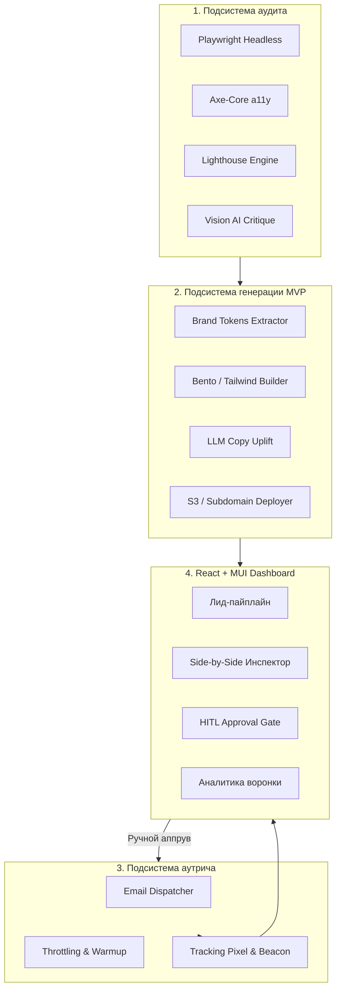

# SOFTWARE REQUIREMENTS SPECIFICATION (SRS)
## Спецификация требований к программному обеспечению SaaS-системы автоматизированного аудита сайтов локального бизнеса, генерации брендовых MVP-редизайнов и персонализированного аутрича (Revamp SaaS)

---

## 1. ОБЩИЕ СВЕДЕНИЯ

### 1.1. Полное наименование системы
**«SaaS-платформа автоматизированного аудита сайтов, генерации брендовых MVP и холодного аутрича с подтверждением человеком (Human-In-The-Loop)»**  
Краткое рабочее наименование: **Revamp SaaS**.

### 1.2. Назначение документа
Настоящая Спецификация требований к программному обеспечению (Software Requirements Specification, SRS) устанавливает исчерпывающий перечень требований к архитектуре, функциональности, техническим характеристикам, безопасности, интерфейсам и этапам реализации SaaS-системы. Документ служит основанием для проектирования, разработки, тестирования и приёмки программного комплекса.

### 1.3. Глоссарий и сокращения
* **SaaS (Software as a Service):** Модель предоставления ПО в виде облачного сервиса.
* **HITL (Human-in-the-Loop):** Архитектурный паттерн, требующий обязательного участия и подтверждения оператора-человека перед выполнением критических действий (в данном случае — отправка писем клиентам).
* **MVP (Minimum Viable Product):** В контексте системы — сгенерированная демонстрационная интерактивная версия веб-сайта клиента с современным дизайном.
* **a11y (Accessibility):** Цифровая доступность веб-интерфейсов для пользователей с ограниченными возможностями по стандарту WCAG 2.1 Level AA.
* **Lighthouse / Core Web Vitals:** Набор метрик веб-производительности от Google (LCP, INP, CLS, FCP).
* **DOM (Document Object Model):** Программное представление структуры HTML-документа.
* **MUI:** Библиотека компонентов интерфейса Material UI для React.
* **Бренд-токены (Design Tokens):** Набор ключевых дизайн-параметров сайта (цветовая палитра, гарнитуры шрифтов, логотип, радиусы скругления).
* **Dwell Time:** Время удержания внимания посетителя на странице сгенерированного MVP-демо.

---

## 2. НАЗНАЧЕНИЕ И ЦЕЛИ СОЗДАНИЯ СИСТЕМЫ

### 2.1. Бизнес-цель
Автоматизация полного цикла B2B-продаж услуг веб-разработки и редизайна для агентств и студий: от обнаружения устаревших сайтов локальных бизнесов до подготовки интерактивного решения «под ключ» и доставки персонального коммерческого предложения с конверсией в отклик (Reply Rate) от 15%.

### 2.2. Задачи системы
1. Автоматический глубокий аудит любого входящего URL без участия человека за время не более 45 секунд.
2. Синтез полноценного одностраничного MVP-лендинга, визуально превосходящего исходный сайт, с сохранением фирменной айдентики бизнеса (логотипы, цвета, контакты, услуги).
3. Автоматическое составление персонализированного коммерческого предложения с демонстрацией ошибок «до» и прототипа «после».
4. Предоставление оператору удобного интерфейса (React + MUI) для инспекции, точечного редактирования и ручного аппрува отправки писем.
5. Отслеживание открытия писем, переходов по ссылкам и поведенческих факторов клиентов на демонстрационной странице.

---

## 3. ТРЕБОВАНИЯ К ПОДСИСТЕМАМ И ФУНКЦИОНАЛУ

Система функционально делится на 5 основных подсистем:
1. **Подсистема сбора данных и аудита (Audit Agent).**
2. **Подсистема генерации брендовых MVP (MVP Redesign Generator).**
3. **Подсистема почтового аутрича и трекинга (Outreach & Tracking Engine).**
4. **Пользовательский интерфейс оператора (React + MUI Dashboard).**
5. **Серверная инфраструктура и очереди (Node.js/Express + MongoDB + BullMQ/Redis).**



---

### 3.1. Подсистема сбора данных и аудита (Audit Agent)

#### 3.1.1. Модуль рендеринга и захвата артефактов
* **Требование 3.1.1.1:** Система должна использовать Headless Chromium (Playwright) с поддержкой выполнения JavaScript и эмуляцией мобильных и десктопных устройств.
* **Требование 3.1.1.2:** Фиксация скриншотов:
  - Десктоп: разрешение $1440 \times 900$ пикселей (полная страница и первый экран Above-the-fold).
  - Мобильный экран: разрешение $375 \times 812$ пикселей (эмуляция мобильного устройства).
* **Требование 3.1.1.3:** Сохранение скриншотов в объектное хранилище (S3-совместимое) с генерацией уникальных неизменяемых ссылок (UUID).

#### 3.1.2. Модуль анализа доступности (Accessibility / a11y)
* **Требование 3.1.2.1:** Интеграция библиотеки `@axe-core/puppeteer` для автоматической проверки по стандарту **WCAG 2.1 Level AA**.
* **Требование 3.1.2.2:** Фиксация нарушений с сохранением точного CSS-селектора, описания проблемы и категории критичности (`critical`, `serious`, `moderate`, `minor`):
  - Контрастность текста по отношению к фону (минимальный порог 4.5:1 для обычного текста, 3:1 для крупного).
  - Отсутствие или пустое значение атрибутов `alt` у смысловых тегов ``.
  - Отсутствие явных меток `<label>` у полей ввода веб-форм.
  - Нарушение логической иерархии заголовков (`h1` отсутствует или используется несколько несвязанных `h1`).

#### 3.1.3. Модуль анализа веб-стандартов и производительности
* **Требование 3.1.3.1:** Запуск встроенного аудита Google Lighthouse в мобильной конфигурации со сбором следующих метрик:
  - **LCP (Largest Contentful Paint):** время отрисовки основного контента (в мс).
  - **CLS (Cumulative Layout Shift):** кумулятивный сдвиг макета.
  - **INP / TBT:** отзывчивость интерфейса при взаимодействии.
* **Требование 3.1.3.2:** Проверка технических стандартов:
  - Наличие валидного SSL-сертификата (протокол HTTPS).
  - Наличие тега `<meta name="viewport">` с корректными параметрами масштабирования.
  - Наличие фавикона (`favicon.ico` / `.png` / `.svg`).
  - Наличие микроразметки Schema.org (`LocalBusiness`, `Organization`) и OpenGraph.

#### 3.1.4. Мультимодальный AI-анализ визуального дизайна (Vision UX/UI Critique)
* **Требование 3.1.4.1:** Отправка десктопного и мобильного скриншотов первого экрана в мультимодальную нейросетевую модель.
* **Требование 3.1.4.2:** Формирование структурированного ответа в формате JSON, содержащего:
  - Оценку визуальной иерархии ($0-100$).
  - Наличие и заметность главного целевого действия (CTA-кнопки).
  - Список устаревших дизайн-признаков (Dated UI: мелкие нечитаемые шрифты, устаревшие градиенты, перегруженность текстом).
  - Перечень ровно 3 критических недостатков дизайна с точки зрения потенциального клиента бизнеса.
  - Перечень ровно 3 точек быстрого роста (Quick Wins).

#### 3.1.5. Расчет интегрального скоринга (Composite Scoring Engine)
* **Требование 3.1.5.1:** Вычисление итогового рейтинга качества сайта по формуле:
  $$\text{Score}_{\text{Total}} = (0.35 \times S_{\text{Design}}) + (0.25 \times S_{\text{Performance}}) + (0.20 \times S_{\text{A11y}}) + (0.20 \times S_{\text{Standards}})$$
* **Требование 3.1.5.2:** Градация состояния сайта:
  - $0 - 49$: Критическое состояние (высокий приоритет для холодного письма).
  - $50 - 74$: Требует модернизации.
  - $75 - 100$: Современный сайт (отправка предложения не рекомендуется).

---

### 3.2. Подсистема генерации брендовых MVP (MVP Redesign Generator)

#### 3.2.1. Экстракция бренд-токенов (Brand DNA Extractor)
* **Требование 3.2.1.1:** Алгоритм должен парсить вычисленные стили (`Computed CSS`) и атрибуты элементов оригинального сайта для извлечения:
  - Основной фирменный цвет (Primary Color) — извлекается из хедера, главных кнопок и логотипа.
  - Вторичный и акцентный цвета (Secondary, Accent).
  - Шрифт заголовков и основного текста (гарнитура, тип: Serif / Sans-Serif).
* **Требование 3.2.1.2:** Извлечение логотипа:
  - Поиск в DOM-дереве тегов `header img`, `a[href="/"] img`, тегов `<svg>` внутри навигации, ссылок `apple-touch-icon`.
  - В случае невозможности извлечения чистого логотипа — автоматическое создание стильного текстового логотипа на базе шрифтовой пары.
* **Требование 3.2.1.3:** Извлечение фактуры бизнеса (Structured Entity Extraction):
  - Номер телефона (валидация по маске), адрес электронной почты, физический адрес, режим работы.
  - Список ключевых услуг с оригинального сайта (до 6 основных направлений).
  - Список реальных преимуществ или отзывов (при наличии).

#### 3.2.2. Генерация структуры и контента лендинга
* **Требование 3.2.2.1:** Генерация кода должна производиться на базе современных дизайн-паттернов (Bento-сетка, скругления, микро-взаимодействия, чистая типографика на Tailwind CSS).
* **Требование 3.2.2.2:** Обязательный состав блоков MVP:
  1. **Sticky Header:** Фирменный логотип, телефон для звонка в 1 клик, кнопка целевого действия «Записаться / Консультация».
  2. **Hero-секция:** Усиленный оффер (AI Copywriting) с фокусом на выгоду клиента, форма быстрого захвата, плашки доверия (рейтинг на картах 4.9+).
  3. **Блок ключевых услуг (Bento Grid):** Интерактивные карточки с иконками и описанием основных услуг, спарсенных с исходного сайта.
  4. **Блок социального доказательства (Social Proof):** Отзывы клиентов, гарантии или сертификаты.
  5. **Интерактивная форма захвата / Калькулятор:** Позволяет посетителю совершить тестовое действие.
  6. **Футер:** Контакты, график работы, гео-метка, ссылка «Прототип создан платформой Revamp».
* **Требование 3.2.2.3:** LLM-усиление текстов (Copywriting Uplift): адаптация исходных формулировок под современные маркетинговые стандарты без искажения фактических данных (названий услуг, цен и контактных телефонов).

#### 3.2.3. Сборка, публикация и визуальное сравнение
* **Требование 3.2.3.1:** Сборка в легковесный автономный HTML/CSS-бандл (размер страницы не более 350 Кб без тяжелых внешних зависимостей).
* **Требование 3.2.3.2:** Встраивание в страницу трекинг-скрипта `revamp-tracker.js` для сбора поведенческих метрик.
* **Требование 3.2.3.3:** Автоматическая публикация на изолированный поддомен (например, `https://preview.revamp.io/v/{slug}`).
* **Требование 3.2.3.4:** Автоматический рендеринг и скриншотирование сгенерированного лендинга через Playwright для создания сравнительного коллажа «До / После» ($1200 \times 630$ пикселей).

---

### 3.3. Подсистема почтового аутрича и трекинга (Outreach Engine)

#### 3.3.1. Генерация персонального коммерческого предложения
* **Требование 3.3.1.1:** Шаблонизация писем на базе результатов аудита:
  - Тема письма: динамическая подстановка имени бизнеса и конкретной найденной проблемы (например: *«Ошибка в мобильной версии {{businessName}} + готовый прототип решения»*).
  - Тело письма (HTML + Plain Text альтернатива):
    - Приветствие с персонализацией по имени владельца (если найдено) или названию компании.
    - 2–3 конкретных критических тезиса аудита (с цифрами LCP, скорингом a11y).
    - Встроенное визуальное сравнение (оптимизированное изображение сплит-экрана «До/После»).
    - Прямая персональная ссылка на просмотр интерактивного прототипа.
    - Отсутствие спам-триггеров и агрессивных продаж.

#### 3.3.2. Защита доставляемости и репутации доменов (Deliverability)
* **Требование 3.3.2.1:** Поддержка пула отправляющих почтовых ящиков с ротацией.
* **Требование 3.3.2.2:** Троттлинг: отправка не более 1 письма в $180$ секунд с одного аккаунта. Максимальный суточный лимит — не более 35 писем на один домен.
* **Требование 3.3.2.3:** Наличие рандомизированного интервала (Jitter: от 15 до 45 секунд) между запланированными отправками.
* **Требование 3.3.2.4:** Автоматическая валидация MX-записей домена получателя перед отправкой.
* **Требование 3.3.2.5:** Наличие в заголовках и теле письма корректной ссылки отписки (`List-Unsubscribe`, `One-Click Unsubscribe`).

#### 3.3.3. Трекинг вовлеченности (Analytics & Telemetry)
* **Требование 3.3.3.1:** Трекинг открытия письма через уникальный прозрачный GIF-пиксель $1 \times 1$ (`/api/v1/track/open/{trackingToken}.gif`).
* **Требование 3.3.3.2:** Трекинг кликов по ссылке с редиректом через сервис-прокси (`/api/v1/track/click/{trackingToken}`).
* **Требование 3.3.3.3:** Трекинг активности на странице MVP через Beacon API:
  - Время нахождения на странице (Dwell Time в секундах).
  - Глубина скролла страницы (25%, 50%, 75%, 100%).
  - Клики по интерактивным кнопкам в прототипе («Записаться», «Позвонить»).

---

### 3.4. Пользовательский интерфейс оператора (React + Material UI Dashboard)

Интерфейс строится на React 18+, Material UI (MUI v6) и реализует строгий паттерн **Human-In-The-Loop**.

```
+---------------------------------------------------------------------------------------------------+
| REVAMP DASHBOARD    [Поиск лида / домена...]          [Фильтр: Ниша v] [Статус v]   [Оператор (Admin)]|
+---------------------+-----------------------------------------------------------------------------+
| Навигация:          | ВОРОНКА ЛИДОВ (KANBAN & DATAGRID ПЕРЕКЛЮЧАТЕЛЬ)                             |
| [*] Воронка лидов   | +-----------------+-----------------+-----------------+-------------------+ |
| [ ] Все аудиты      | Очередь (5)       | Аудит/Ген (2)   | НА РЕВЬЮ [!] (8)| Отправлено (24)   | |
| [ ] Шаблоны писем   | dental-pro.ru     | stroy-dom.ru    | >> auto-fix.ru  | beauty-spa.ru     | |
| [ ] Аналитика       | law-center.com    | clean-city.ru   | legal-group.ru  | stomatolog-msk.ru | |
| [ ] Настройки SMTP  +-----------------+-----------------+-----------------+-------------------+ |
|                     |                                                                             |
|                     | ОКНО РЕВЬЮ И ПОДТВЕРЖДЕНИЯ (HITL APPROVAL MODAL):                           |
|                     | +--------------------------------------+----------------------------------+ |
|                     | | 1. ИСХОДНЫЙ САЙТ (Оценка: 41/100)    | 2. НОВЫЙ MVP (Интерактивный)     | |
|                     | | [Скриншот: Неадаптивный хедер]       | [ <iframe> с переключателем:     | |
|                     | | - Скорость LCP: 4.9 сек              |   Mobile / Tablet / Desktop ]    | |
|                     | | - Ошибок a11y: 18 шт                 | Фирменный цвет: [#1E40AF] (Edit) | |
|                     | +--------------------------------------+----------------------------------+ |
|                     | | 3. ЧЕРНОВИК ПИСЬМА КЛИЕНТУ:                                             | |
|                     | | Кому: info@auto-fix.ru  | Тема: Ошибки в мобильной версии auto-fix...   | |
|                     | | [ WYSIWYG поле редактирования текста коммерческого предложения ]        | |
|                     | |                                                                        | |
|                     | | [Перегенерировать MVP]   [Отправить тестовое]   [ ОДОБРИТЬ И ОТПРАВИТЬ ]| |
|                     | +-------------------------------------------------------------------------+ |
+---------------------+-----------------------------------------------------------------------------+
```

#### 3.4.1. Общие интерфейсные требования
* **Требование 3.4.1.1:** Дизайн-система на базе Material UI с кастомизированной темой (Custom Palette, скругления $10-12$px, типографика Inter/Roboto, поддержка тёмной и светлой темы).
* **Требование 3.4.1.2:** Использование `@mui/x-data-grid` для табличного представления со встроенной сортировкой, пагинацией на стороне сервера и расширенными фильтрами.
* **Требование 3.4.1.3:** Управление состоянием: `Zustand` для клиентского состояния (модальные окна, фильтры) и `TanStack Query (React Query v5)` для серверного кэша и фоновой синхронизации данных.

#### 3.4.2. Экран пайплайна лидов (Pipeline & Kanban)
* **Требование 3.4.2.1:** Отображение стадий жизненного цикла лида:
  - `QUEUED` (В очереди на обработку).
  - `PROCESSING` (Выполняется аудит и генерация).
  - `NEEDS_APPROVAL` (Сгенерировано, ожидает проверки оператором).
  - `SCHEDULED` (Одобрено, ожидает в очереди отправки).
  - `SENT` (Письмо доставлено).
  - `OPENED` (Письмо открыто клиентом).
  - `CLICKED` (Клиент перешел на страницу MVP-демо).
  - `ENGAGED` (Клиент провел на демо более 30 секунд или нажал CTA).
  - `REJECTED` (Отклонено оператором).

#### 3.4.3. Экран детального ревью и подтверждения (HITL Approval Gate)
* **Требование 3.4.3.1:** Сплит-инспектор (Side-by-Side View):
  - Левая панель: Скриншот и сводка исходного сайта с подсветкой проблемных зон.
  - Правая панель: Живой интерактивный `<iframe>` со сгенерированным сайтом и тулбаром смены вьюпортов ($375$px, $768$px, $1440$px).
* **Требование 3.4.3.2:** Панель быстрой корректировки MVP:
  - Возможность кликом изменить основной цвет бренда (Color Picker).
  - Возможность отредактировать главный заголовок и УТП без полного перезапуска генератора.
* **Требование 3.4.3.3:** Редактор письма:
  - Предпросмотр темы и HTML-тела письма.
  - Полнофункциональный редактор текста перед отправкой.
* **Требование 3.4.3.4:** Действия оператора:
  - Кнопка **«Одобрить и отправить»** (ставит задачу в очередь отправки с горячей клавишей `Cmd/Ctrl + Enter`).
  - Кнопка **«Отправить тест себе»** (отправка на почту оператора для контроля).
  - Кнопка **«Перегенерировать MVP»** (повторный запуск AI-воркера с корректирующим промптом).
  - Кнопка **«Отклонить лид»** с выбором причины (нерелевантный бизнес, неверный email, сайт уже современный).

#### 3.4.4. Аналитический экран
* **Требование 3.4.4.1:** Графики конверсии воронки на базе `Recharts`:
  - Аудитов проведено $\rightarrow$ Одобрено оператором $\rightarrow$ Доставлено писем $\rightarrow$ Открытий $\rightarrow$ Переходов на демо $\rightarrow$ Целевых действий в демо.
* **Требование 3.4.4.2:** Монитор очередей задач: отображение активных воркеров, загрузки процессора, очереди BullMQ и оставшихся квот на API нейросетей.

---

### 3.5. Серверная инфраструктура, API и База Данных

#### 3.5.1. Архитектура бэкенда (Node.js + Express)
* **Требование 3.5.1.1:** Архитектура сервиса построена на модульном монолите с разделением слоев: `Routes -> Controllers -> Services -> Repositories -> Models`.
* **Требование 3.5.1.2:** Использование TypeScript со строгой типизацией на всех уровнях.
* **Требование 3.5.1.3:** Централизованная обработка ошибок с логированием (Winston / Pino) и валидацией всех входящих DTO через `Zod`.

#### 3.5.2. База данных (MongoDB & Mongoose)
* **Требование 3.5.2.1:** Использование официального ODM `mongoose` с поддержкой индексов для быстрого поиска по статусам, датам и URL.
* **Требование 3.5.2.2:** Обязательные коллекции:
  1. `users`: операторы и администраторы системы (хранение хэшей паролей `bcrypt`, роли `ADMIN`, `OPERATOR`, `ANALYST`).
  2. `leads`: метаданные о бизнесе, контакты, текущий статус в воронке.
  3. `audits`: детальные данные аудита, сырые JSON от axe-core и Lighthouse, ссылки на скриншоты, скоринг.
  4. `mvp_projects`: сгенерированный контент, дизайн-токены, ссылки на опубликованное демо.
  5. `email_campaigns`: шаблоны, сформированные письма, история отправок, статусы доставки.
  6. `analytics_events`: сырой лог событий (открытия писем, клики, время на сайте).

#### 3.5.3. Очереди и фоновые воркеры (BullMQ + Redis)
* **Требование 3.5.3.1:** Вынесение всех ресурсоемких операций в изолированные процессы воркеров:
  - Очередь `audit-queue`: запуск Playwright, снятие скриншотов, a11y и Lighthouse (concurrency = 2 воркера на CPU).
  - Очередь `ai-gen-queue`: обращение к API нейросетей с контролем лимитов RPM/TPM.
  - Очередь `deploy-queue`: сборка и выгрузка статики MVP в хранилище S3.
  - Очередь `email-queue`: отправка писем с жестким троттлингом и ретраями.
* **Требование 3.5.3.2:** Автоматический перезапуск упавших задач (до 3 попыток с Exponential Backoff).
* **Требование 3.5.3.3:** Изоляция браузерных процессов: принудительный перезапуск контекста браузера каждые 20 аудитов для предотвращения утечек оперативной памяти.

---

## 4. НЕФУНКЦИОНАЛЬНЫЕ ТРЕБОВАНИЯ

### 4.1. Производительность и время отклика
* Время выполнения полного аудита одного сайта (Playwright + Axe + Lighthouse + Vision AI): **не более 45 секунд**.
* Время сборки и деплоя MVP-лендинга: **не более 20 секунд**.
* Время отклика REST API дашборда на операции чтения с пагинацией: **не более 150 мс**.
* Загрузка страницы сгенерированного MVP-демо у конечного клиента: **LCP менее 1.2 секунды**, оценка Lighthouse Performance $\ge 90$.

### 4.2. Безопасность и соответствие законодательству
* **Изоляция стороннего кода:** Все демонстрационные MVP хостятся на отдельном домене (например, `revampdemo.com`), не имеющем доступа к сессионным cookie основного приложения и API-ключам.
* **Защита фреймов:** `<iframe>` в панели оператора должен быть изолирован директивами `sandbox="allow-scripts allow-same-origin"`.
* **Защита API:** Аутентификация операторов по стандарту JWT (Access токен 15 мин, Refresh токен 7 дней в `httpOnly`, `Secure` cookies).
* **Соблюдение почтовых стандартов:** Обязательная настройка SPF, DKIM и DMARC для всех исходящих доменов. Обработка заголовка отписки по стандарту RFC 8058.

### 4.3. Требования к надежности и отказоустойчивости
* Доступность SaaS-сервиса: **SLA 99.5%**.
* Корректная обработка падения исследуемого сайта: при таймауте ответа целевого сайта более 20 секунд аудит помечается статусом `FAILED` с понятным текстом ошибки без зависания очереди.

---

## 5. ЭТАПЫ РАЗРАБОТКИ И ПРИЁМКИ (ROADMAP)

| Этап | Содержание работ | Сроки | Результат приёмки |
|---|---|---|---|
| **Этап 1: Инфраструктура и модуль аудита** | Развертывание Express, MongoDB, Redis. Реализация воркера Playwright, интеграция axe-core, Lighthouse, Vision LLM. Сохранение скриншотов в S3. | 3 недели | Скрипт принимает URL, через 40 сек возвращает в MongoDB полный JSON аудита, скоринг и ссылки на скриншоты. |
| **Этап 2: Генератор брендовых MVP** | Парсинг CSS-токенов, разработка Tailwind Bento-шаблонов, сборка статики, деплой на поддомены, скриншот «До/После». | 3 недели | По `auditId` генерируется рабочий адаптивный лендинг с оригинальными цветами и логотипом по адресу `preview.domain/v/{slug}`. |
| **Этап 3: React + MUI Дашборд и HITL** | Разработка UI на React + MUI. Таблица лидов, сплит-инспектор сайта, модальное окно ревью и подтверждения отправки. | 3 недели | Оператор авторизуется в дашборде, видит очередь лидов, просматривает сплит-экран, редактирует письмо и жмет кнопку отправки. |
| **Этап 4: Почтовый аутрич и трекинг** | Настройка SMTP пула, ротация, троттлинг, генератор писем, трекинг-пиксель, трекер поведения в MVP, экран аналитики. | 3 недели | Письмо уходит после аппрува, открытие фиксируется в реальном времени, клик по MVP логирует время нахождения на демо. |
| **Этап 5: Тестирование и запуск** | Нагрузочное тестирование воркеров, проверка доставляемости писем, исправление багов, оформление документации. | 2 недели | Сквозной E2E прогон 100 реальных сайтов с конверсией без сбоев. Проект готов к промышленной эксплуатации. |

---

## 6. КРИТЕРИИ ПРИЁМКИ СИСТЕМЫ

1. **Критерий функциональной полноты:** Система выполняет полный замкнутый цикл:
   `Ввод URL -> Автоматический аудит -> Генерация MVP -> Появление в дашборде -> Ручная корректировка/аппрув оператором -> Отправка письма -> Регистрация открытия и клика в аналитике`.
2. **Критерий качества генерации MVP:** Сгенерированные страницы сохраняют цветовую гамму бренда с точностью попадания основного цвета $\ge 90\%$, содержат корректный логотип и корректные контактные данные оригинального бизнеса.
3. **Критерий эргономики HITL:** Время проверки одного лида оператором в дашборде не превышает 30 секунд.
4. **Критерий стабильности очередей:** Очередь обрабатывает пачку из 50 сайтов подряд без утечек памяти и зависаний фоновых браузерных процессов.
