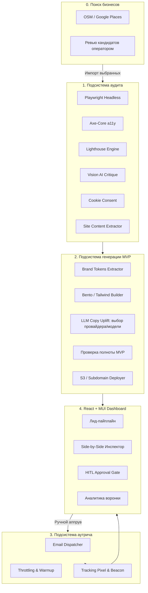

# SOFTWARE REQUIREMENTS SPECIFICATION (SRS)
## Спецификация требований к программному обеспечению SaaS-системы автоматизированного аудита сайтов локального бизнеса, генерации брендовых MVP-редизайнов и персонализированного аутрича (Revamp SaaS)

---

## 1. ОБЩИЕ СВЕДЕНИЯ

### 1.1. Полное наименование системы
**«SaaS-платформа автоматизированного аудита сайтов, генерации брендовых MVP и холодного аутрича с подтверждением человеком (Human-In-The-Loop)»**  
Краткое рабочее наименование: **Revamp SaaS**.

### 1.2. Назначение документа
Настоящая Спецификация требований к программному обеспечению (Software Requirements Specification, SRS) устанавливает исчерпывающий перечень требований к архитектуре, функциональности, техническим характеристикам, безопасности, интерфейсам и этапам реализации SaaS-системы. Документ служит основанием для проектирования, разработки, тестирования и приёмки программного комплекса.

### 1.3. Глоссарий и сокращения
* **SaaS (Software as a Service):** Модель предоставления ПО в виде облачного сервиса.
* **HITL (Human-in-the-Loop):** Архитектурный паттерн, требующий обязательного участия и подтверждения оператора-человека перед выполнением критических действий (в данном случае — отправка писем клиентам).
* **MVP (Minimum Viable Product):** В контексте системы — сгенерированная демонстрационная интерактивная версия веб-сайта клиента с современным дизайном.
* **a11y (Accessibility):** Цифровая доступность веб-интерфейсов для пользователей с ограниченными возможностями по стандарту WCAG 2.1 Level AA.
* **Lighthouse / Core Web Vitals:** Набор метрик веб-производительности от Google (LCP, INP, CLS, FCP).
* **DOM (Document Object Model):** Программное представление структуры HTML-документа.
* **MUI:** Библиотека компонентов интерфейса Material UI для React.
* **Бренд-токены (Design Tokens):** Набор ключевых дизайн-параметров сайта (цветовая палитра, гарнитуры шрифтов, логотип, радиусы скругления).
* **Dwell Time:** Время удержания внимания посетителя на странице сгенерированного MVP-демо.

---

## 2. НАЗНАЧЕНИЕ И ЦЕЛИ СОЗДАНИЯ СИСТЕМЫ

### 2.1. Бизнес-цель
Автоматизация полного цикла B2B-продаж услуг веб-разработки и редизайна для агентств и студий: от обнаружения устаревших сайтов локальных бизнесов до подготовки интерактивного решения «под ключ» и доставки персонального коммерческого предложения с конверсией в отклик (Reply Rate) от 15%.

### 2.2. Задачи системы
1. Автоматический глубокий аудит любого входящего URL без участия человека за время не более 45 секунд.
2. Синтез полноценного одностраничного MVP-лендинга, визуально превосходящего исходный сайт, с сохранением фирменной айдентики бизнеса (логотипы, цвета, контакты, услуги).
3. Автоматическое составление персонализированного коммерческого предложения с демонстрацией ошибок «до» и прототипа «после».
4. Предоставление оператору удобного интерфейса (React + MUI) для инспекции, точечного редактирования и ручного аппрува отправки писем.
5. Отслеживание открытия писем, переходов по ссылкам и поведенческих факторов клиентов на демонстрационной странице.
6. Поиск локальных бизнесов по нише и локации на картах (OpenStreetMap, Google Places) с ревью и выборочным импортом кандидатов оператором.

---

## 3. ТРЕБОВАНИЯ К ПОДСИСТЕМАМ И ФУНКЦИОНАЛУ

Система функционально делится на 6 основных подсистем:
0. **Подсистема поиска локальных бизнесов (Discovery)** — см. §3.6.
1. **Подсистема сбора данных и аудита (Audit Agent).**
2. **Подсистема генерации брендовых MVP (MVP Redesign Generator).**
3. **Подсистема почтового аутрича и трекинга (Outreach & Tracking Engine).**
4. **Пользовательский интерфейс оператора (React + MUI Dashboard).**
5. **Серверная инфраструктура и очереди (Node.js/Express + MongoDB + BullMQ/Redis).**



---

### 3.1. Подсистема сбора данных и аудита (Audit Agent)

#### 3.1.1. Модуль рендеринга и захвата артефактов
* **Требование 3.1.1.1:** Система должна использовать Headless Chromium (Playwright) с поддержкой выполнения JavaScript и эмуляцией мобильных и десктопных устройств.
* **Требование 3.1.1.2:** Фиксация скриншотов:
  - Десктоп: разрешение $1440 \times 900$ пикселей (полная страница и первый экран Above-the-fold).
  - Мобильный экран: разрешение $375 \times 812$ пикселей (эмуляция мобильного устройства).
* **Требование 3.1.1.3:** Сохранение скриншотов в объектное хранилище (S3-совместимое) по ключу `screenshots/{leadId}/{desktop|mobile|desktop-full|mobile-full}.webp`.
* **Требование 3.1.1.4 (REV-21):** Полностраничные скриншоты десктопа и мобильной версии:
  - перед захватом страница прокручивается для подгрузки lazy-контента, а анимации появления при скролле принудительно показываются;
  - высота ограничена 12 000 (десктоп) и 8 000 (мобайл) CSS px, ширина ужимается до 1440 / 750 px без уменьшения высоты;
  - Vision LLM получает только скриншоты первого экрана.
* **Требование 3.1.1.5 (REV-33):** До первого скриншота в каждом контексте система закрывает cookie-баннер: через API известных платформ согласия (OneTrust, Cookiebot, Didomi, Quantcast, Usercentrics, CookieYes, Complianz, Osano, iubenda, Termly, TrustArc), затем по тексту кнопки «Принять» (en, pl, ru, be, lt, de, fr, uk; включая iframe), затем скрытием оставшегося оверлея. Бюджет шага — 3 с; шаг никогда не прерывает аудит. Мобильные Core Web Vitals снимаются до закрытия баннера, axe-core — после. Итог сохраняется в `Audit.cookieBannerHandled`.
* **Требование 3.1.1.6 (REV-23):** Детерминированное извлечение контента исходного сайта из DOM (без генерации): title, meta description, H1 и заголовки, абзацы, услуги с описаниями, навигация, отзывы, контентные изображения, адрес, часы работы, язык страницы и данные schema.org `LocalBusiness`/`Organization` (JSON-LD). Результат сохраняется в `Audit.extractedContent` и `Audit.extractedContacts` и служит единственным источником фактов для MVP.

#### 3.1.2. Модуль анализа доступности (Accessibility / a11y)
* **Требование 3.1.2.1:** Интеграция библиотеки `@axe-core/playwright` для автоматической проверки по стандарту **WCAG 2.1 Level AA**.
* **Требование 3.1.2.2:** Фиксация нарушений с сохранением точного CSS-селектора, описания проблемы и категории критичности (`critical`, `serious`, `moderate`, `minor`):
  - Контрастность текста по отношению к фону (минимальный порог 4.5:1 для обычного текста, 3:1 для крупного).
  - Отсутствие или пустое значение атрибутов `alt` у смысловых тегов ``.
  - Отсутствие явных меток `<label>` у полей ввода веб-форм.
  - Нарушение логической иерархии заголовков (`h1` отсутствует или используется несколько несвязанных `h1`).

#### 3.1.3. Модуль анализа веб-стандартов и производительности
* **Требование 3.1.3.1:** Запуск встроенного аудита Google Lighthouse в мобильной конфигурации со сбором следующих метрик:
  - **LCP (Largest Contentful Paint):** время отрисовки основного контента (в мс).
  - **CLS (Cumulative Layout Shift):** кумулятивный сдвиг макета.
  - **INP / TBT:** отзывчивость интерфейса при взаимодействии.
* **Требование 3.1.3.2:** Проверка технических стандартов:
  - Наличие валидного SSL-сертификата (протокол HTTPS).
  - Наличие тега `<meta name="viewport">` с корректными параметрами масштабирования.
  - Наличие фавикона (`favicon.ico` / `.png` / `.svg`).
  - Наличие микроразметки Schema.org (`LocalBusiness`, `Organization`) и OpenGraph.

#### 3.1.4. Мультимодальный AI-анализ визуального дизайна (Vision UX/UI Critique)
* **Требование 3.1.4.1:** Отправка десктопного и мобильного скриншотов первого экрана в мультимодальную нейросетевую модель.
* **Требование 3.1.4.2:** Формирование структурированного ответа в формате JSON, содержащего:
  - Оценку визуальной иерархии ($0-100$).
  - Наличие и заметность главного целевого действия (CTA-кнопки).
  - Список устаревших дизайн-признаков (Dated UI: мелкие нечитаемые шрифты, устаревшие градиенты, перегруженность текстом).
  - Перечень ровно 3 критических недостатков дизайна с точки зрения потенциального клиента бизнеса.
  - Перечень ровно 3 точек быстрого роста (Quick Wins).

#### 3.1.5. Расчет интегрального скоринга (Composite Scoring Engine)
* **Требование 3.1.5.1:** Вычисление итогового рейтинга качества сайта по формуле:
  $$\text{Score}_{\text{Total}} = (0.35 \times S_{\text{Design}}) + (0.25 \times S_{\text{Performance}}) + (0.20 \times S_{\text{A11y}}) + (0.20 \times S_{\text{Standards}})$$
* **Требование 3.1.5.2:** Градация состояния сайта:
  - $0 - 49$: Критическое состояние (высокий приоритет для холодного письма).
  - $50 - 74$: Требует модернизации.
  - $75 - 100$: Современный сайт (отправка предложения не рекомендуется).

---

### 3.2. Подсистема генерации брендовых MVP (MVP Redesign Generator)

#### 3.2.1. Экстракция бренд-токенов (Brand DNA Extractor)
* **Требование 3.2.1.1:** Алгоритм должен парсить вычисленные стили (`Computed CSS`) и атрибуты элементов оригинального сайта для извлечения:
  - Основной фирменный цвет (Primary Color) — извлекается из хедера, главных кнопок и логотипа.
  - Вторичный и акцентный цвета (Secondary, Accent).
  - Шрифт заголовков и основного текста (гарнитура, тип: Serif / Sans-Serif).
* **Требование 3.2.1.2:** Извлечение логотипа:
  - Поиск в DOM-дереве тегов `header img`, `a[href="/"] img`, тегов `<svg>` внутри навигации, ссылок `apple-touch-icon`.
  - В случае невозможности извлечения чистого логотипа — автоматическое создание стильного текстового логотипа на базе шрифтовой пары.
* **Требование 3.2.1.3:** Извлечение фактуры бизнеса (Structured Entity Extraction):
  - Номер телефона (валидация по маске), адрес электронной почты, физический адрес, режим работы.
  - Список ключевых услуг с оригинального сайта (до 6 основных направлений).
  - Список реальных преимуществ или отзывов (при наличии).
  - Приоритет источников контактов: schema.org JSON-LD > текстовые эвристики > совпадения по CSS-классам (последние — только при наличии цифр). Физический адрес не записывается в поле `city` лида.
* **Требование 3.2.1.4 (REV-23):** Бледный или белый основной цвет заменяется читаемым фирменным цветом или затемняется до контраста не менее 3:1 (исключает белые кнопки на белом фоне).

#### 3.2.2. Генерация структуры и контента лендинга
* **Требование 3.2.2.1:** Генерация кода должна производиться на базе современных дизайн-паттернов (Bento-сетка, скругления, микро-взаимодействия, чистая типографика на Tailwind CSS).
* **Требование 3.2.2.2:** Обязательный состав блоков MVP:
  1. **Sticky Header:** Фирменный логотип, телефон для звонка в 1 клик, кнопка целевого действия «Записаться / Консультация».
  2. **Hero-секция:** Усиленный оффер (AI Copywriting) с фокусом на выгоду клиента, форма быстрого захвата, плашки доверия (рейтинг на картах 4.9+).
  3. **Блок ключевых услуг (Bento Grid):** Интерактивные карточки с иконками и описанием основных услуг, спарсенных с исходного сайта.
  4. **Блок социального доказательства (Social Proof):** Отзывы клиентов, гарантии или сертификаты.
  5. **Интерактивная форма захвата / Калькулятор:** Позволяет посетителю совершить тестовое действие.
  6. **Футер:** Контакты, график работы, гео-метка, ссылка «Прототип создан платформой Revamp».
* **Требование 3.2.2.3:** LLM-усиление текстов (Copywriting Uplift): адаптация исходных формулировок под современные маркетинговые стандарты без искажения фактических данных (названий услуг, цен и контактных телефонов).
* **Требование 3.2.2.4 (REV-23):** Блоки MVP с фактическими данными (кнопка звонка, плашки доверия, отзывы, часы работы, контакты, соцсети, галерея) отображаются только при наличии данных, извлеченных с исходного сайта. Выдуманные значения по умолчанию (телефоны, адреса, отзывы, метрики) запрещены. Плашки доверия допускаются только с числами, которые буквально есть на исходном сайте.
* **Требование 3.2.2.5 (REV-25):** MVP генерируется на языке исходного сайта: LLM пишет тексты на языке `outputLanguage` (тег `lang` сайта или язык его текста), `<html lang>` содержит BCP 47-тег сайта, фиксированный UI-текст шаблона и детерминированный fallback локализованы для en, ru, be, pl, lt (для других языков — английский UI).
* **Требование 3.2.2.6 (REV-34):** Системный промпт явно задает лимит длины каждого поля; перед Zod-валидацией строки обрезаются до лимитов схемы по границе слова, чтобы одно длинное поле не приводило к fallback.
* **Требование 3.2.2.7 (REV-30, REV-32):** Оператор выбирает LLM-провайдера и модель для каждой генерации:
  - каталог: Anthropic API, OpenAI API, Google Gemini API, локальный Claude Code CLI и dev-only `mock` (детерминированные тексты);
  - доступность каждого варианта определяется воркерами (задан ли API-ключ, найден ли бинарник `claude`) и отдается `GET /api/v1/mvp/providers`; при отсутствии свежего отчета воркеров все варианты недоступны;
  - при сбое выбранного провайдера используется только детерминированный fallback, без переключения на другого платного провайдера;
  - в `MvpProject` сохраняются выбранные и фактически использованные провайдер и модель.

#### 3.2.3. Сборка, публикация и визуальное сравнение
* **Требование 3.2.3.1:** Сборка в легковесный автономный HTML/CSS-бандл (размер страницы не более 350 Кб без тяжелых внешних зависимостей).
* **Требование 3.2.3.2:** Встраивание в страницу трекинг-скрипта `revamp-tracker.js` для сбора поведенческих метрик.
* **Требование 3.2.3.3:** Автоматическая публикация на изолированный поддомен (например, `https://preview.revamp.io/v/{slug}`).
* **Требование 3.2.3.4:** Автоматический рендеринг и скриншотирование сгенерированного лендинга через Playwright для создания сравнительного коллажа «До / После» ($1200 \times 630$ пикселей).

#### 3.2.4. Проверка полноты MVP (REV-36, REV-37)
* **Требование 3.2.4.1:** После рендеринга и до перевода лида в `NEEDS_APPROVAL` система сравнивает HTML MVP с данными, извлеченными на аудите, без повторного краулинга. Проверяемые поля и уровни важности:
  - `critical`: название бизнеса, телефон, e-mail, адрес;
  - `important`: часы работы, услуги, соцсети;
  - `informational`: логотип, изображения, отзывы, рейтинг, год основания.
* **Требование 3.2.4.2:** Статус каждого поля: `present`, `missing`, `altered`, `not_in_source` или `unsourced` (контакт в MVP, отсутствующий на исходном сайте). Телефон и e-mail считаются `present` только при наличии и текста, и ссылки `tel:`/`mailto:`.
* **Требование 3.2.4.3:** При включенной настройке `MVP_COMPLETENESS_LLM` поля оценивает LLM; каждый вердикт `present`/`altered` обязан содержать дословную цитату из MVP. Код принимает вердикт, только если цитата найдена в тексте, ссылках или URL изображений MVP; `missing` от LLM не перекрывает совпадение, найденное кодом. Статус `not_in_source` и итоговый балл (0–100, веса 3/2/1 по уровням) всегда вычисляет код.
* **Требование 3.2.4.4:** При отсутствии провайдера, таймауте, ошибке провайдера или невалидном ответе после одного повтора используется сравнение только кодом с сохранением причины (`llmError`). Сбой самого сравнения сохраняется как отчет `unverified` и не прерывает генерацию.
* **Требование 3.2.4.5:** Отчет валидируется Zod, сохраняется в `MvpProject.completenessReport` с указанием метода (`llm`/`deterministic`), модели и того, кто решил по каждому полю (`judgedBy`), и пересчитывается при каждой перегенерации. Отчет рекомендательный: он не одобряет, не блокирует и не отправляет письма.

#### 3.2.5. Перегенерация MVP (REV-31)
* **Требование 3.2.5.1:** Первая генерация доступна из статуса `AUDITED`; перегенерация — из `NEEDS_APPROVAL`, `MVP_READY`, `AWAITING_APPROVAL`, `APPROVED` и только с флагом `forceRegenerate`. После постановки письма в отправку (`SCHEDULED` и далее) и во время текущей генерации API отвечает `409`.
* **Требование 3.2.5.2:** Перегенерация всегда создает новые тексты, перезаписывает MVP по прежнему `previewSlug` (ранее отправленная ссылка остается рабочей, `Cache-Control: no-cache`) и обновляет единственный `MvpProject` лида (`generatedAt`, `generationCount`).
* **Требование 3.2.5.3:** Лид остается в `GENERATING`, пока новое превью не опубликовано. После исчерпания ретраев лид возвращается в `AUDITED` (первая генерация) или `NEEDS_APPROVAL` (предыдущий MVP сохранен), а причина записывается в `Lead.generationError` и показывается оператору.

---

### 3.3. Подсистема почтового аутрича и трекинга (Outreach Engine)

#### 3.3.1. Генерация персонального коммерческого предложения
* **Требование 3.3.1.1:** Шаблонизация писем на базе результатов аудита:
  - Тема письма: динамическая подстановка имени бизнеса и конкретной найденной проблемы (например: *«Ошибка в мобильной версии {{businessName}} + готовый прототип решения»*).
  - Тело письма (HTML + Plain Text альтернатива):
    - Приветствие с персонализацией по имени владельца (если найдено) или названию компании.
    - 2–3 конкретных критических тезиса аудита (с цифрами LCP, скорингом a11y).
    - Встроенное визуальное сравнение (оптимизированное изображение сплит-экрана «До/После»).
    - Прямая персональная ссылка на просмотр интерактивного прототипа.
    - Отсутствие спам-триггеров и агрессивных продаж.

#### 3.3.2. Защита доставляемости и репутации доменов (Deliverability)
* **Требование 3.3.2.1:** Поддержка пула отправляющих почтовых ящиков с ротацией.
* **Требование 3.3.2.2:** Троттлинг: отправка не более 1 письма в $180$ секунд с одного аккаунта. Максимальный суточный лимит — не более 35 писем на один домен.
* **Требование 3.3.2.3:** Наличие рандомизированного интервала (Jitter: от 15 до 45 секунд) между запланированными отправками.
* **Требование 3.3.2.4:** Автоматическая валидация MX-записей домена получателя перед отправкой.
* **Требование 3.3.2.5:** Наличие в заголовках и теле письма корректной ссылки отписки (`List-Unsubscribe`, `One-Click Unsubscribe`).

#### 3.3.3. Трекинг вовлеченности (Analytics & Telemetry)
* **Требование 3.3.3.1:** Трекинг открытия письма через уникальный прозрачный GIF-пиксель $1 \times 1$ (`/api/v1/track/open/{trackingToken}.gif`).
* **Требование 3.3.3.2:** Трекинг кликов по ссылке с редиректом через сервис-прокси (`/api/v1/track/click/{trackingToken}`).
* **Требование 3.3.3.3:** Трекинг активности на странице MVP через Beacon API:
  - Время нахождения на странице (Dwell Time в секундах).
  - Глубина скролла страницы (25%, 50%, 75%, 100%).
  - Клики по интерактивным кнопкам в прототипе («Записаться», «Позвонить»).

---

### 3.4. Пользовательский интерфейс оператора (React + Material UI Dashboard)

Интерфейс строится на React 18+, Material UI (MUI v6) и реализует строгий паттерн **Human-In-The-Loop**.

```
+---------------------------------------------------------------------------------------------------+
| REVAMP DASHBOARD    [Поиск лида / домена...]          [Фильтр: Ниша v] [Статус v]   [Оператор (Admin)]|
+---------------------+-----------------------------------------------------------------------------+
| Навигация:          | ВОРОНКА ЛИДОВ (KANBAN & DATAGRID ПЕРЕКЛЮЧАТЕЛЬ)                             |
| [*] Воронка лидов   | +-----------------+-----------------+-----------------+-------------------+ |
| [ ] Все аудиты      | Очередь (5)       | Аудит/Ген (2)   | НА РЕВЬЮ [!] (8)| Отправлено (24)   | |
| [ ] Шаблоны писем   | dental-pro.ru     | stroy-dom.ru    | >> auto-fix.ru  | beauty-spa.ru     | |
| [ ] Аналитика       | law-center.com    | clean-city.ru   | legal-group.ru  | stomatolog-msk.ru | |
| [ ] Настройки SMTP  +-----------------+-----------------+-----------------+-------------------+ |
|                     |                                                                             |
|                     | ОКНО РЕВЬЮ И ПОДТВЕРЖДЕНИЯ (HITL APPROVAL MODAL):                           |
|                     | +--------------------------------------+----------------------------------+ |
|                     | | 1. ИСХОДНЫЙ САЙТ (Оценка: 41/100)    | 2. НОВЫЙ MVP (Интерактивный)     | |
|                     | | [Скриншот: Неадаптивный хедер]       | [ <iframe> с переключателем:     | |
|                     | | - Скорость LCP: 4.9 сек              |   Mobile / Tablet / Desktop ]    | |
|                     | | - Ошибок a11y: 18 шт                 | Фирменный цвет: [#1E40AF] (Edit) | |
|                     | +--------------------------------------+----------------------------------+ |
|                     | | 3. ЧЕРНОВИК ПИСЬМА КЛИЕНТУ:                                             | |
|                     | | Кому: info@auto-fix.ru  | Тема: Ошибки в мобильной версии auto-fix...   | |
|                     | | [ WYSIWYG поле редактирования текста коммерческого предложения ]        | |
|                     | |                                                                        | |
|                     | | [Перегенерировать MVP]   [Отправить тестовое]   [ ОДОБРИТЬ И ОТПРАВИТЬ ]| |
|                     | +-------------------------------------------------------------------------+ |
+---------------------+-----------------------------------------------------------------------------+
```

#### 3.4.1. Общие интерфейсные требования
* **Требование 3.4.1.1:** Дизайн-система на базе Material UI с кастомизированной темой (Custom Palette, скругления $10-12$px, типографика Inter/Roboto, поддержка тёмной и светлой темы).
* **Требование 3.4.1.2:** Использование `@mui/x-data-grid` для табличного представления со встроенной сортировкой, пагинацией на стороне сервера и расширенными фильтрами.
* **Требование 3.4.1.3:** Управление состоянием: `Zustand` для клиентского состояния (модальные окна, фильтры) и `TanStack Query (React Query v5)` для серверного кэша и фоновой синхронизации данных.
* **Требование 3.4.1.4 (REV-22, REV-24):** Исходный язык интерфейса — английский. Интерфейс локализован на en, ru, be, pl, lt (`i18next`, типизированные ключи, словари проверяются по английскому при компиляции). Переключатель языка в хедере; выбор сохраняется в `localStorage`, по умолчанию берется язык браузера, иначе английский. Даты форматируются по выбранному языку.

#### 3.4.2. Экран пайплайна лидов (Pipeline & Kanban)
* **Требование 3.4.2.1:** Отображение стадий жизненного цикла лида (колонки Kanban группируют статусы):
  - `QUEUED`, `AUDITING`, `AUDITED`, `GENERATING` (В обработке: очередь, аудит, генерация MVP).
  - `NEEDS_APPROVAL` (Сгенерировано, ожидает проверки оператором).
  - `SCHEDULED` (Одобрено, ожидает в очереди отправки).
  - `SENT` (Письмо доставлено).
  - `OPENED` (Письмо открыто клиентом).
  - `CLICKED` (Клиент перешел на страницу MVP-демо).
  - `ENGAGED` (Клиент провел на демо более 30 секунд или нажал CTA).
  - `REJECTED` (Отклонено оператором).
* **Требование 3.4.2.2 (REV-31, REV-36):** Действия и индикаторы на карточке лида:
  - «Сгенерировать MVP» для `AUDITED` и «Перегенерировать MVP» (с подтверждением) для `NEEDS_APPROVAL`, `MVP_READY`, `AWAITING_APPROVAL`, `APPROVED`; оба диалога содержат выбор провайдера и модели LLM, запоминающий последний выбор;
  - текст последней ошибки генерации (`generationError`), когда генерация не идет;
  - чип «Пробелы в данных», если в отчете полноты есть критические проблемы.

#### 3.4.3. Экран детального ревью и подтверждения (HITL Approval Gate)
* **Требование 3.4.3.1:** Сплит-инспектор (Side-by-Side View):
  - Левая панель: Скриншот и сводка исходного сайта с подсветкой проблемных зон.
  - Правая панель: Живой интерактивный `<iframe>` со сгенерированным сайтом и тулбаром смены вьюпортов ($375$px, $768$px, $1440$px). Адрес превью и баннера сбрасывает кэш по времени последней генерации.
  - Полностраничные скриншоты исходного сайта в прокручиваемом просмотрщике со ссылкой на полный размер (REV-21).
  - Чек-лист полноты MVP: поле, значение на исходном сайте, значение в MVP, статус, источник решения (LLM/код), метод и модель проверки (REV-36, REV-37).
  - Провайдер и модель, написавшие тексты MVP (REV-32).
* **Требование 3.4.3.2:** Панель быстрой корректировки MVP:
  - Возможность кликом изменить основной цвет бренда (Color Picker).
  - Возможность отредактировать главный заголовок и УТП без полного перезапуска генератора.
* **Требование 3.4.3.3:** Редактор письма:
  - Предпросмотр темы и HTML-тела письма.
  - Полнофункциональный редактор текста перед отправкой.
* **Требование 3.4.3.4:** Действия оператора:
  - Кнопка **«Одобрить и отправить»** (ставит задачу в очередь отправки с горячей клавишей `Cmd/Ctrl + Enter`).
  - Кнопка **«Отправить тест себе»** (отправка на почту оператора для контроля).
  - Кнопка **«Перегенерировать MVP»** (повторный запуск генерации с подтверждением и выбором провайдера/модели).
  - Если критическое поле MVP отсутствует, изменено или выдумано, одобрение отправки требует дополнительного подтверждения (REV-36).
  - Кнопка **«Отклонить лид»** с выбором причины (нерелевантный бизнес, неверный email, сайт уже современный).

#### 3.4.4. Поиск бизнесов (Discovery UI, REV-27…REV-29)
* **Требование 3.4.4.1:** Кнопка в хедере открывает модальное окно поиска: провайдер (OpenStreetMap / Google Places), ниша, локация, ключевое слово (опционально), лимит (1–100). Форма валидируется `StartDiscoverySchema`.
* **Требование 3.4.4.2 (REV-28):** Кнопка «Определить местоположение» берет грубую позицию браузера и превращает ее в «Город, Страна» на языке интерфейса через `GET /api/v1/discovery/reverse-geocode`. Отказ в доступе, недоступность, таймаут и сбой поиска показываются переведенными сообщениями.
* **Требование 3.4.4.3:** После запуска окно опрашивает состояние задачи. Окно можно закрыть («Выполнять в фоне»); активная задача сохраняется и отображается при повторном открытии.
* **Требование 3.4.4.4 (REV-29):** По завершении показывается таблица кандидатов: новые бизнесы предвыбраны, пропущенные (уже лиды, дубликаты, без сайта, невалидные) скрыты за переключателем и показываются с причиной. Кнопка импорта создает лиды только из выбранных, после чего показывается итог по каждому кандидату и обновляется список лидов.

#### 3.4.5. Аналитический экран
* **Требование 3.4.5.1:** Графики конверсии воронки на базе `Recharts`:
  - Аудитов проведено $\rightarrow$ Одобрено оператором $\rightarrow$ Доставлено писем $\rightarrow$ Открытий $\rightarrow$ Переходов на демо $\rightarrow$ Целевых действий в демо.
* **Требование 3.4.5.2:** Монитор очередей задач: отображение активных воркеров, загрузки процессора, очереди BullMQ и оставшихся квот на API нейросетей.

---

### 3.5. Серверная инфраструктура, API и База Данных

#### 3.5.1. Архитектура бэкенда (Node.js + Express)
* **Требование 3.5.1.1:** Архитектура сервиса построена на модульном монолите с разделением слоев: `Routes -> Controllers -> Services -> Repositories -> Models`.
* **Требование 3.5.1.2:** Использование TypeScript со строгой типизацией на всех уровнях.
* **Требование 3.5.1.3:** Централизованная обработка ошибок с логированием (Winston / Pino) и валидацией всех входящих DTO через `Zod`.

#### 3.5.2. База данных (MongoDB & Mongoose)
* **Требование 3.5.2.1:** Использование официального ODM `mongoose` с поддержкой индексов для быстрого поиска по статусам, датам и URL.
* **Требование 3.5.2.2:** Обязательные коллекции:
  1. `users`: операторы и администраторы системы (хранение хэшей паролей `bcrypt`, роли `ADMIN`, `OPERATOR`, `ANALYST`).
  2. `leads`: метаданные о бизнесе, контакты, текущий статус в воронке.
  3. `audits`: детальные данные аудита, сырые JSON от axe-core и Lighthouse, ссылки на скриншоты, скоринг.
  4. `mvp_projects`: сгенерированный контент, дизайн-токены, ссылки на опубликованное демо.
  5. `email_campaigns`: шаблоны, сформированные письма, история отправок, статусы доставки.
  6. `analytics_events`: сырой лог событий (открытия писем, клики, время на сайте).

#### 3.5.3. Очереди и фоновые воркеры (BullMQ + Redis)
* **Требование 3.5.3.1:** Вынесение всех ресурсоемких операций в изолированные процессы воркеров:
  - Очередь `audit-queue`: запуск Playwright, снятие скриншотов, a11y и Lighthouse (concurrency = 2 воркера на CPU).
  - Очередь `ai-gen-queue`: обращение к API нейросетей с контролем лимитов RPM/TPM.
  - Очередь `deploy-queue`: сборка и выгрузка статики MVP в хранилище S3.
  - Очередь `email-queue`: отправка писем с жестким троттлингом и ретраями.
  - Очередь `discovery-queue`: поиск бизнесов у картографических провайдеров (concurrency = 1).
* **Требование 3.5.3.4:** Задачи генерации MVP (`ai-gen-queue`, `deploy-queue`) несут `forceRegenerate`, исходный статус лида и выбор провайдера/модели оператора; общий обработчик сбоев возвращает лид из `GENERATING` после последнего ретрая.
* **Требование 3.5.3.5 (REV-32):** Воркеры каждые 60 с публикуют в Redis (`revamp:llm-capabilities`, TTL 180 с) доступность LLM-провайдеров на своем хосте; API использует этот отчет для `GET /api/v1/mvp/providers`.
* **Требование 3.5.3.2:** Автоматический перезапуск упавших задач (до 3 попыток с Exponential Backoff).
* **Требование 3.5.3.3:** Изоляция браузерных процессов: принудительный перезапуск контекста браузера каждые 20 аудитов для предотвращения утечек оперативной памяти.

---

### 3.6. Подсистема поиска локальных бизнесов (Discovery, REV-26…REV-29)

* **Требование 3.6.1:** Поиск по нише и локации (и опционально ключевому слову) у одного из провайдеров:
  - **OpenStreetMap** (по умолчанию, без ключа): Nominatim определяет область поиска, Overpass возвращает объекты с тегами ниши и сайтом;
  - **Google Places API (New)** Text Search (требует `GOOGLE_PLACES_API_KEY`); парсинг страниц Google Maps запрещен (нарушает ToS Google).
* **Требование 3.6.2:** Запросы к Nominatim и Overpass содержат идентифицирующий `User-Agent` (`DISCOVERY_USER_AGENT`) и выполняются по одному, согласно правилам использования сервисов.
* **Требование 3.6.3:** Поиск выполняется асинхронно в `discovery-queue` (`POST /api/v1/discovery` → `202 { jobId }`, `GET /api/v1/discovery/:jobId`). Воркер нормализует сайт каждого листинга (абсолютный http(s) URL и домен), отбрасывает профили соцсетей и каталогов, дедуплицирует по домену внутри выдачи и сверяет с существующими лидами.
* **Требование 3.6.4:** Воркер не создает лиды. Каждый листинг классифицируется: `new`, `existing_lead`, `duplicate`, `no_website`, `invalid`. Оператору предлагается не больше `limit` новых бизнесов, пропущенные сохраняются с причиной.
* **Требование 3.6.5:** Импорт (`POST /api/v1/discovery/:jobId/import`) берет данные кандидатов только из сохраненного результата задачи, повторно проверяет существующие лиды и возвращает итог по каждому id (`imported`, `existing_lead`, `not_importable`, `not_found`, `failed`). Неизвестная задача — `404`, незавершенная — `409`. Импортированные лиды создаются в `QUEUED` с тегами `discovered`, `source:<provider>` и сразу ставятся в очередь аудита.
* **Требование 3.6.6:** Если у листинга нет e-mail, лиду присваивается `info@<domain>` с тегом `email-guessed`; аудит заменяет его на e-mail, найденный на сайте, и снимает тег.
* **Требование 3.6.7:** Ошибки конфигурации (нет ключа, локация не найдена, HTTP 400/401/403) завершают задачу без повторов; таймауты Overpass повторяются.
* **Требование 3.6.8 (REV-35, в работе):** Бизнесы, уже импортированные как лиды, распознаются не только по домену, но и по нормализованному телефону и идентификатору листинга провайдера, и не предлагаются повторно.

---

## 4. НЕФУНКЦИОНАЛЬНЫЕ ТРЕБОВАНИЯ

### 4.1. Производительность и время отклика
* Время выполнения полного аудита одного сайта (Playwright + Axe + Lighthouse + Vision AI): **не более 45 секунд**.
* Время сборки и деплоя MVP-лендинга: **не более 20 секунд**.
* Время отклика REST API дашборда на операции чтения с пагинацией: **не более 150 мс**.
* Загрузка страницы сгенерированного MVP-демо у конечного клиента: **LCP менее 1.2 секунды**, оценка Lighthouse Performance $\ge 90$.

### 4.2. Безопасность и соответствие законодательству
* **Изоляция стороннего кода:** Все демонстрационные MVP хостятся на отдельном домене (например, `revampdemo.com`), не имеющем доступа к сессионным cookie основного приложения и API-ключам.
* **Защита фреймов:** `<iframe>` в панели оператора должен быть изолирован директивами `sandbox="allow-scripts allow-same-origin"`.
* **Защита API:** Аутентификация операторов по стандарту JWT (Access токен 15 мин, Refresh токен 7 дней в `httpOnly`, `Secure` cookies).
* **Соблюдение почтовых стандартов:** Обязательная настройка SPF, DKIM и DMARC для всех исходящих доменов. Обработка заголовка отписки по стандарту RFC 8058.
* **Локальный LLM-провайдер:** Claude Code CLI запускается без инструментов, MCP-серверов и пользовательских/проектных настроек, во временной рабочей папке, с таймаутом (`CLAUDE_CLI_TIMEOUT_MS`, по умолчанию 120 с).
* **Геолокация оператора:** обратное геокодирование выполняется через API на уровне города, без возврата адреса улицы.

### 4.3. Требования к надежности и отказоустойчивости
* Доступность SaaS-сервиса: **SLA 99.5%**.
* Корректная обработка падения исследуемого сайта: при таймауте ответа целевого сайта более 20 секунд аудит помечается статусом `FAILED` с понятным текстом ошибки без зависания очереди.

---

## 5. ЭТАПЫ РАЗРАБОТКИ И ПРИЁМКИ (ROADMAP)

| Этап | Содержание работ | Сроки | Результат приёмки |
|---|---|---|---|
| **Этап 1: Инфраструктура и модуль аудита** | Развертывание Express, MongoDB, Redis. Реализация воркера Playwright, интеграция axe-core, Lighthouse, Vision LLM. Сохранение скриншотов в S3. | 3 недели | Скрипт принимает URL, через 40 сек возвращает в MongoDB полный JSON аудита, скоринг и ссылки на скриншоты. |
| **Этап 2: Генератор брендовых MVP** | Парсинг CSS-токенов, разработка Tailwind Bento-шаблонов, сборка статики, деплой на поддомены, скриншот «До/После». | 3 недели | По `auditId` генерируется рабочий адаптивный лендинг с оригинальными цветами и логотипом по адресу `preview.domain/v/{slug}`. |
| **Этап 3: React + MUI Дашборд и HITL** | Разработка UI на React + MUI. Таблица лидов, сплит-инспектор сайта, модальное окно ревью и подтверждения отправки. | 3 недели | Оператор авторизуется в дашборде, видит очередь лидов, просматривает сплит-экран, редактирует письмо и жмет кнопку отправки. |
| **Этап 4: Почтовый аутрич и трекинг** | Настройка SMTP пула, ротация, троттлинг, генератор писем, трекинг-пиксель, трекер поведения в MVP, экран аналитики. | 3 недели | Письмо уходит после аппрува, открытие фиксируется в реальном времени, клик по MVP логирует время нахождения на демо. |
| **Этап 5: Тестирование и запуск** | Нагрузочное тестирование воркеров, проверка доставляемости писем, исправление багов, оформление документации. | 2 недели | Сквозной E2E прогон 100 реальных сайтов с конверсией без сбоев. Проект готов к промышленной эксплуатации. |
| **Этап 6: Развитие после релиза (REV-21 — REV-41)** | Полностраничные скриншоты, cookie-баннеры, контент и язык исходного сайта в MVP, проверка полноты (код + LLM), перегенерация и выбор LLM-провайдера, поиск бизнесов на картах, локализация дашборда. | По тикетам Linear | Каждый тикет проходит конвейер «тикет → код → тесты → PR → merge»; статусы — в `milestones.md`, §6. |

---

## 6. КРИТЕРИИ ПРИЁМКИ СИСТЕМЫ

1. **Критерий функциональной полноты:** Система выполняет полный замкнутый цикл:
   `Ввод URL -> Автоматический аудит -> Генерация MVP -> Появление в дашборде -> Ручная корректировка/аппрув оператором -> Отправка письма -> Регистрация открытия и клика в аналитике`.
2. **Критерий качества генерации MVP:** Сгенерированные страницы сохраняют цветовую гамму бренда с точностью попадания основного цвета $\ge 90\%$, содержат корректный логотип и корректные контактные данные оригинального бизнеса.
3. **Критерий эргономики HITL:** Время проверки одного лида оператором в дашборде не превышает 30 секунд.
4. **Критерий стабильности очередей:** Очередь обрабатывает пачку из 50 сайтов подряд без утечек памяти и зависаний фоновых браузерных процессов.
5. **Критерий достоверности MVP:** MVP не содержит контактов, отзывов и метрик, которых нет на исходном сайте; отчет полноты сохраняется для каждой генерации, а выдуманные критические данные помечаются `unsourced` и требуют явного подтверждения оператора при одобрении.
6. **Критерий лидогенерации:** Поиск по нише и городу возвращает классифицированный список кандидатов, а импорт создает лиды только из выбранных оператором новых бизнесов, без дублей существующих лидов.
