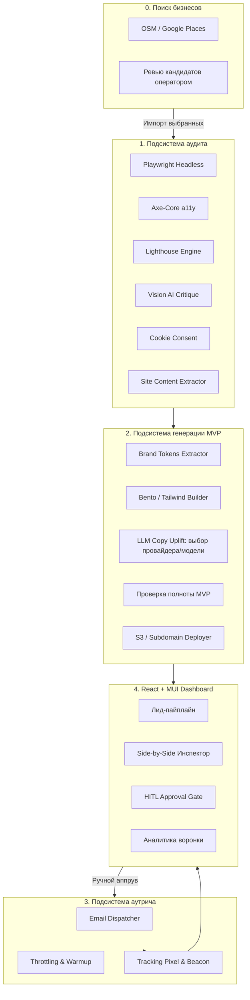

# SOFTWARE REQUIREMENTS SPECIFICATION (SRS)
## Спецификация требований к программному обеспечению SaaS-системы автоматизированного аудита сайтов локального бизнеса, генерации брендовых MVP-редизайнов и персонализированного аутрича (Revamp SaaS)

---

## 1. ОБЩИЕ СВЕДЕНИЯ

### 1.1. Полное наименование системы
**«SaaS-платформа автоматизированного аудита сайтов, генерации брендовых MVP и холодного аутрича с подтверждением человеком (Human-In-The-Loop)»**  
Краткое рабочее наименование: **Revamp SaaS**.

### 1.2. Назначение документа
Настоящая Спецификация требований к программному обеспечению (Software Requirements Specification, SRS) устанавливает исчерпывающий перечень требований к архитектуре, функциональности, техническим характеристикам, безопасности, интерфейсам и этапам реализации SaaS-системы. Документ служит основанием для проектирования, разработки, тестирования и приёмки программного комплекса.

### 1.3. Глоссарий и сокращения
* **SaaS (Software as a Service):** Модель предоставления ПО в виде облачного сервиса.
* **HITL (Human-in-the-Loop):** Архитектурный паттерн, требующий обязательного участия и подтверждения оператора-человека перед выполнением критических действий (в данном случае — отправка писем клиентам).
* **MVP (Minimum Viable Product):** В контексте системы — сгенерированная демонстрационная интерактивная версия веб-сайта клиента с современным дизайном.
* **a11y (Accessibility):** Цифровая доступность веб-интерфейсов для пользователей с ограниченными возможностями по стандарту WCAG 2.1 Level AA.
* **Lighthouse / Core Web Vitals:** Набор метрик веб-производительности от Google (LCP, INP, CLS, FCP).
* **DOM (Document Object Model):** Программное представление структуры HTML-документа.
* **MUI:** Библиотека компонентов интерфейса Material UI для React.
* **Бренд-токены (Design Tokens):** Набор ключевых дизайн-параметров сайта (цветовая палитра, гарнитуры шрифтов, логотип, радиусы скругления).
* **Dwell Time:** Время удержания внимания посетителя на странице сгенерированного MVP-демо.

---

## 2. НАЗНАЧЕНИЕ И ЦЕЛИ СОЗДАНИЯ СИСТЕМЫ

### 2.1. Бизнес-цель
Автоматизация полного цикла B2B-продаж услуг веб-разработки и редизайна для агентств и студий: от обнаружения устаревших сайтов локальных бизнесов до подготовки интерактивного решения «под ключ» и доставки персонального коммерческого предложения с конверсией в отклик (Reply Rate) от 15%.

### 2.2. Задачи системы
1. Автоматический глубокий аудит любого входящего URL без участия человека за время не более 45 секунд.
2. Синтез полноценного одностраничного MVP-лендинга, визуально превосходящего исходный сайт, с сохранением фирменной айдентики бизнеса (логотипы, цвета, контакты, услуги).
3. Автоматическое составление персонализированного коммерческого предложения с демонстрацией ошибок «до» и прототипа «после».
4. Предоставление оператору удобного интерфейса (React + MUI) для инспекции, точечного редактирования и ручного аппрува отправки писем.
5. Отслеживание открытия писем, переходов по ссылкам и поведенческих факторов клиентов на демонстрационной странице.
6. Поиск локальных бизнесов по нише и локации на картах (OpenStreetMap, Google Places) с ревью и выборочным импортом кандидатов оператором.

---

## 3. ТРЕБОВАНИЯ К ПОДСИСТЕМАМ И ФУНКЦИОНАЛУ

Система функционально делится на 6 основных подсистем:
0. **Подсистема поиска локальных бизнесов (Discovery)** — см. §3.6.
1. **Подсистема сбора данных и аудита (Audit Agent).**
2. **Подсистема генерации брендовых MVP (MVP Redesign Generator).**
3. **Подсистема почтового аутрича и трекинга (Outreach & Tracking Engine).**
4. **Пользовательский интерфейс оператора (React + MUI Dashboard).**
5. **Серверная инфраструктура и очереди (Node.js/Express + MongoDB + BullMQ/Redis).**


```mermaid
graph TD
    subgraph S0 [0. Поиск бизнесов]
        Maps[OSM / Google Places]
        Review[Ревью кандидатов оператором]
    end

    subgraph S1 [1. Подсистема аудита]
        Playwright[Playwright Headless]
        Axe[Axe-Core a11y]
        LH[Lighthouse Engine]
        Vision[Vision AI Critique]
        Consent[Cookie Consent]
        SiteContent[Site Content Extractor]
    end

    subgraph S2 [2. Подсистема генерации MVP]
        Extractor[Brand Tokens Extractor]
        Tailwind[Bento / Tailwind Builder]
        AI_Copy[LLM Copy Uplift: выбор провайдера/модели]
        Completeness[Проверка полноты MVP]
        Hosting[S3 / Subdomain Deployer]
    end

    subgraph S4 [4. React + MUI Dashboard]
        Kanban[Лид-пайплайн]
        Inspector[Side-by-Side Инспектор]
        HITL_Gate[HITL Approval Gate]
        AnalyticsUI[Аналитика воронки]
    end

    subgraph S3 [3. Подсистема аутрича]
        MailQueue[Email Dispatcher]
        Warmup[Throttling & Warmup]
        Pixel[Tracking Pixel & Beacon]
    end

    S0 -->|Импорт выбранных| S1
    S1 --> S2
    S2 --> S4
    S4 -->|Ручной аппрув| S3
    S3 --> Pixel
    Pixel --> S4
```

---

### 3.1. Подсистема сбора данных и аудита (Audit Agent)

#### 3.1.1. Модуль рендеринга и захвата артефактов
* **Требование 3.1.1.1:** Система должна использовать Headless Chromium (Playwright) с поддержкой выполнения JavaScript и эмуляцией мобильных и десктопных устройств.
* **Требование 3.1.1.2:** Фиксация скриншотов:
  - Десктоп: разрешение $1440 \times 900$ пикселей (полная страница и первый экран Above-the-fold).
  - Мобильный экран: разрешение $375 \times 812$ пикселей (эмуляция мобильного устройства).
* **Требование 3.1.1.3:** Сохранение скриншотов в объектное хранилище (S3-совместимое) по ключу `screenshots/{leadId}/{desktop|mobile|desktop-full|mobile-full}.webp`.
* **Требование 3.1.1.4 (REV-21):** Полностраничные скриншоты десктопа и мобильной версии:
  - перед захватом страница прокручивается для подгрузки lazy-контента, а анимации появления при скролле принудительно показываются;
  - высота ограничена 12 000 (десктоп) и 8 000 (мобайл) CSS px, ширина ужимается до 1440 / 750 px без уменьшения высоты;
  - Vision LLM получает только скриншоты первого экрана.
* **Требование 3.1.1.5 (REV-33):** До первого скриншота в каждом контексте система закрывает cookie-баннер: через API известных платформ согласия (OneTrust, Cookiebot, Didomi, Quantcast, Usercentrics, CookieYes, Complianz, Osano, iubenda, Termly, TrustArc), затем по тексту кнопки «Принять» (en, pl, ru, be, lt, de, fr, uk; включая iframe), затем скрытием оставшегося оверлея. Бюджет шага — 3 с; шаг никогда не прерывает аудит. Мобильные Core Web Vitals снимаются до закрытия баннера, axe-core — после. Итог сохраняется в `Audit.cookieBannerHandled`.
* **Требование 3.1.1.6 (REV-23):** Детерминированное извлечение контента исходного сайта из DOM (без генерации): title, meta description, H1 и заголовки, абзацы, услуги с описаниями, навигация, отзывы, контентные изображения, адрес, часы работы, язык страницы и данные schema.org `LocalBusiness`/`Organization` (JSON-LD). Результат сохраняется в `Audit.extractedContent` и `Audit.extractedContacts` и служит единственным источником фактов для MVP.

#### 3.1.2. Модуль анализа доступности (Accessibility / a11y)
* **Требование 3.1.2.1:** Интеграция библиотеки `@axe-core/playwright` для автоматической проверки по стандарту **WCAG 2.1 Level AA**.
* **Требование 3.1.2.2:** Фиксация нарушений с сохранением точного CSS-селектора, описания проблемы и категории критичности (`critical`, `serious`, `moderate`, `minor`):
  - Контрастность текста по отношению к фону (минимальный порог 4.5:1 для обычного текста, 3:1 для крупного).
  - Отсутствие или пустое значение атрибутов `alt` у смысловых тегов ``.
  - Отсутствие явных меток `<label>` у полей ввода веб-форм.
  - Нарушение логической иерархии заголовков (`h1` отсутствует или используется несколько несвязанных `h1`).

#### 3.1.3. Модуль анализа веб-стандартов и производительности
* **Требование 3.1.3.1:** Запуск встроенного аудита Google Lighthouse в мобильной конфигурации со сбором следующих метрик:
  - **LCP (Largest Contentful Paint):** время отрисовки основного контента (в мс).
  - **CLS (Cumulative Layout Shift):** кумулятивный сдвиг макета.
  - **INP / TBT:** отзывчивость интерфейса при взаимодействии.
  - *Реализация (REV-99, REV-102):* Lighthouse не запускается (research.md, ADR 11). LCP и CLS снимаются в странице через буферизованный `PerformanceObserver` и хранятся в `Audit.webVitals` (до REV-102 — `lighthouseMetrics`; переименование выполняет `migrate:audit-vitals`); CLS — наибольшее окно сессии (разрыв < 1 с, окно ≤ 5 с) без сдвигов после ввода. Отсутствие записи LCP — ошибка измерения, а не подстановка FCP. INP/TBT и Speed Index не собираются и не хранятся (REV-105: прежний `speedIndex` был временем `loadEventEnd` или LCP × 1,1, а не измерением).
* **Требование 3.1.3.2:** Проверка технических стандартов:
  - Наличие валидного SSL-сертификата (протокол HTTPS).
  - Наличие тега `<meta name="viewport">` с корректными параметрами масштабирования.
  - Наличие фавикона (`favicon.ico` / `.png` / `.svg`).
  - Наличие микроразметки Schema.org (`LocalBusiness`, `Organization`) и OpenGraph.
  - *Реализация (REV-102):* HTTPS — по URL аудита; viewport — `<meta name="viewport">` с непустым `content`; title — непустой `<title>`; фавикон — `<link rel="icon">` / `apple-touch-icon` с `href` или `/favicon.ico` на итоговом origin, отвечающий 2xx не-HTML телом в течение 3 с; Schema.org — JSON-LD с `@type` (включая `@graph`) или микроданные `itemtype` schema.org; OpenGraph — хотя бы один непустой `meta[property^="og:"]`. Баллы: HTTPS 30, viewport 30, title 10, фавикон 10, Schema.org 10, OpenGraph 10. Результат каждой проверки хранится в `Audit.standardsChecks`; если страницу прочитать не удалось, проверок нет, а в `measurementErrors` записывается `standards` (3.1.5.3).

#### 3.1.4. Мультимодальный AI-анализ визуального дизайна (Vision UX/UI Critique)
* **Требование 3.1.4.1:** Отправка десктопного и мобильного скриншотов первого экрана в мультимодальную нейросетевую модель.
* **Требование 3.1.4.2:** Формирование структурированного ответа в формате JSON, содержащего:
  - Оценку визуальной иерархии ($0-100$).
  - Наличие и заметность главного целевого действия (CTA-кнопки).
  - Список устаревших дизайн-признаков (Dated UI: мелкие нечитаемые шрифты, устаревшие градиенты, перегруженность текстом).
  - Перечень ровно 3 критических недостатков дизайна с точки зрения потенциального клиента бизнеса.
  - Перечень ровно 3 точек быстрого роста (Quick Wins).

#### 3.1.5. Расчет интегрального скоринга (Composite Scoring Engine)
* **Требование 3.1.5.1:** Вычисление итогового рейтинга качества сайта по формуле:
  $$\text{Score}_{\text{Total}} = (0.35 \times S_{\text{Design}}) + (0.25 \times S_{\text{Performance}}) + (0.20 \times S_{\text{A11y}}) + (0.20 \times S_{\text{Standards}})$$
* **Требование 3.1.5.2:** Градация состояния сайта:
  - $0 - 49$: Критическое состояние (высокий приоритет для холодного письма).
  - $50 - 74$: Требует модернизации.
  - $75 - 100$: Современный сайт (отправка предложения не рекомендуется).
* **Требование 3.1.5.3 (REV-100):** Ошибка измерения никогда не заменяется фиксированным значением. Если не удалось снять Core Web Vitals (или страница не дала записи LCP), стандарты или axe-core, аудит завершается со статусом `COMPLETED`, но соответствующие значения отсутствуют, а в `Audit.measurementErrors` записывается `{ measurement: 'performance' | 'accessibility' | 'standards', message }`. Итоговая оценка считается по измеренным критериям с перенормировкой весов. Дашборд на шаге «Аудит» показывает «—» вместо числа и предупреждение с причиной; в письмо неизмеренная метрика не попадает. Если аудит не удался целиком (навигация, недоступный домен), аудит получает `FAILED` с `errorMessage`, а лид — `AUDIT_FAILED` после последней попытки (REV-44).
* **Требование 3.1.5.4 (REV-101):** Если Vision-модель не дала валидной критики за все попытки, детерминированный шаблон критики сохраняется для чтения оператором, но не считается измерением: `scores.design` отсутствует, критерий дизайна исключается из итоговой оценки (перенормировка весов по 3.1.5.3), а в `Audit.measurementErrors` записывается `{ measurement: 'design', message }` с провайдером, числом попыток и последней ошибкой (до 200 символов). Дашборд на шаге «Аудит» помечает критические недостатки как шаблон, показывает «—» вместо оценки mobile-friendliness и перечисляет дизайн среди неизмеренного. Признак шаблона — эта ошибка, а не `Audit.aiFallbackUsed` (его дописывает и генерация MVP). Если не измерен ни один критерий (сбой vitals и axe-core при шаблонной критике), оценки нет, и аудит завершается ошибкой, а не выдуманной суммой.

#### 3.1.6. Сбой аудита (REV-44)
* **Требование 3.1.6.1:** Пока у задачи аудита остаются ретраи (3 попытки, экспоненциальный откат), лид остается в `AUDITING`. После последней неудачной попытки лид переходит в `AUDIT_FAILED`, а причина записывается в `Lead.auditError` и в `Audit.errorMessage`.
* **Требование 3.1.6.2:** Постоянные ошибки навигации (`net::ERR_NAME_NOT_RESOLVED`, `net::ERR_CERT_*`, `net::ERR_INVALID_URL`) не повторяются: задача сразу завершается (`UnrecoverableError`), а лид переходит в `AUDIT_FAILED`. Временные ошибки (падение браузера, таймаут) повторяются.
* **Требование 3.1.6.3:** Причина сбоя хранится одной читаемой строкой длиной до 300 символов: без ANSI-кодов Playwright, call log и лога запуска браузера (`sanitizeAuditError` из `@revamp/validation`).
* **Требование 3.1.6.4:** `POST /api/v1/audits/trigger` для лида в `AUDIT_FAILED` возвращает его в `QUEUED`, очищает `auditError` и ставит новый аудит в очередь. Новый запуск аудита тоже очищает `auditError`. Аудит запускается только для лида в `QUEUED` или `AUDIT_FAILED`; для остальных статусов — `409 LEAD_NOT_AUDITABLE`, лид не меняется и аудит не создается (REV-62).

---

### 3.2. Подсистема генерации брендовых MVP (MVP Redesign Generator)

#### 3.2.1. Экстракция бренд-токенов (Brand DNA Extractor)
* **Требование 3.2.1.1:** Алгоритм должен парсить вычисленные стили (`Computed CSS`) и атрибуты элементов оригинального сайта для извлечения:
  - Основной фирменный цвет (Primary Color) — извлекается из хедера, главных кнопок и логотипа.
  - Вторичный и акцентный цвета (Secondary, Accent).
  - Шрифт заголовков и основного текста (гарнитура, тип: Serif / Sans-Serif).
* **Требование 3.2.1.2:** Извлечение логотипа:
  - Поиск в DOM-дереве тегов `header img`, `a[href="/"] img`, тегов `<svg>` внутри навигации, ссылок `apple-touch-icon`.
  - В случае невозможности извлечения чистого логотипа — автоматическое создание стильного текстового логотипа на базе шрифтовой пары.
* **Требование 3.2.1.3:** Извлечение фактуры бизнеса (Structured Entity Extraction):
  - Номер телефона (валидация по маске), адрес электронной почты, физический адрес, режим работы.
  - Список ключевых услуг с оригинального сайта (до 6 основных направлений).
  - Список реальных преимуществ или отзывов (при наличии).
  - Приоритет источников контактов: schema.org JSON-LD > текстовые эвристики > совпадения по CSS-классам (последние — только при наличии цифр). Физический адрес не записывается в поле `city` лида.
* **Требование 3.2.1.4 (REV-23):** Бледный или белый основной цвет заменяется читаемым фирменным цветом или затемняется до контраста не менее 3:1 (исключает белые кнопки на белом фоне).

#### 3.2.2. Генерация структуры и контента лендинга
* **Требование 3.2.2.1:** Генерация кода должна производиться на базе современных дизайн-паттернов (Bento-сетка, скругления, микро-взаимодействия, чистая типографика на Tailwind CSS).
* **Требование 3.2.2.2:** Обязательный состав блоков MVP:
  1. **Sticky Header:** Фирменный логотип, телефон для звонка в 1 клик, кнопка целевого действия «Записаться / Консультация».
  2. **Hero-секция:** Усиленный оффер (AI Copywriting) с фокусом на выгоду клиента, форма быстрого захвата, плашки доверия (рейтинг на картах 4.9+).
  3. **Блок ключевых услуг (Bento Grid):** Интерактивные карточки с иконками и описанием основных услуг, спарсенных с исходного сайта.
  4. **Блок социального доказательства (Social Proof):** Отзывы клиентов, гарантии или сертификаты.
  5. **Интерактивная форма захвата / Калькулятор:** Позволяет посетителю совершить тестовое действие.
  6. **Футер:** Контакты, график работы, гео-метка, ссылка «Прототип создан платформой Revamp».
* **Требование 3.2.2.3:** LLM-усиление текстов (Copywriting Uplift): адаптация исходных формулировок под современные маркетинговые стандарты без искажения фактических данных (названий услуг, цен и контактных телефонов).
* **Требование 3.2.2.4 (REV-23):** Блоки MVP с фактическими данными (кнопка звонка, плашки доверия, отзывы, часы работы, контакты, соцсети, галерея) отображаются только при наличии данных, извлеченных с исходного сайта. Выдуманные значения по умолчанию (телефоны, адреса, отзывы, метрики) запрещены. Плашки доверия допускаются только с числами, которые буквально есть на исходном сайте.
* **Требование 3.2.2.5 (REV-54):** MVP рендерится в одном из четырех макетов (`bento`, `split`, `editorial`, `compact`), который детерминированно выбирается по данным аудита (ниша, число изображений и услуг, объем текста, класс сложности сайта REV-38). Выбор (`variant` и коды причин) валидируется Zod (`MvpLayoutSelectionSchema`) и сохраняется в `MvpProject.layout`; `BentoTemplateDataSchema.layout` принимает только эти значения. Макет меняет только разметку и порядок блоков: состав фактических данных (контакты, услуги, отзывы, изображения) во всех макетах одинаков, а отсутствие `layout` означает исходный Bento-макет. Оператор может сменить макет вручную (REV-84, требование 3.4.3.2); тогда коды причин начинаются с `rule:manual`.
* **Требование 3.2.2.5a (REV-104):** Макет MVP выводится из структуры главной страницы оригинала. Аудит детерминированно (Playwright/DOM, без LLM) читает секции ниже первого экрана по порядку (`services`, `pricing`, `gallery`, `about`, `team`, `reviews`, `faq`, `contact`, `map`, `other`), устройство первого экрана, шапку и плотность и сохраняет их в `Audit.siteLayout` (Zod `SiteLayoutSchema`); если структуру прочитать нельзя, сохраняется `Audit.siteLayoutError`, а структура не придумывается. MVP следует порядку секций, устройству первого экрана, шапке и плотности оригинала через спецификацию дизайна (`MvpProject.layout.design`, коды причин с `rule:derived`), переставляя только проверенный контент. Тот же аудит всегда дает тот же макет. Без прочитанной структуры макет выбирается по правилам 3.2.2.5 с кодом `site_layout:unread`, и дашборд это показывает. Выбор макета оператором, свой дизайн и перегенерация сохраняют выведенный вид.
* **Требование 3.2.2.5b (REV-109):** Аудит детерминированно (Playwright/DOM, без LLM) читает главную страницу оригинала по секциям: шапку, блоки, размеченные обходом REV-104 (`data-revamp-block`), и подвал. Для каждой секции сохраняются роль (`header`, `hero`, `content`, `footer`), вид (`SITE_SECTION_KINDS`, в том числе новый `features` — «почему мы»), расположение (`banner`, `media-beside-text`, `text`, `card-grid` с числом колонок, `list`, `accordion`, `tabs`, `slider`, `gallery`, `embed`), вступление (надзаголовок, заголовок и его уровень, абзацы, ссылки), повторяющиеся элементы (название, подзаголовок, текст дословно, фото, цена как написана, рейтинг 0..5, ссылки), прочий текст, фото, встраивания (карта, видео, форма, виджет) и измеренный стиль (цвета в hex, выравнивание, отступы, доля фото). Результат валидируется `SiteSectionsSchema` с лимитами `SITE_SECTIONS_LIMITS` и хранится в `Audit.siteSections`; ничего не отбрасывается без причины (`skipped` с `noise`, `empty`, `duplicate`, `cap`), а `coverage` показывает долю текста страницы в секциях. Если прочитать нельзя (обход REV-104 не удался, ошибка или таймаут 15 с), сохраняется `Audit.siteSectionsError`, аудит не падает. Следующий шаг — перестройка MVP по этим секциям (3.2.2.5c). Правила чтения REV-110: короткая подпись прямо над заметно более крупным заголовком (шрифт не менее 1,25×, до 60 символов) — надзаголовок; подписи и кнопка формы не попадают в текст секции; скрытый блок, текст которого страница показывает в другом месте (вариант под другой размер экрана), пропускается, а скрытый текст без дубликата (ответы аккордеона, вкладки, слайды) сохраняется; глифы иконочных шрифтов, стрелки и точки слайдера и текст только для скринридеров отбрасываются; верхняя полоса над шапкой читается вместе с шапкой; у слайда фото есть `backgroundImage` элемента.
* **Требование 3.2.2.5d (REV-113):** На каждом аудите Vision-модель группирует главную страницу на шапку, секции и подвал **только по id** кусков контура страницы (`SiteGroupingAnswerSchema`: id, вид и расположение, без строк); модель может группировать и классифицировать куски по id, но никогда не пишет текст или разметку — весь текст копируется со страницы. Чтение хранится в `Audit.siteSections` той же формы с полем `source` (`llm` или `rules`, `SITE_SECTIONS_SOURCES`; у чтений до REV-113 поля нет). Куски, которые модель никуда не положила, попадают в `skipped` с новой причиной `unassigned` и не считаются захваченными, поэтому `coverage` показывает потерю. Если провайдер не настроен, вызов упал, ответ дважды невалиден (неизвестный или повторный id, секция без заголовка, логотип не изображение) или чтение модели не проходит `rebuildEligibility`, когда чтение правилами проходит, сохраняется чтение правилами (`source: 'rules'`), а в `Audit.measurementErrors` пишется новое измерение `sections` (`AUDIT_MEASUREMENTS`) с причиной; оно не входит в оценку, и шаг «Аудит» показывает его отдельной строкой «Секции страницы прочитаны правилами», вне предупреждения об оценке. Аудит из-за группировки не падает. Перестройка (3.2.2.5c) читает `Audit.siteSections` независимо от `source`.
* **Требование 3.2.2.5c (REV-110):** По умолчанию MVP рендерится как перестройка главной страницы оригинала — вариант макета `original` (`MVP_LAYOUT_VARIANTS`: `original`, `bento`, `split`, `editorial`, `compact`). Без LLM и без выдумывания: одна секция на каждую секцию `Audit.siteSections` в исходном порядке, с тем же расположением и дословным текстом; ссылки на другие страницы отбрасываются и записываются, призывы к действию и хосты записи ведут на `#booking`, допустимы только `https`-встраивания из списка (Google Maps, OpenStreetMap, YouTube, Vimeo), форма оригинала заменяется формой записи (иначе она добавляется перед подвалом), подвал заканчивается проверенными контактами. Настройка детерминирована и записывается кодами: контраст текста не ниже 4,5:1 (`contrast:<i>`), затемнение фото под текстом (`overlay:<i>`), `alt` только из оригинала, названия элемента или заголовка секции (`alt:<n>`), шрифт тела не менее 16 px (`font:body-16`), межстрочный интервал не менее 1,5, системные шрифтовые стеки, отступы секций 48–120 px, свернутый в `<details>` текст длиннее 1200 знаков (`collapse:<i>`), единственный `h1` (`h1:hidden`, если у первого экрана нет заголовка). **Возврат к Bento:** если `rebuildEligibility` не проходит (`rebuild:unread` — секции не прочитаны; `rebuild:no_content` — нет секции `hero`/`content`; `rebuild:low_coverage` — покрытие текста `coverage.ratio` меньше `REBUILD_MIN_COVERAGE` = 0,85, значение 0,85 проходит; `rebuild:flat` (REV-112) — чтение слишком плоское: на странице не короче `REBUILD_FLAT_MIN_PAGE_CHARS` = 1500 знаков одна секция `hero`/`content` держит больше `REBUILD_MAX_SECTION_SHARE` = 0,5 текста секций, либо заголовок есть меньше чем у `REBUILD_MIN_HEADING_SHARE` = 0,25 секций `hero`/`content`; факты `flat:share=<n>` и `flat:headings=<h>/<n>`, текст считается `siteSectionChars`, как и покрытие) либо план не проходит `RebuildPlanSchema` (`rebuild:invalid`) или HTML больше 300 КБ (`rebuild:too_large`), MVP рендерится шаблоном Bento, а код причины ставится первым в `layout.reasons`; чип макета показывает причину предупреждением. Итог сохраняется в `MvpProject.rebuild` (покрытие, число секций, пропуски с причиной, коды настройки) и снимается при Bento-рендере. Ручной выбор `original` сохраняется с `rule:manual` (при возврате к Bento — с маркером `manual:original`, чтобы следующая генерация снова попробовала перестройку). Изменение своими словами и свой дизайн для перестроенного MVP работают через отдельную правку перестройки (REV-111, `IRebuildEdit` в `MvpProject.rebuildEdit`): только id секций (`s-<index>`) для порядка и скрытия, id кусков (`s-<i>.t<n>` абзац, `.i<n>` элемент, `.x<n>` доп. блок) для удаления, фон / выравнивание / плотность секции из фиксированных значений, шрифт / плотность / скругления / регистр заголовков темы и `customCss` через тот же санитайзер. Модель не пишет текст страницы; сокращение — удаление целых абзацев и элементов по id; просьба, требующая нового текста, ничего не меняет и объясняется в `summary`. Нельзя скрыть все секции, а также скрыть или сдвинуть с первого места секцию с `h1` страницы. Правка привязана к аудиту (`auditId`): правка для другого аудита не применяется, а перегенерация по новому аудиту ее снимает. «Сбросить свой дизайн» на перестройке снимает `rebuildEdit`, на Bento — `design`. Каждая повторная публикация (правка, палитра, макет, сброс) пересчитывает отчет полноты кодом, без LLM.
* **Требование 3.2.2.5e (REV-114):** У перестройки два уровня (`REBUILD_LEVELS`): `faithful` (как в REV-110/111) и `modern` — те же секции, абзацы, порядок и цвета бренда, но современный вид: первый экран из `h1` и фото, фото на всю ширину колонки с чередованием сторон, текст по левому краю на белой странице с тонированными полосами, серии коротких абзацев и списки из 3 и более элементов карточками, современная шкала шрифтов (`h1` 56, `h2` 36, текст не меньше 17 px). Устаревший вид определяет код при аудите (`Audit.siteEra`, без LLM): взвешенная сумма признаков `SITE_DATED_SIGNS` (вес 2: `table_layout`, `no_viewport`, `frames`, `flash`, `narrow_fixed` — медианная ширина размеченных блоков не больше 1000 px на 1440 px и меньше половины блоков на всю ширину; вес 1: `legacy_tags`, `default_font` — по шрифту тела, `old_jquery`, `stale_copyright`), порог `SITE_DATED_THRESHOLD` = 3; сайт, который не удалось проверить, получает `Audit.siteEraError`, а не вердикт, и остается `faithful`. Уровень хранится в `layout.rebuildLevel` (только у `original`; нет значения — `faithful`) с причинами `modernize:dated` + `dated:<балл>`, `modernize:manual` (выбор оператора) и `modernize:default`; ручной уровень переживает перегенерацию, но не переносится через возврат к Bento. Вид выбирает отдельный текстовый вызов модели по id (`RebuildModernizeService`, без скриншотов, один раз на аудит при первой `modern`-отрисовке): модель отвечает только id и фиксированными значениями (`RebuildModernizeAnswerSchema` — подмножество `IRebuildEdit` без `order`, `hidden`, `dropped`, `customCss`), ответ проверяют Zod и `checkRebuildEdit`, отклоненный ответ повторяется один раз; без провайдера, при сбое вызова или двух отклонениях берется детерминированный `defaultModernDesign` (`modernize:default`). Результат — `MvpProject.modernize` (по аудиту; снимается при перегенерации по новому аудиту, пересчитывается, если сохраненный вид был запасным из-за `call_failed` / `not_configured`). Новые поля словаря правки (доступны и оператору): `sections[id].arrangement` (`card-grid` | `list` только там, где содержимое подходит: серия от 3 абзацев до 300 знаков, `card-grid` для списка от 3 элементов), `mediaSide`, `media` (`natural` | `fill`), `hero { photo: s-<i>.m<n>, style: split | banner }` (у секции с `h1` нет своего фото; фото переносится, а не копируется; `banner` — фото не уже 1000 px; без своей ссылки у первого экрана появляется призыв к записи) и `theme.typeScale`. Правка оператора поверх вида модели побеждает по полю (`mergeRebuildEdits`); без вида план прежний. Без модели никакого текста не появляется, а при непроходящем `rebuildEligibility` модель не вызывается. Уровень переключается в «Инструментах дизайна» (Исходный / Модернизированный); `PATCH /mvp/:id/layout { variant, level? }` — `level` только с `original` (иначе `400`), те же `409`. Сброс своего дизайна сохраняет уровень и вид.
* **Требование 3.2.2.5 (REV-25):** MVP генерируется на языке исходного сайта: LLM пишет тексты на языке `outputLanguage` (тег `lang` сайта или язык его текста), `<html lang>` содержит BCP 47-тег сайта, фиксированный UI-текст шаблона и детерминированный fallback локализованы для en, ru, be, pl, lt (для других языков — английский UI).
* **Требование 3.2.2.6 (REV-34):** Системный промпт явно задает лимит длины каждого поля; перед Zod-валидацией строки обрезаются до лимитов схемы по границе слова, чтобы одно длинное поле не приводило к fallback.
* **Требование 3.2.2.7 (REV-30, REV-32):** Оператор выбирает LLM-провайдера и модель для каждой генерации:
  - каталог: Anthropic API, OpenAI API, Google Gemini API и локальный Claude Code CLI;
  - доступность каждого варианта определяется воркерами (задан ли API-ключ, найден ли бинарник `claude`) и отдается `GET /api/v1/mvp/providers`; при отсутствии свежего отчета воркеров все варианты недоступны;
  - при сбое выбранного провайдера используется только детерминированный fallback, без переключения на другого платного провайдера;
  - если провайдер не настроен или у него нет API-ключа, генерация завершается ошибкой с понятным сообщением (REV-45), а не выдуманными текстами;
  - в `MvpProject` сохраняются выбранные и фактически использованные провайдер и модель.

#### 3.2.3. Сборка, публикация и визуальное сравнение
* **Требование 3.2.3.1:** Сборка в легковесный автономный HTML/CSS-бандл (размер страницы не более 350 Кб без тяжелых внешних зависимостей).
* **Требование 3.2.3.2:** Встраивание в страницу трекинг-скрипта `revamp-tracker.js` для сбора поведенческих метрик.
* **Требование 3.2.3.3:** Автоматическая публикация на изолированный поддомен (например, `https://preview.revamp.io/v/{slug}`).
* **Требование 3.2.3.4:** Автоматический рендеринг и скриншотирование сгенерированного лендинга через Playwright для создания сравнительного коллажа «До / После» ($1200 \times 630$ пикселей).

#### 3.2.4. Проверка полноты MVP (REV-36, REV-37)
* **Требование 3.2.4.1:** После рендеринга и до перевода лида в `NEEDS_APPROVAL` система сравнивает HTML MVP с данными, извлеченными на аудите, без повторного краулинга. Проверяемые поля и уровни важности:
  - `critical`: название бизнеса, телефон, e-mail, адрес;
  - `important`: часы работы, услуги, соцсети;
  - `informational`: логотип, изображения, отзывы, рейтинг, год основания.
* **Требование 3.2.4.2:** Статус каждого поля: `present`, `missing`, `altered`, `not_in_source` или `unsourced` (контакт в MVP, отсутствующий на исходном сайте). Телефон и e-mail считаются `present` только при наличии и текста, и ссылки `tel:`/`mailto:`.
* **Требование 3.2.4.3:** При включенной настройке `MVP_COMPLETENESS_LLM` поля оценивает LLM; каждый вердикт `present`/`altered` обязан содержать дословную цитату из MVP. Код принимает вердикт, только если цитата найдена в тексте, ссылках или URL изображений MVP; `missing` от LLM не перекрывает совпадение, найденное кодом. Статус `not_in_source` и итоговый балл (0–100, веса 3/2/1 по уровням) всегда вычисляет код.
* **Требование 3.2.4.4:** При отсутствии провайдера, таймауте, ошибке провайдера или невалидном ответе после одного повтора используется сравнение только кодом с сохранением причины (`llmError`). Сбой самого сравнения сохраняется как отчет `unverified` и не прерывает генерацию.
* **Требование 3.2.4.5:** Отчет валидируется Zod, сохраняется в `MvpProject.completenessReport` с указанием метода (`llm`/`deterministic`), модели и того, кто решил по каждому полю (`judgedBy`), и пересчитывается при каждой перегенерации. Отчет рекомендательный: он не одобряет, не блокирует и не отправляет письма.

#### 3.2.5. Перегенерация MVP (REV-31)
* **Требование 3.2.5.1:** Первая генерация доступна из статуса `AUDITED`; перегенерация — из `NEEDS_APPROVAL` и только с флагом `forceRegenerate`. После постановки письма в отправку (`SCHEDULED` и далее) и во время текущей генерации API отвечает `409`.
* **Требование 3.2.5.2:** Перегенерация всегда создает новые тексты, перезаписывает MVP по прежнему `previewSlug` (ранее отправленная ссылка остается рабочей, `Cache-Control: no-cache`) и обновляет единственный `MvpProject` лида (`generatedAt`, `generationCount`).
* **Требование 3.2.5.3:** Лид остается в `GENERATING`, пока новое превью не опубликовано. После исчерпания ретраев лид возвращается в `AUDITED` (первая генерация) или `NEEDS_APPROVAL` (предыдущий MVP сохранен), а причина записывается в `Lead.generationError` и показывается оператору.
* **Требование 3.2.5.4 (REV-53):** Пока MVP перегенерируется, превью в инспекторе закрыто анимированным оверлеем (градиент, сканирующая полоса, пульсирующий значок, текст «ИИ пересобирает MVP»). Оверлей появляется сразу по подтверждению перегенерации и держится, пока лид в `GENERATING` и пока iframe не загрузит новую версию. Если перегенерация упала (URL превью не изменился) или новая версия не загрузилась за 20 с, оверлей исчезает сам. Он не меняет `sandbox` iframe и не мешает работе с остальным инспектором.

---

### 3.3. Подсистема почтового аутрича и трекинга (Outreach Engine)

#### 3.3.1. Генерация персонального коммерческого предложения
* **Требование 3.3.1.1:** Шаблонизация писем на базе результатов аудита:
  - Тема письма: динамическая подстановка имени бизнеса и конкретной найденной проблемы (например: *«Ошибка в мобильной версии {{businessName}} + готовый прототип решения»*).
  - Тело письма (HTML + Plain Text альтернатива):
    - Приветствие с персонализацией по имени владельца (если найдено) или названию компании.
    - 2–3 конкретных критических тезиса аудита (с цифрами LCP, скорингом a11y).
    - Встроенное визуальное сравнение (оптимизированное изображение сплит-экрана «До/После»).
    - Прямая персональная ссылка на просмотр интерактивного прототипа.
    - Отсутствие спам-триггеров и агрессивных продаж.

#### 3.3.2. Защита доставляемости и репутации доменов (Deliverability)
* **Требование 3.3.2.1:** Поддержка пула отправляющих почтовых ящиков с ротацией.
* **Требование 3.3.2.2:** Троттлинг: отправка не более 1 письма в $180$ секунд с одного аккаунта. Максимальный суточный лимит — не более 35 писем на один домен.
* **Требование 3.3.2.3:** Наличие рандомизированного интервала (Jitter: от 15 до 45 секунд) между запланированными отправками.
* **Требование 3.3.2.4:** Автоматическая валидация MX-записей домена получателя перед отправкой.
* **Требование 3.3.2.6:** Каждое одобренное письмо отправляется не больше одного раза и только с темой и телом, которые одобрил оператор (REV-61). `POST /outreach/:id/approve` требует `subject` и `body` (иначе `400`). Воркер захватывает кампанию (`SCHEDULED` → `SENDING`) перед отправкой, ретраи не отправляют письмо повторно, а без одобренной кампании или с пустым текстом задача падает без отправки.
* **Требование 3.3.2.5:** Наличие в заголовках и теле письма корректной ссылки отписки (`List-Unsubscribe`, `One-Click Unsubscribe`) на `{PUBLIC_API_URL}/track/unsubscribe/{trackingToken}` (REV-73):
  - `GET` показывает страницу подтверждения с кнопкой «Unsubscribe» и ничего не меняет: почтовые сканеры заранее открывают все ссылки письма (RFC 8058 §3.2).
  - `POST` (one-click от почтового клиента с телом `List-Unsubscribe=One-Click` или кнопка подтверждения) переводит лид и `EmailCampaign` в `UNSUBSCRIBED`, пишет `unsubscribedAt` и одно событие `unsubscribe`; ответ `200`. Повторный вызов идемпотентен.
  - Неизвестный токен (в т.ч. `test-send` тестовой отправки) — `404` без изменений.
  - Одобрение (`409 LEAD_NOT_AWAITING_APPROVAL`) и email worker (HITL-гейт) отказывают лиду в `UNSUBSCRIBED`; открытия, клики и события демо не выводят лид из этого статуса.

#### 3.3.3. Трекинг вовлеченности (Analytics & Telemetry)
* **Требование 3.3.3.1:** Трекинг открытия письма через уникальный прозрачный GIF-пиксель $1 \times 1$ (`/api/v1/track/open/{trackingToken}.gif`).
* **Требование 3.3.3.2:** Трекинг кликов по ссылке с редиректом через сервис-прокси (`/api/v1/track/click/{trackingToken}`).
* **Требование 3.3.3.3:** Трекинг активности на странице MVP через Beacon API:
  - Время нахождения на странице (Dwell Time в секундах).
  - Глубина скролла страницы (25%, 50%, 75%, 100%).
  - Клики по интерактивным кнопкам в прототипе («Записаться», «Позвонить»).

---

### 3.4. Пользовательский интерфейс оператора (React + Material UI Dashboard)

Интерфейс строится на React 18+, Material UI (MUI v6) и реализует строгий паттерн **Human-In-The-Loop**.

```
+---------------------------------------------------------------------------------------------------+
| REVAMP DASHBOARD    [Поиск лида / домена...]          [Фильтр: Ниша v] [Статус v]   [Оператор (Admin)]|
+---------------------+-----------------------------------------------------------------------------+
| Навигация:          | ВОРОНКА ЛИДОВ (KANBAN & DATAGRID ПЕРЕКЛЮЧАТЕЛЬ)                             |
| [*] Воронка лидов   | +-----------------+-----------------+-----------------+-------------------+ |
| [ ] Все аудиты      | Очередь (5)       | Аудит/Ген (2)   | НА РЕВЬЮ [!] (8)| Отправлено (24)   | |
| [ ] Шаблоны писем   | dental-pro.ru     | stroy-dom.ru    | >> auto-fix.ru  | beauty-spa.ru     | |
| [ ] Аналитика       | law-center.com    | clean-city.ru   | legal-group.ru  | stomatolog-msk.ru | |
| [ ] Настройки SMTP  +-----------------+-----------------+-----------------+-------------------+ |
|                     |                                                                             |
|                     | ОКНО РЕВЬЮ И ПОДТВЕРЖДЕНИЯ (HITL APPROVAL MODAL):                           |
|                     | +--------------------------------------+----------------------------------+ |
|                     | | 1. ИСХОДНЫЙ САЙТ (Оценка: 41/100)    | 2. НОВЫЙ MVP (Интерактивный)     | |
|                     | | [Скриншот: Неадаптивный хедер]       | [ <iframe> с переключателем:     | |
|                     | | - Скорость LCP: 4.9 сек              |   Mobile / Tablet / Desktop ]    | |
|                     | | - Ошибок a11y: 18 шт                 | Фирменный цвет: [#1E40AF] (Edit) | |
|                     | +--------------------------------------+----------------------------------+ |
|                     | | 3. ЧЕРНОВИК ПИСЬМА КЛИЕНТУ:                                             | |
|                     | | Кому: info@auto-fix.ru  | Тема: Ошибки в мобильной версии auto-fix...   | |
|                     | | [ WYSIWYG поле редактирования текста коммерческого предложения ]        | |
|                     | |                                                                        | |
|                     | | [Перегенерировать MVP]   [Отправить тестовое]   [ ОДОБРИТЬ И ОТПРАВИТЬ ]| |
|                     | +-------------------------------------------------------------------------+ |
+---------------------+-----------------------------------------------------------------------------+
```

#### 3.4.1. Общие интерфейсные требования
* **Требование 3.4.1.1 (REV-49):** Дизайн-система на базе Material UI в духе Hyperliquid: тёмный режим как основной (сине-зелёный почти черный фон, один мятный акцент), согласованный светлый режим, плоские компоненты со скруглениями 4–10 px и рамками 1px вместо теней, компактные поля ввода, шрифт Inter с табличными цифрами. Цвета, формы и переопределения компонентов задаются централизованно в теме (`theme.ts`); контраст текста и интерактивных элементов — не ниже WCAG AA в обоих режимах.
* **Требование 3.4.1.2:** Использование `@mui/x-data-grid` для табличного представления со встроенной сортировкой, пагинацией и расширенными фильтрами.
* **Требование 3.4.1.2.1 (REV-43):** Дашборд показывает все лиды, подходящие под фильтры, без скрытого лимита: клиент загружает все страницы `GET /api/v1/leads` (`limit=100`), а фильтры по статусу, нише, сложности и текстовый поиск применяются на сервере. Счетчик «Найдено» берется из `pagination.total`. KPI-карточки считаются по всей воронке через `GET /api/v1/leads/stats` и не зависят от фильтров. Смена любого фильтра возвращает таблицу на первую страницу.
* **Требование 3.4.1.3:** Управление состоянием: `Zustand` для клиентского состояния (модальные окна, фильтры) и `TanStack Query (React Query v5)` для серверного кэша и фоновой синхронизации данных.
* **Требование 3.4.1.4 (REV-22, REV-24):** Исходный язык интерфейса — английский. Интерфейс локализован на en, ru, be, pl, lt (`i18next`, типизированные ключи, словари проверяются по английскому при компиляции). Переключатель языка в хедере; выбор сохраняется в `localStorage`, по умолчанию берется язык браузера, иначе английский. Даты форматируются по выбранному языку.
* **Требование 3.4.1.5 (REV-39, REV-46):** Боковое меню содержит только разделы, у которых есть экран (сейчас — «Лиды и воронка»); активный пункт определяется текущим экраном и помечается `aria-current="page"`, заглушки и фиктивные счетчики не показываются. Меню сворачивается кнопкой внизу из 240px в полосу 72px с логотипом и иконками пунктов; названия пунктов в свернутом виде показываются во всплывающей подсказке и остаются в `aria-label`. Ширина меняется с анимацией, основная область подстраивается. Состояние хранится в `localStorage` (`revamp_sidebar_collapsed`), по умолчанию меню развернуто.
* **Требование 3.4.1.6 (REV-47):** Горячие клавиши задаются одним реестром `SHORTCUTS` (`utils/shortcuts.ts`) и подключаются хуком `useShortcuts`; тесты реестра проверяют, что у двух действий нет одинаковой комбинации. Везде в оболочке приложения: `1` / `2` / `3` — очередь ревью, все лиды, настройки; `D` — поиск бизнесов; `N` — добавить лид; `/` — фокус на поиске лидов; `?` — окно со списком всех горячих клавиш (также кнопка с клавиатурой на панели навигации), переведенное на все языки интерфейса; `Esc` закрывает диалог или панель (штатное поведение MUI). В очереди ревью — `J` / `K` / `Enter` (3.4.3.0a), в ревью лида — одобрение `⌘ + Enter` на macOS и `Ctrl + Enter` на остальных платформах (3.4.3.0). Клавиши не срабатывают при вводе в поля (`input`, `textarea`, `select`, `contenteditable`, роли `textbox` / `combobox` / `searchbox` / `spinbutton`; кроме одобрения, которое работает из редактора письма), внутри диалогов, панелей и меню, и на клавишу, уже обработанную другим элементом. Клавиши без модификатора не срабатывают при зажатых `⌘` / `Ctrl` / `Alt`, поэтому сочетания браузера не перехватываются. HITL: горячая клавиша одобрения вызывает тот же путь, что и кнопка «Одобрить и отправить», с ее проверками статуса, задержкой включения и подтверждением критичных данных; ни одна клавиша не отправляет письмо сама. Отдельной клавиши сворачивания бокового меню нет: с REV-76 панель навигации — фиксированная полоса иконок. Элементы показывают свои клавиши (REV-97): пустое поле поиска без фокуса — значок клавиши `/`, пункты панели навигации, «Найти компании», «Добавить лид» и «Одобрить и отправить» — клавишу во всплывающей подсказке; значки клавиш рисует один компонент `KeyCaps` по реестру (им же пользуется окно `?`), у элементов задан `aria-keyshortcuts`.

#### 3.4.2. Экран пайплайна лидов (Pipeline & Kanban)
* **Требование 3.4.2.1:** Отображение стадий жизненного цикла лида (колонки Kanban группируют статусы):
  - `QUEUED`, `AUDITING`, `AUDIT_FAILED`, `AUDITED`, `GENERATING` (В обработке: очередь, аудит, сбой аудита, генерация MVP).
  - `NEEDS_APPROVAL` (Сгенерировано, ожидает проверки оператором).
  - `SCHEDULED` (Одобрено, ожидает в очереди отправки).
  - `SENT` (Письмо доставлено).
  - `OPENED` (Письмо открыто клиентом).
  - `CLICKED` (Клиент перешел на страницу MVP-демо).
  - `ENGAGED` (Клиент провел на демо более 30 секунд или нажал CTA).
  - `REJECTED` (Отклонено оператором).
  - `UNSUBSCRIBED` (Получатель отписался по ссылке из письма; дальнейший аутрич запрещен, REV-73).
* **Требование 3.4.2.1a (REV-62):** Список статусов лида — ровно эти 13 значений (`LEAD_STATUSES` в `@revamp/shared-types`); после отправки письма лид получает `SENT` (статуса `DISPATCHED` нет). Допустимые переходы задает одна таблица `LEAD_TRANSITIONS` (`@revamp/validation`, см. диаграмму в blueprint.md), и каждая запись статуса в API и воркерах проверяет ее атомарно: устаревшая задача или поздний трекинг не возвращают лид назад. Открытия, клики и вовлеченность учитываются только после `SENT`. `UNSUBSCRIBED` достижим из любого статуса и финален. Статусы `PENDING`, `MVP_READY`, `AWAITING_APPROVAL`, `APPROVED`, `DISPATCHED`, `REPLIED` удалены; сохраненные лиды с ними переводит `npm run migrate:lead-statuses --workspace=@revamp/api` (`APPROVED` → `NEEDS_APPROVAL`, то есть на повторное одобрение). Колонки Kanban, чипы статусов и фильтр дашборда строятся из того же списка.
* **Требование 3.4.2.2 (REV-31, REV-36):** Действия и индикаторы на карточке лида:
  - «Сгенерировать MVP» для `AUDITED` и «Перегенерировать MVP» (с подтверждением) для `NEEDS_APPROVAL`; оба диалога содержат выбор провайдера и модели LLM, запоминающий последний выбор;
  - текст последней ошибки генерации (`generationError`), когда генерация не идет;
  - чип «Пробелы в данных», если в отчете полноты есть критические проблемы;
  - для `AUDIT_FAILED` (REV-44): чип «Аудит не удался» с причиной (`auditError`) во всплывающей подсказке, кнопка «Повторить аудит» и отклонение лида с подтверждением. То же самое есть в таблице, а в фильтре статусов есть «Аудит не удался».

#### 3.4.3. Экран детального ревью и подтверждения (HITL Approval Gate)
* **Требование 3.4.3.0 (REV-77):** Ревью лида — страница `/leads/:id` (компонент `LeadReview`) из трех шагов, на экране один шаг: **1 Аудит**, **2 Прототип**, **3 Письмо**. Шаги переключаются вкладками и кнопками нижней панели (`ReviewActionBar`): «Далее: прототип», «Далее: письмо», на третьем шаге «Одобрить и отправить»; «Отклонить лид» и «Назад» есть на каждом шаге, где применимы. Одобрение (кнопка и `⌘ + Enter` на macOS / `Ctrl + Enter` на остальных платформах, REV-47) существует только на шаге «Письмо», рядом с уведомлением HITL, и включается через 500 мс после открытия шага, чтобы двойной клик по «Далее» ничего не отправил. Все шаги остаются смонтированными: несохраненные правки письма и состояние прототипа сохраняются при переходах. Полноэкранный инспектор (`SideBySideInspectorModal`) и его стор удалены.
* **Требование 3.4.3.0a (REV-79):** Главный экран `/` — очередь ревью (`ReviewQueuePage`). Вкладки четырех групп со счетчиками: **Ждут вас** (`NEEDS_APPROVAL`, `AUDIT_FAILED`), **В работе** (`QUEUED`, `AUDITING`, `AUDITED`, `GENERATING`), **Аутрич** (`SCHEDULED`, `SENT`, `OPENED`, `CLICKED`), **Закрыты** (`ENGAGED`, `REJECTED`, `UNSUBSCRIBED`); соответствие статус → группа задано одной таблицей `LEAD_STATUS_BUCKET` в `leadStages.ts`. Слева список группы шириной 380px («Ждут вас» — сначала самые старые, остальные — сначала новые), справа ревью выбранного лида (`LeadReview`). Группа и лид хранятся в URL (`/?bucket=…&lead=…`). Когда оператор одобряет или отклоняет выбранный лид и тот покидает группу, выбирается следующий за ним, если его нет — предыдущий; решение подтверждается уведомлением. Лид, который воркер или перегенерация MVP переводит в другую группу, пока он выбран (например, `NEEDS_APPROVAL` → `GENERATING` → `NEEDS_APPROVAL`), остается в списке и выбранным, пока оператор сам не перейдет к другому лиду (REV-86; `keepSelectedLead`); быстрые фильтры применяются после этого. Клавиши: `J` / `K` — перемещение по списку, `Enter` — открыть лид на `/leads/:id`; не срабатывают в полях ввода, в диалогах и с модификаторами (`Cmd/Ctrl + Enter` остается одобрением). Мышью тот же переход дает кнопка «Открыть на весь экран» в заголовке ревью выбранного лида (REV-89): `useOpenLead`, то же состояние `LeadLocationState`, закрытие возвращает в очередь к той же группе и лиду; без выбранного лида кнопки нет. Для `AUDIT_FAILED` над ревью показана ошибка аудита с «Повторить аудит» / «Отклонить». У каждой группы есть пустое состояние; значок очереди на панели навигации показывает число «Ждут вас».
* **Требование 3.4.3.0b (REV-80):** Быстрые фильтры очереди ревью. Кнопка «Фильтр» справа от подписи списка открывает строку фильтров текущей группы: **Статус** — переключатели статусов, присутствующих в группе, со счетчиками (множественный выбор, показывается, если статусов больше одного); **Оценка** — диапазоны `totalScore` с теми же порогами, что у чипа оценки: ниже 40, 40–69, 70+ (множественный выбор). Пустой выбор означает «все»; лиды без оценки (например, `AUDIT_FAILED`) скрываются, только пока выбран хотя бы один диапазон. Фильтры работают на клиенте по уже загруженному списку, принадлежат группе и сбрасываются при смене группы; в URL остаются только `bucket` и `lead`. Подпись списка показывает «N из M», кнопка — число активных значений. Если под фильтры не подходит ни один лид, показывается отдельное пустое состояние с «Сбросить фильтры» (не пустое состояние группы). Выбор лида, синхронизация с URL и `J` / `K` / `Enter` работают по отфильтрованному списку.
* **Требование 3.4.3.1:** Шаги 1 и 2 ревью (раньше — сплит-инспектор):
  - Шаг «Аудит»: скриншот исходного сайта (десктоп/мобайл), метрики, чек-лист полноты, критические недостатки и быстрые победы.
  - Шаг «Прототип»: живой интерактивный `<iframe>` со сгенерированным сайтом и тулбаром смены вьюпортов ($375$px, $768$px, $1440$px). Адрес превью и баннера сбрасывает кэш по времени последней генерации. Тулбар и превью занимают всю видимую высоту шага; блок «Что изменилось» (REV-81) стоит под превью, над краем видна его шапка (48px), а сам блок открывается прокруткой карточки, поэтому длинная сводка не сжимает превью (REV-96).
  - Полностраничные скриншоты исходного сайта в прокручиваемом просмотрщике со ссылкой на полный размер (REV-21).
  - Чек-лист полноты MVP: поле, значение на исходном сайте, значение в MVP, статус, источник решения (LLM/код), метод и модель проверки (REV-36, REV-37).
  - Провайдер и модель, написавшие тексты MVP (REV-32).
* **Требование 3.4.3.2:** Панель быстрой корректировки MVP. Это плавающая панель «Инструменты дизайна» поверх превью (REV-88): она соседствует с песочницей `<iframe>` и никогда не встраивается в документ MVP, не меняя атрибут `sandbox`. Оператор перетаскивает её за ручку в пределах вьюпорта на любой ширине (мобайл, планшет, десктоп), двигает стрелками (Shift — крупный шаг), возвращает в правый верхний угол клавишей Home или кнопкой «вернуть на место» и сворачивает до заголовка. Положение и свёрнутость хранятся в `sessionStorage` на время сессии браузера, для всех лидов. Кнопка «открыть прототип в новой вкладке» открывает маршрут дашборда `/leads/:id/preview` (REV-91): MVP на всё окно в той же песочнице и с той же панелью; опубликованная страница, которую получает лид, доступна там по отдельной ссылке.
  - Возможность кликом изменить основной цвет бренда (Color Picker). Цвет сразу применяется в превью и сохраняется в проекте MVP (`PATCH /mvp/:id/tokens` по `_id` MVP); ошибка сохранения показывается уведомлением, а не проходит молча (REV-65). Опубликованный MVP перерисовывается в этой палитре той же задачей `relayout-mvp`, что и после смены макета, так что превью в новой вкладке и ссылка для лида показывают выбор оператора (REV-90). Пикер открывается с палитрой, сохраненной в MVP (иначе — с цветом из аудита), и заблокирован вне `NEEDS_APPROVAL`, как переключатель макета.
  - Переключатель макета MVP (`original` — «Исходный сайт» первым, `bento`, `split`, `editorial`, `compact`, REV-84, REV-110): выбранный макет сразу применяется в песочнице с анимированным переходом, без перезагрузки iframe и без новой генерации (LLM не вызывается, тексты и данные те же). Выбор сохраняется в проекте MVP (`PATCH /mvp/:id/layout`), чип макета показывает «выбран оператором», а опубликованный MVP перерисовывается в этом макете. Менять макет можно только в `NEEDS_APPROVAL`; ошибка сохранения возвращает прежний макет и показывается уведомлением. Переход между перестройкой и шаблоном (REV-110) меняет рендерер, поэтому страница перерисовывается на сервере: дашборд не шлет `REVAMP_SET_LAYOUT`, показывает «Перерисовка…» и перезагружает превью, когда приходит новый `editedAt` (или рендерер определился). Выбор `original` для аудита, который нельзя перестроить, отклоняется `409 MVP_REBUILD_UNAVAILABLE` (причина в `details.reason`), и дашборд показывает ее словами. Чип макета у перестроенного MVP — «Исходный сайт» с подсказкой (секции, пропуски, исправления), при возврате к Bento — предупреждение (`color="warning"`) с причиной. Под выбором макета при `original` стоит переключатель «Исходный» / «Модернизированный» (REV-114, `PATCH /mvp/:id/layout` с `{ variant: 'original', level }`): подпись «предложено для устаревшего сайта» при `modernize:dated`, «вид по умолчанию» при `modernize:default`; первое переключение на «Модернизированный» длится столько же, сколько вызов модели.
  - Изменение своими словами (REV-85): в той же панели «Инструменты дизайна» поле «Опишите изменение» (3–500 символов; Enter — применить, Shift+Enter — новая строка). `POST /mvp/:id/edit` передает текст LLM-агенту правок (провайдер по умолчанию) вместе с контекстом генерации, текущими текстами, цветом и макетом. Агент может переписать, сократить, переставить или убрать уже имеющееся и выбрать цвет только из цветов бренда и пресетов, а макет — из четырех; для MVP в макете `original` правку выполняет отдельный агент перестройки по id секций и кусков, без текста (REV-111, 3.2.2.5c); ответ валидируется Zod (`MvpEditOutputSchema`), а код отклоняет новые числа, e-mail и ссылки, которых нет на исходном сайте или в текущих текстах (Strict Grounding). Нарушающий правила ответ не применяется даже частично: оператор видит ошибку (`502 MVP_EDIT_FAILED`), как и при ненастроенном провайдере, без подстановки фиктивных изменений. Принятое изменение сохраняется в MVP (только измененные части, `editedAt`), опубликованный MVP перерисовывается до ответа, и превью перезагружается; оператор видит «Применено: …» с кратким описанием от модели или «Ничего не изменено: …» с причиной. Доступно только в `NEEDS_APPROVAL` (`409 MVP_EDIT_NOT_ALLOWED`); если воркеры не ответили за 150 с — `504 MVP_EDIT_TIMEOUT`, и поздний ответ уже не применяется.
  - Свой дизайн (REV-92): тем же полем оператор может переставить и скрыть секции (о компании, услуги, галерея, отзывы, полоса доверия), изменить первый экран (выравнивание, порядок бейджа, заголовка, подзаголовка, кнопок, полосы доверия и фото, сторона фото в макете `split`), стили 11 именованных элементов (размер, насыщенность, выравнивание, регистр, трекинг, цвет и фон как роли палитры, скругление, тень, рамка), шрифтовую пару из системных стеков (без внешних шрифтов), плотность, скругления и стиль первого экрана, а также добавить до трех своих блоков (выделение, список преимуществ, призыв к действию). Агент возвращает спецификацию `MvpDesign` из фиксированных имен и токенов (`MvpDesignSchema`), а шаблон применяет ее детерминированно — модель не пишет CSS и разметку. Первый экран, форма записи и проверенные контакты не скрываются; текст блоков проходит ту же проверку фактов. Дизайн хранится в `MvpProject.design`, сохраняется при перегенерации и живой смене макета; кнопка «Сбросить свой дизайн» (`DELETE /mvp/:id/design`) убирает его и перерисовывает страницу. Без дизайна страница рендерится точно как раньше.
  - Свой CSS (REV-93): для того, что токены не выражают (градиентный текст, наклон карточек при наведении, акцентная линия под заголовками), дизайн может содержать `customCss` до 4 КБ. Воркеры разбирают его PostCSS и принимают только целиком: селекторы — только собственные хуки и классы страницы; без `url()`, `@import`, `@font-face`, экранирования и `<`; ничего нельзя скрыть, сжать, перекрыть или увести за пределы страницы; `position: fixed/sticky` только у шапки; `content` только пустой (никакого текста в обход Strict Grounding). CSS проверяется перед сохранением и снова при рендере (не прошедший проверку не выводится). Агент предпочитает токены и пишет CSS только для остального; сброс своего дизайна удаляет и его.
  - Возможность отредактировать главный заголовок и УТП без полного перезапуска генератора.
* **Требование 3.4.3.3:** Редактор письма:
  - Предпросмотр темы и HTML-тела письма.
  - Полнофункциональный редактор текста перед отправкой.
* **Требование 3.4.3.4:** Действия оператора:
  - Кнопка **«Одобрить и отправить»** (ставит задачу в очередь отправки с горячей клавишей `Cmd/Ctrl + Enter`).
  - Кнопка **«Отправить тест себе»** (отправка на почту оператора для контроля).
  - Кнопка **«Перегенерировать MVP»** (повторный запуск генерации с подтверждением и выбором провайдера/модели).
  - Если критическое поле MVP отсутствует, изменено или выдумано, одобрение отправки требует дополнительного подтверждения (REV-36).
  - Кнопка **«Отклонить лид»** с выбором причины (нерелевантный бизнес, неверный email, сайт уже современный).
* **Требование 3.4.3.5 (REV-59):** Одобрение и отклонение зависят от статуса лида (списки `OUTREACH_APPROVABLE_STATUSES` и `OUTREACH_REJECTABLE_STATUSES` в `@revamp/validation`, выводятся из `LEAD_TRANSITIONS` и общие для API и дашборда, REV-62):
  - одобрить можно только лид на проверке (`NEEDS_APPROVAL`); иначе `409 LEAD_NOT_AWAITING_APPROVAL`, письмо не создается и в очередь не ставится;
  - отклонить можно любой лид до одобрения (включая `AUDIT_FAILED`); с `SCHEDULED` и далее, а также для уже `REJECTED`/`UNSUBSCRIBED` — `409 LEAD_NOT_REJECTABLE`;
  - проверка статуса и его смена выполняются одним `findOneAndUpdate` с фильтром по статусу, поэтому два одновременных одобрения не поставят письмо дважды;
  - в дашборде кнопки (и `Cmd/Ctrl + Enter`) недоступны вне разрешенных статусов, а над редактором показывается пояснение с текущим статусом.
* **Требование 3.4.3.6 (REV-72):** Одобряется и отправляется ровно тот текст, который показывает превью:
  - дашборд подставляет переменные (`{{businessName}}`, `{{demoUrl}}` и др.) до одобрения той же функцией, что и для тестовой отправки (`renderEmailDraft`), поэтому в письмо не попадают `{{…}}`;
  - API сохраняет черновик как `bodyPlainText` и как экранированный HTML с абзацами и переносами строк (`draftToHtml` в `@revamp/shared-types`) в `bodyHtml`; воркер отправляет обе части без изменений;
  - тестовое письмо (REV-60) и реальное письмо используют одно и то же преобразование и совпадают по содержимому.

#### 3.4.4. Поиск бизнесов (Discovery UI, REV-27…REV-29, REV-78)
* **Требование 3.4.4.0 (REV-78):** Поиск открывается в правой панели шириной 600px (`DiscoveryDrawer`, на телефоне — во всю ширину) кнопкой «Найти компании» в хедере и значком «Найти компании» на панели навигации; очередь остается видна за затемнением. Панель показывает шаги **Где**, **Проверка**, **Импорт**. Шаг выводится из состояния поиска: без активной задачи — «Где», с задачей — «Проверка», после импорта — «Импорт»; закрытие панели в любой момент и повторное открытие возвращают на тот же шаг. «Изменить поиск» / «Назад» возвращают на «Где» с параметрами прошлого поиска. Шаг «Импорт» показывает итог (импортировано / не импортировано / ошибки), «Проверить оставшиеся», если остались новые бизнесы, «Новый поиск» и «Готово». Валидация, запросы к API и правила импорта те же, что в 3.4.4.1–3.4.4.4.
* **Требование 3.4.4.1:** Шаг «Где»: провайдер (OpenStreetMap / Google Places), город или район, ниша (стоматология, автосервис, юристы, салоны красоты, рестораны, фитнес, агентства недвижимости `real_estate` (REV-106) или «другое»), ключевое слово (опционально), лимит (1–100). Форма валидируется `StartDiscoverySchema`.
* **Требование 3.4.4.2 (REV-28):** Кнопка «Определить местоположение» берет грубую позицию браузера и превращает ее в «Город, Страна» на языке интерфейса через `GET /api/v1/discovery/reverse-geocode`. Отказ в доступе, недоступность, таймаут и сбой поиска показываются переведенными сообщениями.
* **Требование 3.4.4.3:** После запуска шаг «Проверка» опрашивает состояние задачи. Пока задача в очереди или выполняется, панель можно закрыть («Выполнять в фоне»); активная задача сохраняется и отображается при повторном открытии.
* **Требование 3.4.4.3a (REV-40):** Пока окно закрыто, кнопка «Найти компании» в хедере показывает состояние фоновой задачи: спиннер, пока задача в очереди или выполняется; зеленый бейдж с числом новых бизнесов, доступных для импорта, по завершении; красную точку при ошибке. Хедер использует тот же запрос статуса, что и окно, поэтому опрос продолжается при закрытом окне и прекращается на `completed`/`failed`. Подсказка и `aria-label` переведены на все языки интерфейса. Клик открывает окно на задаче. Индикатор сбрасывается, когда оператор увидел результат в окне или начал новый поиск.
* **Требование 3.4.4.3b (REV-41):** Когда задача, свернутая в фон, завершается, дашборд на любой странице показывает всплывающее уведомление (MUI `Snackbar`, снизу справа): при `completed` с новыми бизнесами — число бизнесов для ревью и кнопку «Просмотреть», уведомление не скрывается само; при `completed` без новых бизнесов — «новых компаний нет»; при `failed` или ошибке запроса статуса — сообщение об ошибке (последние два скрываются через 8 с). Клик по уведомлению открывает окно поиска на результате; само окно автоматически не открывается. Уведомление показывается один раз на задачу (`useDiscoveryStore.notifiedJobId`) и не показывается, если окно уже открыто или оператор уже видел результат. Тексты переведены на все языки интерфейса.
* **Требование 3.4.4.4 (REV-29):** По завершении шаг «Проверка» показывает список кандидатов: новые бизнесы предвыбраны, пропущенные (уже лиды, дубликаты, без сайта, невалидные) скрыты за переключателями и показываются с причиной. Кнопка импорта создает лиды только из выбранных, после чего панель переходит на шаг «Импорт» с итогом, а список лидов обновляется.
* **Требование 3.4.4.5 (REV-98):** Каждый новый бизнес показывает оценку своего сайта (см. 3.6.9): чип вердикта («Хороший кандидат», «Возможно», «Слабый кандидат», «Не удалось оценить»), строку с признаками («Простой сайт · Нет HTTPS · Copyright 2014» или причину сбоя) и строку «Почему» с аргументом вердикта: баллы признаков и порог, которого не хватило (например, «слишком большой или сложный для одностраничного MVP, признаки набирают только 1 из 3, нужных сложному сайту»). Над списком — фильтр-чипы по вердикту с количеством, переключатель «Сначала лучшие» (по умолчанию включен; порядок: хорошие, возможно, не удалось оценить, без оценки, слабые) и правило подсчета баллов. Фильтр и сортировка хранятся в `useDiscoveryStore` и сбрасываются для новой задачи. Слабые кандидаты не предвыбраны; «Выбрать все» и импорт действуют только на показанные строки. Выбор остается за оператором (HITL). Тексты на всех 5 языках.
* **Требование 3.4.4.6 (REV-107):** На шагах «Проверка» и «Импорт» есть кнопка «Искать снова без проверенных»: она сразу запускает тот же поиск (провайдер, ниша, место, ключевое слово, лимит) с `excludeDomains` — доменами бизнесов, которые этот поиск и поиски, которые он продолжил, уже предложили и проверили (новые и импортированные с тех пор). Хранятся последние 1000 доменов (`DISCOVERY_MAX_EXCLUDED_DOMAINS`). Подсказка кнопки называет их число. Кнопки нет, если поиск ничего не проверил или провайдер закончился раньше, чем набран лимит (тогда искать больше нечего); исчерпанный, но заполненный поиск кнопку показывает, так как OSM отдает всю область одним запросом и лимит мог отсечь часть бизнесов. Шаг «Проверка» показывает чип «Уже проверены: N» (`skippedChecked`). Ошибка запуска показывается на текущем шаге. Тексты на всех 5 языках.

#### 3.4.5. Аналитический экран
* **Требование 3.4.5.1:** Графики конверсии воронки на базе `Recharts`:
  - Аудитов проведено $\rightarrow$ Одобрено оператором $\rightarrow$ Доставлено писем $\rightarrow$ Открытий $\rightarrow$ Переходов на демо $\rightarrow$ Целевых действий в демо.
* **Требование 3.4.5.2:** Монитор очередей задач: отображение активных воркеров, загрузки процессора, очереди BullMQ и оставшихся квот на API нейросетей.

---

### 3.5. Серверная инфраструктура, API и База Данных

#### 3.5.1. Архитектура бэкенда (Node.js + Express)
* **Требование 3.5.1.1:** Архитектура сервиса построена на модульном монолите с разделением слоев: `Routes -> Controllers -> Services -> Repositories -> Models`.
* **Требование 3.5.1.2:** Использование TypeScript со строгой типизацией на всех уровнях.
* **Требование 3.5.1.3:** Централизованная обработка ошибок с логированием (Winston / Pino) и валидацией всех входящих DTO через `Zod`.
* **Требование 3.5.1.4 (REV-63):** Все ошибки API возвращаются в одном формате `{ success: false, error: { code, message, details? } }`. Маршруты и сервисы бросают `AppError(statusCode, code, message, details?)`, JSON ошибки формирует только глобальный `errorHandler`. Коды (`API_ERROR_CODES` в `@revamp/shared-types`; полная таблица с HTTP-статусами — blueprint.md §5):
  - общие: `VALIDATION_ERROR` (400, ошибки Zod в `details.issues`), `INVALID_ID` (400), `INVALID_JSON` (400), `PAYLOAD_TOO_LARGE` (413), `DUPLICATE` (409), `NOT_FOUND` (404, неизвестный маршрут), `INTERNAL` (500, текст скрыт в production);
  - лиды и аудиты: `INVALID_URL`, `LEAD_NOT_FOUND`, `LEAD_NOT_AUDITABLE`, `AUDIT_NOT_FOUND`;
  - MVP: `LLM_PROVIDER_NOT_ALLOWED`, `NO_COMPLETED_AUDIT`, `MVP_GENERATION_NOT_ALLOWED`, `MVP_ALREADY_GENERATED`, `MVP_NOT_FOUND`, `MVP_LAYOUT_CHANGE_NOT_ALLOWED`, `MVP_REBUILD_UNAVAILABLE`, `PREVIEW_NOT_FOUND`;
  - аутрич: `LEAD_NOT_AWAITING_APPROVAL`, `LEAD_NOT_REJECTABLE`, `NO_CONTACT_EMAIL`, `EMAIL_PROVIDER_NOT_CONFIGURED`, `EMAIL_TEST_TIMEOUT`, `EMAIL_SEND_FAILED`;
  - поиск бизнесов: `DISCOVERY_JOB_NOT_FOUND`, `DISCOVERY_JOB_NOT_COMPLETED`, `GEOCODING_UNAVAILABLE`, `PLACE_NOT_FOUND`.

  Клиенты (дашборд) выбирают поведение по `error.code` и показывают оператору `error.message`.

#### 3.5.2. База данных (MongoDB & Mongoose)
* **Требование 3.5.2.1:** Использование официального ODM `mongoose` с поддержкой индексов для быстрого поиска по статусам, датам и URL.
* **Требование 3.5.2.2:** Обязательные коллекции:
  1. `users`: операторы и администраторы системы (хранение хэшей паролей `bcrypt`, роли `ADMIN`, `OPERATOR`, `ANALYST`).
  2. `leads`: метаданные о бизнесе, контакты, текущий статус в воронке.
  3. `audits`: детальные данные аудита, нарушения axe-core (`axeViolations`, с усечением HTML и узлов, REV-102), web vitals, ссылки на скриншоты, скоринг.
  4. `mvp_projects`: сгенерированный контент, дизайн-токены, ссылки на опубликованное демо.
  5. `email_campaigns`: шаблоны, сформированные письма, история отправок, статусы доставки.
  6. `analytics_events`: сырой лог событий (открытия писем, клики, время на сайте).

#### 3.5.3. Очереди и фоновые воркеры (BullMQ + Redis)
* **Требование 3.5.3.1:** Вынесение всех ресурсоемких операций в изолированные процессы воркеров:
  - Очередь `audit-queue`: запуск Playwright, снятие скриншотов, a11y и Lighthouse (concurrency = 2 воркера на CPU).
  - Очередь `ai-gen-queue`: обращение к API нейросетей с контролем лимитов RPM/TPM.
  - Очередь `deploy-queue`: сборка и выгрузка статики MVP в хранилище S3, а также перерисовка опубликованного MVP после смены макета (`relayout-mvp`, REV-84) или палитры (REV-90) оператором.
  - Очередь `email-queue`: отправка писем с жестким троттлингом и ретраями.
  - Очередь `email-test-queue` (REV-60): тестовое письмо оператору через того же провайдера, без троттлинга, ретраев и трекинга; лид и кампания не меняются. Без провайдера — ошибка `503`, а не фиктивный успех.
  - Очередь `mvp-edit-queue` (REV-85): изменение MVP своими словами через LLM-агента правок; 1 попытка без ретраев, API ждет результата до 150 с. Статус лида не меняется.
  - Очередь `discovery-queue`: поиск бизнесов у картографических провайдеров (concurrency = 1).
* **Требование 3.5.3.4:** Задачи генерации MVP (`ai-gen-queue`, `deploy-queue`) несут `forceRegenerate`, исходный статус лида и выбор провайдера/модели оператора; общий обработчик сбоев возвращает лид из `GENERATING` после последнего ретрая.
* **Требование 3.5.3.5 (REV-32):** Воркеры каждые 60 с публикуют в Redis (`revamp:llm-capabilities`, TTL 180 с) доступность LLM-провайдеров на своем хосте; API использует этот отчет для `GET /api/v1/mvp/providers`.
* **Требование 3.5.3.2:** Автоматический перезапуск упавших задач (до 3 попыток с Exponential Backoff).
* **Требование 3.5.3.3:** Изоляция браузерных процессов: принудительный перезапуск контекста браузера каждые 20 аудитов для предотвращения утечек оперативной памяти.

---

### 3.6. Подсистема поиска локальных бизнесов (Discovery, REV-26…REV-29)

* **Требование 3.6.1:** Поиск по нише и локации (и опционально ключевому слову) у одного из провайдеров:
  - **OpenStreetMap** (по умолчанию, без ключа): Nominatim определяет область поиска, Overpass возвращает объекты с тегами ниши и сайтом;
  - **Google Places API (New)** Text Search (требует `GOOGLE_PLACES_API_KEY`); парсинг страниц Google Maps запрещен (нарушает ToS Google).
* **Требование 3.6.2:** Запросы к Nominatim и Overpass содержат идентифицирующий `User-Agent` (`DISCOVERY_USER_AGENT`) и выполняются по одному, согласно правилам использования сервисов.
* **Требование 3.6.3:** Поиск выполняется асинхронно в `discovery-queue` (`POST /api/v1/discovery` → `202 { jobId }`, `GET /api/v1/discovery/:jobId`). Воркер нормализует сайт каждого листинга (абсолютный http(s) URL и домен), отбрасывает профили соцсетей и каталогов, дедуплицирует по домену внутри выдачи и сверяет с существующими лидами.
* **Требование 3.6.4:** Воркер не создает лиды. Каждый листинг классифицируется: `new`, `existing_lead`, `duplicate`, `no_website`, `invalid`. Оператору предлагается не больше `limit` новых бизнесов, пропущенные сохраняются с причиной.
* **Требование 3.6.4a (REV-107):** `StartDiscoverySchema.excludeDomains` (необязательно; до 1000 голых доменов, приводятся к нижнему регистру и дедуплицируются) — бизнесы, проверенные прошлыми поисками. Воркер полностью убирает листинги с этими доменами из результата (не сверяет с лидами и не оценивает сайт), не засчитывает их в `limit` и поэтому продолжает листать провайдера; их число возвращается в `IDiscoveryJobResult.skippedChecked`.
* **Требование 3.6.5:** Импорт (`POST /api/v1/discovery/:jobId/import`) берет данные кандидатов только из сохраненного результата задачи, повторно проверяет существующие лиды и возвращает итог по каждому id (`imported`, `existing_lead`, `not_importable`, `not_found`, `failed`). Неизвестная задача — `404`, незавершенная — `409`. Импортированные лиды создаются в `QUEUED` с тегами `discovered`, `source:<provider>` и сразу ставятся в очередь аудита.
* **Требование 3.6.6:** Если у листинга нет e-mail, лиду присваивается `info@<domain>` с тегом `email-guessed`; аудит заменяет его на e-mail, найденный на сайте, и снимает тег.
* **Требование 3.6.7:** Ошибки конфигурации (нет ключа, локация не найдена, HTTP 400/401/403) завершают задачу без повторов; таймауты Overpass повторяются.
* **Требование 3.6.9 (REV-98):** После классификации воркер оценивает сайт каждого предложенного нового бизнеса одним HTTP-запросом к главной странице, без Playwright и без LLM (Strict Grounding). Редиректы проходятся вручную, каждый хост проверяется: localhost, внутренние имена, частные IPv4 и любые IPv6-литералы не запрашиваются (`blocked_host`). Если https не отвечает, запрос повторяется по http; ошибка сертификата фиксируется. Тело читается до 2 МБ; на всю проверку один таймаут `DISCOVERY_ASSESS_TIMEOUT_MS` (по умолчанию 8000), одновременно не больше `DISCOVERY_ASSESS_CONCURRENCY` проверок (по умолчанию 6). HTML разбирается happy-dom без выполнения скриптов.
  - Признаки сложности: больше 10 внутренних страниц, магазин, личные кабинеты, фреймворк клиентского приложения. Сайт без них — простой.
  - Признаки для редизайна: нет HTTPS, плохой сертификат, нет `viewport`, табличная или фреймовая вёрстка, Flash (по 2 балла); старый jQuery (1.x/2.x), теги `<font>`/`<center>`/`<marquee>`/`<blink>`, нет `<title>`, нет meta description, год copyright старше 3 лет, ответ дольше 3 с, HTML больше 500 КБ (по 1 баллу).
  - Вердикт: простой сайт с 2+ баллами — `good`, с 1 — `maybe`, с 0 — `poor`; сложный сайт с 3+ баллами — `maybe`, иначе `poor`. Вместе с вердиктом сохраняются `verdictReason` (`simple_with_signs`, `simple_few_signs`, `simple_no_signs`, `complex_with_signs`, `complex_few_signs`), `signScore` и `signScoreNeeded`.
  - Если сайт не удалось получить, оценка — `outcome: 'failed'` с причиной (`timeout`, `unreachable`, `invalid_certificate`, `http_error` с кодом, `not_html`, `blocked_host`) и без вердикта.
  - Оценка валидируется `SiteAssessmentSchema` и хранится в поле `assessment` кандидата в результате задачи; `GET /api/v1/discovery/:jobId` возвращает ее без изменений.
* **Требование 3.6.8 (REV-35, в работе):** Бизнесы, уже импортированные как лиды, распознаются не только по домену, но и по нормализованному телефону и идентификатору листинга провайдера, и не предлагаются повторно.

---

## 4. НЕФУНКЦИОНАЛЬНЫЕ ТРЕБОВАНИЯ

### 4.1. Производительность и время отклика
* Время выполнения полного аудита одного сайта (Playwright + Axe + Lighthouse + Vision AI): **не более 45 секунд**.
* Время сборки и деплоя MVP-лендинга: **не более 20 секунд**.
* Время отклика REST API дашборда на операции чтения с пагинацией: **не более 150 мс**.
* Загрузка страницы сгенерированного MVP-демо у конечного клиента: **LCP менее 1.2 секунды**, оценка Lighthouse Performance $\ge 90$.

### 4.2. Безопасность и соответствие законодательству
* **Изоляция стороннего кода:** Все демонстрационные MVP хостятся на отдельном домене (например, `revampdemo.com`), не имеющем доступа к сессионным cookie основного приложения и API-ключам.
* **Защита фреймов:** `<iframe>` в панели оператора должен быть изолирован директивами `sandbox="allow-scripts allow-same-origin"`.
* **Защита API:** Аутентификация операторов по стандарту JWT (Access токен 15 мин, Refresh токен 7 дней в `httpOnly`, `Secure` cookies).
* **Соблюдение почтовых стандартов:** Обязательная настройка SPF, DKIM и DMARC для всех исходящих доменов. Обработка заголовка отписки по стандарту RFC 8058.
* **Локальный LLM-провайдер:** Claude Code CLI запускается без инструментов, MCP-серверов и пользовательских/проектных настроек, во временной рабочей папке, с таймаутом (`CLAUDE_CLI_TIMEOUT_MS`, по умолчанию 120 с).
* **Геолокация оператора:** обратное геокодирование выполняется через API на уровне города, без возврата адреса улицы.

### 4.3. Требования к надежности и отказоустойчивости
* Доступность SaaS-сервиса: **SLA 99.5%**.
* Корректная обработка падения исследуемого сайта: при таймауте ответа целевого сайта более 20 секунд аудит помечается статусом `FAILED` с понятным текстом ошибки без зависания очереди.

---

## 5. ЭТАПЫ РАЗРАБОТКИ И ПРИЁМКИ (ROADMAP)

| Этап | Содержание работ | Сроки | Результат приёмки |
|---|---|---|---|
| **Этап 1: Инфраструктура и модуль аудита** | Развертывание Express, MongoDB, Redis. Реализация воркера Playwright, интеграция axe-core, Lighthouse, Vision LLM. Сохранение скриншотов в S3. | 3 недели | Скрипт принимает URL, через 40 сек возвращает в MongoDB полный JSON аудита, скоринг и ссылки на скриншоты. |
| **Этап 2: Генератор брендовых MVP** | Парсинг CSS-токенов, разработка Tailwind Bento-шаблонов, сборка статики, деплой на поддомены, скриншот «До/После». | 3 недели | По `auditId` генерируется рабочий адаптивный лендинг с оригинальными цветами и логотипом по адресу `preview.domain/v/{slug}`. |
| **Этап 3: React + MUI Дашборд и HITL** | Разработка UI на React + MUI. Таблица лидов, сплит-инспектор сайта, модальное окно ревью и подтверждения отправки. | 3 недели | Оператор авторизуется в дашборде, видит очередь лидов, просматривает сплит-экран, редактирует письмо и жмет кнопку отправки. |
| **Этап 4: Почтовый аутрич и трекинг** | Настройка SMTP пула, ротация, троттлинг, генератор писем, трекинг-пиксель, трекер поведения в MVP, экран аналитики. | 3 недели | Письмо уходит после аппрува, открытие фиксируется в реальном времени, клик по MVP логирует время нахождения на демо. |
| **Этап 5: Тестирование и запуск** | Нагрузочное тестирование воркеров, проверка доставляемости писем, исправление багов, оформление документации. | 2 недели | Сквозной E2E прогон 100 реальных сайтов с конверсией без сбоев. Проект готов к промышленной эксплуатации. |
| **Этап 6: Развитие после релиза (REV-21 — REV-41)** | Полностраничные скриншоты, cookie-баннеры, контент и язык исходного сайта в MVP, проверка полноты (код + LLM), перегенерация и выбор LLM-провайдера, поиск бизнесов на картах, локализация дашборда. | По тикетам Linear | Каждый тикет проходит конвейер «тикет → код → тесты → PR → merge»; статусы — в `milestones.md`, §6. |

---

## 6. КРИТЕРИИ ПРИЁМКИ СИСТЕМЫ

1. **Критерий функциональной полноты:** Система выполняет полный замкнутый цикл:
   `Ввод URL -> Автоматический аудит -> Генерация MVP -> Появление в дашборде -> Ручная корректировка/аппрув оператором -> Отправка письма -> Регистрация открытия и клика в аналитике`.
2. **Критерий качества генерации MVP:** Сгенерированные страницы сохраняют цветовую гамму бренда с точностью попадания основного цвета $\ge 90\%$, содержат корректный логотип и корректные контактные данные оригинального бизнеса.
3. **Критерий эргономики HITL:** Время проверки одного лида оператором в дашборде не превышает 30 секунд.
4. **Критерий стабильности очередей:** Очередь обрабатывает пачку из 50 сайтов подряд без утечек памяти и зависаний фоновых браузерных процессов.
5. **Критерий достоверности MVP:** MVP не содержит контактов, отзывов и метрик, которых нет на исходном сайте; отчет полноты сохраняется для каждой генерации, а выдуманные критические данные помечаются `unsourced` и требуют явного подтверждения оператора при одобрении.
6. **Критерий лидогенерации:** Поиск по нише и городу возвращает классифицированный список кандидатов, а импорт создает лиды только из выбранных оператором новых бизнесов, без дублей существующих лидов.
